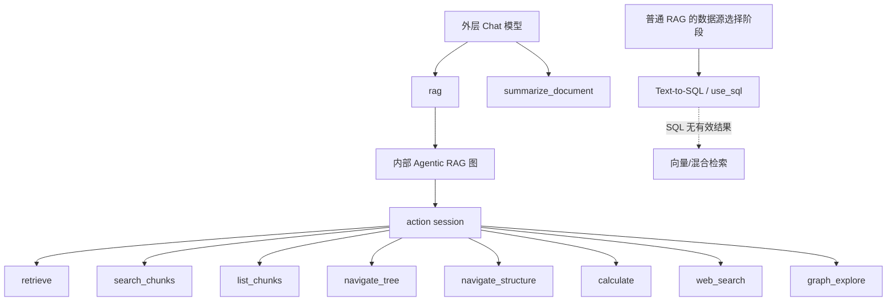
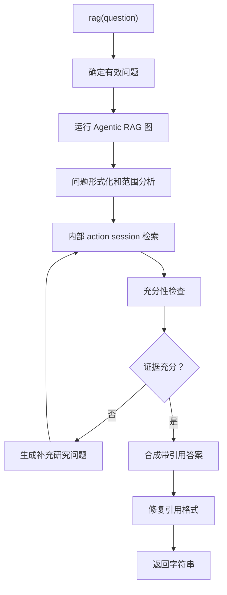
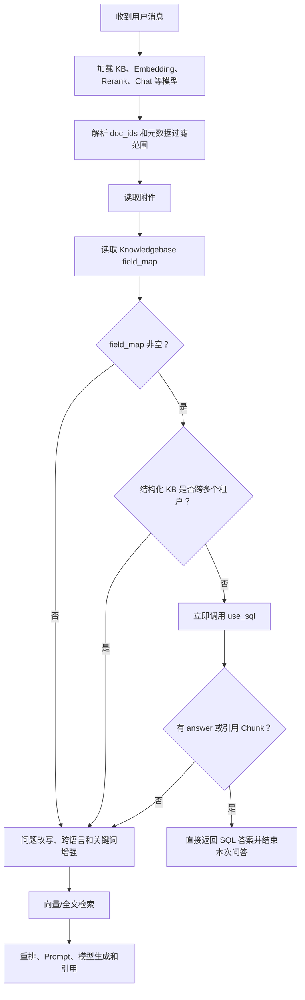
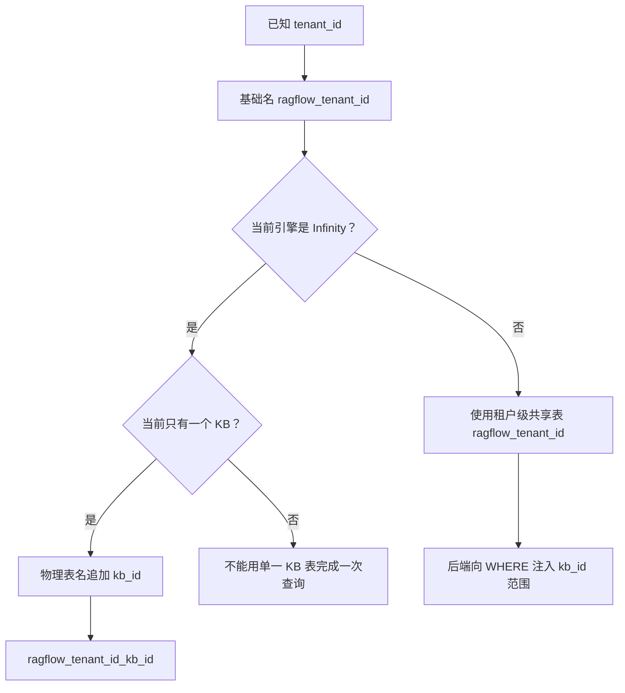
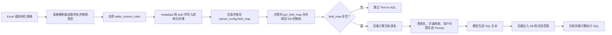
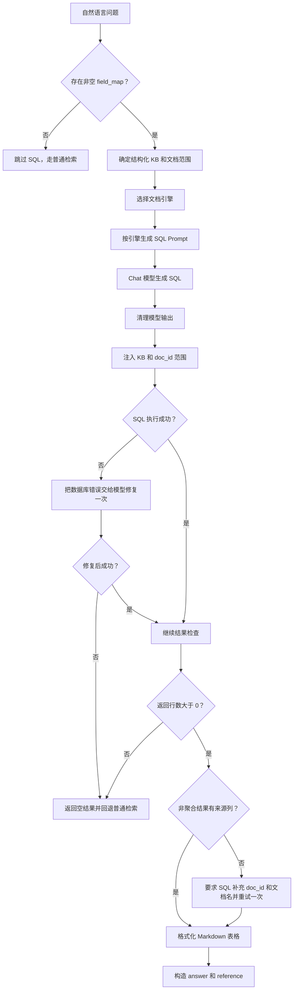
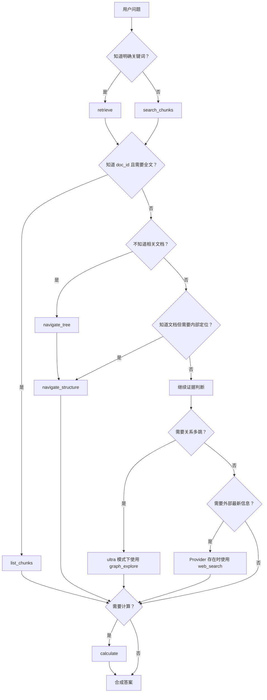

# RAGFlow Agentic RAG 工具清单、参数与返回值

本文整理当前代码中的 Agentic RAG 工具，包括：

1. **外层 Chat 模型真正绑定的工具**；
2. **`rag` 工具内部 action session 按 thinking mode 暴露的检索工具**；
3. 每个工具的启用条件、参数、返回结构、适用场景和失败语义。

## 一、先区分两套工具面

当前实现不是把所有检索函数一次性直接绑定给最外层 Chat 模型，而是分成两层。



这里的两条线不能混为一谈：

- 上半部分是 `reasoning > 0` 且模型支持工具调用时的 Agentic RAG。
- 下半部分是普通 `async_chat` 中的 Text-to-SQL。
- 当前 Python Agentic RAG 虽然定义了 `structured_query` 和
  `structured_retrieve` helper，但没有把它们注册进 `_TOOL_MAP`，也没有在
  `agentic_rag_graph.py` 中调用。因此真正进入 Agentic RAG 后，当前代码不会执行
  Text-to-SQL。

### 1. 外层工具

`RAGTools.__init__` 最终设置：

```python
self.tools = [self.rag, self.summarize_document]
```

随后 `rag_agent` 在模型支持工具调用时执行：

```python
chat_mdl.bind_tools(None, rag_tools.tools)
```

因此，最外层模型看到的工具是：

| 工具 | 用途 |
|---|---|
| `rag` | 执行完整 Agentic RAG 研究流程，并返回带引用的答案 |
| `summarize_document` | 在用户明确要求总结某个具体文档时，读取该文档并提供全文上下文 |

### 2. `rag` 内部工具

外层模型调用 `rag` 后，`rag` 内部运行 `run_agentic_rag`。内部 action session 根据 `thinking_mode` 决定把哪些检索工具暴露给内部模型。

| 工具 | low | medium | high | ultra |
|---|---:|---:|---:|---:|
| `retrieve` | 否 | 是 | 是 | 是 |
| `search_chunks` | 否 | 是 | 是 | 是 |
| `list_chunks` | 否 | 是 | 是 | 是 |
| `navigate_tree` | 否 | 是 | 是 | 是 |
| `navigate_structure` | 否 | 是 | 是 | 是 |
| `calculate` | 否 | 是 | 是 | 是 |
| `web_search` | 否 | 按 Provider | 按 Provider | 按 Provider |
| `graph_explore` | 否 | 否 | 否 | 是 |

补充说明：

- `low` 模式不建立工具循环，走一次混合检索。
- `medium`、`high` 默认使用基础检索工具。
- `high` 增加规划和预取，但工具面与 `medium` 基本相同。
- `ultra` 额外开启关系型知识图谱探索 `graph_explore`。
- 没有 Web Search Provider 时，`web_search` 会从工具 Schema 中隐藏，而不是仅靠 Prompt 告诉模型不要调用。
- `navigate_tree`、`navigate_structure` 和 `graph_explore` 如果首次确认当前数据集没有对应编译结构，会在本次会话中被禁用，避免重复空调用。
- Text-to-SQL 不在 `_TOOL_MAP` 的普通 action-session 工具 Schema 中；它由结构化知识库分支在编排层调用，不应误写成外层 Chat 模型可以直接调用的同名工具。

## 二、外层工具一：`rag`

### 工具定义

```python
@tool(timeout=600)
async def rag(self, question: str) -> str:
```

### 参数

| 参数 | 类型 | 必填 | 说明 |
|---|---|---:|---|
| `question` | `string` | 是 | 自包含的自然语言问题 |

工具说明要求调用方传入一个完整问题，而不是依赖外层对话中的省略指代。

### 内部执行过程



### 返回值

类型是 `string`，内容通常是：

```text
基于知识库证据生成的最终答案，包含 [ID:n] 引用标记。
```

返回字符串还可能追加研究状态提示，例如：

- 证据不足；
- 存在缺失声明；
- 存在冲突；
- 建议外层模型针对缺口再次调用 `rag`；
- 连续多轮证据不足后要求停止重试。

这些状态提示是给外层模型的控制信号，不一定全部作为最终用户答案展示。

### 关键行为

- 使用用户原始完整问题优先于外层模型可能压缩过的问题。
- 对近似重复的问题有本轮缓存，避免重复研究。
- 研究结果写入共享引用池 `self.kbinfos`。
- 自动处理槽位引用和范围引用。
- `timeout=600` 表示工具调用有 600 秒级别的执行上限。

## 三、外层工具二：`summarize_document`

### 工具定义

```python
@tool
async def summarize_document(self, doc_id: str) -> list[str]:
```

### 适用条件

只应该在用户明确要求总结某个具体文档时调用，例如：

```text
请总结刚才找到的那份员工手册。
```

不适用于一般问答。一般问答应使用 `rag`，因为 `rag` 会做问题相关的检索和证据筛选。

### 参数

| 参数 | 类型 | 必填 | 说明 |
|---|---|---:|---|
| `doc_id` | `string` | 是 | 当前轮次其他工具返回的 32 位小写十六进制文档 ID |

限制：

- 不能凭空生成 `doc_id`；
- 应该先从 `retrieve`、`search_chunks`、`navigate_tree` 或其他检索结果中取得；
- 工具不接受 `chunk_ids`；
- 工具读取整份文档，但最多返回 30 个 Chunk。

### 返回值

类型是 `list[string]`。

每个字符串通常是一个格式化知识块，内容包括文档 Chunk 和位置顺序；如果启用引用，还会在结果前加入引用规则说明。

文档不存在或没有可读 Chunk 时返回：

```json
[]
```

### 内部行为

1. 通过 `fetch_full_document(doc_id)` 读取完整文档。
2. 按文档顺序获取 Chunk。
3. 将 Chunk 加入共享引用池。
4. 按模型上下文窗口构造知识块。
5. 如果开启引用，返回引用规则和文档内容。

## 四、内部工具：`retrieve`

### 用途

精确词项优先的检索，适合：

- 人名、地名、产品名；
- 文档标题；
- 编号、代码、错误码；
- 明确短语；
- 问题中出现的原文术语。

它是 BM25/全文风格的首轮召回工具，返回紧凑片段。

### 参数

```json
{
  "query": [
    "报销审批",
    "超过 5000 元 审批流程"
  ]
}
```

| 参数 | 类型 | 必填 | 限制 |
|---|---|---:|---|
| `query` | `array[string]` | 是 | 1 到 3 个查询 |

工具 Schema 没有声明 `doc_scope` 参数。文档范围由执行器结合当前 `RAGTools` 状态内部注入。

### 返回值

工具执行器统一包装为 `ToolOutcome`：

| 字段 | 类型 | 含义 |
|---|---|---|
| `payload` | `list[object]` | 模型看到的短文本 Chunk 列表 |
| `evidence_ids` | `list` | 用于证据跟踪的 Chunk/文档 ID |
| `status` | `ok / miss / redundant / error` | 本次调用状态 |
| `reason` | `string` | 失败或空结果原因 |
| `metrics` | `object` | 命中数和新增证据数等统计 |

有效 Chunk 常包含：

```json
{
  "chunk_id": "chunk-id",
  "doc_id": "document-id",
  "docnm_kwd": "员工制度.pdf",
  "content_with_weight": "超过 5000 元需要部门负责人审批。",
  "kb_id": "kb-id"
}
```

### 状态语义

- `ok`：产生了新的证据；
- `miss`：这个查询没有命中，不代表知识库没有该事实；
- `redundant`：结果全部已经在证据池中；
- `error`：基础设施或参数错误。

## 五、内部工具：`search_chunks`

### 用途

语义优先的混合检索，适合：

- 精确关键词检索没有找到结果；
- 问题和文档使用不同表达；
- 不知道答案在哪个文档；
- 问题与答案没有明显表面词重合；
- 需要补充结构化邻居 Chunk。

### 参数

```json
{
  "query": [
    "高金额报销需要经过哪些审批环节？"
  ]
}
```

| 参数 | 类型 | 必填 | 限制 |
|---|---|---:|---|
| `query` | `array[string]` | 是 | 1 到 2 个查询 |

### 返回值

返回和 `retrieve` 相同的 `ToolOutcome` 外层结构，但 `payload` 是按相关性排序的语义 Chunk，可能包含：

- 普通检索片段；
- 编译得到的原子事实 Claim；
- 父子或结构邻居；
- Claim 的原文引用。

如果结果以 `[claim score=...]` 开头，表示它可能是数据集编译出的原子事实，并携带原始文档引用。

### 失败处理

- `miss`：当前查询没命中，换一个角度或使用 `retrieve`；
- `redundant`：没有产生新证据，不应重复改写同一个查询；
- 没有编译结构不会让普通语义检索失效，结构扩展会退化为空操作。

## 六、内部工具：`list_chunks`

### 用途

读取一个已知文档的完整内容，适合：

- 枚举文档中的所有条目；
- 统计多个段落；
- 对同一文档做计算；
- 需要完整上下文而不是单个片段。

### 参数

```json
{
  "doc_id": "32-character-lowercase-document-id"
}
```

| 参数 | 类型 | 必填 | 说明 |
|---|---|---:|---|
| `doc_id` | `string` | 是 | 必须来自之前工具结果 |

不接受 `chunk_ids` 参数。工具读取完整文档，但最多保留 30 个 Chunk。

### 返回值

```json
{
  "chunks": [
    {
      "chunk_id": "chunk-id",
      "doc_id": "document-id",
      "content_with_weight": "按文档阅读顺序排列的内容",
      "docnm_kwd": "document.pdf"
    }
  ],
  "doc_aggs": [
    {
      "doc_id": "document-id",
      "doc_name": "document.pdf",
      "count": 30
    }
  ]
}
```

空文档、未知 `doc_id` 或读取失败时，通常返回空 `chunks` 和空 `doc_aggs`。这是查询级 Miss，不代表应永久禁用该工具。

## 七、内部工具：`navigate_tree`

### 用途

在大型数据集的编译导航树中定位可能相关的文档，适合：

- 只知道主题、实体或别名；
- 不知道答案在哪个文档；
- 数据集规模较大；
- 需要先确定后续 `doc_id`。

它是“数据集级导航”，不是文档全文读取。

### 参数

```json
{
  "query": "报销审批制度"
}
```

| 参数 | 类型 | 必填 | 说明 |
|---|---|---:|---|
| `query` | `string` | 是 | 要定位的主题、实体或别名 |

工具 Schema 不声明 `keywords`，即使执行器内部可以使用导航摘要作为软提示，也不应由模型自行传入。

### 返回值

返回候选文档和每个文档的首段摘要，典型结构包括：

```json
{
  "doc_ids": ["document-id-1", "document-id-2"],
  "documents": [
    {
      "doc_id": "document-id-1",
      "summary": "文档主题摘要",
      "chunks": ["首个相关 Chunk"]
    }
  ]
}
```

这些 `doc_id` 会成为后续导航和深读的已知文档集合。

### 空结果语义

如果数据集没有编译导航树，会返回 `empty` 且 `reason=no_structure`。这种结果表示数据集能力不存在，工具会在本次会话后续被禁用；模型应切换到 `search_chunks`，而不是反复调用。

## 八、内部工具：`navigate_structure`

### 用途

在已经知道 `doc_id` 的前提下，定位单个文档内部的结构和相关位置。

它是“文档级导航”，与 `navigate_tree` 的区别是：

| 工具 | 范围 | 解决的问题 |
|---|---|---|
| `navigate_tree` | 整个数据集 | 哪些文档可能相关？ |
| `navigate_structure` | 单个文档 | 这个文档的哪一部分相关？ |

### 参数

```json
{
  "doc_id": "document-id",
  "query": "超过 5000 元的审批流程",
  "kind": "catalog"
}
```

| 参数 | 类型 | 必填 | 默认/限制 |
|---|---|---:|---|
| `doc_id` | `string` | 是 | 必须来自先前工具结果 |
| `query` | `string` | 否 | 要在文档内定位的内容 |
| `kind` | `string` | 否 | `catalog`、`mindmap` 或 `graph`；默认 `catalog` |

### 返回值

返回结构化文档大纲，并标出相关 Chunk ID。可能包含：

- 目录或结构节点；
- 匹配的 Chunk ID；
- 结构层级；
- Claim 原文引用；
- 阅读顺序信息。

如果结构结果直接包含回答所需的 Claim，模型可以直接基于 Claim 回答；只有缺少上下文或数字时才继续 `list_chunks`。

### 状态语义

- `ok`：找到可用结构或命中 Chunk；
- `poor`：结构存在，但没有钻取到可用 Chunk；
- `empty/no_structure`：文档没有该类编译结构；
- 第二次确认没有结构后，该工具可能从本次会话工具面移除。

## 九、内部工具：`calculate`

### 用途

对已检索到的事实进行可追溯计算，避免模型心算：

- 求和；
- 差值；
- 百分比；
- 比例；
- 排序；
- 比较；
- 长度、年龄、价格、面积或增长率。

### 参数

```json
{
  "question": "2024 年和 2025 年销售额增长了多少？",
  "facts": [
    "2024 年销售额为 100 万元",
    "2025 年销售额为 125 万元"
  ]
}
```

| 参数 | 类型 | 必填 | 说明 |
|---|---|---:|---|
| `question` | `string` | 是 | 用户原问题，原样传递 |
| `facts` | `array[string]` | 是 | 从证据中逐字提取的数字或事实 |

### 返回值

工具说明约定返回包含表达式和结果的对象，例如：

```json
{
  "expression": "(125 - 100) / 100 * 100%",
  "result": "25%"
}
```

如果必要数字缺失或无法推导，状态为 `poor`。此时应先检索更多证据或直接引用已有答案，不能估算或编造。

## 十、内部工具：`web_search`

### 用途

搜索外部网络，适合：

- 最新事件；
- 当前世界知识；
- 近期统计数据；
- 人物当前状态；
- 明显晚于知识库更新时间的事实。

如果问题合理地属于固定知识库，应优先使用 `retrieve` 或 `search_chunks`。

### 参数

```json
{
  "query": [
    "2026 年最新的相关统计数据"
  ]
}
```

| 参数 | 类型 | 必填 | 限制 |
|---|---|---:|---|
| `query` | `array[string]` | 是 | 1 到 2 个查询 |

### 启用条件

工具只有在 `web_search` Provider 存在时才出现在工具 Schema 中。Provider 可以来自 Tavily、QuerIt、Serply、YouCom 等实现。

### 返回值

Web 结果会被转换成和知识库 Chunk 相近的结构，通常包括：

```json
{
  "chunks": [
    {
      "content_with_weight": "网页摘要或正文片段",
      "url": "https://example.com",
      "docnm_kwd": "网页标题",
      "doc_id": "web-result-id"
    }
  ],
  "doc_aggs": []
}
```

这些结果会合并进同一个证据池，后续可以和内部知识库结果一起参与答案和引用处理。

### 失败处理

- 没有 Provider：工具不会展示给模型；
- Provider 调用失败：返回 `error`；
- 当前工具失败后，工具说明要求停止重复联网，转用内部知识库工具。

## 十一、内部工具：`graph_explore`

### 用途

探索编译后的知识图谱，适合关系型、多跳问题：

- 谁与谁存在关系；
- 因果链；
- 成员关系；
- 所属关系；
- 多个实体之间需要经过关系连接的问题。

它不是普通文档定位工具，而是从实体出发沿关系跳转，并返回相关实体、关系或背后的源文档片段。

### 参数

```json
{
  "query": "某人物与某组织之间是什么关系？",
  "doc_scope": [
    "document-id"
  ]
}
```

| 参数 | 类型 | 必填 | 说明 |
|---|---|---:|---|
| `query` | `string` | 是 | 关系问题或起始实体 |
| `doc_scope` | `array[string]` | 否 | 从前序工具结果得到的文档 ID 范围 |

### 启用条件

只有 `ultra` thinking mode 会把 `graph_explore` 放进工具集合。即使在 `ultra` 模式，如果当前数据集没有编译知识图谱，工具也会返回 `empty/no_structure`，并在本次会话中禁用。

### 返回值

返回统一工具结果，`payload` 可能包含：

- 匹配实体；
- 实体之间的关系；
- 关系路径；
- 相关源文档 Chunk；
- 文档和 Chunk ID。

没有编译图谱时不会伪造关系，应该退回 `search_chunks` 或 `navigate_structure`。

## 十二、结构化数据工具：Text-to-SQL

Text-to-SQL 是当前工具文档中最容易漏掉的一条路径。它和 `retrieve`、`search_chunks`
不同：后两者返回文本 Chunk，Text-to-SQL 先让模型把自然语言问题转换成受约束的
SQL，再查询结构化字段，并把表格结果转换为答案和引用。

### 12.0 一句话回答：什么时候、在哪个阶段执行？

**Text-to-SQL 位于普通 RAG 的“数据源选择”阶段，是正式向量/混合检索之前的优先尝试。**

按此前问答流程文档的阶段编号，它属于：

> **阶段 4：数据源选择**，并且发生在阶段 5“向量/全文检索、重排和过滤”之前。

但按源码真实执行顺序，它甚至早于多轮问题改写、跨语言扩展和关键词增强：



因此它不是“向量检索以后补做 SQL”，也不是“模型回答到一半再决定调用 SQL”。
只要普通 RAG 检测到 `field_map`，就先尝试 SQL：

```python
field_map = KnowledgebaseService.get_field_map(dialog.kb_ids)
if field_map:
    ans = await use_sql(...)
    if ans and (ans.get("reference", {}).get("chunks") or ans.get("answer")):
        yield ans
        return
```

这段代码中的 `return` 很关键：

- SQL 有有效答案：直接结束，不再走向量检索、Rerank 和普通 LLM 答案生成；
- SQL 失败、返回 0 行、没有答案且没有引用：继续后面的向量/混合检索；
- 结构化 KB 跨多个租户：跳过 SQL，直接回退向量检索。

### 12.0.1 不同路由下是否执行

| 当前路由 | Text-to-SQL 是否执行 | 原因 |
|---|---:|---|
| `reasoning=0` 的普通 RAG | 是，只要 `field_map` 非空且范围有效 | `rag_agent` 转入 `async_chat`，在向量检索前调用 `use_sql` |
| 未设置 reasoning 的普通 RAG | 是，条件同上 | 默认走 `async_chat` |
| reasoning 开启，但模型不支持工具调用 | 是，条件同上 | `rag_agent` 回退到 `async_chat` |
| reasoning 开启，视觉模型收到图片 | 是，条件同上 | 为了让模型看到图片，路由回退到 `async_chat` |
| reasoning 开启，模型支持工具调用并真正进入 Agentic RAG | **当前 Python 实现不执行** | helper 已定义，但未接入图和 `_TOOL_MAP` |
| Go Chat Pipeline 普通结构化查询 | 是，条件同上 | 通过 `StructuredQuery` / `useSQL` 执行 |

### 12.0.2 为什么源码里有 helper，却仍说 Agentic 路径不执行？

当前源码中确实存在：

```python
RAGTools.structured_retrieve(...)
harness.tools.search.structured_query(...)
```

但是全仓调用关系显示：

- `structured_retrieve` 只有定义，没有调用点；
- `structured_query` 只有定义，没有被 action session 导入或调度；
- `_TOOL_MAP` 不包含 `structured_query`；
- `THINKING_MODES` 的工具集合不包含 `structured_query`；
- `agentic_rag_graph.py` 没有调用这两个方法。

所以它们目前是**尚未接通的内部能力**，不能据此判断 Agentic RAG 已经执行
Text-to-SQL。文档后续描述的是这套 helper 和底层 `use_sql` 的能力契约，而不是说
它已经作为 Agentic 工具对模型开放。

### 12.1 它是不是一个公开绑定工具？

严格来说分两种情况：

| 层级 | 名称 | 是否出现在外层 Chat 工具 Schema | 作用 |
|---|---|---:|---|
| 普通 action session | `structured_query` | 否 | 已定义的结构化查询 helper，目前未注册到 action session |
| Agentic RAG 对象 | `structured_retrieve` | 否 | 已定义的结构化检索 helper，目前未接入 Agentic 图 |
| 编排/服务层 | `use_sql` | 否 | 真正生成、校验、执行和格式化 SQL |
| Go Chat Pipeline | `StructuredQuery` / `useSQL` | 否 | Python `use_sql` 的 Go 对应实现 |

因此，Text-to-SQL 是普通 RAG 中由服务层主动触发的**内部编排能力**，不是当前
`chat_mdl.bind_tools(...)` 直接绑定给外层模型的独立 Function Calling 工具。模型
不会直接获得数据库连接，也不会直接执行 SQL；SQL 生成和执行由 RAGFlow 后端控制。

### 12.2 进入条件

普通 RAG 的结构化分支需要满足：

1. Chat 绑定了带 `parser_config.field_map` 的结构化知识库；
2. `field_map` 非空；
3. 当前请求的知识库范围和文档范围可以被解析；
4. 结构化 KB 不能跨多个文档存储租户；
5. 当前文档存储引擎支持 SQL 查询；
6. 生成的 SQL 通过后端的范围和引擎校验。

`field_map` 是 SQL 生成的允许字段集合，通常包含字段名及其显示名称/类型映射。
没有结构化字段映射时，SQL 路径不适用，系统继续使用普通向量/全文检索。

#### 12.2.1 “field_map 非空”到底是什么意思？

`field_map` 是知识库解析配置中的一个字典。它描述：

> 表格文件的哪些列已经作为结构化字段写入文档存储，以及生成 SQL 时应该使用什么
> 存储字段名。

例如用户上传一份 Excel：

| 姓名 | 部门 | 报销金额 | 日期 |
|---|---|---:|---|
| 张三 | 研发部 | 6200 | 2026-09-01 |

表格解析器读取列名、推断数据类型，并根据 `table_column_roles` 决定哪些列要保存为
结构化元数据：

- `metadata`：写入结构化字段，可用于 SQL；
- `both`：既进入文本索引，也写入结构化字段，可用于 SQL；
- `indexing` / `vectorize`：只进入文本检索，不进入 `field_map`，不能作为 SQL
  结构化字段查询。

`table_column_roles` 有自动和手动两种来源：

- 默认 `auto`：用户无需配置，所有列统一按 `both` 处理；
- `manual`：用户可在 Table Parser 的上传弹窗中逐列选择，也可在首次解析后到
  知识库设置中修改。

上传弹窗会在浏览器本地读取表头，以便在上传请求发出前显示列角色选择器。首次解析
后，后端还会把所有列名保存到 `parser_config.table_column_names`，供知识库设置页
继续编辑。手动角色修改后需要重新解析已有文档，因为角色决定 Chunk 和结构化字段
如何写入，修改配置本身不会重建旧数据。

解析完成后，表格解析器把合并后的映射写入：

```python
knowledgebase.parser_config["field_map"]
```

一个示意值可能是：

```json
{
  "xing_ming_tks": "姓名",
  "bu_men_tks": "部门",
  "bao_xiao_jin_e_flt": "报销金额",
  "ri_qi_tm": "日期"
}
```

不同文档引擎生成的键不完全相同：

- Elasticsearch/OpenSearch：键通常是拼音化并带类型后缀的存储字段名；
- Infinity/OceanBase：键通常保留 Excel 的原始列名，值是用于显示的列名；
- GaussDB：键采用其 JSONB 查询约定使用的字段名。

多个绑定知识库的映射通过 `dict.update(...)` 合并：

```python
conf = {}
for kb in KnowledgebaseService.get_by_ids(kb_ids):
    if kb.parser_config and "field_map" in kb.parser_config:
        conf.update(kb.parser_config["field_map"])
```

所以：

- `field_map == {}`：没有任何绑定知识库提供可供 SQL 查询的结构化列；
- `bool(field_map) == True`：至少存在一个可供 Text-to-SQL 使用的结构化字段；
- 非空只表示“有可查询 Schema”，不表示这个问题一定适合 SQL，也不表示 SQL
  一定能命中数据；
- 如果字段只是用于向量化、没有被配置为 `metadata` 或 `both`，它不会进入
  `field_map`。

#### 12.2.2 模型怎么知道有哪些表？

模型不会自己查询数据库目录，也不会执行 `SHOW TABLES`。RAGFlow 在调用模型前已经
根据当前文档引擎、租户和知识库范围计算好目标表名，并把它直接写进 Prompt。

这里不是根据这些信息“推测”数据库里可能有哪些业务表，而是使用 RAGFlow 自己定义
的固定命名协议：

```python
def index_name(uid):
    return f"ragflow_{uid}"
```

其中 `uid` 就是知识库所属租户的 `tenant_id`。所以只要知道租户 ID，基础索引名就
是确定的：

```text
tenant_id = 8f1234
基础索引名 = ragflow_8f1234
```

然后再根据文档引擎决定知识库是如何隔离的：



之所以这个名字一定和数据实际写入位置一致，是因为入库和查询使用同一套参数：

```python
# 写入 Chunk
settings.docStoreConn.insert(
    chunks,
    search.index_name(task_tenant_id),
    task_dataset_id,
)
```

这里传入：

- `search.index_name(task_tenant_id)`：`ragflow_<tenant_id>`；
- `task_dataset_id`：也就是 `kb_id`。

Infinity 的连接器在写入时明确组合：

```python
table_name = f"{index_name}_{knowledgebase_id}"
```

因此：

```text
index_name = ragflow_<tenant_id>
knowledgebase_id = <kb_id>
最终 Infinity 物理表 = ragflow_<tenant_id>_<kb_id>
```

而 ES/OpenSearch 一类引擎采用租户级共享索引：

```text
物理索引 = ragflow_<tenant_id>
每条 Chunk 自身带有 kb_id
查询时通过 WHERE kb_id = ... 限制知识库
```

所以三个信息各自解决的问题是：

| 信息 | 作用 |
|---|---|
| 当前文档存储引擎 | 判断是“每 KB 一张表”还是“租户共享表加 KB 过滤” |
| 知识库所属租户 | 决定 `ragflow_<tenant_id>` 基础名称 |
| 当前绑定 KB | Infinity 用来追加表名；其他引擎用来注入 `kb_id` 过滤 |

这套机制依赖一个前提：知识库 Chunk 是由 RAGFlow 的入库流程写入 RAGFlow 管理的
文档存储，而不是让 Text-to-SQL 任意连接用户数据库并发现其中的业务表。

目标表名大致按下面规则产生：

| 引擎 | 模型收到的目标表 |
|---|---|
| Elasticsearch/OpenSearch/OceanBase/GaussDB | 当前租户对应的 `ragflow_<tenant>` 索引/表，再由后端补充 KB 过滤 |
| Infinity 单 KB | `ragflow_<tenant>_<kb_id>`，KB 范围直接编码在表名中 |

因此模型面对的不是“从很多业务表中选择一个”，而是：

> 后端已经指定一个 RAGFlow 文档索引/表，请为这个指定表生成一条查询。

例如 Prompt 会明确包含：

```text
Table: ragflow_8f...;
Available fields:
  - xing_ming_tks (姓名)
  - bu_men_tks (部门)
  - bao_xiao_jin_e_flt (报销金额)
  - ri_qi_tm (日期)

Question: 研发部报销金额超过 5000 元的有几笔？
Write SQL using exact field names above. Only SQL.
```

模型可能生成：

```sql
SELECT COUNT(*) AS rows
FROM ragflow_8f...
WHERE bu_men_tks = '研发部'
  AND bao_xiao_jin_e_flt > 5000
```

随后后端还会把当前 Chat 允许的 `kb_id` 和 `doc_id` 范围注入 SQL。模型不负责
决定自己能访问哪个知识库。

#### 12.2.3 模型怎么知道搜索哪些字段？

字段选择依赖两份输入：

1. `field_map`：告诉模型允许使用的存储字段名，以及字段对应的原始/显示列名；
2. 用户问题：告诉模型查询意图、过滤条件、聚合方式和目标列。

模型做的是自然语言到 Schema 的匹配。例如：

```text
用户问题中的“部门”       -> field_map 中显示名为“部门”的 bu_men_tks
用户问题中的“报销金额”   -> field_map 中显示名为“报销金额”的 bao_xiao_jin_e_flt
用户问题中的“有几笔”     -> COUNT(*)
用户问题中的“超过 5000”  -> > 5000
```

除了 `field_map` 中的业务字段，Prompt 还要求非聚合查询返回来源系统字段：

- `doc_id`；
- `docnm_kwd`，Infinity 使用 `docnm`；
- 必要时使用 `kb_id`。

这些字段用于把 SQL 结果追溯回原文档并生成引用，不是从用户 Excel 表头中推断出的
业务字段。

#### 12.2.4 完整的数据来源链



### 12.3 调用参数

内部 `structured_query` 的函数签名是：

```python
async def structured_query(
    tools,
    query: str,
    keywords: str = "",
    kb_ids: list[str] | None = None,
    doc_scope: list[str] | None = None,
) -> dict:
```

| 参数 | 类型 | 必填 | 说明 |
|---|---|---:|---|
| `query` | `string` | 是 | 要转换成 SQL 的自然语言问题 |
| `keywords` | `string` | 否 | 为 Schema 兼容保留；Text-to-SQL 不使用它做关键词匹配 |
| `kb_ids` | `array[string]` | 否 | 限制可查询的知识库 |
| `doc_scope` | `array[string]` | 否 | 限制可查询的文档；会经过当前 Chat 的范围过滤 |

`RAGTools.structured_retrieve(question)` 是更高层的简化入口，只接受：

```python
structured_retrieve(question: str)
```

它会从 `self.sql_kbs`、`self.field_map` 和 `self.scoped_doc_ids()` 中取得其余范围信息。

### 12.4 SQL 生成和执行流程



### 12.5 支持的文档引擎差异

| 引擎 | 表/字段形式 | SQL 特殊处理 |
|---|---|---|
| Elasticsearch / OpenSearch | 直接访问索引字段 | 直接使用 `field_map` 中的字段名 |
| Infinity | `ragflow_<tenant>_<kb>`，字段在 JSON `chunk_data` 中 | 使用 `json_extract_string`，单 KB 范围编码在表名 |
| OceanBase | JSON `chunk_data` | 使用 `json_extract_string` 和必要的类型转换 |
| GaussDB | JSONB `chunk_data` | 使用 GaussDB 专用 Prompt 和 validator，字段通过 JSONB 运算符读取 |

模型生成的 SQL 必须使用 `field_map` 中的精确字段名。Infinity/OceanBase/GaussDB
的 JSON 字段还需要使用对应引擎的 JSON 提取语法，不能把普通 ES 字段写法直接套用。

### 12.6 SQL 安全和范围约束

后端不会原样信任模型生成的 SQL，至少会执行以下控制：

- 从 `field_map` 提供允许的字段和类型信息；
- 清理 Markdown 代码围栏、思考文本和末尾分号；
- 校验 `kb_id` 和 `doc_id` 的 UUID 格式；
- 对 ES/OpenSearch/OceanBase 注入 `kb_id` 过滤条件；
- 对文档范围注入 `doc_id` 过滤条件；
- Infinity 使用带 KB 的表名限制范围；
- GaussDB 使用专用 validator 校验并补写边界；
- SQL 执行失败时最多按引擎提示修复一次；
- 不把任意 Python、系统命令或数据库连接能力暴露给模型。

### 12.7 SQL 结果返回值

`structured_query` 和 `structured_retrieve` 对外使用以下结构：

```json
{
  "answer": "|字段|Source|\n|------|------|\n|结果|##0$$|",
  "chunks": [
    {
      "doc_id": "document-id",
      "docnm_kwd": "table.xlsx",
      "content_with_weight": "来源 Chunk 内容"
    }
  ],
  "doc_aggs": [
    {
      "doc_id": "document-id",
      "doc_name": "table.xlsx",
      "count": 1
    }
  ]
}
```

底层 `use_sql` 的完整返回值还包含：

```json
{
  "answer": "Markdown 表格答案",
  "reference": {
    "chunks": [],
    "doc_aggs": []
  },
  "prompt": "本次 SQL 生成使用的系统 Prompt"
}
```

其中：

- `answer` 是格式化后的 Markdown 表格；
- `reference.chunks` 是用于引用和来源回填的 Chunk；
- `reference.doc_aggs` 是文档聚合统计；
- `prompt` 主要用于内部调试和调用链追踪。

### 12.8 聚合查询与来源引用

聚合查询包括 `COUNT`、`SUM`、`AVG`、`MAX`、`MIN`、`DISTINCT` 等。聚合 SQL
的结果可能只有统计值，没有 `doc_id` 和文档名，后端会：

1. 保留原始聚合表格作为 `answer`；
2. 根据原 SQL 的 `WHERE` 条件另外查询最多 20 个来源文档；
3. 将来源 Chunk 放入 `reference`；
4. 对 GaussDB 使用专用的聚合来源 SQL 构造逻辑。

非聚合查询如果缺少 `doc_id` 和 `docnm_kwd`/`docnm`，后端会要求模型保持原意
并补充来源列，再执行一次。修复仍失败时，可能保留一个无来源列的 best-effort
表格答案，但引用保障会降低。

### 12.9 失败和回退

| 情况 | 结果 |
|---|---|
| 没有 `field_map` | 不进入 SQL，直接普通检索 |
| SQL 生成失败 | 返回空结构化结果，继续普通检索 |
| SQL 第一次执行失败 | 带错误信息重生成一次 |
| 修复后仍失败 | 返回空结果，继续普通检索 |
| 查询返回 0 行 | 视为无有效 SQL 证据，继续普通检索 |
| 缺来源列 | 尝试补充来源列一次 |
| 结构化结果有效 | 将表格答案和来源加入最终答案/引用池 |

### 12.10 与 `calculate` 的区别

- Text-to-SQL 适合对表格字段直接过滤、聚合和排序；
- `calculate` 适合已经从证据中取得事实后做通用计算；
- 如果问题是“统计表中满足条件的行数”，优先 Text-to-SQL；
- 如果问题是“把检索到的两个数字相减”，使用 `calculate`；
- 两者都不能让模型绕过后端的知识库和文档范围。

### 12.11 Go 实现

Go Chat Pipeline 对应入口是：

```go
StructuredQuery(...)
useSQL(...)
```

其行为与 Python `dialog_service.use_sql` 对齐，包括：

- 根据文档引擎生成不同 SQL Prompt；
- 行数问题的固定 `COUNT(*)` 优化；
- 注入知识库范围；
- SQL 执行失败后修复一次；
- 非聚合结果缺少来源列时尝试补列；
- 返回 `answer` 和 `reference`；
- 空结果让调用方继续普通检索。

Go 的 `StructuredQuery` 同样是服务内部入口，不是外层 Function Calling Schema。

## 十三、工具状态统一协议

内部 action session 不直接只返回裸 Chunk，而是使用 `ToolOutcome`：

```python
@dataclass
class ToolOutcome:
    payload: list
    evidence_ids: list = field(default_factory=list)
    status: str = OK
    reason: str = ""
    metrics: dict = field(default_factory=dict)
```

### 状态表

| 状态 | 含义 | 是否说明数据集没有事实 | 后续动作 |
|---|---|---:|---|
| `ok` | 有可用结果，通常增加了新证据 | 否 | 继续判断证据是否足够 |
| `empty` | 数据集级能力不存在，例如没有编译结构 | 是能力缺失，不是事实缺失 | 可禁用对应工具，切换其他工具 |
| `miss` | 本次查询没有命中 | 否 | 改写角度或换工具 |
| `poor` | 有结果但太弱，不能可靠支持答案 | 否 | 补充检索或深读文档 |
| `redundant` | 调用成功但没有新增证据 | 否 | 停止重复查询，生成状态更新 |
| `error` | 参数、基础设施或 Provider 失败 | 否 | 重试需谨慎，必要时回退或报错 |

### `reason` 常见值

| reason | 含义 |
|---|---|
| `no_structure` | 当前数据集不存在所需编译结构 |
| `no_doc` | 查询没有找到文档 |
| `bad_args` | 参数不合法 |
| `infra` | 搜索引擎、模型或外部 Provider 故障 |

特别重要：

- `no_structure` 是数据集能力级结论，可以触发工具禁用；
- `no_doc` 只是当前查询没找到，不允许因此禁用工具；
- `redundant` 表示结果已经在证据池中，不应通过相似查询反复刷结果。

## 十四、调用顺序建议



## 十五、关键代码位置

### 关于其他源码中出现的工具名

`rag/advanced_rag/harness/tools/search.py` 还保留了动态工具工厂的名称映射，例如
`think`、`todo_write` 和 `grep_chunks`。这组映射用于动态工具函数的公开命名，
不能直接等同于当前 `action_session.py` 的 `_TOOL_MAP`。当前 action session
通过 `_TOOL_MAP` 和 `config.THINKING_MODES` 暴露本文第 4 至第 11 节列出的工具。
因此，阅读源码时应以实际创建 action session 的路径和本轮模型收到的 Schema
为准，不能仅根据搜索到的函数名判断某个工具一定已绑定。

| 内容 | 文件 |
|---|---|
| 外层 `rag`、`summarize_document` | `rag/advanced_rag/agentic_rag.py` |
| thinking mode 和工具集合 | `rag/advanced_rag/harness/config.py` |
| 工具 Schema、工具注册和可见性 | `rag/advanced_rag/harness/action_session.py` |
| 全文、向量和文档读取实现 | `rag/advanced_rag/harness/tools/search.py` |
| 知识图谱探索实现 | `rag/advanced_rag/harness/tools/exploration.py` |
| 导航树和文档结构 | `rag/advanced_rag/harness/tools/navigation.py` |
| Agentic RAG 图 | `rag/advanced_rag/agentic_rag_graph.py` |
| 外层能力判断和工具绑定 | `api/db/services/dialog_service.py` 中的 `rag_agent` |
| Go 端工具命名和检索桥接 | `internal/agent/tool/agentic_search.go`、`internal/agent/retrievalbridge` |
