# RAGFlow 问答流程与回答质量保障

## 概述

RAGFlow 的聊天问答采用检索增强生成（RAG）：

> 用户问题 -> 问题改写/扩展 -> 混合检索 -> 重排与过滤 -> 拼接知识上下文 -> LLM 生成 -> 引用校正 -> SSE 流式返回 -> 保存会话

根据聊天应用的配置，系统会选择以下路径：

1. 没有知识库且未启用联网：直接调用大模型。
2. 结构化知识库：优先尝试 Text-to-SQL。
3. 普通 RAG：关键词检索、向量检索、重排后交由 LLM 生成。
4. 推理模式：通过 Agentic RAG 由模型多轮调用检索工具。这里的“工具调用”是模型返回结构化的工具名称和参数，由 RAGFlow 校验并执行已绑定的检索工具；模型本身不会直接访问数据库或执行代码。
5. 可选叠加联网搜索、知识图谱、多轮问题改写、跨语言扩展、关键词扩展、元数据过滤、TOC/父子块增强与引用。

以下以 Web 聊天界面的 `/api/v1/chat/completions` 为主线。项目也支持 Go 后端；其对应实现和流程说明位于 `internal/service/chat_pipeline.go`。

## 完整流程图

```mermaid
flowchart TD
    U[用户输入问题] --> FE1[前端校验<br/>问题非空且当前没有生成任务]
    FE1 --> FE2{是否已有会话?}

    FE2 -- 否 --> FE3[创建 Conversation]
    FE2 -- 是 --> FE4[读取当前会话历史]
    FE3 --> FE5
    FE4 --> FE5

    FE5[构造用户消息<br/>文本 + 附件 + 消息 ID]
    FE5 --> FE6[本地显示用户问题<br/>并创建回答占位符]
    FE6 --> FE7[POST /api/v1/chat/completions<br/>携带历史、模型参数、联网与推理开关]
    FE7 --> API1[认证和请求格式校验]

    API1 --> API2{chat_id / session_id 是否合法?}
    API2 -- 否 --> ERR[返回错误]
    API2 -- 是 --> API3[检查聊天应用归属<br/>读取 Dialog 和 Conversation]
    API3 --> API4[解析生成参数<br/>temperature / top_p / max_tokens]
    API4 --> API5[选择指定模型或租户默认模型]
    API5 --> ROUTER[rag_agent 路由]

    ROUTER --> REASON{是否开启 reasoning?}
    REASON -- 否 --> NORMAL[普通 async_chat]
    REASON -- 是 --> TOOLS{模型支持工具调用?}
    TOOLS -- 否 --> NORMAL
    TOOLS -- 是 --> VISION{问题是否含图片?}
    VISION -- 是 --> NORMAL
    VISION -- 否 --> AGENT[Agentic RAG]

    NORMAL --> SOURCE{有知识库或启用联网?}
    SOURCE -- 否 --> SOLO[纯 LLM 对话]
    SOURCE -- 是 --> MODEL[加载 Embedding、Rerank、Chat、TTS 模型]
    MODEL --> ATTACH[解析文本和图片附件]
    ATTACH --> SCOPE[确定 KB、文档 ID 与元数据过滤范围]

    SCOPE --> SQL{知识库有结构化字段映射?}
    SQL -- 是 --> SQLGEN[LLM 生成受约束 SQL]
    SQLGEN --> SQLEXEC[校验并执行 SQL]
    SQLEXEC --> SQLHIT{得到有效结果?}
    SQLHIT -- 是 --> RESPONSE
    SQLHIT -- 否 --> QUERY
    SQL -- 否 --> QUERY

    QUERY[问题预处理]
    QUERY --> MULTI{多轮问题改写?}
    MULTI -- 是 --> FULLQ[结合最近对话<br/>改写为独立问题]
    MULTI -- 否 --> LANG
    FULLQ --> LANG
    LANG{跨语言检索?}
    LANG -- 是 --> TRANS[生成多语言查询]
    LANG -- 否 --> KEYWORD
    TRANS --> KEYWORD
    KEYWORD{关键词增强?}
    KEYWORD -- 是 --> KW[LLM 提取关键词并追加]
    KEYWORD -- 否 --> RETRIEVE
    KW --> RETRIEVE

    RETRIEVE[候选召回] --> LEX[全文/关键词匹配]
    RETRIEVE --> EMB[问题 Embedding]
    EMB --> VECTOR[向量 KNN 检索]
    LEX --> FUSION[混合候选集合]
    VECTOR --> FUSION
    FUSION --> CLEAN[剔除已删除文档的残留 Chunk]
    CLEAN --> RERANK{配置了 Rerank 模型?}
    RERANK -- 是 --> CROSSENC[Cross-Encoder 重排]
    RERANK -- 否 --> HYBRID[词法和向量相似度加权]
    CROSSENC --> SCORE[叠加标签 / PageRank 特征]
    HYBRID --> SCORE
    SCORE --> FILTER[按 similarity_threshold 过滤]
    FILTER --> TOPN[稳定排序并选 Top N]

    TOPN --> TOC{开启 TOC 增强?}
    TOC -- 是 --> TOCR[按目录结构补充相关块]
    TOC -- 否 --> PARENT
    TOCR --> PARENT[父子 Chunk 合并/回溯]
    PARENT --> WEB{启用联网搜索?}
    WEB -- 是 --> WEBR[追加 Web 搜索结果]
    WEB -- 否 --> KG
    WEBR --> KG{启用知识图谱?}
    KG -- 是 --> KGR[知识图谱结果插入前部]
    KG -- 否 --> PROMPT
    KGR --> PROMPT[构造知识块<br/>ID / 标题 / URL / 元数据 / 正文]

    PROMPT --> EMPTY{没有命中且配置 empty_response?}
    EMPTY -- 是 --> FALLBACK[返回预设未命中回答]
    EMPTY -- 否 --> BUDGET[控制知识与历史的 Token 预算]
    BUDGET --> CITPROMPT{开启引用 quote?}
    CITPROMPT -- 是 --> CITEINST[追加引用格式指令]
    CITPROMPT -- 否 --> LLM
    CITEINST --> LLM[调用 Chat / Vision LLM]
    SOLO --> LLM
    FALLBACK --> RESPONSE

    LLM --> STREAM[流式输出文本与思考事件]
    STREAM --> DECORATE[最终答案装饰]
    DECORATE --> CITECHECK{模型生成合法引用?}
    CITECHECK -- 否 --> AUTOCITE[按答案片段和 Chunk 相似度<br/>自动插入引用]
    CITECHECK -- 是 --> REPAIRCITE[解析已有引用]
    AUTOCITE --> REPAIRCITE
    REPAIRCITE --> RESPONSE[返回 Answer + References + Prompt]

    AGENT --> ATOOLS["绑定 RAG 工具<br/>模型获得工具 Schema"]
    ATOOLS --> ALOOP[模型分析问题并调用检索工具]
    ALOOP --> ARETRIEVE[KB / Web / 元数据范围检索]
    ARETRIEVE --> ASUFFICIENT{证据是否充分?}
    ASUFFICIENT -- 否 --> AQUERY[生成补充查询]
    AQUERY --> ALOOP
    ASUFFICIENT -- 是 --> ACOMPOSE[基于证据合成带引用答案]
    ACOMPOSE --> REPAIRCITE

    RESPONSE --> SSE[后端包装为 SSE 事件]
    SSE --> SAVE[更新 Conversation 的消息与引用]
    SAVE --> FE8[前端解析 SSE]
    FE8 --> FE9[合并增量文本并节流刷新 UI]
    FE9 --> FE10[展示回答、思考过程和引用文档]
```



## 前端与 API 入口

前端发送逻辑会校验问题、阻止重复发送、必要时创建会话，并在本地立即插入用户消息和助手占位符。请求携带完整历史消息、`chat_id`、`session_id`、模型生成参数、`internet` 和 `reasoning` 开关。

后端入口负责认证、消息规范化、聊天与会话归属检查、会话创建/读取、模型参数合并，并在会话中为本轮回复预留引用信息。默认返回 SSE 流。

流式事件包括：

1. 普通答案文本增量；
2. 思考开始事件；
3. 思考文本；
4. 思考结束事件；
5. 带引用的最终答案事件；
6. 流结束事件。

前端使用 `AbortController` 支持停止生成，合并高频增量并进行节流更新；停止时仍保留已产生的文本。

## 路径选择

### 无知识库直答

当聊天应用没有绑定知识库且没有开启联网搜索时，系统直接调用模型。这条路径没有检索和引用保障，回答质量主要取决于模型、系统提示词和用户提供的上下文。

### 结构化数据 SQL

当知识库定义字段映射时，系统优先让 LLM 生成 SQL。SQL 会经过表名、知识库 ID、文档 ID 和语句范围校验后再执行；若无有效结果才退回向量检索。

此路径适用于计数、求和、均值、最大/最小值等聚合问题，通常比从文本 Chunk 推理更可靠。

### 普通 RAG

普通路径按“问题增强 -> 混合检索 -> 重排 -> 上下文构造 -> LLM -> 引用处理”执行。

### Agentic RAG

推理模式且模型支持工具调用时，模型通过 RAG 工具多轮检索和补充查询，在证据充分后生成最终带引用答案。模型不支持工具调用、或用户输入包含需要视觉模型处理的图片时，会自动回退到普通 RAG，避免脱离知识库直接回答。

## 什么是工具调用

工具调用（Tool Calling / Function Calling）允许模型以结构化方式请求后端执行一个已注册工具，例如请求 `rag` 工具并提供查询参数。模型只负责提出调用请求；RAGFlow 才负责校验参数、限制知识库范围、执行搜索、返回工具结果，并决定是否继续下一轮。

在 Agentic RAG 中，流程是：

```text
模型分析问题
  -> 返回结构化 tool call
  -> RAGFlow 执行 RAG / Web / 知识图谱工具
  -> 工具返回证据
  -> 模型基于证据继续调用或生成最终答案
```

是否进入这条路径，不是通过试探模型回答判断，而是读取当前 `LLMBundle` 的 `is_tools` 能力标记。能力缺失时默认按不支持处理，并回退普通 RAG。工具实际可访问的内容仍受 Chat 绑定知识库、文档范围、元数据过滤和后端权限控制；模型不能直接执行任意代码或访问任意数据。

## 普通 RAG 的详细过程

### 1. 模型与附件

系统按聊天配置加载：

| 模型 | 用途 |
|---|---|
| Embedding | 将问题编码为向量 |
| Chat / Vision | 生成最终答案 |
| Rerank | 重新排序检索候选 |
| TTS | 可选语音输出 |

文本附件会追加进用户消息；图片会转换成不同模型供应商需要的多模态格式。文本模型不会收到其不支持的图片格式。

### 2. 检索范围

检索范围受以下条件共同约束：

- 聊天应用绑定的知识库；
- 显式指定的文档 ID；
- 消息中的文档 ID；
- 元数据过滤推导出的文档集合；
- 仅可用的索引内容。

### 3. 问题增强

可选的预处理包括：

- **多轮改写**：结合近期对话，把“它是什么时候开源的？”改写成独立可检索的问题。
- **跨语言扩展**：生成其他语言的查询表达，提高跨语言文档召回率。
- **关键词增强**：低温度模型抽取关键词并追加到检索查询。

### 4. 混合检索与重排

候选召回结合：

- 全文/关键词检索；
- 问题 Embedding 和向量 KNN；
- 标题、重要关键词、文档问题字段；
- Tag 特征和 PageRank；
- 知识库、文档和元数据过滤条件。

如果初次检索为空，系统可以有限度降低匹配和向量阈值重试，但不会解除知识库和文档范围约束。

随后系统从较大的 `rerank_candidates_count` 候选集中进行重排：

- 配置 Rerank 模型时，使用 Cross-Encoder 相关性分数；
- 未配置时，使用词法相似度与向量余弦相似度；
- 加上 Tag/PageRank 特征；
- 按 `similarity_threshold` 过滤；
- 使用稳定排序后取 `top_n`。

### 5. 检索结果扩展

检索后的可选增强：

- **TOC 增强**：按文档目录补足章节上下文；
- **父子 Chunk 回溯**：小 Chunk 命中后补全父级内容；
- **联网搜索**：只有配置了 Web Search Provider 且该请求打开 `internet` 时才加入；
- **知识图谱**：图谱检索结果插在普通文本 Chunk 前。

### 6. Prompt 构造

每个知识块包含 ID、标题、URL、可选文档元数据与正文。系统将知识块填入系统提示词的 `{knowledge}` 参数；若确实有知识但模板遗漏了该参数，会追加知识上下文。

随后拼接：

1. 系统提示词和知识；
2. 引用格式说明；
3. 经过清洗的历史消息；
4. 文本附件；
5. 视觉模型的图片内容。

系统会限制知识块和历史消息的 Token 总数，为模型输出预留空间。裁剪时优先保留系统提示词和最新用户问题。

### 7. 未命中处理

若没有检索结果且设置了 `empty_response`，会返回配置的未命中回答，而不是让模型基于自身参数知识自由生成。带文本或图片附件时不会走该兜底，因为附件本身可能是回答依据。

### 8. 引用与最终答案

开启 `quote` 后，系统向模型要求以真实 Chunk ID 添加逐条引用。

最终答案处理流程：

1. 解析模型已有的引用；
2. 若模型没有引用，则计算答案片段与候选 Chunk 的混合相似度，自动补引用；
3. 统一 `(ID: 1)`、`【ID: 1】`、`ref1` 等格式；
4. 过滤超出候选范围的引用；
5. 只保留与实际引用对应的文档聚合；
6. 从返回引用中删除内部使用的向量。

## 回答质量保障机制

这些机制能显著提高并约束回答质量，但不能数学意义上保证每句话都绝对正确。

| 机制 | 作用 | 主要降低的风险 |
|---|---|---|
| 文档解析、清洗、Chunk 与 Embedding 入库 | 决定检索语料质量和语义可检索性 | 解析错误、无效语料、上下文切分不合理 |
| 知识库/文档/元数据范围 | 将召回限制到授权且相关的数据集 | 跨库误答、无关文档干扰 |
| 混合检索 | 同时利用关键词精确性和语义召回能力 | 编号/术语漏检、同义表达漏检 |
| 多候选召回再重排 | 先保证召回率，再提高前排精度 | 只看向量 Top-K 导致的错误排序 |
| Rerank | Cross-Encoder 重新判断问题与 Chunk 的相关性 | 相似但不回答问题的段落排在前面 |
| 相似度阈值与 Top N | 去除低相关内容，控制上下文噪声 | 无关信息进入 Prompt |
| 多轮改写、跨语言与关键词扩展 | 改善含糊指代和跨语言召回 | 上下文依赖、语言不匹配、术语遗漏 |
| TOC、父子块与知识图谱增强 | 同时兼顾检索精度和生成完整上下文 | 只命中孤立段落、缺失章节关系 |
| 未命中兜底 | 无可靠检索依据时可拒答 | 在知识库外臆造 |
| Token 预算 | 避免模型输入超限或静默截断 | 最新问题、关键知识被挤出上下文 |
| 引用指令、自动补引用和格式修复 | 提供可追溯的文档依据 | 无法核查回答来源、无效引用 |
| Langfuse 跟踪 | 记录 Prompt、引用、Token 与耗时 | 难以定位检索、提示词或模型问题 |
| 单元和端到端测试 | 防止流式最终答案、检索排序等核心行为回归 | 关键流程回归 |

## 重要参数与调优建议

| 参数 | 过低的影响 | 过高的影响 | 建议 |
|---|---|---|---|
| `similarity_threshold` | 更多噪声进入上下文 | 合理答案也可能被过滤 | 根据实际知识库和 Rerank 分数校准 |
| `top_n` | 上下文不足、答案不完整 | Prompt 噪声增大、Token 被占满 | 从较小值开始，结合引用质量调节 |
| `rerank_candidates_count` | 候选不足，重排无法纠错 | 延迟和模型成本上升 | 大于 `top_n`，按知识库规模调整 |
| `vector_similarity_weight` | 专有名词与精确文本匹配可能下降 | 关键词、编号、过滤词的精确性可能下降 | 依据文档语言和问题类型调节 |
| `quote` | 回答缺少可核验来源 | 有轻微 Prompt 开销 | 知识库问答通常保持开启 |
| `empty_response` | 可能在无依据时自由回答 | 对弱召回问题较容易直接拒答 | 配合阈值和 Rerank 一起配置 |

## 边界与限制

1. 绑定知识库不自动等于每次都把知识注入模型；普通路径依赖知识参数或自动追加逻辑。
2. 关闭 `quote` 后仍可能使用检索内容，但用户看不到可核验引用。
3. 引用说明存在相似支持证据，不等同于逐句事实蕴含验证。
4. 普通聊天主链没有独立的最终答案事实核验模型；质量核心仍是数据治理、检索质量、提示词约束与引用可追溯性。
5. 联网搜索扩大了信息覆盖面，也引入了外部网页来源质量与时效性的不确定性。
