# RAGFlow 问答分阶段详细流程与条件判定

本文是总览文档 [qa-process-overview.md](./qa-process-overview.md) 的补充。总览流程图保持不变；本文把问答拆成独立阶段，并解释每个分支条件在代码中如何判断。

## 一、阶段总览

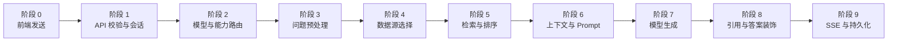

## 二、阶段 0：前端发送问题

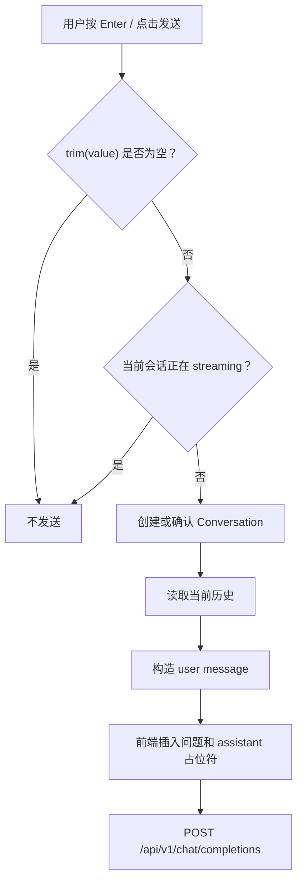

### 条件判定

| 条件 | 实际判断 | 代码位置 |
|---|---|---|
| 问题是否为空 | 对输入执行 `trim(value) === ''` | `web/src/pages/next-chats/hooks/use-send-chat-message.ts` |
| 是否正在生成 | 当前会话状态 `isStreaming` | 同上 |
| 是否新建会话 | URL 中是否有会话 ID，以及 `createConversationBeforeSendMessage` 的返回结果 | 同上 |
| 是否保留完整历史 | 请求设置 `pass_all_history_messages: true` | `web/src/services/chat-completion-stream.ts` |
| 是否联网 | 由输入组件传入 `enableInternet`，最终作为请求字段 `internet` | 同上 |
| 是否推理 | 由输入组件传入 `enableThinking`，最终转换为 `reasoning` | 同上 |

## 三、阶段 1：API 校验、会话和权限

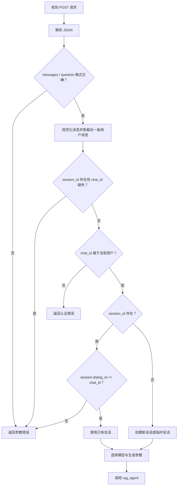

### 条件判定

| 条件 | 判断方式 |
|---|---|
| `chat_id` 是否有效 | `_ensure_owned_chat(chat_id)` 检查当前用户是否拥有该 Chat |
| `session_id` 是否有效 | 查询 Conversation；查询不到返回 `Session not found!` |
| 会话是否属于 Chat | 比较 `conv.dialog_id` 与 `chat_id` |
| 是否保存历史 | `store_history_messages` 默认是 `true`；如果关闭，则要求 `pass_all_history_messages=true` |
| 是否流式 | 请求字段 `stream`，默认是 `true` |

Python 入口是 `api/apps/restful_apis/chat_api.py:1242` 附近的 `session_completion`。

## 四、阶段 2：模型加载与能力路由

这是最容易产生疑问的阶段。系统不是只看用户有没有打开“推理”，还会继续判断模型能力和附件类型。

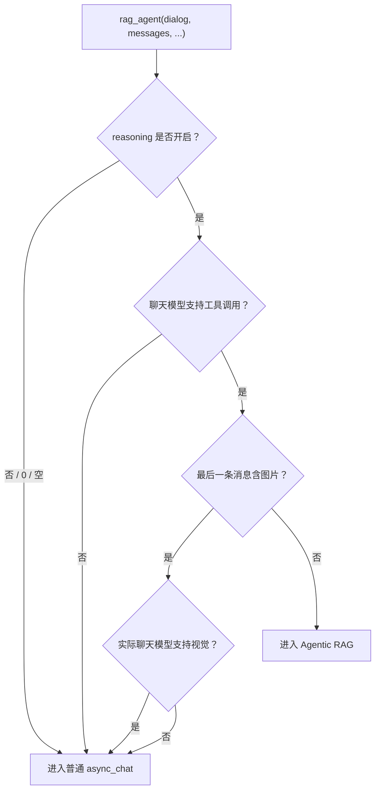

### 4.1 “是否开启 reasoning”怎么判断？

入口代码读取：

```python
reasoning = kwargs["reasoning"] if "reasoning" in kwargs else prompt_config.get("reasoning", 0)
if not reasoning or str(reasoning).strip() == "0":
    # 普通 async_chat
```

因此以下值会进入普通路径：

- `0`
- `"0"`
- `None`
- `False`
- 空字符串

其他非零值会进入推理分支，例如前端传入的 `"1"` 到 `"4"`。这些值还会映射到不同思考等级；非法数字会回退到 `medium`。

### 4.2 “模型支持工具调用?” 怎么判断？

#### 什么是工具调用？

工具调用（Tool Calling，也称 Function Calling）是模型输出结构化的“请求后端执行某个工具”，而不是把工具调用当作普通文本。例如，模型可能返回：

```json
{
  "tool": "rag",
  "arguments": {
    "query": "RAGFlow 如何进行文档解析？"
  }
}
```

模型本身不会执行这个工具，也不会直接访问数据库或搜索引擎。完整过程是：

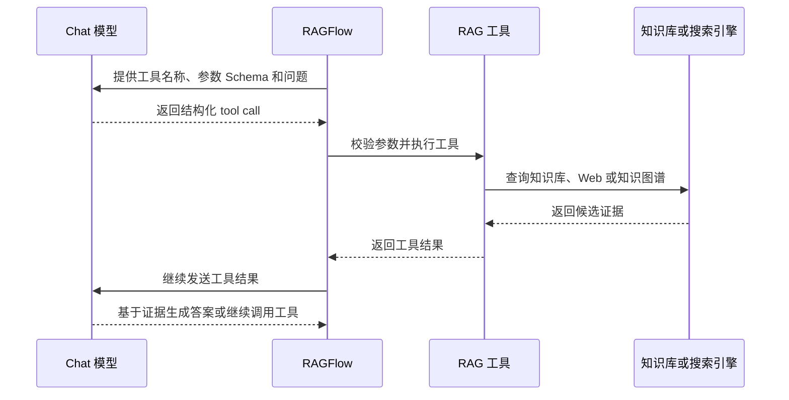

在 RAGFlow 中，工具调用主要用于 Agentic RAG：模型判断是否需要检索、应该检索什么；RAGFlow 执行检索工具并把结果返回给模型；模型可以根据证据是否充分继续发起补充查询，最后生成带引用的答案。

它和普通 RAG 的区别是：

| 普通 RAG | Agentic RAG |
|---|---|
| 后端先固定执行检索，再把结果放进 Prompt | 模型可以决定何时调用检索工具以及如何补充查询 |
| 检索问题主要由后端改写和配置决定 | 检索过程可以根据中间证据动态迭代 |
| 通常是一轮检索加一轮生成 | 可能多轮“模型 -> 工具 -> 模型” |
| 不要求模型理解工具协议 | 要求模型能返回结构化工具调用 |

工具调用不是“模型获得服务器权限”。工具实际能做什么，仍由 RAGFlow 绑定的工具集合、参数校验、知识库范围和后端权限决定。模型只能请求已暴露的工具，不能自行执行任意 Python、SQL 或系统命令。

代码不会现场向供应商发送一次试探请求，而是读取当前 `LLMBundle` 的能力标记：

```python
if not getattr(chat_mdl, "is_tools", False):
    # 不支持工具调用，回退普通 RAG
    async for ans in async_chat(...):
        yield ans
```

也就是说，判断依据是：

1. 根据 Chat 配置解析实际模型和供应商；
2. 创建 `LLMBundle`；
3. `LLMBundle`/底层模型适配器设置 `is_tools`；
4. `rag_agent` 读取该布尔值。

`getattr(..., False)` 的含义是：如果适配器没有这个能力字段，默认按照“不支持工具调用”处理，而不是冒险发送工具协议。

支持工具调用时，代码执行：

```python
chat_mdl.bind_tools(None, rag_tools.tools)
```

然后 Agentic RAG 才能将 RAG 工具的名称、描述和参数 Schema 绑定给模型。模型返回 tool call 后，RAGFlow 的工具执行器负责真正运行工具、收集结果并驱动下一轮模型调用。

若模型不支持工具调用，直接走普通 RAG，避免模型只收到路由提示词却从自身知识回答。这里的“不支持”包括：

- 当前供应商适配器没有实现工具调用协议；
- 当前模型配置没有声明工具调用能力；
- `LLMBundle` 没有设置 `is_tools=True`；
- 能力字段缺失，此处通过 `getattr(chat_mdl, "is_tools", False)` 按不支持处理。

因此，`is_tools` 是 RAGFlow 对“当前实际选中的模型适配器是否可以安全接收和返回工具调用”的能力声明，不是通过模型回答内容猜测出来的。

### 4.3 工具调用与安全边界

工具调用链中的职责可以分成三层：

1. **模型层**：决定是否请求工具，以及提供结构化参数。
2. **RAGFlow 编排层**：检查模型能力、绑定允许的工具、执行调用、控制循环和终止条件。
3. **数据访问层**：根据 Chat 绑定的知识库、文档范围、元数据过滤和搜索配置实际查询数据。

即使模型返回了工具调用，后端仍然掌握最终执行权。工具调用失败、模型不支持工具协议或工具结果不足时，系统可以回退普通 RAG 或返回错误，而不会把未经检索的工具请求当成最终答案。

### 4.4 “最后一条消息含图片?” 怎么判断？

`message_has_image_attachments` 检查最后一条用户消息的 `files`：

- 文件字典的 `mime_type` 中包含 `image`；
- 或附件是 `data:` URI。

命中后还会调用 `dialog_model_vision_capable(dialog)` 判断聊天模型是否具备视觉能力。视觉模型和图片会回退到 `async_chat`，因为普通路径会把图片真正转换为多模态消息；Agentic RAG 的外层工具循环不能保证图片内容被内层检索答案看到。

### 4.5 模型实例怎么选？

`get_models` 按以下逻辑加载：

1. 知识库存在时，按知识库的 `embd_id` 解析 Embedding 模型。
2. Chat 有租户级模型覆盖时优先使用租户模型。
3. 否则使用 Chat 自己的 `llm_id`。
4. `llm_id` 为空时使用租户默认 Chat 模型。
5. `dialog.rerank_id` 非空时加载 Rerank 模型。
6. Prompt 配置开启 TTS 时加载 TTS 模型。

## 五、阶段 3：问题预处理

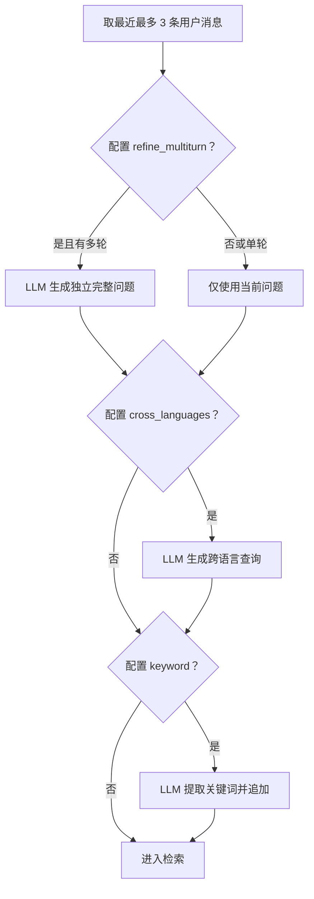

### 条件判定

| 条件 | 判断方式 | 失败时行为 |
|---|---|---|
| 多轮改写 | `len(questions) > 1 and prompt_config.get("refine_multiturn")` | 使用当前问题 |
| 跨语言 | `prompt_config.get("cross_languages")` | 使用原问题 |
| 关键词增强 | `prompt_config.get("keyword", False)` | 不追加关键词 |
| 改写模型出错 | 返回内容包含 `**ERROR**` | `full_question` 回退到最后一条原问题 |
| 跨语言模型出错 | 返回内容包含 `**ERROR**` | `cross_languages` 回退原查询 |

多轮问题最多取最近三条用户消息，避免将无限长历史都交给问题改写模型。

## 六、阶段 4：数据源选择

> **定位结论：Text-to-SQL 就在本阶段执行。** 它是普通 `async_chat`
> 在向量/全文检索之前的优先分支。这里的阶段编号是按职责划分；源码真实顺序中，
> `use_sql` 还早于阶段 3 的多轮改写、跨语言和关键词增强，直接使用最后一条原始
> 用户问题。

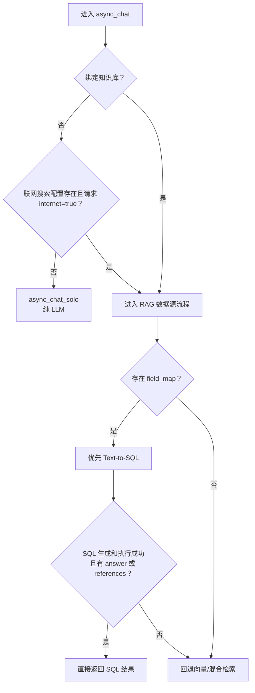

SQL 命中后的 `return` 表示它会短路后续流程：

- 有 `answer`，或者存在引用 Chunk：直接把 SQL 表格结果返回给用户；
- SQL 失败或返回 0 行：继续阶段 3 的问题增强，然后进入阶段 5 检索；
- 不会先向量检索、再补做 SQL。

### 6.0 不同问答路由是否会到达 Text-to-SQL

| 路由 | 是否执行 Text-to-SQL |
|---|---:|
| 普通 RAG，`reasoning=0` | `field_map` 非空时执行 |
| 未设置 reasoning | `field_map` 非空时执行 |
| 开启 reasoning，但模型不支持工具调用并回退普通 RAG | `field_map` 非空时执行 |
| 开启 reasoning，但带图片而回退普通 RAG | `field_map` 非空时执行 |
| 真正进入 Python Agentic RAG | 当前不执行 |

Python Agentic RAG 中虽然定义了 `structured_retrieve` 和 `structured_query`，
但当前没有接入 `agentic_rag_graph.py`、`action_session._TOOL_MAP` 或
`THINKING_MODES`。因此它们目前不是可实际调度的 Agentic 工具。不能因为源码中
存在这两个 helper，就认为 Agentic 路径已经执行了 Text-to-SQL。

### 6.1 “有知识库?” 怎么判断？

普通入口首先执行：

```python
use_web_search = _should_use_web_search(dialog.prompt_config, kwargs.get("internet"))
if not dialog.kb_ids and not use_web_search:
    async_chat_solo(...)
```

所以只要满足以下任一条件，就不会走纯 LLM：

- `dialog.kb_ids` 非空；
- 已配置 Web Search Provider 且本次请求的 `internet` 标志为真。

### 6.2 “启用联网?” 怎么判断？

联网必须同时满足：

1. Prompt 配置中存在有效 Web Search Provider；
2. 请求参数 `internet` 可规范化为真。

可识别的真值包括：

- `True`
- `1`
- `"true"`
- `"1"`
- `"yes"`
- `"on"`

`false`、`0`、`"false"`、空字符串等会被视为关闭。只有配置存在但请求没有打开 `internet`，仍不会联网。

### 6.3 “有结构化字段映射?” 怎么判断？

代码调用 `KnowledgebaseService.get_field_map(dialog.kb_ids)`。如果返回非空 `field_map`，就先走 `use_sql`。

`field_map` 不是运行问答时由模型猜出来的。上传 Excel/表格时，表格解析器读取列名、
推断类型，并将角色为 `metadata` 或 `both` 的列保存到知识库配置
`parser_config.field_map`。问答时，`get_field_map` 合并所有绑定知识库的映射。

例如：

```json
{
  "bu_men_tks": "部门",
  "bao_xiao_jin_e_flt": "报销金额",
  "ri_qi_tm": "日期"
}
```

“非空”就是这个字典至少有一个字段。它只表示当前知识库存在可用 SQL 查询的结构化
Schema，不表示本次问题一定能由 SQL 回答。

执行 `use_sql` 时，后端先根据文档引擎、租户和 KB 算出目标表名，然后把以下内容
一起放进 SQL 生成 Prompt：

1. 已确定的目标表名；
2. `field_map` 中允许使用的字段名和显示名/类型；
3. 用户的自然语言问题；
4. 必须返回 `doc_id` 和文档名等来源字段的规则。

模型不执行 `SHOW TABLES`，也不自行选择数据库。它只针对后端指定的 RAGFlow
文档表，根据用户问题在给定字段列表中选择字段并生成 SQL。后端随后再注入允许的
`kb_id` 和 `doc_id` 范围。

目标表名能够被确定，不是因为后端临时猜测数据库结构，而是因为 RAGFlow 的 Chunk
入库和查询共享固定命名规则：

```python
def index_name(uid):
    return f"ragflow_{uid}"
```

- 基础名由知识库所属 `tenant_id` 唯一确定；
- Infinity 入库时把 `kb_id` 追加为
  `ragflow_<tenant_id>_<kb_id>`，每个 KB 一张物理表；
- ES/OpenSearch 等引擎使用 `ragflow_<tenant_id>` 租户级共享索引，每条数据带
  `kb_id`，查询时由后端注入 KB 过滤条件。

上传和解析文档时，Chunk 已经按这套规则写入对应位置。因此问答阶段只需用同样的
`tenant_id`、`kb_id` 和引擎规则重建目标名称，不需要让模型发现表。

SQL 路径还会检查：

- 是否存在带 `parser_config.field_map` 的知识库；
- 多租户知识库是否跨越多个文档存储租户；
- KB ID 和文档 ID 是否为合法格式；
- 生成的 SQL 是否访问允许的数据范围。

如果 SQL 没有返回有效 `answer` 或引用 Chunk，则明确回退到向量检索。

## 七、阶段 5：检索、重排和过滤

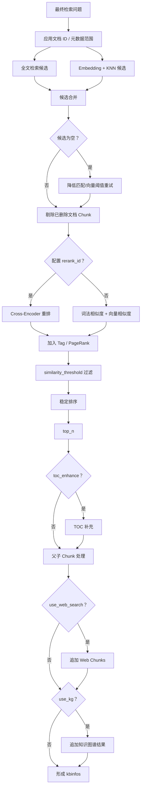

### 7.1 检索候选怎么产生？

`Dealer.search` 同时构造：

- 关键词/全文匹配；
- 问题向量；
- KNN 向量查询；
- KB、文档、可用状态等过滤；
- 可选 Tag/PageRank 特征。

在 Elasticsearch 路径，系统会先以候选 ID 做搜索，再通过 KNN-only 查询得到干净的向量分数；Chunk 向量不会在主检索阶段全部传回应用，而是在需要生成引用时按需补取。

### 7.2 “候选为空”怎么处理？

如果第一次搜索为零：

- 没有全文表达式时，可以降低向量相似度阈值；
- 有全文表达式时，可以降低全文最小匹配和向量阈值；
- 指定了文档 ID 时，还可以执行受范围约束的无文本过滤查询。

重试仍然不会移除 KB、文档和可用状态过滤。

### 7.3 “是否配置 Rerank?” 怎么判断？

判断条件是 `rerank_mdl is not None`，而 `rerank_mdl` 只有在 `dialog.rerank_id` 非空且模型配置成功时才会创建。

有 Rerank：

```text
候选 Chunk -> Rerank 模型 -> 词法分数和 Rerank 分数组合
```

无 Rerank：

```text
候选 Chunk -> 词法相似度和向量相似度加权
```

### 7.4 “Chunk 是否保留?” 怎么判断？

排序后，系统只保留满足以下条件的候选：

```text
综合分数 >= similarity_threshold
```

然后按综合分数降序稳定排序，再取请求的 `page_size`，聊天场景通常使用 `dialog.top_n`。

此外，`_prune_deleted_chunks` 会检查 Chunk 对应的文档是否仍存在。若索引中有残留但数据库文档已删除，则从结果中删除。

### 7.5 TOC、父子 Chunk、知识图谱怎么判断？

| 功能 | 条件 |
|---|---|
| TOC 增强 | `prompt_config.get("toc_enhance")` |
| 父子 Chunk | 普通检索完成后固定调用 `retrieval_by_children` |
| Web 搜索 | `_should_use_web_search(...)` 返回真 |
| 知识图谱 | `prompt_config.get("use_kg")` |

## 八、阶段 6：上下文构造与 Prompt

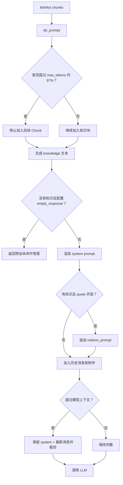

### 条件判定

| 条件 | 判断方式 |
|---|---|
| 是否加入知识块 | `kbinfos["chunks"]` 中有内容且未超过 Token 预算 |
| 是否走 `empty_response` | 没有知识、没有可用附件上下文，并且 `prompt_config["empty_response"]` 非空 |
| 是否添加引用指令 | `knowledges` 非空且 `quote` 默认/显式为真 |
| 是否裁剪消息 | `message_fit_in` 计算总 Token 超过模型允许的约 95% |
| 是否自动追加知识 | 有检索知识但 System Prompt 没有 `{knowledge}` 占位符 |

`kb_prompt` 按完整知识块计算 Token，知识块包含标题、URL、元数据和正文，避免只计算正文而导致实际 Prompt 超限。

## 九、阶段 7：模型生成

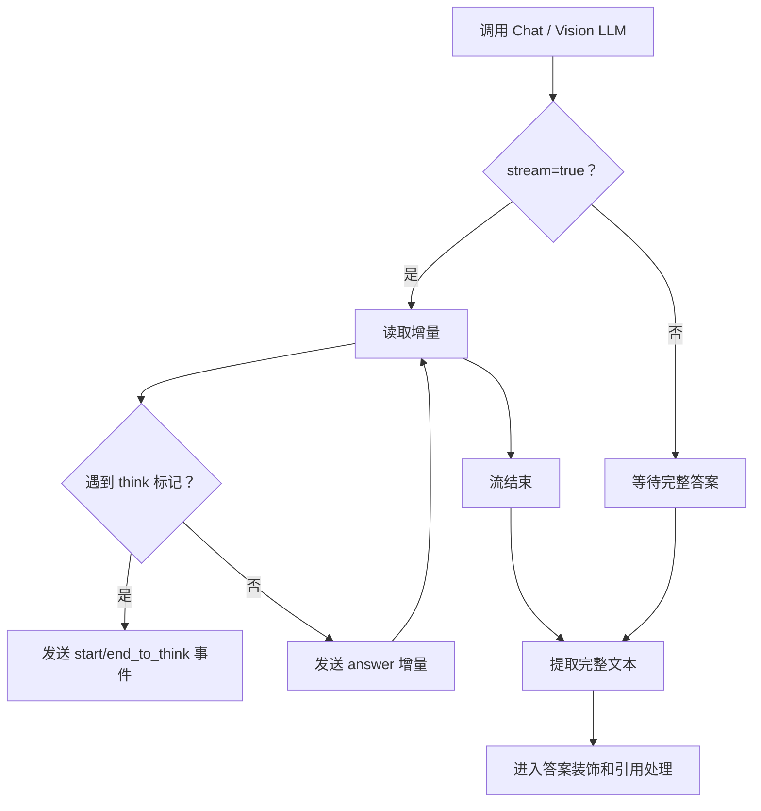

流式解析会识别 `<think>` 和 `</think>`，将思考和可见答案分开。前端可以单独展示思考状态；思考内容不会被当作普通答案引用。

## 十、阶段 8：引用和答案质量后处理

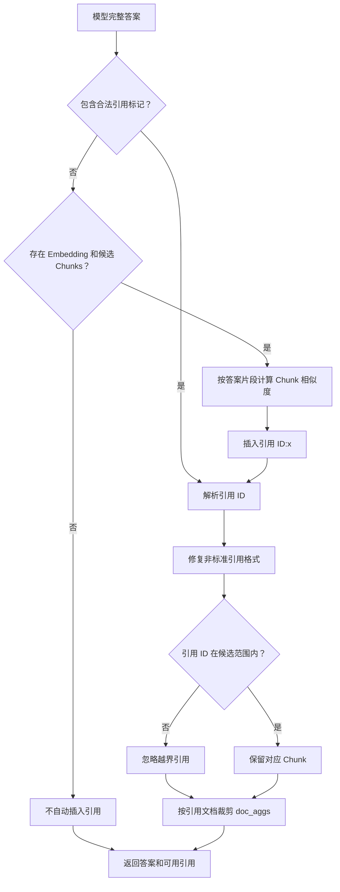

### 条件判定

合法引用模式主要是：

```text
[ID:1]
[1]
```

系统还会识别并修复：

```text
(ID: 1)
【ID: 1】
ref1
```

模型没有引用时，只有同时满足以下条件才会自动补引用：

1. 有 Embedding 模型；
2. 有候选知识 Chunk；
3. 能取得候选 Chunk 的向量；
4. 答案片段与候选 Chunk 的混合相似度超过动态阈值。

自动补引用不是逐句事实验证，而是“答案片段与知识块相似”匹配。

## 十一、阶段 9：SSE、前端合并与会话保存

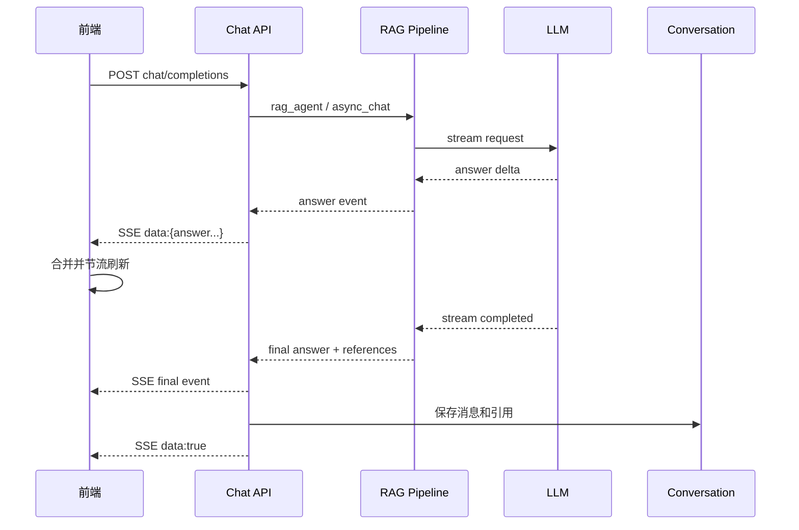

### 结束条件

| 条件 | 行为 |
|---|---|
| 正常完成 | 发送最终答案、引用和结束事件 |
| 用户停止 | AbortController 中止读取，保留已生成文本 |
| SSE Reader AbortError | 前端标记为 aborted，不把它当普通请求失败 |
| 其他读取异常 | 前端将请求标记失败并把问题放入待重试状态 |
| 后端异常 | 返回 `code=500` 和错误答案事件，同时结束 SSE |

后端使用 `structure_answer` 将增量内容累加到 Assistant 消息，并在最终事件或引用发生变化时更新 Conversation 的引用信息。

## 十二、质量保障的实际边界

### 能够明确保障的部分

- 检索范围不会无条件跨越用户指定的知识库和文档范围。
- 已删除文档的残留 Chunk 会在检索结果中被清理。
- 候选结果会经过阈值过滤和 Top N 限制。
- Prompt 和历史消息会受到 Token 预算控制。
- 引用 ID 会经过格式修复和越界过滤。
- 没有依据时可以返回预设的未命中回答。
- 不支持工具调用的模型不会被强行走 Agentic RAG。

### 不能完全保障的部分

- 引用存在不等于答案逐句被证实。
- 普通路径没有独立的最终事实核验模型。
- 文档解析、Chunk 切分或 Embedding 质量差时，后续流程无法完全修复。
- 联网结果的可信度取决于搜索供应商和网页来源。
- 自定义 System Prompt 可能改变模型的回答风格和约束效果。

## 十三、关键代码索引

| 阶段 | 文件/符号 |
|---|---|
| 前端发送 | `web/src/pages/next-chats/hooks/use-send-chat-message.ts` |
| SSE 请求与解析 | `web/src/services/chat-completion-stream.ts` |
| 前端流驱动 | `web/src/pages/next-chats/chat-stream/run-stream.ts` |
| Python API 入口 | `api/apps/restful_apis/chat_api.py:session_completion` |
| 路由普通/Agentic | `api/db/services/dialog_service.py:rag_agent` |
| 普通 RAG 主流程 | `api/db/services/dialog_service.py:async_chat` |
| 模型加载 | `api/db/services/dialog_service.py:get_models` |
| 混合检索与重排 | `rag/nlp/search.py:Dealer.retrieval` |
| 搜索候选召回 | `rag/nlp/search.py:Dealer.search` |
| 知识 Prompt | `rag/prompts/generator.py:kb_prompt` |
| 问题改写和关键词 | `rag/prompts/generator.py:full_question`、`keyword_extraction` |
| 引用格式修复 | `api/db/services/dialog_service.py:repair_bad_citation_formats` |
| 会话答案持久化 | `api/db/services/conversation_service.py:structure_answer` |
| Go 端对应流程 | `internal/service/chat_pipeline.go:ChatPipelineService` |
