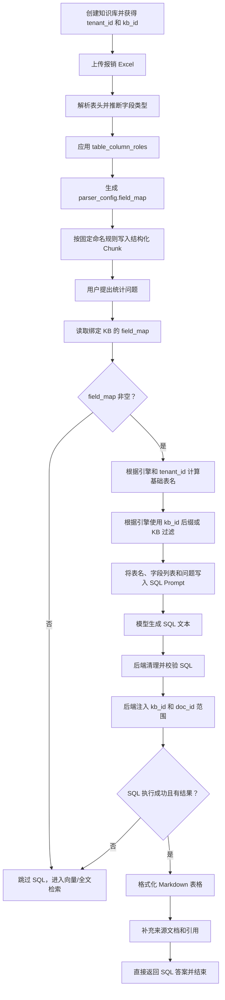

# Text-to-SQL 完整示例：从 Excel 入库到问答返回

本文通过一份“报销明细 Excel”说明 RAGFlow 的 Text-to-SQL 完整流程，重点回答：

1. `field_map` 是怎样生成的；
2. 后端为什么能确定目标表名；
3. 模型怎么知道可以查询哪些字段；
4. 模型生成 SQL 后，知识库和文档范围如何被限制；
5. SQL 结果如何变成最终答案和引用。

## 一、核心结论

RAGFlow 的 Text-to-SQL 不是连接用户的任意业务数据库，让模型执行
`SHOW TABLES` 后自行选择业务表。

它查询的是：

> RAGFlow 解析 Excel、CSV 或其他表格文档后，按照固定命名规则写入自身文档存储
> 引擎的结构化 Chunk。

文档写入和问答查询使用同一套命名规则，因此后端可以根据文档存储引擎、
`tenant_id` 和 `kb_id` 精确定位数据，而不需要模型发现数据库结构。

## 二、示例数据

### 2.1 创建知识库

假设某公司创建了一个知识库：

```text
tenant_id：
11111111-1111-1111-1111-111111111111

kb_id：
22222222-2222-2222-2222-222222222222

知识库名称：
财务制度
```

两个 ID 的作用：

| ID | 含义 |
|---|---|
| `tenant_id` | 标识数据属于哪个租户，也是文档存储基础索引名的一部分 |
| `kb_id` | 标识数据属于哪个知识库，用于物理表隔离或查询范围过滤 |

### 2.2 上传 Excel

向“财务制度”知识库上传：

```text
2026年9月报销明细.xlsx
```

Excel 内容：

| 姓名 | 部门 | 报销金额 | 报销类型 | 日期 |
|---|---|---:|---|---|
| 张三 | 研发部 | 6200 | 差旅费 | 2026-09-01 |
| 李四 | 研发部 | 3500 | 办公费 | 2026-09-02 |
| 王五 | 市场部 | 8000 | 差旅费 | 2026-09-03 |

“姓名”“部门”“报销金额”等是 Excel 的列，不是独立数据库表。

## 三、表格解析和 `field_map`

### 3.1 解析列名和类型

RAGFlow 的表格解析器读取表头并推断数据类型：

```text
姓名       -> 文本
部门       -> 文本
报销金额   -> 数值
报销类型   -> 文本
日期       -> 日期
```

### 3.2 列角色决定是否可用于 SQL

`table_column_roles` 决定每一列如何使用：

| 列角色 | 进入文本检索 | 写入结构化存储 | 进入 `field_map` | 可用于 SQL |
|---|---:|---:|---:|---:|
| `metadata` | 否 | 是 | 是 | 是 |
| `both` | 是 | 是 | 是 | 是 |
| `indexing` / `vectorize` | 是 | 否 | 否 | 否 |

假设示例中的五列都配置为 `both`，它们既可以参与全文/向量检索，也可以参与
Text-to-SQL。

#### 3.2.1 谁配置 `table_column_roles`

系统支持两种模式：

| 模式 | 谁决定列角色 | 实际行为 |
|---|---|---|
| `auto` | 后端使用默认规则 | 所有列都按 `both` 处理 |
| `manual` | 用户逐列选择 | 后端读取用户提交的 `table_column_roles` |

默认模式是 `auto`。如果用户没有进行任何配置，后端执行：

```python
if parser_config.get("table_column_mode") == "manual":
    column_roles = parser_config.get("table_column_roles") or {}
else:
    column_roles = {}
```

处理每一列时使用：

```python
role = column_roles.get(col_name, "both")
```

因此没有显式角色的列，默认角色就是 `both`。

需要区分两种“自动”：

- **列名读取和字段类型推断**是程序自动完成的；
- **列角色自动模式**不是模型逐列智能判断，而是统一把所有列设为 `both`。

#### 3.2.2 用户可以在上传时配置

如果当前知识库使用 Table Parser，上传弹窗会在浏览器本地读取所选 Excel/CSV 的
表头，展示列名。例如：

```text
姓名
部门
报销金额
报销类型
日期
```

用户可以选择：

```text
自动：全部使用 both

手动：
  姓名       -> indexing
  部门       -> both
  报销金额   -> metadata
  报销类型   -> both
  日期       -> metadata
```

手动配置随上传请求传递：

```json
{
  "table_column_mode": "manual",
  "table_column_roles": {
    "姓名": "indexing",
    "部门": "both",
    "报销金额": "metadata",
    "报销类型": "both",
    "日期": "metadata"
  }
}
```

这意味着：

- “姓名”只进入文本检索，不能作为 SQL 结构化字段；
- “部门”和“报销类型”既可文本检索也可 SQL；
- “报销金额”和“日期”只作为结构化元数据，可用于 SQL。

#### 3.2.3 用户也可以在首次解析后修改

首次解析表格时，后端会自动读取所有 Sheet 的列名，并保存：

```python
parser_config["table_column_names"]
```

知识库设置页面利用这份列名列表展示逐列角色选择器。因此用户也可以：

1. 先按默认自动模式上传和解析；
2. 打开知识库的 Table Parser 设置；
3. 切换到手动模式；
4. 为每一列选择 `indexing`、`metadata` 或 `both`；
5. 保存配置；
6. 重新解析已有表格文档。

重新解析很重要，因为角色决定 Chunk 入库时：

- 哪些字段写入 `content_with_weight`；
- 哪些字段写入结构化存储；
- 最终生成怎样的 `field_map`。

仅修改知识库配置，不重新解析已入库文档，旧 Chunk 不会自动按照新角色重新构造。

#### 3.2.4 示例中角色从哪里来

如果用户上传报销 Excel 时什么都不改：

```text
table_column_mode = auto
table_column_roles = 未设置
```

后端最终得到：

```text
姓名       -> both
部门       -> both
报销金额   -> both
报销类型   -> both
日期       -> both
```

所以本文后续示例中的五个字段都会进入 `field_map`。

如果用户手动把“姓名”设为 `indexing`，重新解析后，“姓名”不会进入结构化
`field_map`，Text-to-SQL Prompt 也不会把“姓名”作为允许的业务字段提供给模型。

### 3.3 生成字段映射

在 Elasticsearch/OpenSearch 一类引擎中，示意 `field_map` 可能是：

```json
{
  "xing_ming_tks": "姓名",
  "bu_men_tks": "部门",
  "bao_xiao_jin_e_flt": "报销金额",
  "bao_xiao_lei_xing_tks": "报销类型",
  "ri_qi_tm": "日期"
}
```

可以将其理解为：

| Excel 列名 | 文档存储中的实际字段 |
|---|---|
| 姓名 | `xing_ming_tks` |
| 部门 | `bu_men_tks` |
| 报销金额 | `bao_xiao_jin_e_flt` |
| 报销类型 | `bao_xiao_lei_xing_tks` |
| 日期 | `ri_qi_tm` |

不同文档引擎的实际字段名会不同：

- Elasticsearch/OpenSearch 通常使用转换后的存储字段名；
- Infinity/OceanBase 通常保留表格原始列名作为 `chunk_data` 的 JSON Key；
- GaussDB 使用其 JSONB 查询约定对应的字段名。

解析完成后，映射保存在：

```python
knowledgebase.parser_config["field_map"]
```

### 3.4 “field_map 非空”的含义

问答时执行：

```python
field_map = KnowledgebaseService.get_field_map(dialog.kb_ids)
```

多个绑定知识库的映射会被合并：

```python
conf = {}
for kb in KnowledgebaseService.get_by_ids(kb_ids):
    if kb.parser_config and "field_map" in kb.parser_config:
        conf.update(kb.parser_config["field_map"])
```

因此：

```text
field_map == {}
```

表示没有任何绑定知识库提供可用于 SQL 的结构化列，系统跳过 Text-to-SQL。

```text
bool(field_map) == True
```

表示至少存在一个结构化字段，可以尝试 Text-to-SQL。

非空只说明存在可用 Schema，不说明：

- 当前问题一定适合 SQL；
- SQL 一定生成成功；
- SQL 一定能查询到数据。

## 四、数据写入哪里

### 4.1 固定基础名称

RAGFlow 的基础文档索引命名函数是：

```python
def index_name(uid):
    return f"ragflow_{uid}"
```

其中 `uid` 是知识库所属租户的 `tenant_id`。

本例中：

```text
tenant_id =
11111111-1111-1111-1111-111111111111
```

所以基础索引名是：

```text
ragflow_11111111-1111-1111-1111-111111111111
```

### 4.2 入库时使用相同规则

文档解析完成后，Chunk 通过以下方式写入文档存储：

```python
settings.docStoreConn.insert(
    chunks,
    search.index_name(task_tenant_id),
    task_dataset_id,
)
```

参数对应：

```text
search.index_name(task_tenant_id)
    = ragflow_<tenant_id>

task_dataset_id
    = kb_id
```

因此写入时已经同时知道：

- 租户级基础索引名；
- Chunk 属于哪个知识库。

## 五、Excel 每一行如何存储

在 Elasticsearch/OpenSearch 的示意结构中，Excel 第一行可能转换为：

```json
{
  "kb_id": "22222222-2222-2222-2222-222222222222",
  "doc_id": "33333333-3333-3333-3333-333333333333",
  "docnm_kwd": "2026年9月报销明细.xlsx",
  "xing_ming_tks": "张三",
  "bu_men_tks": "研发部",
  "bao_xiao_jin_e_flt": 6200,
  "bao_xiao_lei_xing_tks": "差旅费",
  "ri_qi_tm": "2026-09-01",
  "content_with_weight": "姓名：张三；部门：研发部；报销金额：6200；报销类型：差旅费；日期：2026-09-01"
}
```

第二行：

```json
{
  "kb_id": "22222222-2222-2222-2222-222222222222",
  "doc_id": "33333333-3333-3333-3333-333333333333",
  "docnm_kwd": "2026年9月报销明细.xlsx",
  "xing_ming_tks": "李四",
  "bu_men_tks": "研发部",
  "bao_xiao_jin_e_flt": 3500,
  "bao_xiao_lei_xing_tks": "办公费",
  "ri_qi_tm": "2026-09-02"
}
```

第三行：

```json
{
  "kb_id": "22222222-2222-2222-2222-222222222222",
  "doc_id": "33333333-3333-3333-3333-333333333333",
  "docnm_kwd": "2026年9月报销明细.xlsx",
  "xing_ming_tks": "王五",
  "bu_men_tks": "市场部",
  "bao_xiao_jin_e_flt": 8000,
  "bao_xiao_lei_xing_tks": "差旅费",
  "ri_qi_tm": "2026-09-03"
}
```

概念上可以理解为：

```text
索引：ragflow_11111111-1111-1111-1111-111111111111

┌────────────┬────────┬──────────┬────────┬────────────┐
│ kb_id      │ 姓名   │ 部门     │ 金额   │ doc_id     │
├────────────┼────────┼──────────┼────────┼────────────┤
│ 2222...    │ 张三   │ 研发部   │ 6200   │ 3333...    │
│ 2222...    │ 李四   │ 研发部   │ 3500   │ 3333...    │
│ 2222...    │ 王五   │ 市场部   │ 8000   │ 3333...    │
└────────────┴────────┴──────────┴────────┴────────────┘
```

## 六、用户提出问题

用户问：

```text
研发部报销金额超过 5000 元的有几笔？
```

普通 RAG 在“数据源选择”阶段读取当前 Chat 绑定知识库的 `field_map`。

由于映射非空，系统在向量/全文检索之前优先尝试 Text-to-SQL。

## 七、后端如何确定目标表

后端已经知道：

```text
当前文档引擎：
Elasticsearch

tenant_id：
11111111-1111-1111-1111-111111111111

kb_id：
22222222-2222-2222-2222-222222222222
```

Elasticsearch/OpenSearch 使用租户级共享索引：

```text
目标索引 = ragflow_<tenant_id>
```

所以目标索引确定为：

```text
ragflow_11111111-1111-1111-1111-111111111111
```

这个名称不是模型猜出来的，也不是模型查询数据库目录得到的。它是后端按照和入库
阶段相同的命名公式计算出来的。

## 八、后端怎样把表和字段告诉模型

RAGFlow 构造类似下面的 SQL 生成 Prompt：

```text
You are a Database Administrator. Write SQL queries.

Table:
ragflow_11111111-1111-1111-1111-111111111111

Available fields:
- xing_ming_tks (姓名)
- bu_men_tks (部门)
- bao_xiao_jin_e_flt (报销金额)
- bao_xiao_lei_xing_tks (报销类型)
- ri_qi_tm (日期)

Question:
研发部报销金额超过 5000 元的有几笔？

Rules:
1. Use exact field names from the schema.
2. Output only SQL.
3. Do not output explanations.
```

模型不执行 `SHOW TABLES`，也不会自行访问数据库 Schema。它只得到：

1. 一个已经确定的目标表名；
2. `field_map` 提供的允许字段；
3. 用户自然语言问题；
4. SQL 生成规则。

## 九、模型如何选择字段

模型根据用户问题和 `field_map` 做语义对应：

```text
“研发部”
    -> bu_men_tks = '研发部'

“报销金额”
    -> bao_xiao_jin_e_flt

“超过 5000”
    -> bao_xiao_jin_e_flt > 5000

“有几笔”
    -> COUNT(*)
```

模型可能生成：

```sql
SELECT COUNT(*) AS rows
FROM ragflow_11111111-1111-1111-1111-111111111111
WHERE bu_men_tks = '研发部'
  AND bao_xiao_jin_e_flt > 5000
```

模型只生成 SQL 文本，不直接执行 SQL。

## 十、后端强制加入知识库范围

租户级索引中可能同时存在多个知识库的数据。例如：

```text
财务制度 KB
员工制度 KB
销售数据 KB
```

因此只确定租户级索引还不足以保证查询范围。后端会把当前 Chat 绑定的 `kb_id`
注入 SQL：

```sql
SELECT COUNT(*) AS rows
FROM ragflow_11111111-1111-1111-1111-111111111111
WHERE bu_men_tks = '研发部'
  AND bao_xiao_jin_e_flt > 5000
  AND kb_id = '22222222-2222-2222-2222-222222222222'
```

`kb_id` 范围不是模型决定的。

如果用户只选择了某个文件，后端还会加入 `doc_id`：

```sql
SELECT COUNT(*) AS rows
FROM ragflow_11111111-1111-1111-1111-111111111111
WHERE bu_men_tks = '研发部'
  AND bao_xiao_jin_e_flt > 5000
  AND kb_id = '22222222-2222-2222-2222-222222222222'
  AND doc_id = '33333333-3333-3333-3333-333333333333'
```

后端还会校验插入 SQL 的 `kb_id` 和 `doc_id` 格式，防止把不合法 ID 直接拼接到
查询中。

## 十一、执行结果和最终答案

符合条件的数据只有：

| 姓名 | 部门 | 报销金额 |
|---|---|---:|
| 张三 | 研发部 | 6200 |

SQL 引擎返回的示意结果是：

```json
{
  "columns": [
    {
      "name": "rows"
    }
  ],
  "rows": [
    [1]
  ]
}
```

RAGFlow 将结果格式化为 Markdown 表格：

```markdown
|rows|
|------|
|1|
```

最终可以向用户展示：

```text
研发部报销金额超过 5000 元的记录共有 1 笔。
```

聚合结果通常不直接包含 `doc_id` 和文档名。RAGFlow 会根据原 SQL 的过滤条件另外
查询有限数量的来源文档，尽可能为聚合结果补充引用。

## 十二、Infinity 引擎的区别

Infinity 采用每个知识库一张物理表。

本例中：

```text
基础名：
ragflow_11111111-1111-1111-1111-111111111111

kb_id：
22222222-2222-2222-2222-222222222222
```

Infinity 连接器写入时执行：

```python
table_name = f"{index_name}_{knowledgebase_id}"
```

最终物理表名是：

```text
ragflow_11111111-1111-1111-1111-111111111111_22222222-2222-2222-2222-222222222222
```

因为这张表本身只属于一个 KB，所以 KB 范围已经编码在物理表名中。

Infinity 通常把业务列存放在 JSON `chunk_data` 中。模型收到的 Prompt 类似：

```text
Table:
ragflow_1111..._2222...

JSON fields:
- 姓名
- 部门
- 报销金额
- 报销类型
- 日期

Question:
研发部报销金额超过 5000 元的有几笔？
```

模型可能生成：

```sql
SELECT COUNT(*) AS rows
FROM ragflow_1111..._2222...
WHERE json_extract_string(chunk_data, '$.部门') = '研发部'
  AND CAST(
        json_extract_string(chunk_data, '$.报销金额')
        AS FLOAT
      ) > 5000
```

## 十三、两个引擎的定位方式对比

| 引擎 | 物理存储 | KB 隔离方式 |
|---|---|---|
| Elasticsearch/OpenSearch | `ragflow_<tenant_id>` | 多个 KB 共用索引，通过 `kb_id` 过滤 |
| Infinity | `ragflow_<tenant_id>_<kb_id>` | 每个 KB 一张物理表 |

三个输入分别解决：

| 信息 | 作用 |
|---|---|
| 文档存储引擎 | 决定使用租户共享表还是每 KB 独立表 |
| `tenant_id` | 决定基础名 `ragflow_<tenant_id>` |
| `kb_id` | Infinity 用作物理表后缀；其他引擎用作查询范围 |

## 十四、完整流程图



## 十五、仓库货架类比

可以把整个过程类比成仓库：

```text
tenant_id = 仓库编号
kb_id     = 货架或区域编号
doc_id    = 箱子编号
field_map = 箱内物品标签和实际存储字段的对照表
```

Elasticsearch/OpenSearch：

```text
根据 tenant_id 找到仓库
    ↓
根据 kb_id 找到仓库中的知识库区域
    ↓
根据 doc_id 限制到某个文件
```

Infinity：

```text
tenant_id + kb_id 直接确定一张知识库物理表
```

模型不负责选择仓库或货架。后端已经确定查询范围，模型只根据用户问题和
`field_map` 生成该范围内的 SQL。

## 十六、代码位置

| 内容 | 代码位置 |
|---|---|
| 基础索引命名 `index_name` | `rag/nlp/search.py` |
| 表格列解析和 `field_map` 生成 | `rag/app/table.py` |
| `field_map` 合并读取 | `api/db/services/knowledgebase_service.py` |
| Text-to-SQL 主流程 | `api/db/services/dialog_service.py` 中的 `use_sql` |
| Chunk 入库 | `rag/svr/task_executor.py` 中的 `insert_chunks` |
| Infinity 表名拼接 | `rag/utils/infinity_conn.py` 中的 `insert` |
| Go 对应 Text-to-SQL | `internal/service/chat_pipeline.go` |
