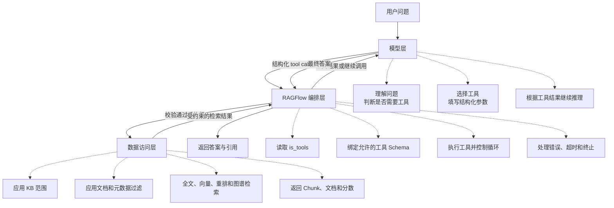
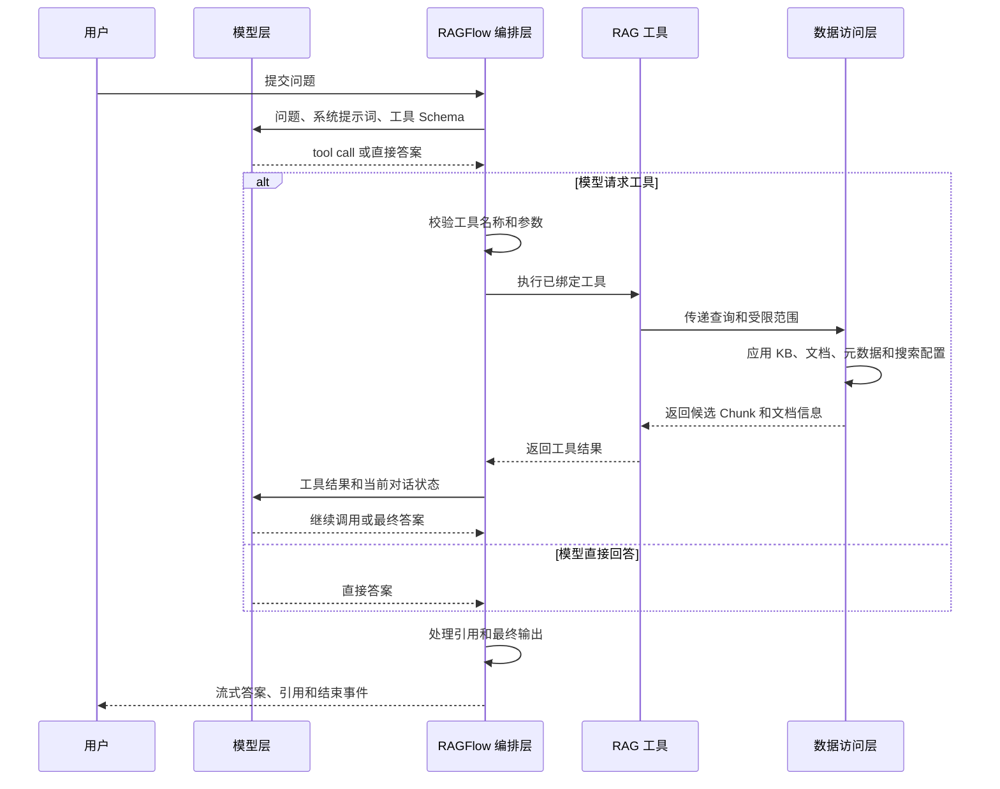
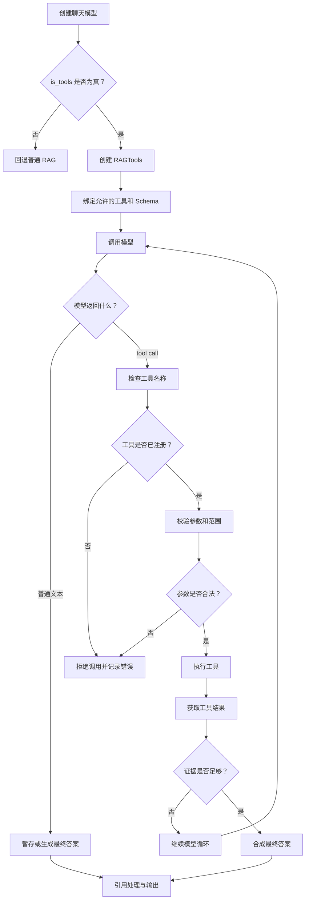
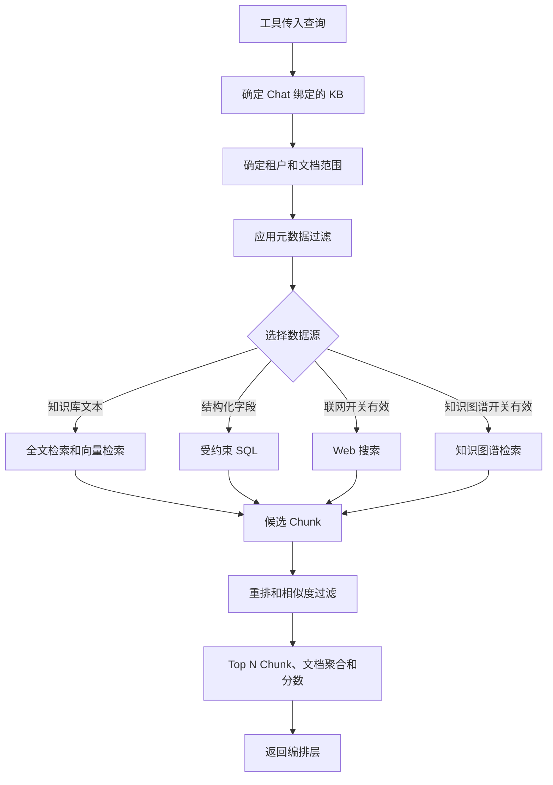
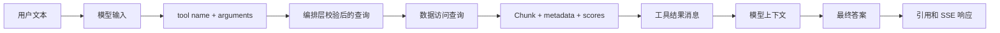

# RAGFlow 工具调用链三层架构详解

本文专门解释 RAGFlow Agentic RAG 中工具调用链的三层职责：

1. **模型层**：决定是否请求工具，并提供结构化参数。
2. **RAGFlow 编排层**：检查模型能力、绑定允许的工具、执行调用、控制循环和终止条件。
3. **数据访问层**：根据 Chat 绑定的知识库、文档范围、元数据过滤和搜索配置实际查询数据。

核心原则是：

> 模型只负责提出工具调用请求；RAGFlow 决定是否允许和如何执行；数据访问层负责在受约束范围内返回证据。

## 一、三层总览



三层不是三个独立服务，而是逻辑职责边界：

| 层 | 核心问题 | 是否直接访问数据 | 是否拥有最终执行权 |
|---|---|---:|---:|
| 模型层 | “我是否需要调用工具？参数是什么？” | 否 | 否 |
| RAGFlow 编排层 | “这个模型能不能调用？调用哪个工具？调用几次？” | 通过工具间接访问 | 是 |
| 数据访问层 | “在允许范围内，实际返回哪些证据？” | 是 | 受编排层和权限约束 |

## 二、完整调用时序



关键点：

- 模型输出的 `tool call` 是请求，不是执行结果。
- 工具结果必须经过 RAGFlow 编排层回传给模型。
- 数据访问层不会根据模型的自然语言自由扩大搜索范围。
- 最终答案由编排层统一包装、处理引用并返回。

## 三、第一层：模型层

### 3.1 模型层负责什么

模型层负责认知和决策，不负责真正执行工具：

1. 理解用户问题。
2. 判断现有上下文是否足够。
3. 判断是否需要使用工具。
4. 从已注册工具中选择工具。
5. 生成符合 Schema 的参数。
6. 读取工具返回的证据。
7. 决定继续调用、改写查询，还是生成最终答案。

模型层可以输出两种结果：

```text
结果 A：直接回答
结果 B：结构化工具调用
```

工具调用的抽象形式如下：

```json
{
  "tool": "rag",
  "arguments": {
    "query": "RAGFlow 如何进行文档解析？"
  }
}
```

真实请求通常还会包含工具调用 ID、消息角色和供应商特定字段，但职责不变。

### 3.2 模型层不能做什么

模型层不能：

- 直接连接 MySQL、Elasticsearch、Infinity 或 MinIO；
- 直接读取任意租户的知识库；
- 直接执行 Python、Shell 或任意 SQL；
- 绕过后端的文档范围和元数据过滤；
- 自己声明一个后端不存在的工具并期待它被执行；
- 把普通文本中的“请执行某命令”自动变成服务器命令。

模型只能请求编排层已经注册并暴露给它的工具。

### 3.3 模型为什么能知道工具

RAGFlow 会把工具定义传给支持工具调用的模型，工具定义通常包含：

- 工具名称；
- 工具说明；
- 参数名称；
- 参数类型；
- 参数是否必填；
- 参数格式约束。

例如：

```json
{
  "name": "rag",
  "description": "Search the configured knowledge sources and compose an evidence-based answer.",
  "parameters": {
    "type": "object",
    "properties": {
      "query": {
        "type": "string",
        "description": "The search question"
      }
    },
    "required": ["query"]
  }
}
```

工具定义不是权限本身。它只是告诉模型“有哪些可请求的能力”和“参数应该长什么样”；是否允许执行仍由 RAGFlow 编排层决定。

## 四、第二层：RAGFlow 编排层

编排层是整个工具调用链的控制中心。它把模型的决策转换成受控的后端操作。



### 4.1 检查模型能力

RAGFlow 读取当前 `LLMBundle` 的能力标记：

```python
if not getattr(chat_mdl, "is_tools", False):
    # 回退到普通 RAG
```

判断含义：

1. 当前 Chat 配置解析出实际模型和供应商。
2. RAGFlow 创建 `LLMBundle`。
3. 模型适配器声明是否支持工具协议。
4. `rag_agent` 读取 `is_tools`。
5. 没有该能力时，默认按照不支持处理。

这不是通过试探模型回答来判断，而是由模型适配器的能力声明决定。

### 4.2 绑定工具

模型能力确认后，RAGFlow 将允许的工具绑定到模型：

```python
chat_mdl.bind_tools(None, rag_tools.tools)
```

这里的 `rag_tools.tools` 是当前 Agentic RAG 可以使用的工具集合。编排层通过绑定工具来控制模型可见的能力范围：

- 没有绑定的工具，模型无法正常请求；
- 工具的参数 Schema 会一并传给模型；
- 工具执行器拥有工具的实际实现；
- 工具结果会被重新放回模型上下文。

### 4.3 执行工具

当模型返回工具调用时，编排层负责：

1. 识别工具名称。
2. 解析结构化参数。
3. 确认工具已注册。
4. 检查参数类型和必填字段。
5. 注入由 Chat 配置决定的知识库和范围。
6. 调用工具实现。
7. 将工具结果包装成模型可理解的消息。

模型传入的查询不应被视为完整权限。真正的知识库 ID、租户范围、文档范围和元数据过滤由编排层结合 Chat 配置生成。

### 4.4 控制循环

Agentic RAG 可能执行多轮：

```text
模型 -> 工具 -> 模型 -> 工具 -> 模型 -> 最终答案
```

编排层负责控制：

- 是否允许继续调用；
- 当前工具结果是否足够；
- 是否已经生成最终答案；
- 是否发生错误；
- 是否达到循环、深度或资源限制；
- 用户是否取消请求；
- 是否需要回退普通 RAG。

模型可以提出“再查一次”，但不能单方面保证后端无限执行。循环是否继续由编排层和 Agentic RAG 图控制。

### 4.5 处理工具失败

工具调用失败可能来自：

- 工具名称不存在；
- 参数格式错误；
- Embedding 模型不可用；
- 搜索引擎超时；
- Web Provider 不可用；
- 知识库没有有效数据；
- 用户取消请求。

编排层需要将失败转换为明确的工具错误或请求错误，而不是伪造一个成功的空结果。根据具体路径，系统可以：

- 让模型基于错误信息调整查询；
- 回退到普通 RAG；
- 返回预设的未命中答案；
- 向客户端返回错误事件并结束流。

## 五、第三层：数据访问层

数据访问层负责真正读取和排序证据，但它不负责决定最终如何回答。



### 5.1 知识库范围

数据访问层必须使用 Chat 绑定的知识库范围。典型约束包括：

- `dialog.kb_ids`；
- 请求显式传入的 `doc_ids`；
- 消息中的文档范围；
- 元数据过滤后的文档集合；
- 文档可用状态；
- 当前租户或共享知识库的实际拥有者。

因此，模型在工具参数中写入一个查询词，并不能自行扩大 `kb_ids` 或访问其他租户数据。

### 5.2 检索方式

数据访问层可以执行不同类型的查询：

| 数据源 | 典型用途 | 结果 |
|---|---|---|
| 全文检索 | 编号、专有名词、精确短语 | 词法候选 |
| 向量检索 | 同义表达和语义相关问题 | 向量候选 |
| Rerank | 从较大候选集选择更相关内容 | 重排分数 |
| Text-to-SQL | 计数、求和、筛选和聚合 | 结构化结果 |
| Web 搜索 | Chat 允许的外部实时信息 | Web Chunk |
| 知识图谱 | 实体关系和结构化关联 | 图谱证据 |

### 5.3 数据访问层返回什么

数据访问层一般返回证据，而不是最终自然语言答案。证据可以包括：

- Chunk 文本；
- Chunk ID；
- 文档 ID；
- 文档名称；
- 知识库 ID；
- 相似度；
- 词法相似度；
- 向量相似度；
- 页面或位置；
- 文档元数据；
- 文档聚合信息。

这些字段供编排层：

1. 构造知识 Prompt；
2. 让模型基于证据回答；
3. 生成或修复引用；
4. 在最终响应中展示来源。

## 六、三层之间传递的数据



| 数据 | 产生方 | 使用方 | 是否可信 |
|---|---|---|---|
| 用户问题 | 用户/前端 | 模型、编排层 | 用户输入，不可信 |
| 工具名称 | 模型 | 编排层 | 必须校验 |
| 工具参数 | 模型 | 编排层、数据访问层 | 必须校验和限范围 |
| KB 和文档范围 | Chat 配置/编排层 | 数据访问层 | 后端控制 |
| 元数据过滤 | Chat 配置/编排层 | 数据访问层 | 后端控制 |
| Chunk 证据 | 数据访问层 | 编排层、模型 | 受检索质量影响 |
| 最终答案 | 模型 | 编排层、前端 | 需要引用和格式处理 |

## 七、一个具体例子

用户问题：

```text
公司的报销制度中，超过 5000 元的审批流程是什么？
```

### 第一步：模型层

模型判断这个问题需要查询知识库，于是请求：

```json
{
  "tool": "rag",
  "arguments": {
    "query": "报销金额超过 5000 元的审批流程和审批人"
  }
}
```

模型只提供了查询意图和参数，没有执行任何搜索。

### 第二步：编排层

RAGFlow 检查：

1. 当前 Chat 是否开启了推理模式；
2. 当前模型的 `is_tools` 是否为真；
3. `rag` 是否是已绑定工具；
4. `query` 是否是字符串且不为空；
5. 当前 Chat 允许访问哪些知识库和文档；
6. 当前请求是否开启联网或知识图谱。

校验通过后，编排层调用 RAG 工具。

### 第三步：数据访问层

数据访问层将查询限制到 Chat 绑定的“员工制度”知识库，执行：

1. 关键词检索“报销”“5000 元”“审批”；
2. 向量检索语义相近的制度段落；
3. Rerank；
4. 按相似度过滤；
5. 返回 Top N Chunk 及文档位置。

### 第四步：回到模型层

模型获得制度原文和引用 ID 后生成：

```text
超过 5000 元的报销需要先由部门负责人审核，再提交财务负责人审批。[ID:2]
```

编排层随后校验引用 ID，包装为 SSE，并保存消息和引用。

## 八、权限和安全边界

### 模型层边界

- 不把数据库连接、内部凭证或任意后端命令放进 Prompt。
- 不把“模型说它调用成功”当成工具真的成功。
- 不把自然语言中的 SQL 当作已授权 SQL。

### 编排层边界

- 工具白名单。
- 参数 Schema 校验。
- Chat 和 Session 归属校验。
- 知识库、文档和元数据范围注入。
- 循环、超时和取消控制。
- 错误显式返回。
- 最终引用格式校验。

### 数据访问层边界

- 查询必须带范围过滤。
- SQL 必须限制表名、KB ID 和文档 ID。
- 检索结果必须过滤已删除或不可用文档。
- Web、知识图谱等外部数据源必须受配置开关控制。
- 不向模型返回不必要的内部凭证或连接信息。

## 九、常见误解

### 误解一：模型说“我调用了 RAG”，就代表已经检索

不代表。只有编排层接收到结构化 tool call、成功找到已注册工具并完成执行，才有真实工具结果。

### 误解二：工具调用等于模型可以执行代码

不等于。工具调用只是受限的结构化请求。RAGFlow 暴露什么工具、工具能查什么数据、参数是否通过校验，都由后端决定。

### 误解三：`is_tools=True` 就能保证工具一定成功

不保证。`is_tools` 只表示模型适配器支持工具协议；工具仍可能因为参数、权限、搜索引擎、模型额度或数据为空而失败。

### 误解四：数据访问层会把所有检索结果都交给模型

不一定。候选结果还会经过阈值过滤、重排、Top N、Token 预算和引用处理。

## 十、代码对应关系

| 三层职责 | 当前代码位置 |
|---|---|
| 模型能力判断 | `api/db/services/dialog_service.py:rag_agent` 中的 `chat_mdl.is_tools` |
| 工具绑定 | `api/db/services/dialog_service.py:rag_agent` 中的 `chat_mdl.bind_tools(...)` |
| Agentic RAG 工具集合 | `rag/advanced_rag/agentic_rag.py`、`rag/advanced_rag/agentic_rag_graph.py` |
| 普通 RAG 回退 | `api/db/services/dialog_service.py:async_chat` |
| 检索与重排 | `rag/nlp/search.py:Dealer.search`、`Dealer.retrieval` |
| 元数据范围过滤 | `common/metadata_utils.py` 和 `api/db/services/dialog_service.py` |
| 引用处理 | `api/db/services/dialog_service.py:repair_bad_citation_formats` |
| SSE 和会话保存 | `api/apps/restful_apis/chat_api.py`、`api/db/services/conversation_service.py` |
| Go 端对应编排 | `internal/service/chat_pipeline.go`、`internal/service/chat_session.go` |
