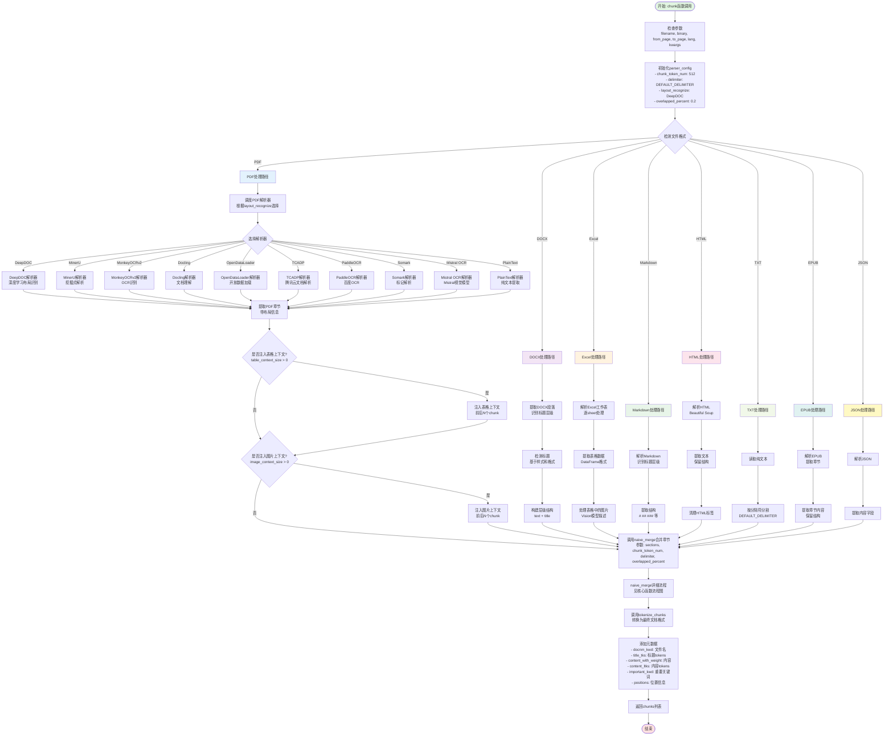

# Naive通用切片规则流程图

## 规则概述

**Naive规则**是RAGFlow中最核心的通用切片模板,支持多种文档格式(PDF、DOCX、Excel、Markdown、HTML、TXT、EPUB、JSON等),是处理绝大多数文档类型的默认选择。

## 核心特性

- **多格式支持**: 支持10+种文档格式
- **多解析器后端**: 支持10种PDF解析器(DeepDOC、MinerU、MonkeyOCRv2、Docling、OpenDataLoader、TCADP、PaddleOCR、Somark、Mistral OCR、PlainText)
- **灵活的切片策略**: 基于token数量的朴素合并(naive_merge)
- **重叠支持**: 支持chunk间的重叠以保持上下文连贯性
- **表格和图片上下文注入**: 可配置表格和图片的上下文大小

## 主流程图



## 配置参数说明

### parser_config参数

| 参数名 | 类型 | 默认值 | 说明 |
|--------|------|--------|------|
| chunk_token_num | int | 512 | 每个chunk的目标token数量 |
| delimiter | str | "\n!?;。;!?~" | 文本分割分隔符 |
| layout_recognize | str | "DeepDOC" | PDF布局识别后端 |
| overlapped_percent | float | 0.2 | chunk重叠百分比(0-1) |
| table_context_size | int | 0 | 表格上下文大小(前后chunk数) |
| image_context_size | int | 0 | 图片上下文大小(前后chunk数) |
| analyze_hyperlink | bool | True | 是否分析超链接 |

### 支持的PDF解析器

1. **DeepDOC** (默认): 深度学习布局识别,准确度高
2. **MinerU**: 挖掘式解析,适合复杂布局
3. **MonkeyOCRv2**: OCR识别,适合扫描文档
4. **Docling**: 文档理解,适合学术论文
5. **OpenDataLoader**: 开放数据加载器
6. **TCADP**: 腾讯云文档解析,云端处理
7. **PaddleOCR**: 百度OCR,中文优化
8. **Somark**: 标记解析器
9. **Mistral OCR**: Mistral视觉模型
10. **PlainText**: 纯文本提取,最快但精度低

## 关键代码片段

### 主入口函数

```python
def chunk(filename, binary=None, from_page=0, to_page=MAXIMUM_PAGE_NUMBER, 
          lang="Chinese", callback=None, **kwargs):
    """
    主切片函数,根据文件格式调度到不同的解析器
    
    参数:
        filename: 文件名
        binary: 二进制内容(可选)
        from_page: 起始页码
        to_page: 结束页码
        lang: 语言("Chinese"或"English")
        callback: 进度回调函数
        **kwargs: 包含parser_config的额外参数
    
    返回:
        List[Dict]: chunk列表,每个chunk是一个字典
    """
    parser_config = kwargs.get("parser_config", {
        "chunk_token_num": 512,
        "delimiter": DEFAULT_DELIMITER,
        "layout_recognize": "DeepDOC"
    })
    
    # 格式检测和解析器选择
    eng = lang.lower() == "english"
    doc = {
        "docnm_kwd": filename,
        "title_tks": rag_tokenizer.tokenize(re.sub(r"\.[a-zA-Z]+$", "", filename))
    }
    
    # ... 根据文件扩展名调度到相应解析器 ...
    
    # 使用naive_merge合并章节
    chunks = naive_merge(sections, 
                        int(parser_config.get("chunk_token_num", 128)),
                        parser_config.get("delimiter", DEFAULT_DELIMITER),
                        overlapped_percent)
    
    # 转换为最终文档格式
    res.extend(tokenize_chunks(chunks, doc, eng, pdf_parser, language=lang))
    return res
```

### PDF解析器调度

```python
PARSERS = {
    "deepdoc": "by_deepdoc",
    "mineru": "by_mineru",
    "monkeyocrv2": "by_monkeyocrv2",
    "docling": "by_docling",
    "opendataloader": "by_opendataloader",
    "tcadp": "by_tcadp",
    "paddleocr": "by_paddleocr",
    "somark": "by_somark",
    "mistral ocr": "by_mistral",
    "plaintext": "by_plaintext"
}

def _dispatch_pdf_parser(parser_config):
    """根据配置调度到相应的PDF解析器"""
    layout_recognize = parser_config.get("layout_recognize", "DeepDOC").lower()
    parser_name = PARSERS.get(layout_recognize, "by_deepdoc")
    return getattr(PdfParser, parser_name)
```

## 使用场景

### 适用场景

1. **通用文档处理**: 当不确定文档类型时的默认选择
2. **混合格式文档**: 包含文本、表格、图片的复杂文档
3. **多语言文档**: 支持中英文及其他语言
4. **长文档**: 需要按token数量精确控制chunk大小
5. **需要上下文重叠**: 通过overlapped_percent保持语义连贯

### 不适用场景

1. **学术论文**: 使用paper规则更好,能提取标题/作者/摘要
2. **结构化Q&A**: 使用qa规则,专门提取问答对
3. **纯表格数据**: 使用table规则,每行作为一个chunk
4. **简历文档**: 使用resume规则,结构化提取简历信息

## 性能优化建议

1. **选择合适的解析器**: 
   - 质量优先: DeepDOC、Docling
   - 速度优先: PlainText
   - 扫描文档: PaddleOCR、MonkeyOCRv2

2. **调整chunk_token_num**:
   - 较小(128-256): 精确检索,但可能切断语义
   - 中等(512): 平衡的默认值
   - 较大(1024+): 保持完整上下文,但检索粒度粗

3. **设置合理的重叠**:
   - 0: 无重叠,速度最快
   - 0.2: 推荐值,适度重叠
   - 0.5+: 大量重叠,增加存储但提高召回

4. **上下文注入**: 仅在表格/图片对理解至关重要时启用

## 相关函数

- [naive_merge](./核心函数流程图.md#naive_merge): 朴素合并策略
- [tokenize_chunks](./核心函数流程图.md#tokenize_chunks): 文档格式化
- [add_positions](./核心函数流程图.md#add_positions): 位置元数据添加
