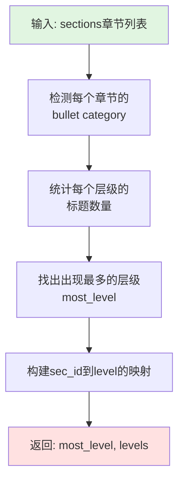

# Paper学术论文切片规则流程图

## 规则概述

**Paper规则**是专门为学术论文优化的切片模板,能够智能识别和提取论文的特殊结构(标题、作者、摘要、章节),并使用层级化的合并策略保持论文的逻辑结构。

## 核心特性

- **论文结构提取**: 自动识别标题、作者、摘要
- **层级化合并**: 基于标题层级(hierarchical_merge)的智能合并
- **摘要特殊处理**: 摘要作为独立chunk并标记重要关键词
- **标题频率分析**: 通过标题出现频率判断文档结构
- **章节对齐**: 保持论文章节的完整性,不跨章节合并

## 主流程图

```mermaid
flowchart TD
    Start([开始: chunk函数调用]) --> CheckParams[检查参数<br/>filename, binary, from_page, to_page, lang, kwargs]
    CheckParams --> InitConfig[初始化parser_config<br/>- chunk_token_num: 512<br/>- layout_recognize: DeepDOC]
    
    InitConfig --> ParsePDF[调用PDF解析器<br/>提取论文内容]
    ParsePDF --> ExtractStructure[提取论文结构<br/>- 标题<br/>- 作者<br/>- 摘要<br/>- 正文章节]
    
    ExtractStructure --> HasTitle{是否提取到标题?}
    HasTitle -->|是| AddTitle[添加到doc<br/>title_tks]
    HasTitle -->|否| HasAuthors
    AddTitle --> HasAuthors{是否提取到作者?}
    
    HasAuthors -->|是| AddAuthors[添加到doc<br/>authors_tks]
    HasAuthors -->|否| HasAbstract
    AddAuthors --> HasAbstract{是否提取到摘要?}
    
    HasAbstract -->|是| CreateAbstractChunk[创建摘要chunk<br/>独立chunk]
    HasAbstract -->|否| ProcessSections
    
    CreateAbstractChunk --> MarkImportant[标记重要关键词<br/>important_kwd: abstract, 总结, 概括, summary]
    MarkImportant --> TokenizeAbstract[对摘要分词<br/>content_ltks]
    TokenizeAbstract --> AddAbstractToResult[添加摘要chunk到结果]
    AddAbstractToResult --> ProcessSections
    
    ProcessSections[处理正文章节<br/>sections列表]
    ProcessSections --> SortSections[按位置排序章节<br/>根据页码和坐标]
    
    SortSections --> DetectBullets[检测标题项目符号<br/>bullets_category]
    DetectBullets --> AnalyzeTitleFreq[分析标题频率<br/>title_frequency]
    
    AnalyzeTitleFreq --> GetMostLevel[获取最常见标题层级<br/>most_level]
    GetMostLevel --> BuildLevelMap[构建层级映射<br/>levels: sec_id -> level]
    
    BuildLevelMap --> MergeBySections[按章节枢轴合并<br/>_merge_sections_by_pivot]
    
    MergeBySections --> MergeLoop{遍历所有章节}
    MergeLoop -->|当前章节| CheckTokenBudget{当前tokens + 新章节tokens<br/> > chunk_token_num?}
    
    CheckTokenBudget -->|是且有内容| FinishChunk[完成当前chunk<br/>添加到chunks]
    CheckTokenBudget -->|否| AddToChunk[添加章节到当前chunk]
    
    FinishChunk --> StartNewChunk[开始新chunk]
    StartNewChunk --> AddToChunk
    AddToChunk --> MergeLoop
    
    MergeLoop -->|完成| TokenizeChunks[调用tokenize_chunks<br/>转换为最终文档格式]
    
    TokenizeChunks --> AddDocMetadata[添加文档元数据<br/>- docnm_kwd: 文件名<br/>- title_tks: 论文标题<br/>- authors_tks: 作者列表<br/>- content_with_weight: 内容<br/>- important_kwd: 关键词]
    
    AddDocMetadata --> ReturnResult[返回chunks列表<br/>摘要chunk + 正文chunks]
    ReturnResult --> End([结束])
    
    style Start fill:#e1f5e1
    style End fill:#ffe1e1
    style CreateAbstractChunk fill:#fff3e0
    style DetectBullets fill:#e3f2fd
    style AnalyzeTitleFreq fill:#f3e5f5
    style MergeBySections fill:#e8f5e9
```



## 关键算法详解

### 1. 标题频率分析流程



### 2. 章节枢轴合并流程

```mermaid
flowchart TD
    Start([开始合并]) --> Init[初始化<br/>current_chunk = []<br/>current_tokens = 0]
    Init --> Loop{遍历sections}
    
    Loop -->|章节| CountTokens[计算当前章节<br/>token数量]
    CountTokens --> CheckBudget{current_tokens + tokens<br/> > token_budget<br/>且current_chunk非空?}
    
    CheckBudget -->|是| SaveChunk[保存当前chunk<br/>chunks.append]
    CheckBudget -->|否| AddSection
    SaveChunk --> ResetChunk[重置<br/>current_chunk = []<br/>current_tokens = 0]
    ResetChunk --> AddSection[添加章节到current_chunk<br/>累加tokens]
    
    AddSection --> Loop
    Loop -->|完成| SaveLast[保存最后一个chunk]
    SaveLast --> Return([返回chunks列表])
    
    style Start fill:#e1f5e1
    style Return fill:#ffe1e1
```

## 配置参数说明

### parser_config参数

| 参数名 | 类型 | 默认值 | 说明 |
|--------|------|--------|------|
| chunk_token_num | int | 512 | 每个chunk的目标token数量 |
| layout_recognize | str | "DeepDOC" | PDF布局识别后端 |

### 特殊处理的论文字段

| 字段 | 说明 | 存储位置 |
|------|------|----------|
| title | 论文标题 | doc["title_tks"] |
| authors | 作者列表 | doc["authors_tks"] |
| abstract | 摘要 | 独立chunk,带important_kwd标记 |
| sections | 正文章节 | 按层级合并后的chunks |

## 关键代码片段

### 主入口函数

```python
def chunk(filename, binary=None, from_page=0, to_page=MAXIMUM_PAGE_NUMBER,
          lang="Chinese", callback=None, **kwargs):
    """
    学术论文专用切片函数
    
    参数:
        filename: 文件名
        binary: 二进制内容(可选)
        from_page: 起始页码
        to_page: 结束页码
        lang: 语言("Chinese"或"English")
        callback: 进度回调函数
        **kwargs: 包含parser_config的额外参数
    
    返回:
        List[Dict]: chunk列表,摘要chunk在最前面
    """
    parser_config = kwargs.get("parser_config", {
        "chunk_token_num": 512,
        "layout_recognize": "DeepDOC"
    })
    
    # 解析论文结构
    paper = pdf_parser(filename if not binary else binary,
                      from_page=from_page, to_page=to_page,
                      callback=callback, **parser_config)
    
    # 提取标题和作者
    if paper.get("title_tks"):
        doc["title_tks"] = paper["title_tks"]
    if paper.get("authors"):
        doc["authors_tks"] = paper["authors"]
    
    # 特殊处理摘要
    if paper["abstract"]:
        d = deepcopy(doc)
        d["content_with_weight"] = paper["abstract"]
        d["content_ltks"] = rag_tokenizer.tokenize(paper["abstract"])
        d["important_kwd"] = ["abstract", "总结", "概括", "summary", "summarize"]
        res.append(d)
    
    # 层级化合并正文
    bull = bullets_category([txt for txt, _ in sorted_sections])
    most_level, levels = title_frequency(bull, sorted_sections)
    chunks = _merge_sections_by_pivot(sorted_sections, sec_ids, chunk_token_num)
    
    return res
```

### 章节枢轴合并

```python
def _merge_sections_by_pivot(sections, sec_ids, token_budget):
    """
    基于枢轴点合并章节,确保每个chunk尊重token预算且保持结构
    
    参数:
        sections: 章节列表 [(text, title), ...]
        sec_ids: 章节ID列表
        token_budget: token预算
    
    返回:
        List[str]: 合并后的chunk列表
    """
    chunks = []
    current_chunk = []
    current_tokens = 0
    
    for (text, _), sec_id in zip(sections, sec_ids):
        tokens = len(rag_tokenizer.tokenize(text))
        if current_tokens + tokens > token_budget and current_chunk:
            chunks.append("\n".join(current_chunk))
            current_chunk = []
            current_tokens = 0
        current_chunk.append(text)
        current_tokens += tokens
    
    # 添加最后一个chunk
    if current_chunk:
        chunks.append("\n".join(current_chunk))
    
    return chunks
```

### 标题频率分析

```python
def title_frequency(bull, sections):
    """
    分析标题频率,找出最常见的层级
    
    参数:
        bull: bullet category
        sections: 章节列表
    
    返回:
        most_level: 最常见的层级
        levels: sec_id到层级的映射字典
    """
    level_counts = {}
    levels = {}
    
    for i, (text, title) in enumerate(sections):
        level = detect_title_level(text, bull)
        levels[i] = level
        level_counts[level] = level_counts.get(level, 0) + 1
    
    # 找出出现最多的层级
    most_level = max(level_counts.items(), key=lambda x: x[1])[0]
    
    return most_level, levels
```

## 论文结构识别示例

### 典型论文结构

```
标题: Deep Learning for Natural Language Processing
作者: John Doe, Jane Smith
摘要: This paper presents a novel approach...

1. Introduction
   1.1 Background
   1.2 Motivation
2. Related Work
   2.1 Traditional Methods
   2.2 Deep Learning Approaches
3. Methodology
   3.1 Model Architecture
   3.2 Training Procedure
4. Experiments
   4.1 Dataset
   4.2 Results
5. Conclusion
```

### 切片结果

1. **Chunk 0 (摘要)**:
   - content: "This paper presents a novel approach..."
   - important_kwd: ["abstract", "summary", "总结"]
   - title_tks: "Deep Learning for Natural Language Processing"
   - authors_tks: ["John Doe", "Jane Smith"]

2. **Chunk 1 (Introduction)**:
   - content: "1. Introduction\n1.1 Background\n1.2 Motivation\n[完整内容]"
   - 层级: 1

3. **Chunk 2 (Related Work)**:
   - content: "2. Related Work\n2.1 Traditional Methods\n2.2 Deep Learning Approaches\n[完整内容]"
   - 层级: 1

4. **Chunk 3 (Methodology)**:
   - content: "3. Methodology\n3.1 Model Architecture\n3.2 Training Procedure\n[完整内容]"
   - 层级: 1

## 使用场景

### 适用场景

1. **学术论文**: arxiv、会议论文、期刊论文
2. **研究报告**: 带有标准章节结构的研究文档
3. **技术白皮书**: 有明确章节划分的技术文档
4. **学位论文**: 硕士/博士论文

### 优势

1. **结构保持**: 不会切断章节边界,保持论文逻辑完整性
2. **摘要优先**: 摘要作为独立chunk,检索时权重更高
3. **元数据丰富**: 提取标题和作者信息,便于过滤和检索
4. **层级感知**: 理解论文的层级结构,智能合并

### 不适用场景

1. **非结构化文档**: 无明确章节的文档,使用naive规则更好
2. **小说/书籍**: 使用book规则更适合
3. **表格数据**: 使用table规则
4. **Q&A文档**: 使用qa规则

## 与Naive规则对比

| 特性 | Paper规则 | Naive规则 |
|------|----------|----------|
| 结构提取 | ✅ 提取标题/作者/摘要 | ❌ 仅提取文本 |
| 合并策略 | hierarchical_merge (层级化) | naive_merge (朴素) |
| 章节边界 | ✅ 严格保持 | ❌ 可能跨越 |
| 摘要处理 | ✅ 独立chunk + 重要标记 | ❌ 普通处理 |
| 适用文档 | 学术论文 | 通用文档 |
| 性能 | 稍慢(需结构分析) | 较快 |

## 性能优化建议

1. **选择合适的chunk_token_num**:
   - 较小(256-384): 每个小节独立,检索精确
   - 中等(512): 平衡值,一般1-2个小节
   - 较大(1024+): 整个大章节,保持完整上下文

2. **使用高质量PDF解析器**:
   - DeepDOC: 推荐,布局识别准确
   - Docling: 专为学术文档优化
   - 避免PlainText: 会丢失结构信息

3. **预处理建议**:
   - 确保PDF是文本型而非扫描型
   - 如果是扫描PDF,先进行OCR处理

## 相关函数

- [hierarchical_merge](./核心函数流程图.md#hierarchical_merge): 层级化合并策略
- [bullets_category](./核心函数流程图.md#bullets_category): 标题项目符号检测
- [tokenize_chunks](./核心函数流程图.md#tokenize_chunks): 文档格式化
