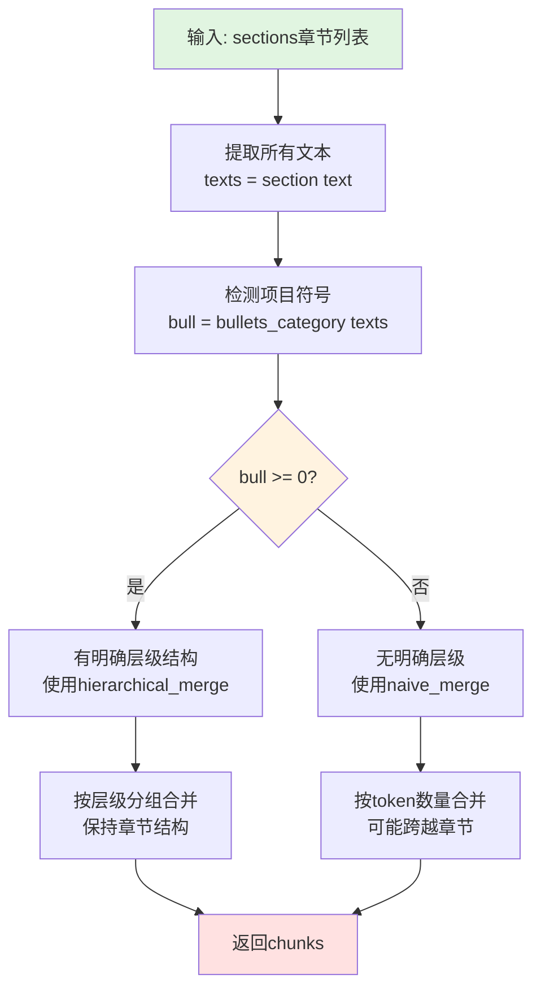
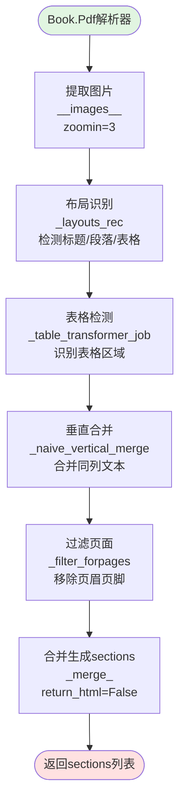

# Book书籍长文档切片规则流程图

## 规则概述

**Book规则**是专门为长文档(书籍、小说、教材等)优化的切片模板,能够自动选择最佳的合并策略,移除目录表干扰,并保持长文档的阅读连贯性。

## 核心特性

- **自动策略选择**: 根据文档结构自动选择hierarchical_merge或naive_merge
- **目录表移除**: 自动识别并移除目录表(Contents Table)
- **项目符号检测**: 通过bullets_category判断文档是否有明确层级
- **长文档优化**: 针对书籍的特殊优化,如章节识别、页眉页脚处理
- **多格式支持**: 支持PDF、DOCX、TXT、EPUB等格式

## 主流程图

```mermaid
flowchart TD
    Start([开始: chunk函数调用]) --> CheckParams[检查参数<br/>filename, binary, from_page, to_page, lang, kwargs]
    CheckParams --> InitConfig[初始化parser_config<br/>- chunk_token_num: 512<br/>- delimiter: \n!?。；！？<br/>- layout_recognize: DeepDOC]
    
    InitConfig --> DetectFormat{检测文件格式}
    
    DetectFormat -->|PDF| PDFPath[PDF处理路径]
    DetectFormat -->|DOCX| DOCXPath[DOCX处理路径]
    DetectFormat -->|TXT| TXTPath[TXT处理路径]
    DetectFormat -->|EPUB| EPUBPath[EPUB处理路径]
    
    %% PDF处理路径
    PDFPath --> CustomPDFParser[自定义PDF解析器<br/>Book.Pdf class]
    CustomPDFParser --> ExtractImages[提取图片<br/>zoomin=3]
    ExtractImages --> LayoutRecognition[布局识别<br/>_layouts_rec]
    LayoutRecognition --> TableDetection[表格检测<br/>_table_transformer_job]
    TableDetection --> VerticalMerge[垂直合并<br/>_naive_vertical_merge]
    VerticalMerge --> FilterPages[过滤页面<br/>_filter_forpages]
    FilterPages --> MergeSections[合并生成sections<br/>_merge_]
    MergeSections --> RemoveContents
    
    %% DOCX处理路径
    DOCXPath --> CustomDocxParser[自定义DOCX解析器<br/>Book.Docx class]
    CustomDocxParser --> ExtractDocxParas[提取段落和样式]
    ExtractDocxParas --> DetectDocxStructure[检测文档结构<br/>标题和正文]
    DetectDocxStructure --> BuildDocxSections[构建章节列表<br/>(text, title)]
    BuildDocxSections --> RemoveContents
    
    %% TXT处理路径
    TXTPath --> ReadTxtContent[读取文本内容<br/>get_text]
    ReadTxtContent --> SplitLines[按行分割]
    SplitLines --> BuildTxtSections[构建sections]
    BuildTxtSections --> RemoveContents
    
    %% EPUB处理路径
    EPUBPath --> ParseEPUBStructure[解析EPUB结构<br/>提取章节]
    ParseEPUBStructure --> ExtractEPUBChapters[提取章节内容]
    ExtractEPUBChapters --> RemoveContents
    
    %% 共同处理路径
    RemoveContents[移除目录表<br/>Pdf.remove_contents_table]
    RemoveContents --> DetectBullets[检测项目符号<br/>bullets_category]
    
    DetectBullets --> BulletCheck{bull >= 0?<br/>是否有明确层级?}
    
    BulletCheck -->|是,有层级| UseHierarchical[使用hierarchical_merge<br/>层级化合并策略]
    BulletCheck -->|否,无层级| UseNaive[使用naive_merge<br/>朴素合并策略]
    
    UseHierarchical --> HierarchicalDetail[hierarchical_merge流程<br/>按层级分组<br/>最多5层]
    UseNaive --> NaiveDetail[naive_merge流程<br/>按token数量合并<br/>支持重叠]
    
    HierarchicalDetail --> GenerateChunks[生成chunks列表]
    NaiveDetail --> GenerateChunks
    
    GenerateChunks --> TokenizeChunks[调用tokenize_chunks<br/>转换为最终文档格式]
    
    TokenizeChunks --> AddMetadata[添加元数据<br/>- docnm_kwd: 文件名<br/>- title_tks: 标题tokens<br/>- content_with_weight: 内容<br/>- content_ltks: 内容tokens<br/>- positions: 位置信息]
    
    AddMetadata --> ReturnResult[返回chunks列表]
    ReturnResult --> End([结束])
    
    style Start fill:#e1f5e1
    style End fill:#ffe1e1
    style BulletCheck fill:#fff3e0
    style UseHierarchical fill:#e3f2fd
    style UseNaive fill:#f3e5f5
    style RemoveContents fill:#e8f5e9
```

## 关键算法详解

### 1. 自动策略选择流程



### 2. 目录表移除流程

```mermaid
flowchart TD
    Start([输入: sections]) --> CheckEnglish{是否英文文档?}
    
    CheckEnglish -->|是| EnglishPattern[查找英文目录模式<br/>Contents, Table of Contents]
    CheckEnglish -->|否| ChinesePattern[查找中文目录模式<br/>目录, 目次, 索引]
    
    EnglishPattern --> FindPattern{找到目录标记?}
    ChinesePattern --> FindPattern
    
    FindPattern -->|否| ReturnOriginal[返回原sections<br/>无需移除]
    FindPattern -->|是| MarkStart[标记目录开始位置<br/>start_idx]
    
    MarkStart --> ScanForward[向前扫描]
    ScanForward --> DetectPageNumbers{检测页码模式<br/>如: Chapter 1....5}
    
    DetectPageNumbers -->|是目录内容| Continue[继续扫描]
    DetectPageNumbers -->|否| MarkEnd[标记目录结束位置<br/>end_idx]
    
    Continue --> ScanForward
    MarkEnd --> RemoveRange[移除sections[start_idx:end_idx]]
    RemoveRange --> ReturnCleaned[返回清理后的sections]
    
    ReturnOriginal --> End([结束])
    ReturnCleaned --> End
    
    style Start fill:#e1f5e1
    style End fill:#ffe1e1
```

### 3. 自定义PDF解析器流程



## 配置参数说明

### parser_config参数

| 参数名 | 类型 | 默认值 | 说明 |
|--------|------|--------|------|
| chunk_token_num | int | 512 | 每个chunk的目标token数量 |
| delimiter | str | "\n!?。；！？" | 文本分割分隔符 |
| layout_recognize | str | "DeepDOC" | PDF布局识别后端 |

### 书籍特定优化

| 优化项 | 说明 |
|--------|------|
| 目录表移除 | 自动识别并移除目录,避免干扰检索 |
| 页眉页脚过滤 | 移除重复的页眉页脚信息 |
| 章节识别 | 识别章节标题,保持章节完整性 |
| 图片处理 | zoomin=3高分辨率提取 |
| 表格检测 | 使用table_transformer检测表格 |

## 关键代码片段

### 主入口函数

```python
def chunk(filename, binary=None, from_page=0, to_page=MAXIMUM_PAGE_NUMBER,
          lang="Chinese", callback=None, **kwargs):
    """
    书籍/长文档切片函数
    
    参数:
        filename: 文件名
        binary: 二进制内容(可选)
        from_page: 起始页码
        to_page: 结束页码
        lang: 语言("Chinese"或"English")
        callback: 进度回调函数
        **kwargs: 包含parser_config的额外参数
    
    返回:
        List[Dict]: chunk列表
    """
    parser_config = kwargs.get("parser_config", {
        "chunk_token_num": 512,
        "delimiter": "\n!?。；！？",
        "layout_recognize": "DeepDOC"
    })
    
    # ... 解析文档获取sections ...
    
    # 移除目录表
    sections = Pdf.remove_contents_table(sections, eng)
    
    # 自动策略选择
    bull = bullets_category([t for t, _ in sections])
    
    if bull >= 0:
        # 有层级结构,使用hierarchical_merge
        chunks = ["\n".join(ck) for ck in hierarchical_merge(bull, sections, 5)]
    else:
        # 无层级结构,使用naive_merge
        chunks = naive_merge([(t, "") for t, _ in sections],
                           parser_config.get("chunk_token_num", 256),
                           parser_config.get("delimiter", "\n。；！？"))
    
    # 转换为最终文档格式
    res = tokenize_chunks(chunks, doc, eng, pdf_parser, language=lang)
    return res
```

### 自定义PDF解析器

```python
class Pdf(PdfParser):
    def __call__(self, filename, binary=None, from_page=0, 
                 to_page=MAXIMUM_PAGE_NUMBER, **kwargs):
        """书籍专用PDF解析器"""
        self.__images__(
            filename if not binary else binary,
            zoomin=3,  # 高分辨率提取
            from_page=from_page,
            to_page=to_page,
            callback=callback
        )
        
        # 布局识别
        self._layouts_rec(zoomin=3)
        
        # 表格检测
        tbls = self._table_transformer_job(zoomin=3)
        
        # 垂直合并
        self._naive_vertical_merge()
        
        # 过滤页面(移除页眉页脚)
        self._filter_forpages()
        
        # 合并生成sections
        sections = self._merge_(
            self.boxes,
            deepcopy(kwargs.get("parser_config", {})),
            tbl_rows=tbls,
            return_html=False
        )
        return sections
```

### 目录表移除

```python
@staticmethod
def remove_contents_table(sections, is_english):
    """
    移除目录表
    
    参数:
        sections: 章节列表
        is_english: 是否英文文档
    
    返回:
        清理后的sections
    """
    # 查找目录标记
    contents_keywords = ["Contents", "Table of Contents"] if is_english \
                       else ["目录", "目次", "索引"]
    
    start_idx = -1
    for i, (text, _) in enumerate(sections):
        if any(kw in text for kw in contents_keywords):
            start_idx = i
            break
    
    if start_idx == -1:
        return sections  # 未找到目录
    
    # 扫描目录范围
    end_idx = start_idx + 1
    page_number_pattern = re.compile(r'\.\s*\d+$')
    
    for i in range(start_idx + 1, len(sections)):
        text = sections[i][0]
        if page_number_pattern.search(text):
            end_idx = i + 1
        else:
            break
    
    # 移除目录
    return sections[:start_idx] + sections[end_idx:]
```

## 书籍结构识别示例

### 典型书籍结构

```
书名: Python编程实战

目录
第一章 Python基础.......................1
第二章 数据结构.......................25
第三章 面向对象编程...................50

第一章 Python基础
  1.1 安装Python
    Python是一种解释型语言...
  1.2 第一个程序
    让我们编写第一个程序...

第二章 数据结构
  2.1 列表
    列表是Python中最常用的数据结构...
  2.2 字典
    字典使用键值对存储数据...
```

### 切片结果(有层级结构)

使用**hierarchical_merge**策略:

1. **Chunk 0 (第一章完整)**:
   - content: "第一章 Python基础\n1.1 安装Python\nPython是一种解释型语言...\n1.2 第一个程序\n让我们编写第一个程序..."
   - 层级: 1

2. **Chunk 1 (第二章完整)**:
   - content: "第二章 数据结构\n2.1 列表\n列表是Python中最常用的数据结构...\n2.2 字典\n字典使用键值对存储数据..."
   - 层级: 1

### 切片结果(无层级结构)

对于没有明确章节的小说等,使用**naive_merge**策略:

1. **Chunk 0 (按token数量)**:
   - content: "故事开始于一个寒冷的冬夜...[512 tokens内容]"

2. **Chunk 1 (按token数量)**:
   - content: "...[继续512 tokens内容]..."

## 使用场景

### 适用场景

1. **长篇小说**: 章节清晰或连续叙事
2. **技术书籍**: 有明确的章节划分
3. **教材教程**: 课本、学习材料
4. **长篇报告**: 研究报告、调查报告
5. **电子书**: EPUB、MOBI转换的文档

### 优势

1. **智能策略**: 自动选择最佳合并策略
2. **目录清理**: 不会被目录表干扰检索
3. **结构保持**: 有层级时保持章节完整
4. **长文优化**: 针对长文档的特殊处理
5. **多格式**: 支持多种书籍格式

### 不适用场景

1. **学术论文**: 使用paper规则,能提取摘要和作者
2. **Q&A文档**: 使用qa规则
3. **表格数据**: 使用table规则
4. **短文档**: 使用naive规则即可

## 与其他规则对比

| 特性 | Book规则 | Paper规则 | Naive规则 |
|------|---------|----------|----------|
| 目录移除 | ✅ 自动移除 | ❌ 不处理 | ❌ 不处理 |
| 策略选择 | ✅ 自动(hierarchical/naive) | ✅ 固定hierarchical | ✅ 固定naive |
| 摘要提取 | ❌ 不提取 | ✅ 独立chunk | ❌ 不提取 |
| 适用文档 | 书籍、长文档 | 学术论文 | 通用文档 |
| 章节识别 | ✅ 自动检测 | ✅ 必需 | ❌ 不关心 |

## 性能优化建议

1. **选择合适的chunk_token_num**:
   - 较小(256-384): 每个小节独立
   - 中等(512): 平衡值,推荐
   - 较大(1024+): 整章内容,适合长上下文

2. **优化PDF处理**:
   - 对扫描版PDF,先OCR处理
   - 使用DeepDOC获得最佳布局识别
   - zoomin=3确保图片清晰度

3. **处理特殊格式**:
   - EPUB: 最理想,保留原始结构
   - PDF: 需要高质量PDF
   - TXT: 适合纯文本小说

4. **分批处理**:
   - 超长书籍可以分批处理(from_page/to_page)
   - 每次处理50-100页为宜

## 相关函数

- [hierarchical_merge](./核心函数流程图.md#hierarchical_merge): 层级化合并策略
- [naive_merge](./核心函数流程图.md#naive_merge): 朴素合并策略
- [bullets_category](./核心函数流程图.md#bullets_category): 项目符号检测
- [tokenize_chunks](./核心函数流程图.md#tokenize_chunks): 文档格式化
