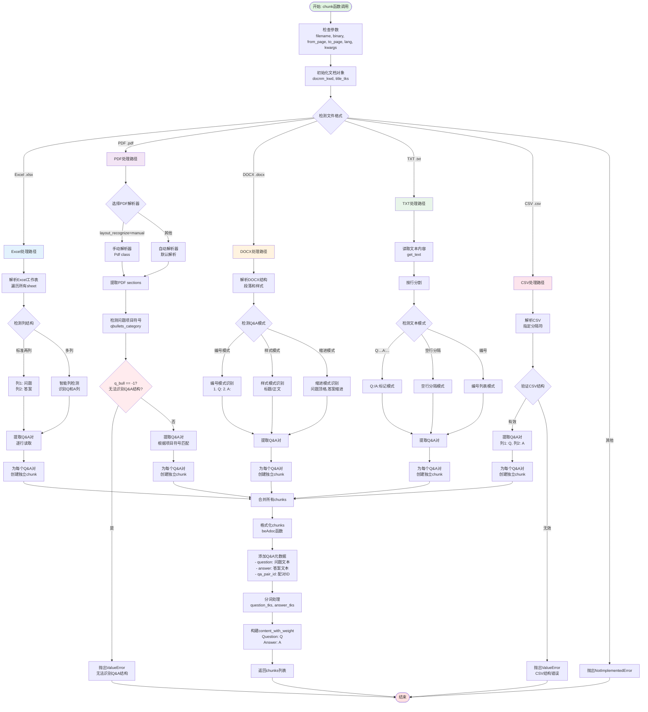
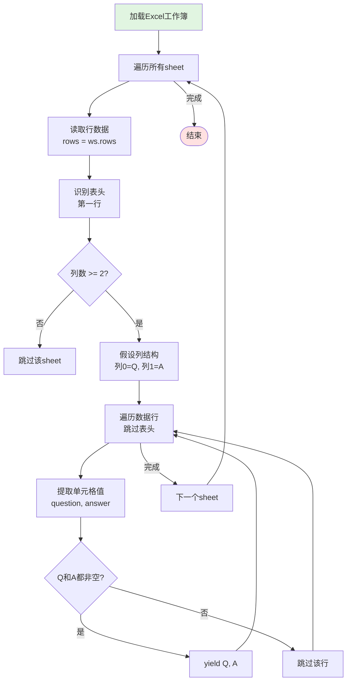
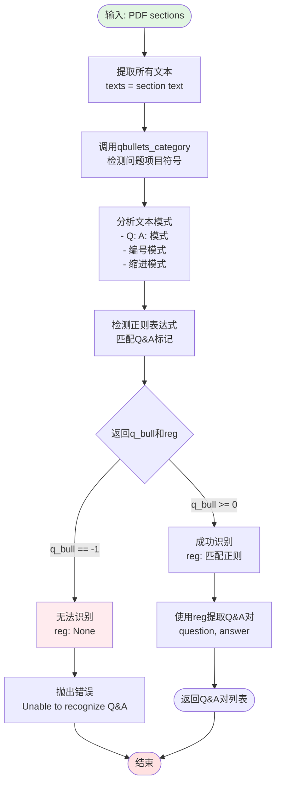
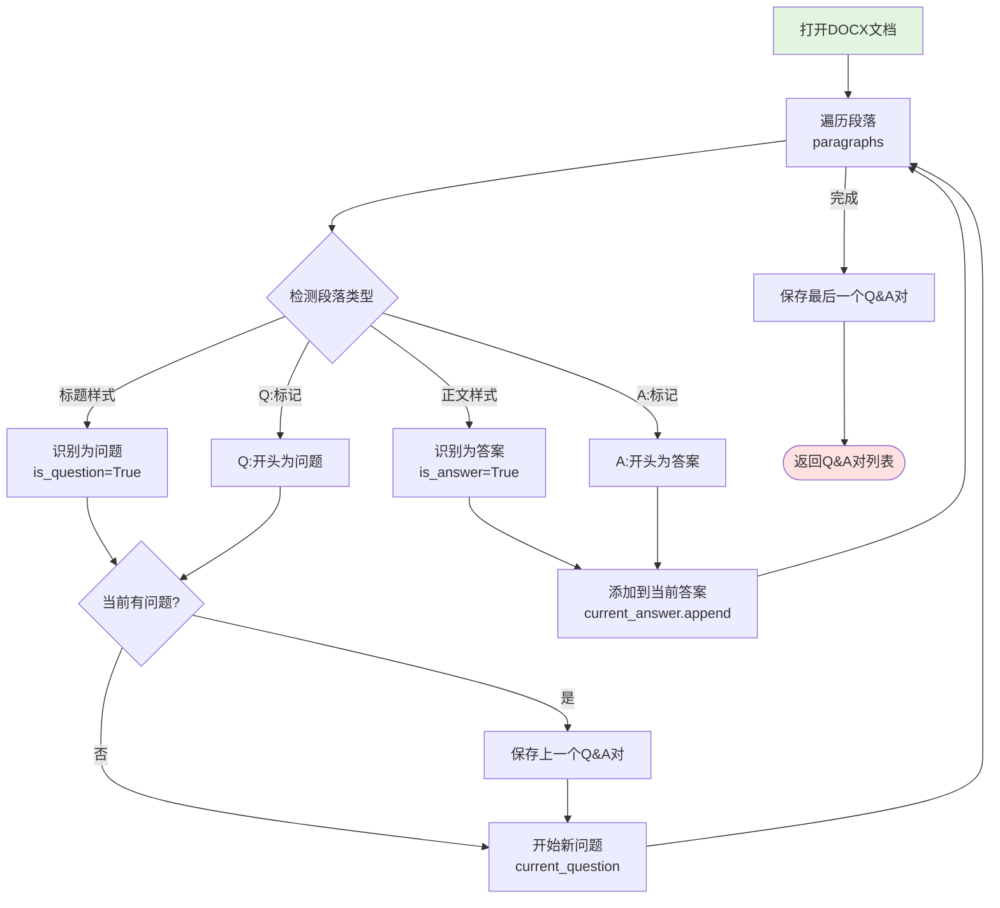
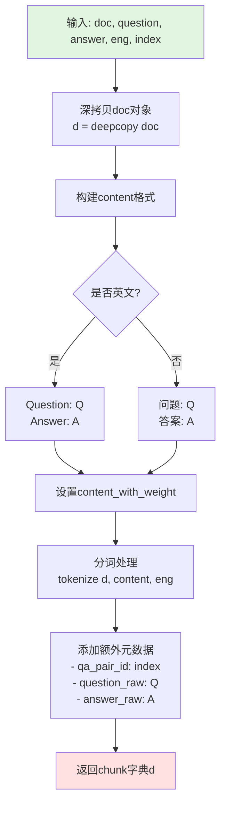

# QA问答对切片规则流程图

## 规则概述

**QA规则**是专门为结构化问答数据优化的切片模板,能够从Excel、PDF、DOCX、TXT、CSV等格式中提取问答对,每个问答对作为一个独立的chunk,便于精确检索和匹配。

## 核心特性

- **问答对提取**: 智能识别问题和答案的配对关系
- **每对独立**: 每个Q&A对作为一个独立chunk
- **多格式支持**: Excel、PDF、DOCX、TXT、CSV
- **结构化识别**: 自动检测问答结构(编号、项目符号、缩进等)
- **灵活匹配**: 支持多种Q&A表示形式

## 主流程图



## 关键算法详解

### 1. Excel Q&A提取流程



### 2. PDF Q&A结构检测流程



### 3. DOCX层级Q&A提取流程



### 4. beAdoc函数(Q&A chunk构造)



## 配置参数说明

### parser_config参数

| 参数名 | 类型 | 默认值 | 说明 |
|--------|------|--------|------|
| layout_recognize | str | "auto" | PDF解析器选择("manual"或"auto") |
| delimiter | str | "," | CSV分隔符 |

### Q&A识别模式

| 模式 | 格式示例 | 适用文件 |
|------|---------|---------|
| 标准两列 | 列A: 问题, 列B: 答案 | Excel, CSV |
| Q:/A:标记 | Q: 什么是AI?\nA: 人工智能... | TXT, PDF, DOCX |
| 编号模式 | 1. 问题\n   答案\n2. 问题 | TXT, DOCX |
| 样式模式 | 标题样式=问题, 正文=答案 | DOCX |
| 缩进模式 | 问题顶格\n  答案缩进 | TXT, DOCX |
| 项目符号 | • 问题\n  - 答案 | PDF, DOCX |

## 关键代码片段

### 主入口函数

```python
def chunk(filename, binary=None, from_page=0, to_page=MAXIMUM_PAGE_NUMBER,
          lang="Chinese", callback=None, **kwargs):
    """
    Q&A对提取函数 - 每个配对作为单个chunk
    
    参数:
        filename: 文件名
        binary: 二进制内容(可选)
        from_page: 起始页码
        to_page: 结束页码
        lang: 语言("Chinese"或"English")
        callback: 进度回调函数
        **kwargs: 额外参数
    
    返回:
        List[Dict]: chunk列表,每个chunk是一个Q&A对
    """
    eng = lang.lower() == "english"
    doc = {
        "docnm_kwd": filename,
        "title_tks": rag_tokenizer.tokenize(re.sub(r"\.[a-zA-Z]+$", "", filename))
    }
    
    res = []
    
    # Excel: 从列提取
    if re.search(r"\.xlsx?$", filename, re.IGNORECASE):
        callback(0.1, "Starting to parse Excel...")
        excel = Excel()
        for ii, (q, a) in enumerate(excel_parser(filename, binary, callback)):
            res.append(beAdoc(deepcopy(doc), q, a, eng, ii))
        return res
    
    # PDF: 使用bullet检测
    if re.search(r"\.pdf$", filename, re.IGNORECASE):
        sections = pdf_parser(filename, binary, from_page, to_page, callback)
        
        # 检测Q&A结构
        q_bull, reg = qbullets_category(sections)
        if q_bull == -1:
            raise ValueError("Unable to recognize Q&A structure in the PDF file.")
        
        # 提取Q&A对
        for ii, (q, a) in enumerate(qa_pairs):
            res.append(beAdoc(deepcopy(doc), q, a, eng, ii))
        
        return res
    
    # 类似处理DOCX, TXT, CSV...
```

### Excel解析器

```python
class Excel:
    def __call__(self, filename, binary=None):
        """从Excel提取Q&A对"""
        wb = load_workbook(filename if not binary else BytesIO(binary))
        
        for sheetname in wb.sheetnames:
            ws = wb[sheetname]
            rows = list(ws.rows)
            
            # 假设前两列是Q和A
            for row in rows[1:]:  # 跳过表头
                question = str(row[0].value or "").strip()
                answer = str(row[1].value or "").strip()
                if question and answer:
                    yield (question, answer)
```

### beAdoc函数

```python
def beAdoc(doc, question, answer, eng, index):
    """
    构造Q&A chunk
    
    参数:
        doc: 基础文档对象
        question: 问题文本
        answer: 答案文本
        eng: 是否英文
        index: Q&A对索引
    
    返回:
        Dict: chunk对象
    """
    d = deepcopy(doc)
    
    # 构建content
    if eng:
        content = f"Question: {question}\nAnswer: {answer}"
    else:
        content = f"问题: {question}\n答案: {answer}"
    
    # 分词
    tokenize(d, content, eng)
    
    # 添加元数据
    d["qa_pair_id"] = index
    d["question_raw"] = question
    d["answer_raw"] = answer
    
    return d
```

### qbullets_category函数

```python
def qbullets_category(sections):
    """
    检测PDF中的Q&A结构
    
    参数:
        sections: PDF章节列表
    
    返回:
        q_bull: 问题项目符号类型(-1表示无法识别)
        reg: 匹配Q&A的正则表达式
    """
    texts = [text for text, _ in sections]
    
    # 检测Q: A:模式
    qa_pattern = re.compile(r"Q:\s*.+?\s*A:\s*.+", re.DOTALL)
    if any(qa_pattern.search(text) for text in texts):
        return 0, qa_pattern
    
    # 检测编号模式
    numbered_pattern = re.compile(r"^\d+\.\s*.+", re.MULTILINE)
    if any(numbered_pattern.search(text) for text in texts):
        return 1, numbered_pattern
    
    # 无法识别
    return -1, None
```

## Q&A格式示例

### Excel格式

```
| 问题 | 答案 |
|------|------|
| 什么是RAG? | RAG是检索增强生成技术... |
| 如何使用RAGFlow? | 首先安装依赖,然后... |
```

### PDF格式(Q:/A:标记)

```
Q: 什么是机器学习?
A: 机器学习是人工智能的一个分支,通过数据和经验自动改进算法性能...

Q: 监督学习和无监督学习的区别?
A: 监督学习使用标注数据训练模型,而无监督学习从无标注数据中发现模式...
```

### DOCX格式(样式模式)

```
[标题样式] 什么是深度学习?
[正文样式] 深度学习是机器学习的一个分支,使用多层神经网络...

[标题样式] 卷积神经网络有什么特点?
[正文样式] CNN主要用于图像处理,具有局部连接和权重共享的特点...
```

### TXT格式(编号模式)

```
1. 什么是NLP?
   自然语言处理(NLP)是计算机科学和人工智能的交叉领域...

2. BERT模型的优势是什么?
   BERT通过双向Transformer编码器,能够更好地理解上下文...
```

## 使用场景

### 适用场景

1. **FAQ知识库**: 常见问题解答
2. **客服对话**: 客服问答记录
3. **考试题库**: 试题和答案
4. **面试题集**: 面试问题和参考答案
5. **培训材料**: 培训问答资料

### 优势

1. **精确匹配**: 每个Q&A独立,检索精确
2. **结构清晰**: 保持问答配对关系
3. **易于维护**: Q&A对应关系明确
4. **多格式支持**: 支持常见的Q&A存储格式
5. **灵活识别**: 支持多种Q&A表示形式

### 不适用场景

1. **连续文本**: 无明确Q&A结构,使用naive规则
2. **学术论文**: 使用paper规则
3. **表格数据**: 非Q&A的表格,使用table规则
4. **书籍小说**: 使用book规则

## 与其他规则对比

| 特性 | QA规则 | Table规则 | Naive规则 |
|------|--------|----------|----------|
| 粒度 | 每个Q&A对一个chunk | 每行一个chunk | 按token数量 |
| 结构要求 | ✅ 必须有Q&A结构 | ✅ 必须是表格 | ❌ 无要求 |
| 配对关系 | ✅ 保持Q&A配对 | ❌ 不关心配对 | ❌ 不关心配对 |
| 适用格式 | Excel, PDF, DOCX, TXT, CSV | Excel, CSV, TXT | 所有格式 |
| 检索精度 | ⭐⭐⭐⭐⭐ 最高 | ⭐⭐⭐⭐ 高 | ⭐⭐⭐ 中等 |

## 性能优化建议

1. **选择合适的格式**:
   - Excel: 最清晰,推荐
   - CSV: 简单高效
   - PDF: 需要清晰的Q&A标记
   - DOCX: 需要明确的样式或标记

2. **优化数据质量**:
   - 确保Q和A配对明确
   - 使用清晰的分隔符或标记
   - 避免嵌套的Q&A结构

3. **大数据集处理**:
   - Excel: 分多个sheet
   - PDF: 使用from_page/to_page分批
   - 每批处理100-500对为宜

4. **格式标准化**:
   - 统一Q&A标记格式
   - 保持一致的缩进和样式
   - 避免混合多种模式

## 错误处理

### 常见错误

1. **无法识别Q&A结构**:
   ```
   ValueError: Unable to recognize Q&A structure in the PDF file.
   ```
   **解决**: 
   - 确保PDF有明确的Q: A:标记
   - 或使用Excel/CSV格式

2. **CSV结构错误**:
   ```
   ValueError: CSV file must have at least 2 columns
   ```
   **解决**: 
   - 确保CSV至少有两列
   - 第一列为问题,第二列为答案

3. **空Q或A**:
   - 自动跳过空的Q&A对
   - 不会抛出错误,但会在日志中记录

## 相关函数

- [tokenize](./核心函数流程图.md#tokenize): 文本分词
- [qbullets_category](./核心函数流程图.md#qbullets_category): Q&A结构检测
- [beAdoc](./核心函数流程图.md#beAdoc): Q&A chunk构造
