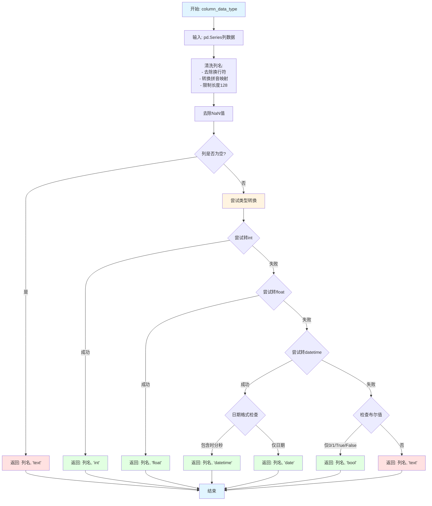
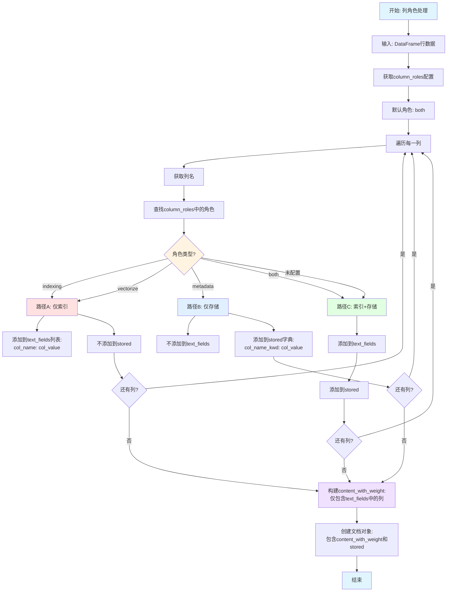

# Table规则流程图

## 概述

Table规则专门用于处理表格类文档（Excel、CSV、TXT），**每一行都会被处理成一个独立的chunk**。该规则支持：
- 列类型推断（int/float/text/datetime/bool）
- 列角色配置（indexing/metadata/both）
- 多级表头处理
- 拼音列名映射
- field_map回写机制

## 主流程图

```mermaid
graph TD
    Start[开始: chunk函数] --> CheckFormat{检查文件格式}
    
    CheckFormat -->|Excel .xlsx/.xls| ParseExcel[使用pd.read_excel解析]
    CheckFormat -->|CSV .csv| ParseCSV[使用pd.read_csv解析]
    CheckFormat -->|TXT .txt| ParseTXT[使用pd.read_csv + tab分隔符]
    
    ParseExcel --> LoadConfig[加载配置参数]
    ParseCSV --> LoadConfig
    ParseTXT --> LoadConfig
    
    LoadConfig --> ExtractParams[提取参数:<br/>- column_roles列角色<br/>- field_map字段映射<br/>- layout_recognize布局识别<br/>- html_merge_columns合并列]
    
    ExtractParams --> CheckMultiHeader{是否包含<br/>html_merge_columns?}
    
    CheckMultiHeader -->|是| BuildHierarchy[调用_build_hierarchical_headers<br/>构建多级表头]
    CheckMultiHeader -->|否| UseSimpleHeaders[使用简单列名]
    
    BuildHierarchy --> InferTypes
    UseSimpleHeaders --> InferTypes[Pass 1: 列类型推断]
    
    InferTypes --> LoopColumns[遍历每一列]
    LoopColumns --> CallColumnDataType[调用column_data_type函数<br/>返回: 清洗后列名, 类型]
    CallColumnDataType --> StoreType[存储列类型到clmn_tys数组]
    StoreType --> NextColumn{还有列?}
    NextColumn -->|是| LoopColumns
    NextColumn -->|否| Pass2
    
    Pass2[Pass 2: 行转chunk] --> LoopRows[遍历DataFrame每一行]
    
    LoopRows --> InitFields[初始化字段:<br/>- text_fields列表<br/>- stored字典]
    
    InitFields --> LoopCols[遍历每一列]
    
    LoopCols --> GetRole{获取列角色<br/>从column_roles}
    GetRole -->|indexing| AddToText[添加到text_fields<br/>用于向量化]
    GetRole -->|metadata| AddToStored[添加到stored<br/>仅存储不索引]
    GetRole -->|both默认| AddToBoth[同时添加到<br/>text_fields和stored]
    GetRole -->|vectorize| AddToText
    
    AddToText --> CheckNextCol{还有列?}
    AddToStored --> CheckNextCol
    AddToBoth --> CheckNextCol
    
    CheckNextCol -->|是| LoopCols
    CheckNextCol -->|否| BuildContent[构建content_with_weight:<br/>col1: val1\ncol2: val2]
    
    BuildContent --> ApplyFieldMap{是否有field_map?}
    
    ApplyFieldMap -->|是| MapFields[将text_fields中的列名<br/>映射回原始列名<br/>更新stored]
    ApplyFieldMap -->|否| CreateChunk
    
    MapFields --> CreateChunk[创建chunk文档对象]
    
    CreateChunk --> SetFields[设置字段:<br/>- docnm_kwd文档名<br/>- content_with_weight<br/>- image_id图片ID]
    
    SetFields --> AppendResult[添加到结果列表res]
    
    AppendResult --> CheckNextRow{还有行?}
    CheckNextRow -->|是| LoopRows
    CheckNextRow -->|否| Return[返回res结果列表]
    
    Return --> End[结束]
    
    style Start fill:#e1f5ff
    style End fill:#e1f5ff
    style InferTypes fill:#fff4e1
    style Pass2 fill:#fff4e1
    style BuildContent fill:#f0e1ff
    style CreateChunk fill:#e1ffe1
```



## 子流程1: 列类型推断 (column_data_type)



## 子流程2: 多级表头构建 (_build_hierarchical_headers)

```mermaid
graph TD
    Start[开始: _build_hierarchical_headers] --> Input[输入:<br/>- df DataFrame<br/>- html_merge_columns合并配置]
    
    Input --> ParseConfig[解析html_merge_columns<br/>格式: row1_col1:row2_col3]
    
    ParseConfig --> InitMatrix[初始化矩阵:<br/>rows行 x df.columns列]
    
    InitMatrix --> FillMatrix[填充矩阵:<br/>遍历合并配置]
    
    FillMatrix --> LoopMerge[遍历每个合并单元格]
    LoopMerge --> ParseRange[解析范围:<br/>row1, col1, row2, col3]
    
    ParseRange --> GetValue[从df获取单元格值:<br/>df.iloc[row1, col1]]
    
    GetValue --> FillRange[填充范围内所有单元格<br/>matrix[r][c] = value]
    
    FillRange --> NextMerge{还有合并?}
    NextMerge -->|是| LoopMerge
    NextMerge -->|否| FillSingle
    
    FillSingle[填充未合并单元格] --> LoopRows[遍历每一行]
    LoopRows --> LoopCols[遍历每一列]
    LoopCols --> CheckFilled{已填充?}
    CheckFilled -->|否| FillCell[填充单元格值<br/>df.iloc[r, c]]
    CheckFilled -->|是| NextCell
    FillCell --> NextCell{还有列?}
    NextCell -->|是| LoopCols
    NextCell -->|否| NextRow{还有行?}
    NextRow -->|是| LoopRows
    NextRow -->|否| BuildNames
    
    BuildNames[构建层级列名] --> LoopColumns[遍历每一列]
    LoopColumns --> BuildPath[自上而下拼接路径:<br/>level1 > level2 > ... > leaf]
    BuildPath --> CleanPath[清理路径:<br/>- 去除空字符串<br/>- 用 > 连接]
    CleanPath --> StoreColName[存储新列名]
    StoreColName --> NextCol{还有列?}
    NextCol -->|是| LoopColumns
    NextCol -->|否| UpdateDF[更新DataFrame列名]
    
    UpdateDF --> DropRows[删除原表头行:<br/>df.drop前N行]
    DropRows --> Return[返回更新后的DataFrame]
    Return --> End[结束]
    
    style Start fill:#e1f5ff
    style End fill:#e1f5ff
    style InitMatrix fill:#fff4e1
    style BuildNames fill:#f0e1ff
    style UpdateDF fill:#e1ffe1
```

## 子流程3: 列角色分流



## 配置参数说明

### parser_config参数

```python
parser_config = {
    "column_roles": {
        "id": "metadata",         # 仅存储，不参与向量化
        "name": "indexing",       # 仅向量化，不存储为字段
        "description": "both",    # 既向量化又存储（默认）
        "price": "vectorize"      # 同indexing
    },
    "field_map": {
        "姓名": "name",           # 中文列名映射为英文
        "年龄": "age"
    },
    "html_merge_columns": [
        "0_0:0_2",               # 第0行第0列到第0行第2列合并
        "1_0:2_0"                # 第1行第0列到第2行第0列合并
    ],
    "layout_recognize": "DeepDOC"  # 布局识别后端（对表格无效）
}
```

### 列角色说明

| 角色 | 是否向量化 | 是否存储为字段 | 使用场景 |
|------|-----------|---------------|---------|
| `indexing` | ✅ | ❌ | 用于搜索的长文本，不需要返回 |
| `vectorize` | ✅ | ❌ | 同indexing |
| `metadata` | ❌ | ✅ | ID、标签等元数据，不需要搜索 |
| `both` | ✅ | ✅ | 默认值，标题、描述等需要搜索和返回的字段 |

## 代码示例

### 基本用法

```python
from rag.app.table import chunk

# Excel文件
chunks = chunk(
    filename="products.xlsx",
    binary=open("products.xlsx", "rb").read(),
    lang="Chinese",
    parser_config={
        "column_roles": {
            "product_id": "metadata",
            "description": "indexing",
            "name": "both"
        }
    }
)

# 每行一个chunk
for ck in chunks:
    print(ck["content_with_weight"])
    # 输出: name: 产品A\ndescription: 这是产品A的描述
    print(ck.get("product_id_kwd"))  # metadata字段
    # 输出: P001
```

### 多级表头示例

```python
# 假设Excel有如下结构:
# |    Q1    |    Q2    |
# | 销售 | 利润 | 销售 | 利润 |
# | 100 | 20  | 150 | 30  |

chunks = chunk(
    filename="report.xlsx",
    binary=file_binary,
    parser_config={
        "html_merge_columns": [
            "0_0:0_1",  # Q1跨两列
            "0_2:0_3"   # Q2跨两列
        ]
    }
)

# 生成的列名: "Q1 > 销售", "Q1 > 利润", "Q2 > 销售", "Q2 > 利润"
```

### field_map回写示例

```python
chunks = chunk(
    filename="users.csv",
    parser_config={
        "field_map": {
            "姓名": "name",
            "年龄": "age"
        },
        "column_roles": {
            "姓名": "both",  # 使用中文配置
            "年龄": "metadata"
        }
    }
)

# chunk中的stored字段会使用映射后的英文名:
# stored = {"name_kwd": "张三", "age_kwd": 25}
```

## 列类型推断示例

```python
# 函数: column_data_type
import pandas as pd

# 示例1: 整数列
col = pd.Series([1, 2, 3, 4, 5])
name, dtype = column_data_type(col)
# 返回: ('列名', 'int')

# 示例2: 日期列
col = pd.Series(["2024-01-01", "2024-01-02"])
name, dtype = column_data_type(col)
# 返回: ('列名', 'date')

# 示例3: 日期时间列
col = pd.Series(["2024-01-01 10:30:00", "2024-01-02 14:45:00"])
name, dtype = column_data_type(col)
# 返回: ('列名', 'datetime')

# 示例4: 布尔列
col = pd.Series([True, False, 1, 0])
name, dtype = column_data_type(col)
# 返回: ('列名', 'bool')

# 示例5: 文本列（默认）
col = pd.Series(["apple", "banana", "cherry"])
name, dtype = column_data_type(col)
# 返回: ('列名', 'text')
```

## 使用场景

1. **产品目录**: 每个产品一行，产品名、描述可搜索，ID仅存储
2. **用户数据**: 用户信息表，姓名可搜索，ID/邮箱作为metadata
3. **财务报表**: 多级表头的季度报表，自动构建层级列名
4. **日志分析**: CSV日志文件，时间戳、级别、消息分开索引
5. **中英文混合**: 使用field_map统一列名，便于多语言表格处理

## 关键函数调用链

```
chunk()
  ├─> _build_hierarchical_headers()  # 多级表头处理
  ├─> column_data_type()             # 列类型推断（每列）
  └─> 行遍历循环
       ├─> 列角色判断（indexing/metadata/both）
       ├─> text_fields构建（用于content_with_weight）
       ├─> stored字典构建（用于metadata字段）
       └─> field_map回写（列名映射）
```

## 注意事项

1. **每行一个chunk**: 不同于其他规则的段落合并，table规则严格按行切分
2. **列类型推断**: 自动识别int/float/datetime/bool，影响stored字段的值类型
3. **列角色优先级**: column_roles明确指定 > 默认both
4. **field_map时机**: 在stored字段生成时应用，text_fields使用映射后的列名
5. **多级表头**: html_merge_columns索引从0开始，格式为"row_col:row_col"
6. **拼音映射**: 中文列名自动转换为拼音（如果配置了PINYIN_MAP）
7. **列名长度**: 自动截断超过128字符的列名
8. **NaN处理**: 类型推断时自动忽略NaN值

## 相关代码位置

- 主函数: `d:\work\rag\ragflow\rag\app\table.py::chunk()`
- 类型推断: `d:\work\rag\ragflow\rag\app\table.py::column_data_type()`
- 多级表头: `d:\work\rag\ragflow\rag\app\table.py::_build_hierarchical_headers()`
- 列名映射: `d:\work\rag\ragflow\rag\app\table.py::PINYIN_MAP`
