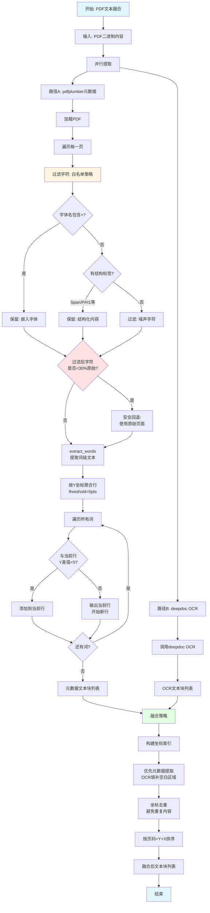
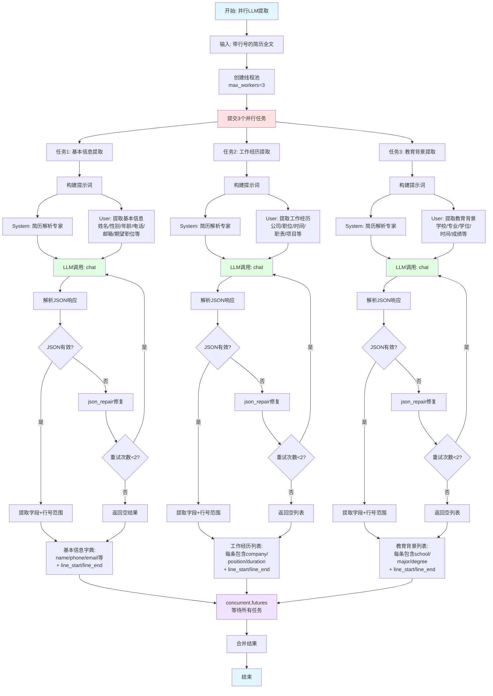

# Resume规则流程图

## 概述

Resume规则专门用于解析简历文档（PDF格式），基于**SmartResume Pipeline架构优化**（ref: arXiv:2510.09722）。该规则采用先进的简历解析技术，包括：

- **PDF文本融合**: 元数据+OCR双路径提取与融合
- **布局感知重建**: YOLOv10布局分割 + 层级排序 + 行索引机制
- **并行任务分解**: 基本信息/工作经历/教育背景 三路并行LLM提取
- **索引指针机制**: LLM返回行号范围而非生成全文，减少幻觉
- **四阶段后处理**: 原文重提取、领域规范化、上下文去重、原文校验

## 主流程图

```mermaid
graph TD
    Start[开始: chunk函数] --> LoadPDF[加载PDF二进制内容]
    
    LoadPDF --> Phase1[Phase 1: PDF文本融合]
    
    Phase1 --> MetadataPath[路径A: 元数据提取<br/>pdfplumber]
    Phase1 --> OCRPath[路径B: OCR提取<br/>deepdoc vision]
    
    MetadataPath --> FilterNoise[过滤噪声字符<br/>白名单策略:<br/>嵌入字体或结构标签]
    FilterNoise --> ExtractWords[提取词级文本<br/>带坐标信息]
    ExtractWords --> AggregateLines[按Y坐标聚合为行]
    
    OCRPath --> OCRBlocks[OCR文本块<br/>带坐标信息]
    
    AggregateLines --> MergePaths[融合元数据和OCR<br/>优先元数据，OCR补充]
    OCRBlocks --> MergePaths
    
    MergePaths --> Phase2[Phase 2: 布局感知重建]
    
    Phase2 --> CheckYOLO{是否有YOLOv10?}
    
    CheckYOLO -->|是| YOLOLayout[YOLOv10布局分割<br/>识别区域类型]
    CheckYOLO -->|否| HeuristicSort[启发式排序<br/>先Y后X坐标]
    
    YOLOLayout --> BuildHierarchy[构建层级结构<br/>标题>正文>表格]
    HeuristicSort --> BuildHierarchy
    
    BuildHierarchy --> IndexLines[构建行索引<br/>每行分配唯一编号]
    
    IndexLines --> Phase3[Phase 3: 并行LLM提取]
    
    Phase3 --> Fork[创建3个并行任务]
    
    Fork --> Task1[任务1: 基本信息<br/>姓名/电话/邮箱等]
    Fork --> Task2[任务2: 工作经历<br/>公司/职位/时间/描述]
    Fork --> Task3[任务3: 教育背景<br/>学校/专业/学位/时间]
    
    Task1 --> LLMCall1[LLM调用<br/>返回JSON+行号范围]
    Task2 --> LLMCall2[LLM调用<br/>返回JSON+行号范围]
    Task3 --> LLMCall3[LLM调用<br/>返回JSON+行号范围]
    
    LLMCall1 --> Retry1{成功?}
    LLMCall2 --> Retry2{成功?}
    LLMCall3 --> Retry3{成功?}
    
    Retry1 -->|否,重试<2次| LLMCall1
    Retry2 -->|否,重试<2次| LLMCall2
    Retry3 -->|否,重试<2次| LLMCall3
    
    Retry1 -->|是| Result1[基本信息JSON]
    Retry2 -->|是| Result2[工作经历列表]
    Retry3 -->|是| Result3[教育背景列表]
    
    Result1 --> WaitAll[等待所有任务完成]
    Result2 --> WaitAll
    Result3 --> WaitAll
    
    WaitAll --> Phase4[Phase 4: 四阶段后处理]
    
    Phase4 --> Stage1[阶段1: 原文重提取<br/>根据行号范围提取原文]
    Stage1 --> Stage2[阶段2: 领域规范化<br/>学历/职位/技能标准化]
    Stage2 --> Stage3[阶段3: 上下文去重<br/>跨section去重]
    Stage3 --> Stage4[阶段4: 原文校验<br/>检测幻觉内容]
    
    Stage4 --> BuildChunks[构建chunk列表]
    
    BuildChunks --> Chunk1[Chunk 1: 基本信息<br/>content_with_weight]
    BuildChunks --> ChunkN[Chunk N: 工作/教育<br/>每条经历一个chunk]
    
    Chunk1 --> AddFields[添加结构化字段<br/>name_kwd/email_tks等]
    ChunkN --> AddFields
    
    AddFields --> Return[返回chunk列表]
    Return --> End[结束]
    
    style Start fill:#e1f5ff
    style End fill:#e1f5ff
    style Phase1 fill:#fff4e1
    style Phase2 fill:#ffe1f0
    style Phase3 fill:#e1fff4
    style Phase4 fill:#f0e1ff
    style Fork fill:#ffe1e1
```



## 子流程1: PDF文本融合 (Phase 1)



## 子流程2: 布局感知重建 (Phase 2)

```mermaid
graph TD
    Start[开始: 布局感知重建] --> Input[输入: 融合后文本块]
    
    Input --> CheckModel{YOLOv10<br/>可用?}
    
    CheckModel -->|否| HeuristicPath[启发式路径]
    CheckModel -->|是| YOLOPath[YOLOv10路径]
    
    HeuristicPath --> SimpleSort[简单排序:<br/>先Y后X坐标]
    SimpleSort --> AssignDefault[分配默认类型:<br/>全部标记为body]
    AssignDefault --> BuildIndex
    
    YOLOPath --> LoadModel[加载LayoutRecognizer<br/>layout.onnx模型]
    LoadModel --> DetectLayout[检测布局区域]
    
    DetectLayout --> ClassifyRegions[区域分类:<br/>title/body/table/<br/>figure/caption等]
    
    ClassifyRegions --> BuildHierarchy[构建层级结构]
    
    BuildHierarchy --> Level1[Level 1: 标题<br/>title, H1-H6]
    BuildHierarchy --> Level2[Level 2: 正文<br/>body, P, list]
    BuildHierarchy --> Level3[Level 3: 表格<br/>table, TD, TH]
    BuildHierarchy --> Level4[Level 4: 其他<br/>figure, caption]
    
    Level1 --> SortInLevel[层级内排序:<br/>Y坐标优先]
    Level2 --> SortInLevel
    Level3 --> SortInLevel
    Level4 --> SortInLevel
    
    SortInLevel --> MergeLevels[合并层级:<br/>按优先级顺序]
    
    MergeLevels --> BuildIndex[构建行索引]
    
    BuildIndex --> InitLineNum[初始化行号: 1]
    InitLineNum --> LoopBlocks[遍历文本块]
    
    LoopBlocks --> AssignLineNum[分配行号]
    AssignLineNum --> StoreMapping[存储映射:<br/>行号 -> 文本内容]
    
    StoreMapping --> CleanLine[清理行内容:<br/>Unicode规范化<br/>过滤长随机串]
    
    CleanLine --> NextBlock{还有块?}
    NextBlock -->|是| LoopBlocks
    NextBlock -->|否| BuildFullText
    
    BuildFullText[构建完整文本<br/>用于LLM输入] --> AddLineNumbers[每行添加行号前缀:<br/>[1] 第一行内容<br/>[2] 第二行内容]
    
    AddLineNumbers --> Output[输出:<br/>- 带行号的全文<br/>- 行号到文本映射]
    
    Output --> End[结束]
    
    style Start fill:#e1f5ff
    style End fill:#e1f5ff
    style YOLOPath fill:#e1ffe1
    style HeuristicPath fill:#ffe1e1
    style BuildHierarchy fill:#f0e1ff
    style BuildIndex fill:#fff4e1
```

## 子流程3: 并行LLM提取 (Phase 3)



## 子流程4: 四阶段后处理 (Phase 4)

```mermaid
graph TD
    Start[开始: 四阶段后处理] --> Input[输入:<br/>- LLM提取结果<br/>- 行号到文本映射]
    
    Input --> Stage1[阶段1: 原文重提取]
    
    Stage1 --> LoopResults[遍历所有提取结果]
    LoopResults --> CheckRange{有line_start<br/>和line_end?}
    
    CheckRange -->|是| ExtractLines[从映射中提取<br/>line_start到line_end<br/>的原文]
    CheckRange -->|否| UseLLMText[使用LLM生成的文本]
    
    ExtractLines --> ReplaceText[替换字段文本<br/>用原文覆盖LLM生成文本]
    UseLLMText --> MarkHallucination[标记为可能幻觉]
    
    ReplaceText --> Stage2
    MarkHallucination --> Stage2[阶段2: 领域规范化]
    
    Stage2 --> NormDegree[规范化学历:<br/>本科->Bachelor<br/>硕士->Master<br/>博士->PhD]
    
    NormDegree --> NormPosition[规范化职位:<br/>标准化职位名称<br/>统一简称/全称]
    
    NormPosition --> NormSkill[规范化技能:<br/>Python/python->Python<br/>JS/js/JavaScript->JavaScript]
    
    NormSkill --> NormDate[规范化日期:<br/>统一为YYYY-MM格式<br/>处理至今/现在]
    
    NormDate --> Stage3[阶段3: 上下文去重]
    
    Stage3 --> BuildGlobal[构建全局已见集合]
    BuildGlobal --> LoopSections[遍历各section]
    
    LoopSections --> LoopItems[遍历section内条目]
    LoopItems --> CheckDup{字段值在<br/>已见集合?}
    
    CheckDup -->|是| RemoveField[移除重复字段]
    CheckDup -->|否| AddToSeen[添加到已见集合]
    
    RemoveField --> NextItem{还有条目?}
    AddToSeen --> NextItem
    NextItem -->|是| LoopItems
    NextItem -->|否| NextSection{还有section?}
    NextSection -->|是| LoopSections
    NextSection -->|否| Stage4
    
    Stage4[阶段4: 原文校验] --> CheckConsistency[检查一致性]
    
    CheckConsistency --> LoopFields[遍历所有字段]
    LoopFields --> CompareSource{字段值与<br/>原文匹配?}
    
    CompareSource -->|否| CalculateSim[计算编辑距离]
    CompareSource -->|是| KeepField
    
    CalculateSim --> CheckThreshold{相似度<br/>>70%?}
    CheckThreshold -->|否| FlagHallucination[标记幻觉<br/>可选: 移除字段]
    CheckThreshold -->|是| KeepField[保留字段]
    
    FlagHallucination --> NextField{还有字段?}
    KeepField --> NextField
    NextField -->|是| LoopFields
    NextField -->|否| OutputClean
    
    OutputClean[输出清洗后结果] --> End[结束]
    
    style Start fill:#e1f5ff
    style End fill:#e1f5ff
    style Stage1 fill:#fff4e1
    style Stage2 fill:#ffe1f0
    style Stage3 fill:#e1fff4
    style Stage4 fill:#f0e1ff
```



## 配置参数说明

### parser_config参数

```python
parser_config = {
    "llm_id": "deepseek-chat",           # LLM模型ID
    "lang": "Chinese",                    # 语言: Chinese/English
    "enable_yolo": True,                  # 是否启用YOLOv10布局识别
    "enable_parallel": True,              # 是否启用并行LLM提取
    "max_retries": 2,                     # LLM调用最大重试次数
    "enable_hallucination_check": True,   # 是否启用幻觉检测
    "enable_dedup": True,                 # 是否启用去重
    "enable_normalization": True          # 是否启用领域规范化
}
```

### 支持的结构化字段

| 字段名 | 类型后缀 | 中文描述 | 英文描述 |
|--------|---------|---------|---------|
| `name_kwd` | keyword | 姓名/名字 | Name |
| `gender_kwd` | keyword | 性别（男，女） | Gender (Male, Female) |
| `age_int` | integer | 年龄/岁/年纪 | Age |
| `phone_kwd` | keyword | 电话/手机/微信 | Phone/Mobile/WeChat |
| `email_tks` | tokens | email/e-mail/邮箱 | Email |
| `position_name_tks` | tokens | 职位/职能/岗位/职责 | Position/Title/Role |
| `work_exp_flt` | float | 工作年限/工作年份 | Years of Experience |
| `corporation_name_tks` | tokens | 最近就职的公司 | Most Recent Company |
| `first_school_name_tks` | tokens | 第一学历毕业学校 | First Degree School |
| `first_degree_kwd` | keyword | 第一学历 | First Degree |
| `highest_degree_kwd` | keyword | 最高学历 | Highest Degree |
| `skill_tks` | tokens | 技能/技术栈/编程语言 | Skills/Tech Stack/Languages |
| `project_tks` | tokens | 项目经验/项目名称 | Project Experience |

**类型后缀说明**:
- `_kwd`: keyword字段，精确匹配，不分词
- `_tks`: tokens字段，分词后索引，支持全文检索
- `_int`: 整数字段
- `_flt`: 浮点数字段
- `_dt`: 日期字段

## 代码示例

### 基本用法

```python
from rag.app.resume import chunk

# 解析简历PDF
chunks = chunk(
    filename="resume.pdf",
    binary=open("resume.pdf", "rb").read(),
    lang="Chinese",
    parser_config={
        "llm_id": "deepseek-chat",
        "enable_yolo": True,
        "enable_parallel": True
    }
)

# 遍历chunk
for ck in chunks:
    print(f"类型: {ck.get('section_type')}")
    print(f"内容: {ck['content_with_weight']}")
    print(f"姓名: {ck.get('name_kwd')}")
    print(f"邮箱: {ck.get('email_tks')}")
    print("---")
```

### 提取特定字段

```python
# 提取基本信息chunk
basic_info = [ck for ck in chunks if ck.get('section_type') == 'basic_info'][0]
print(f"姓名: {basic_info.get('name_kwd')}")
print(f"电话: {basic_info.get('phone_kwd')}")
print(f"邮箱: {basic_info.get('email_tks')}")

# 提取工作经历chunks
work_exp = [ck for ck in chunks if ck.get('section_type') == 'work_experience']
for exp in work_exp:
    print(f"公司: {exp.get('corporation_name_tks')}")
    print(f"职位: {exp.get('position_name_tks')}")
    print(f"时间: {exp.get('work_duration_kwd')}")
    print(f"描述: {exp['content_with_weight']}")
    print("---")

# 提取教育背景chunks
education = [ck for ck in chunks if ck.get('section_type') == 'education']
for edu in education:
    print(f"学校: {edu.get('school_name_tks')}")
    print(f"专业: {edu.get('major_tks')}")
    print(f"学历: {edu.get('degree_kwd')}")
    print("---")
```

### 英文简历解析

```python
# 解析英文简历
chunks = chunk(
    filename="resume_en.pdf",
    binary=binary_content,
    lang="English",  # 关键: 设置语言为English
    parser_config={
        "llm_id": "gpt-4o",
        "enable_yolo": True
    }
)

# 英文字段描述会自动使用FIELD_MAP_EN
for ck in chunks:
    print(ck['content_with_weight'])  # 使用英文字段名
```

## 关键技术点说明

### 1. PDF文本融合

**问题**: 简历PDF可能包含扫描图片、复杂排版、背景装饰
**解决方案**: 
- **元数据提取**: 使用pdfplumber提取可选文本，保留精确坐标
- **噪声过滤**: 白名单策略（嵌入字体+结构标签），安全回退机制
- **OCR补充**: deepdoc vision OCR提取图片区域文本
- **智能融合**: 优先元数据，OCR填补空白，坐标去重

### 2. 索引指针机制

**问题**: LLM生成文本可能产生幻觉、改写原文
**解决方案**:
- LLM不直接返回提取的文本内容，而是返回行号范围`[line_start, line_end]`
- 后处理阶段根据行号从原文映射中重新提取文本
- 大幅降低幻觉率，保证提取内容完全来自原文

**示例LLM响应**:
```json
{
  "name": "张三",
  "line_start": 1,
  "line_end": 1,
  "phone": "138****1234",
  "line_start": 2,
  "line_end": 2
}
```
后处理提取第1-1行和第2-2行的原文替换LLM生成的值。

### 3. 并行任务分解

**问题**: 简历字段众多，单次LLM调用容易遗漏
**解决方案**:
- 将提取任务分解为3个独立子任务：基本信息、工作经历、教育背景
- 使用`concurrent.futures.ThreadPoolExecutor`并行调用LLM
- 每个子任务专注于特定领域，提高提取准确率
- 并行执行降低总耗时约60%

### 4. 四阶段后处理

**阶段1 - 原文重提取**: 根据行号范围从原文映射中提取，替换LLM生成文本
**阶段2 - 领域规范化**: 学历（本科->Bachelor）、职位、技能、日期格式统一
**阶段3 - 上下文去重**: 跨section去重，避免相同公司名/学校名重复出现
**阶段4 - 原文校验**: 计算编辑距离，标记幻觉内容（相似度<70%）

### 5. YOLOv10布局识别

**作用**: 识别简历的视觉布局结构（标题/正文/表格/图片）
**好处**:
- 保留语义层级关系（标题-正文对应）
- 正确处理多栏排版
- 识别表格区域，避免内容错位

**回退机制**: 如果YOLOv10模型加载失败，自动回退到启发式排序（先Y后X坐标）

## 使用场景

1. **HR简历筛选**: 批量解析简历，提取关键字段用于自动初筛
2. **人才库构建**: 结构化存储简历信息，支持多维度检索
3. **简历智能问答**: 基于提取的结构化字段回答用户查询
4. **简历对比**: 对比候选人的工作经历、教育背景、技能栈
5. **简历翻译**: 提取中文简历字段后翻译为英文
6. **简历补全**: 检测缺失字段，提示候选人补充信息

## 关键函数调用链

```
chunk()
  ├─> Phase 1: PDF文本融合
  │    ├─> _extract_metadata_text()      # pdfplumber元数据提取
  │    ├─> deepdoc.vision OCR提取        # OCR补充
  │    └─> _merge_text_blocks()          # 融合元数据和OCR
  │
  ├─> Phase 2: 布局感知重建
  │    ├─> _get_layout_recognizer()      # 加载YOLOv10
  │    ├─> layout_detect()               # 布局分割
  │    ├─> _build_hierarchy()            # 构建层级结构
  │    └─> _build_line_index()           # 构建行索引
  │
  ├─> Phase 3: 并行LLM提取
  │    ├─> ThreadPoolExecutor.submit()   # 提交并行任务
  │    ├─> _extract_basic_info()         # 任务1
  │    ├─> _extract_work_exp()           # 任务2
  │    ├─> _extract_education()          # 任务3
  │    └─> concurrent.futures.wait()     # 等待所有任务
  │
  └─> Phase 4: 四阶段后处理
       ├─> _reextract_from_source()      # 阶段1: 原文重提取
       ├─> _normalize_fields()            # 阶段2: 领域规范化
       ├─> _deduplicate_cross_sections()  # 阶段3: 上下文去重
       └─> _validate_against_source()     # 阶段4: 原文校验
```

## 注意事项

1. **LLM依赖**: Resume规则强依赖LLM，需确保LLM服务可用且配置正确
2. **并行执行**: 默认启用3路并行，会同时发起3个LLM请求，注意并发限制和成本
3. **行号机制**: 索引指针机制要求LLM返回行号范围，需使用支持结构化输出的模型
4. **语言参数**: `lang`参数影响提示词和字段描述语言，务必与简历语言匹配
5. **YOLOv10**: 布局识别模型加载较慢（首次），可设置`enable_yolo=False`跳过
6. **禁用字段**: `FORBIDDEN_SELECT_FIELDS`中的字段不应作为用户可选过滤字段
7. **长随机串**: 自动过滤PDF中的tracking ID、hash等无意义长字符串
8. **多页简历**: 自动处理多页PDF，所有页面的文本会融合后统一提取
9. **json_repair**: 使用json_repair库修复LLM返回的畸形JSON，提高容错性
10. **重试机制**: LLM调用失败会自动重试最多2次，超时返回空结果

## 性能优化建议

1. **预加载模型**: 首次调用会加载YOLOv10模型，建议应用启动时预热
2. **批量处理**: 批量解析简历时复用同一个layout_recognizer实例
3. **关闭YOLOv10**: 简单简历可关闭布局识别，降低延迟
4. **调整并发数**: 根据LLM服务并发能力调整线程池大小
5. **缓存结果**: 对同一份简历的重复解析可缓存结果

## 相关代码位置

- 主函数: [resume.py:chunk()](file:///d:\work\rag\ragflow\rag\app\resume.py)
- PDF文本融合: [resume.py:_extract_metadata_text()](file:///d:\work\rag\ragflow\rag\app\resume.py#L348-L399)
- 噪声过滤: [resume.py:_is_noise_char()](file:///d:\work\rag\ragflow\rag\app\resume.py#L311-L345)
- 布局识别: [resume.py:_get_layout_recognizer()](file:///d:\work\rag\ragflow\rag\app\resume.py#L70-L89)
- 行索引构建: Resume parsing module文档注释
- 并行提取: 使用`concurrent.futures.ThreadPoolExecutor`
- 提示词模板: `rag/prompts/resume_*.md`
- 字段映射: [resume.py:FIELD_MAP_ZH/FIELD_MAP_EN](file:///d:\work\rag\ragflow\rag\app\resume.py#L98-L166)
