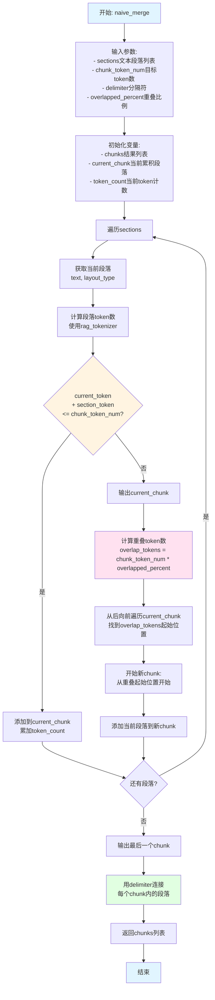
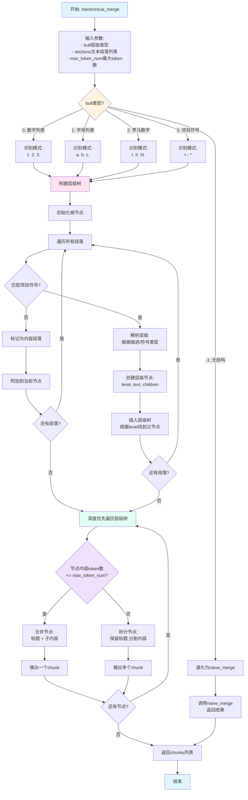
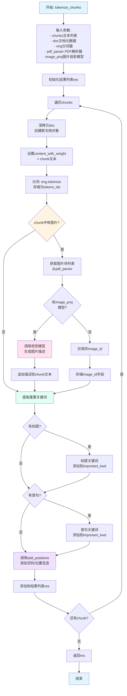
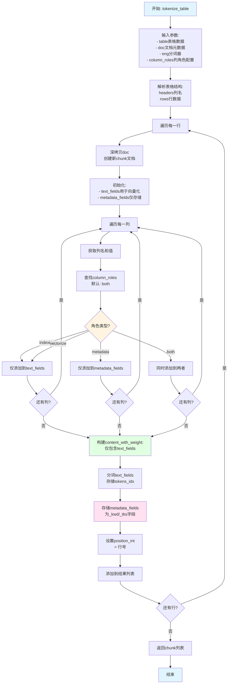
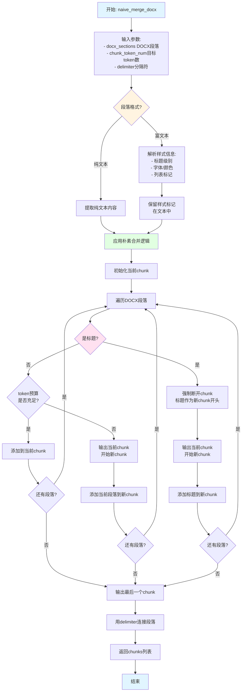
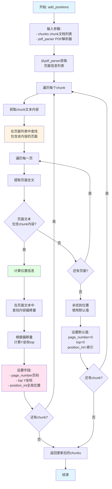
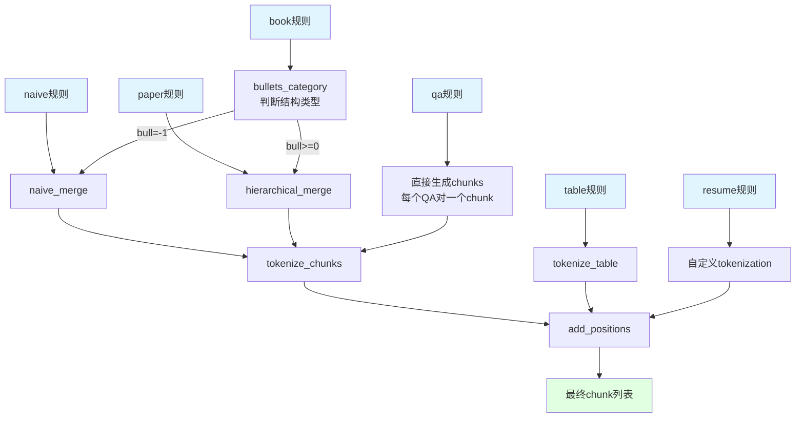
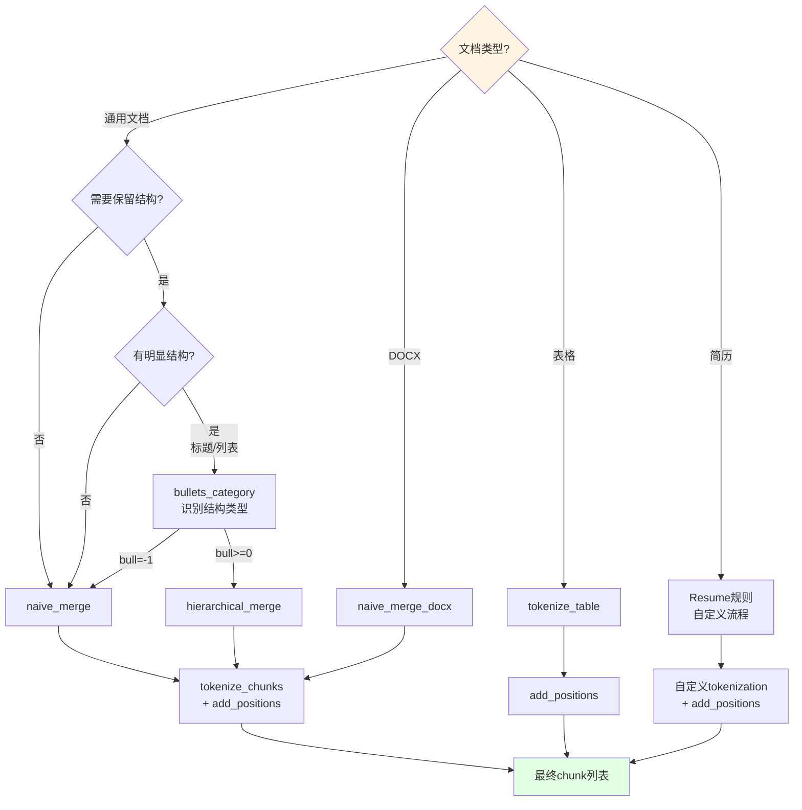

# 核心函数流程图

## 概述

本文档描述RAGFlow项目中6个核心chunk处理函数的详细流程。这些函数是所有chunk规则的基础，被naive、paper、book等多个规则模板调用。

核心函数列表：
1. **naive_merge**: Token预算驱动的朴素合并策略
2. **hierarchical_merge**: 层级化合并策略（保留文档结构）
3. **tokenize_chunks**: 将文本块转换为最终chunk文档格式
4. **tokenize_table**: 表格专用tokenization
5. **naive_merge_docx**: DOCX文档专用朴素合并
6. **add_positions**: 为chunk添加页码和位置元数据

## 函数1: naive_merge - 朴素合并策略

### 功能说明
基于token预算和分隔符的简单合并策略，将多个文本段落合并为固定token数的chunk。支持重叠策略（overlap）以保持上下文连续性。

### 流程图



### 参数说明

| 参数 | 类型 | 默认值 | 说明 |
|------|------|--------|------|
| `sections` | `list[tuple[str, str]]` | - | 文本段落列表，每个元素为(text, layout_type) |
| `chunk_token_num` | `int` | 512 | 目标chunk的token数量 |
| `delimiter` | `str` | `"\n"` | 段落之间的分隔符 |
| `overlapped_percent` | `float` | 0.0 | 重叠比例（0.0-1.0），例如0.1表示10%重叠 |

### 代码示例

```python
from rag.nlp import naive_merge

sections = [
    ("第一段文本内容", "text"),
    ("第二段文本内容", "text"),
    ("第三段文本内容", "text"),
]

# 基本用法
chunks = naive_merge(sections, chunk_token_num=512, delimiter="\n")
# 返回: ["第一段文本内容\n第二段文本内容", "第三段文本内容"]

# 带重叠
chunks = naive_merge(sections, chunk_token_num=512, delimiter="\n", overlapped_percent=0.1)
# chunk之间会有10%的重叠内容
```

### 使用场景
- 通用文档切片（naive规则）
- 不需要保留文档结构的场景
- 需要固定token数的chunk
- 需要chunk之间有重叠以保持上下文

---

## 函数2: hierarchical_merge - 层级化合并策略

### 功能说明
基于文档结构的层级化合并策略，保留标题-正文的层级关系。通过bullets_category识别的结构层级，将相同层级的段落合并到对应的上级标题下。

### 流程图



### 参数说明

| 参数 | 类型 | 说明 |
|------|------|------|
| `bull` | `int` | 项目符号类型：0=数字, 1=字母, 2=罗马数字, 3=符号, -1=无结构 |
| `sections` | `list[tuple[str, str]]` | 文本段落列表 |
| `max_token_num` | `int` | 每个chunk的最大token数 |

### bull类型识别示例

```python
from rag.nlp import bullets_category

sections = [
    ("1. 第一章", "title"),
    ("1.1 第一节", "title"),
    ("正文内容", "text"),
    ("2. 第二章", "title"),
]

bull = bullets_category([t for t, _ in sections])
# 返回: 0 (识别为数字列表结构)

chunks = hierarchical_merge(bull, sections, max_token_num=512)
# 返回: [
#   "1. 第一章\n1.1 第一节\n正文内容",
#   "2. 第二章"
# ]
```

### 使用场景
- 结构化文档（book规则）
- 学术论文（paper规则）
- 带有章节标题的文档
- 需要保留文档逻辑结构
- 需要标题-正文对应关系

---

## 函数3: tokenize_chunks - Chunk Tokenization

### 功能说明
将原始文本chunk转换为最终的chunk文档格式，添加位置信息、图片描述、重要关键词等元数据。

### 流程图



### 输出字段

每个chunk文档对象包含以下字段：

| 字段 | 类型 | 说明 |
|------|------|------|
| `content_with_weight` | `str` | chunk文本内容 |
| `tokens_ids` | `list[int]` | 分词后的token ID列表 |
| `image_id` | `str` | 关联的图片ID（如有） |
| `important_kwd` | `list[str]` | 重要关键词列表 |
| `page_number` | `int` | 页码 |
| `top` | `float` | 页面内Y坐标 |
| `position_int` | `int` | 在文档中的位置索引 |
| `docnm_kwd` | `str` | 文档名称 |

### 代码示例

```python
from rag.nlp import tokenize_chunks, rag_tokenizer

chunks = [
    "第一章 引言\n这是引言内容。",
    "第二章 方法\n这是方法描述。"
]

doc = {
    "docnm_kwd": "example.pdf",
    "kb_id": "kb123"
}

eng = rag_tokenizer.get_tokenizer()

result = tokenize_chunks(chunks, doc, eng)

for chunk_doc in result:
    print(f"内容: {chunk_doc['content_with_weight']}")
    print(f"Token数: {len(chunk_doc['tokens_ids'])}")
    print(f"页码: {chunk_doc.get('page_number')}")
    print(f"关键词: {chunk_doc.get('important_kwd')}")
    print("---")
```

### 使用场景
- 所有chunk规则的最后一步
- 将文本转换为可索引的文档格式
- 添加RAG检索所需的元数据
- 集成视觉模型的图片描述

---

## 函数4: tokenize_table - 表格Tokenization

### 功能说明
表格专用的tokenization函数，处理表格行数据，支持列角色配置（indexing/metadata/both）。

### 流程图



### 列角色说明

| 角色 | 向量化 | 存储为字段 | 典型用途 |
|------|--------|-----------|---------|
| `indexing` / `vectorize` | ✅ | ❌ | 用于搜索的长文本（描述、备注） |
| `metadata` | ❌ | ✅ | ID、标签、分类等元数据 |
| `both` (默认) | ✅ | ✅ | 标题、名称等需要搜索和显示的字段 |

### 代码示例

```python
from rag.nlp import tokenize_table

table = {
    "headers": ["产品ID", "产品名称", "描述", "价格"],
    "rows": [
        ["P001", "产品A", "这是产品A的详细描述", "99.9"],
        ["P002", "产品B", "这是产品B的详细描述", "199.9"],
    ]
}

doc = {"docnm_kwd": "products.xlsx"}
eng = rag_tokenizer.get_tokenizer()

column_roles = {
    "产品ID": "metadata",      # 仅存储，不参与检索
    "产品名称": "both",        # 既检索又存储
    "描述": "indexing",        # 仅检索，不存储
    "价格": "metadata"         # 仅存储
}

chunks = tokenize_table(table, doc, eng, column_roles)

# 每行生成一个chunk
for chunk in chunks:
    print(chunk["content_with_weight"])
    # 输出: 产品名称: 产品A\n描述: 这是产品A的详细描述
    print(chunk.get("产品ID_kwd"))  # P001 (metadata字段)
```

### 使用场景
- Table规则的最后一步
- Excel/CSV表格解析
- 需要列级别索引控制
- 结构化数据导入RAG系统

---

## 函数5: naive_merge_docx - DOCX朴素合并

### 功能说明
DOCX文档专用的朴素合并函数，考虑DOCX特有的段落样式和格式信息。

### 流程图



### 与naive_merge的区别

| 特性 | naive_merge | naive_merge_docx |
|------|-------------|------------------|
| 输入类型 | 通用文本段落 | DOCX段落对象 |
| 样式处理 | 无 | 保留标题/列表样式 |
| 断开策略 | 仅token预算 | token预算 + 标题强制断开 |
| 应用场景 | 通用文档 | DOCX专用 |

### 代码示例

```python
from rag.nlp import naive_merge_docx
from docx import Document

doc = Document("example.docx")
docx_sections = []

for para in doc.paragraphs:
    docx_sections.append({
        "text": para.text,
        "style": para.style.name,  # 'Heading 1', 'Normal', etc.
        "is_heading": para.style.name.startswith('Heading')
    })

chunks = naive_merge_docx(
    docx_sections,
    chunk_token_num=512,
    delimiter="\n"
)

# 标题会作为chunk的开始
# 例如: ["Heading 1\n段落1\n段落2", "Heading 2\n段落3"]
```

### 使用场景
- DOCX文档解析
- 需要保留Word文档格式信息
- 标题需要作为chunk边界
- Office文档导入RAG系统

---

## 函数6: add_positions - 添加位置信息

### 功能说明
为chunk添加页码和在页面内的位置信息，用于检索结果的溯源定位。

### 流程图



### 输出字段

| 字段 | 类型 | 说明 |
|------|------|------|
| `page_number` | `int` | 页码（从1开始），0表示未找到 |
| `top` | `float` | 在页面内的Y坐标（PDF points），从页面顶部开始 |
| `position_int` | `int` | 在整个文档中的位置索引（全局顺序） |

### 代码示例

```python
from rag.nlp import add_positions
from deepdoc.parser import PdfParser

# 假设已有chunks
chunks = [
    {"content_with_weight": "第一章 引言\n引言内容..."},
    {"content_with_weight": "第二章 方法\n方法描述..."},
]

# 创建PDF解析器
pdf_parser = PdfParser()
pdf_parser.parse("example.pdf")

# 添加位置信息
chunks = add_positions(chunks, pdf_parser)

for chunk in chunks:
    print(f"页码: {chunk['page_number']}")
    print(f"Y坐标: {chunk['top']}")
    print(f"全局位置: {chunk['position_int']}")
```

### 使用场景
- 所有PDF文档解析
- 检索结果溯源定位
- 高亮显示原文位置
- 多文档检索排序

---

## 核心函数调用关系



## 函数选择决策树



## 性能对比

| 函数 | 时间复杂度 | 空间复杂度 | 适用文档大小 | 备注 |
|------|-----------|-----------|-------------|------|
| `naive_merge` | O(n) | O(1) | 任意 | 最快，线性扫描 |
| `hierarchical_merge` | O(n log n) | O(n) | <10MB | 需要构建层级树 |
| `tokenize_chunks` | O(n*m) | O(n) | 任意 | m为平均chunk长度 |
| `tokenize_table` | O(r*c) | O(r) | <100K行 | r行c列 |
| `naive_merge_docx` | O(n) | O(1) | 任意 | 类似naive_merge |
| `add_positions` | O(n*p) | O(1) | 任意 | p为页数 |

## 最佳实践

### 1. 选择合适的合并策略
- **通用文档**: 优先使用`naive_merge`，简单高效
- **结构化文档**: 使用`hierarchical_merge`保留层级关系
- **DOCX文档**: 使用`naive_merge_docx`保留样式信息
- **表格数据**: 直接使用`tokenize_table`，不需要预合并

### 2. Token预算设置
```python
# 推荐token数范围
chunk_token_num = 512   # 标准配置，适合大多数场景
chunk_token_num = 256   # 短chunk，适合精准检索
chunk_token_num = 1024  # 长chunk，适合摘要生成
```

### 3. 重叠策略
```python
# 重叠比例建议
overlapped_percent = 0.1   # 10%重叠，适合一般场景
overlapped_percent = 0.2   # 20%重叠，适合需要强上下文的场景
overlapped_percent = 0.0   # 无重叠，适合独立段落
```

### 4. 列角色配置（表格）
```python
column_roles = {
    # ID类字段: metadata only
    "id": "metadata",
    "uuid": "metadata",
    
    # 长文本字段: indexing only
    "description": "indexing",
    "content": "indexing",
    "remarks": "indexing",
    
    # 标题/名称: both (默认)
    "title": "both",
    "name": "both",
    "product_name": "both",
}
```

### 5. 调试技巧
```python
# 打印chunk统计信息
def print_chunk_stats(chunks):
    for i, chunk in enumerate(chunks):
        token_count = len(chunk.get('tokens_ids', []))
        print(f"Chunk {i}: {token_count} tokens, "
              f"page {chunk.get('page_number')}, "
              f"top {chunk.get('top')}")

# 验证位置信息
def validate_positions(chunks):
    for chunk in chunks:
        assert chunk.get('page_number', 0) >= 0
        assert chunk.get('position_int', 0) >= 0
```

## 相关代码位置

- 核心函数实现: [rag/nlp/__init__.py](file:///d:\work\rag\ragflow\rag\nlp\__init__.py)
- naive_merge: [rag/nlp/__init__.py::naive_merge()](file:///d:\work\rag\ragflow\rag\nlp\__init__.py)
- hierarchical_merge: [rag/nlp/__init__.py::hierarchical_merge()](file:///d:\work\rag\ragflow\rag\nlp\__init__.py)
- tokenize_chunks: [rag/nlp/__init__.py::tokenize_chunks()](file:///d:\work\rag\ragflow\rag\nlp\__init__.py)
- tokenize_table: [rag/nlp/__init__.py::tokenize_table()](file:///d:\work\rag\ragflow\rag\nlp\__init__.py)
- add_positions: [rag/nlp/__init__.py::add_positions()](file:///d:\work\rag\ragflow\rag\nlp\__init__.py)
