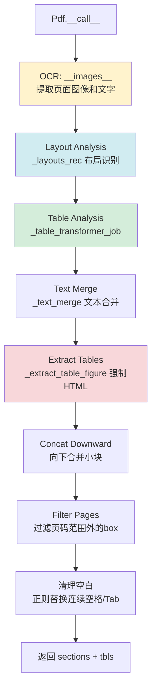
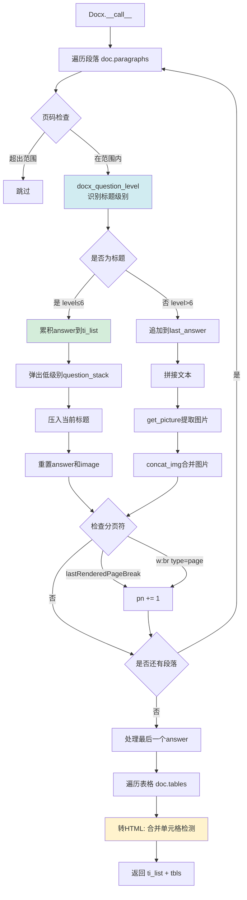

# Manual规则流程图

## 规则概述

Manual（手册）规则是专门为**技术手册、操作手册、说明书**等层级化文档设计的切片模板。它采用**章节ID分组 + 小token块合并**策略，优先按章节结构切片，对小块进行智能合并，保留文档层级信息。

**适用场景**：
- 技术手册（产品说明书、API文档）
- 操作指南（用户手册、培训材料）
- 多层级结构化文档（带目录大纲的PDF/DOCX）

**核心特点**：
1. **支持PDF大纲提取**：优先使用PDF书签/大纲进行章节划分
2. **标题频率分析回退**：无大纲时自动分析标题级别
3. **小块智能合并**：tk_cnt < 32 或 (tk_cnt < 1024 且同章节) 时自动合并
4. **位置标签保留**：每个文本块携带页码和坐标信息用于溯源
5. **Vision增强**：支持对表格和图表调用Vision模型描述

---

## 主流程图

```mermaid
graph TD
    A[开始] --> B{文件类型判断}
    
    B -->|PDF| C[选择PDF解析器]
    B -->|DOCX| D[Docx解析器]
    B -->|其他| E[抛出NotImplementedError]
    
    C --> F[PDF解析流程]
    D --> G[DOCX解析流程]
    
    F --> H[标准化sections格式]
    H --> I{检查是否有有效内容}
    I -->|无内容| J[返回空列表]
    I -->|有内容| K{是否支持结构化输出parser}
    
    K -->|是 tcadp/docling/mineru/paddleocr| L[设置chunk_token_num=0<br/>禁用后续切片]
    K -->|否| M[保留chunk_token_num配置]
    
    L --> N[提取PDF大纲 outlines]
    M --> N
    
    N --> O{大纲覆盖率检查}
    O -->|len(outlines)/len(sections) > 0.03| P[使用大纲进行章节匹配]
    O -->|否| Q[使用标题频率分析]
    
    P --> R[计算每个section的章节级别 levels]
    Q --> R
    
    R --> S[生成章节ID sec_ids<br/>按most_level划分]
    S --> T[将表格插入sections<br/>sec_id=-1]
    T --> U[排序: 页码→top→left]
    U --> V[小块合并循环]
    
    V --> W{token检查}
    W -->|tk_cnt<32 或<br/>tk_cnt<1024且同章节| X[合并到前一个chunk]
    W -->|否| Y[创建新chunk]
    
    X --> Z{是否还有section}
    Y --> Z
    Z -->|是| V
    Z -->|否| AA[Vision增强处理表格]
    
    AA --> AB[tokenize_table转换表格]
    AB --> AC[tokenize_chunks转换文本块]
    AC --> AD{配置了上下文增强}
    AD -->|是| AE[attach_media_context<br/>添加前后文]
    AD -->|否| AF[返回最终chunks]
    AE --> AF
    
    G --> AG[DOCX层级提取]
    AG --> AH[遍历段落识别标题级别]
    AH --> AI[提取表格转HTML]
    AI --> AJ[tokenize_table + tokenize]
    AJ --> AK{配置了上下文增强}
    AK -->|是| AL[attach_media_context]
    AK -->|否| AM[返回结果]
    AL --> AM

    style F fill:#e1f5ff
    style G fill:#fff4e1
    style P fill:#d4edda
    style Q fill:#f8d7da
    style AA fill:#d1ecf1
```

---

## PDF解析子流程



---

## DOCX解析子流程（Manual专用）



---

## 章节匹配算法（PDF大纲模式）

```mermaid
graph TD
    A[提取大纲 outlines<br/>title, lvl, page] --> B[计算max_lvl<br/>most_level = max_lvl - 1]
    B --> C[遍历每个section]
    C --> D[生成section的bigram集合<br/>tks = txt[i]+txt[i+1]]
    D --> E[遍历每个大纲条目]
    E --> F[生成大纲bigram集合<br/>tks_]
    F --> G[计算Jaccard相似度<br/>len(tks ∩ tks_) / max(len)]
    G --> H{相似度 > 0.8}
    H -->|是| I[匹配成功<br/>levels.append lvl]
    H -->|否| J[继续下一个大纲]
    J --> K{还有大纲}
    K -->|是| E
    K -->|否| L[未匹配<br/>levels.append max_lvl+1]
    I --> M{是否还有section}
    L --> M
    M -->|是| C
    M -->|否| N[完成章节级别分配]
    
    style G fill:#d1ecf1
    style I fill:#d4edda
    style L fill:#f8d7da
```

---

## 位置标签tag函数

```mermaid
graph TD
    A[tag pn, left, right, top, bottom] --> B{全零检查}
    B -->|pn+left+right+top+bottom==0| C[返回空字符串]
    B -->|否| D{是否MinerU解析器}
    D -->|是| E[pn += 1<br/>本地一基索引]
    D -->|否| F[保持原值]
    E --> G[格式化字符串<br/>@@pn\tleft\tright\ttop\tbottom##]
    F --> G
    G --> H[返回位置标签]
    
    style D fill:#fff3cd
    style G fill:#d4edda
```

**说明**：
- MinerU的页码是本地一基索引，crop()会加上任务页偏移
- 其他解析器直接使用绝对页码
- 格式：`@@页码\t左\t右\t上\t下##`

---

## 配置参数

| 参数 | 类型 | 默认值 | 说明 |
|------|------|--------|------|
| `chunk_token_num` | int | 512 | 目标token数量，tcadp/docling/mineru/paddleocr会强制设为0 |
| `delimiter` | str | `\n` | 分隔符 |
| `layout_recognize` | str/bool | "DeepDOC" | PDF解析器选择，支持10+种后端 |
| `table_context_size` | int | 0 | 表格上下文窗口大小（前后chunk数） |
| `image_context_size` | int | 0 | 图片上下文窗口大小 |
| `from_page` | int | 0 | 起始页码（0-based） |
| `to_page` | int | MAXIMUM_PAGE_NUMBER | 结束页码 |
| `lang` | str | "Chinese" | 语言（Chinese/English） |

---

## 章节ID分配逻辑

```python
# most_level: 主章节级别（通常是二级标题）
# levels: 每个section的标题级别

sec_ids = []
sid = 0
for i, lvl in enumerate(levels):
    # 只有主章节级别以上的标题，且级别发生变化时，才增加章节ID
    if lvl <= most_level and i > 0 and lvl != levels[i - 1]:
        sid += 1
    sec_ids.append(sid)

# 示例：
# levels    = [0, 1, 2, 3, 2, 1, 2, 3, 7, 7]
# most_level = 2
# sec_ids   = [0, 1, 1, 1, 1, 2, 2, 2, 2, 2]
```

**说明**：
- 表格固定分配 `sec_id = -1`
- `lvl <= most_level` 的标题才触发章节切换
- 同一章节内的小块会自动合并（token预算允许时）

---

## 使用示例

### 示例1：带大纲的技术手册PDF
```python
from rag.app import manual

def progress_callback(prog, msg):
    print(f"[{prog:.1%}] {msg}")

chunks = manual.chunk(
    filename="user_manual.pdf",
    binary=None,
    from_page=0,
    to_page=100,
    lang="Chinese",
    callback=progress_callback,
    parser_config={
        "chunk_token_num": 512,
        "layout_recognize": "DeepDOC",
        "table_context_size": 1,  # 表格前后各1个chunk作为上下文
        "image_context_size": 0
    }
)

# 返回格式：
# [
#   {
#     "content_ltks": [...],
#     "content_with_weight": "第一章 概述\n本手册介绍...",
#     "image": None,
#     "page_num_int": [1],
#     "position_int": [(1, 72.0, 540.0, 100.0, 720.0)],
#     ...
#   },
#   ...
# ]
```

### 示例2：DOCX操作手册
```python
chunks = manual.chunk(
    filename="operation_guide.docx",
    binary=open("operation_guide.docx", "rb").read(),
    lang="English",
    callback=progress_callback,
    parser_config={
        "table_context_size": 2,
        "image_context_size": 1
    }
)

# DOCX会自动识别标题级别（Heading 1-6），提取表格和图片
```

---

## 与其他规则的对比

| 特性 | Manual | Naive | Paper | Book |
|------|--------|-------|-------|------|
| **章节识别** | PDF大纲 + 标题频率 | bullets_category | 标题频率 | bullets_category |
| **合并策略** | 小块智能合并（tk<32或<1024且同章节） | naive_merge | hierarchical_merge | hierarchical/naive自动选择 |
| **表格处理** | 插入sections，sec_id=-1 | 附加在末尾 | 附加在末尾 | 附加在末尾 |
| **位置标签** | 详细（@@page\tleft\tright\ttop\tbottom##） | 简化 | 简化 | 简化 |
| **大纲支持** | ✅ 优先使用 | ❌ | ❌ | ❌ |
| **Vision增强** | ✅ 表格+图表 | ✅ 全部 | ✅ 全部 | ✅ 全部 |

---

## 最佳实践

1. **技术手册**：优先使用Manual规则，配合 `table_context_size=1` 增强表格检索
2. **PDF大纲缺失**：手动添加书签或使用Book规则作为回退
3. **小块过多**：调高 `chunk_token_num` 至 1024 或 2048
4. **MinerU/Docling**：这些解析器已经做了结构化输出，`chunk_token_num` 会被自动设为0
5. **DOCX手册**：确保使用标准标题样式（Heading 1-6），否则无法正确识别层级

---

## 核心代码片段

### 小块合并逻辑
```python
chunks = []
last_sid = -2
tk_cnt = 0

for txt, sec_id, poss in sorted(sections, key=lambda x: (x[-1][0][0], x[-1][0][3], x[-1][0][1])):
    poss = "\t".join([tag(*pos) for pos in poss])
    
    # 合并条件：token<32 或 (token<1024 且 同章节或表格)
    if tk_cnt < 32 or (tk_cnt < 1024 and (sec_id == last_sid or sec_id == -1)):
        if chunks:
            chunks[-1] += "\n" + txt + poss
            tk_cnt += num_tokens_from_string(txt)
            continue
    
    # 否则创建新chunk
    chunks.append(txt + poss)
    tk_cnt = num_tokens_from_string(txt)
    if sec_id > -1:
        last_sid = sec_id
```

### 大纲匹配算法
```python
for txt, _, _ in sections:
    for t, lvl, _ in outlines:
        tks = set([t[i] + t[i + 1] for i in range(len(t) - 1)])
        tks_ = set([txt[i] + txt[i + 1] for i in range(min(len(t), len(txt) - 1))])
        if len(set(tks & tks_)) / max([len(tks), len(tks_), 1]) > 0.8:
            levels.append(lvl)
            break
    else:
        levels.append(max_lvl + 1)  # 未匹配，分配最低优先级
```

---

## 注意事项

1. **PDF大纲依赖**：只有PDF包含书签时才会使用大纲匹配，否则回退到标题频率分析
2. **MinerU特殊处理**：页码索引机制不同，需要特殊tag逻辑
3. **表格sec_id**：固定为-1，确保表格能与前文合并
4. **DOCX段落顺序**：使用 `doc._element.body` 遍历保证表格和段落的正确顺序
5. **token计数**：使用 `num_tokens_from_string` 而非简单字符计数

---

## 总结

Manual规则适合**层级清晰、章节明确**的手册类文档。通过PDF大纲优先策略和小块智能合并，能够保留文档结构的同时生成大小适中的检索单元。对于没有明确层级的文档，建议使用Naive或Book规则。
