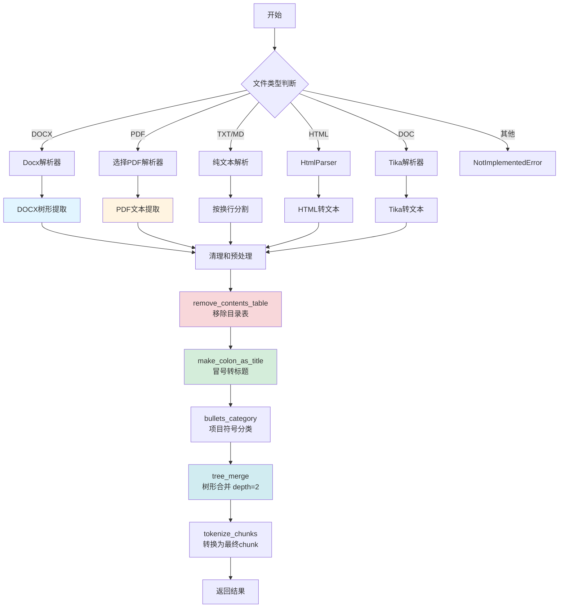
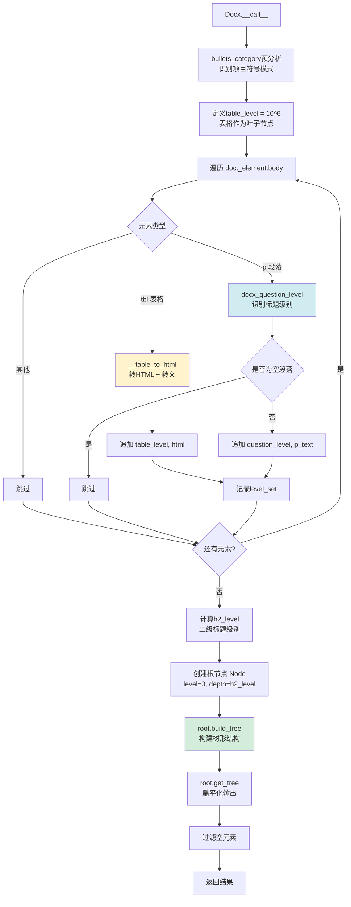
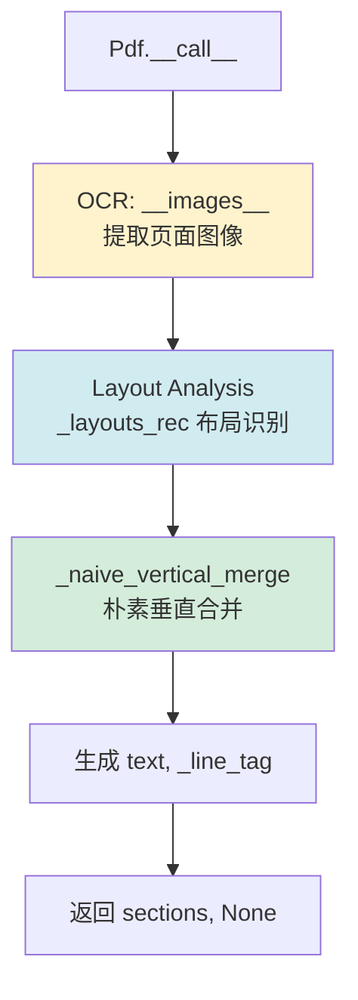
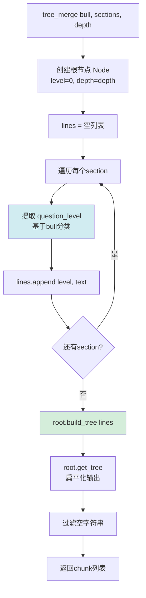
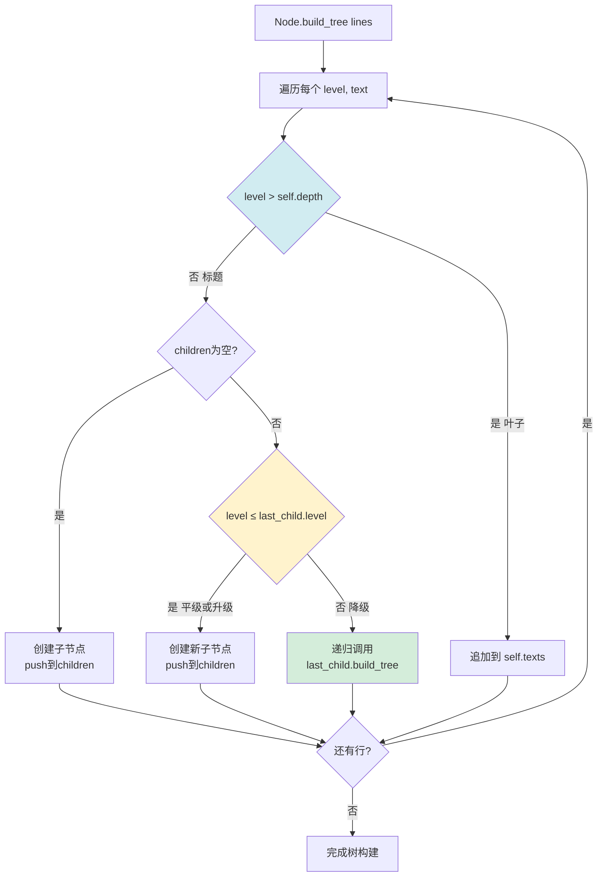
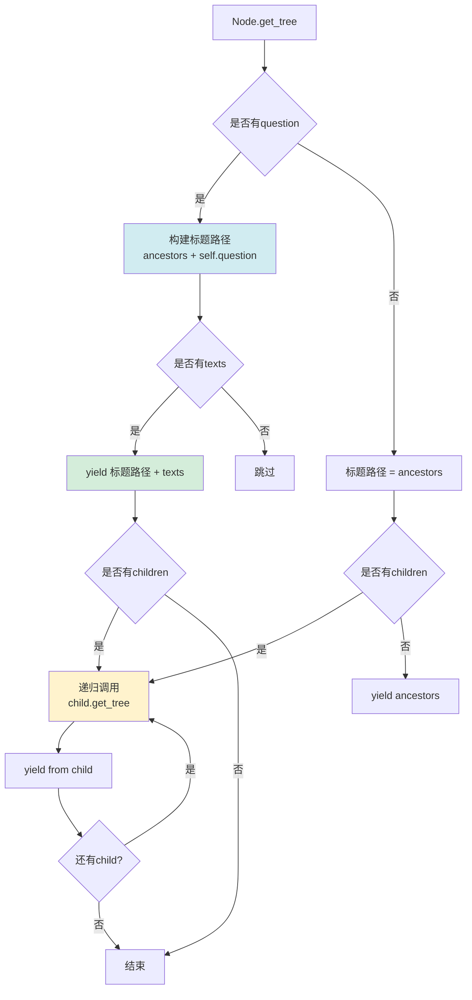
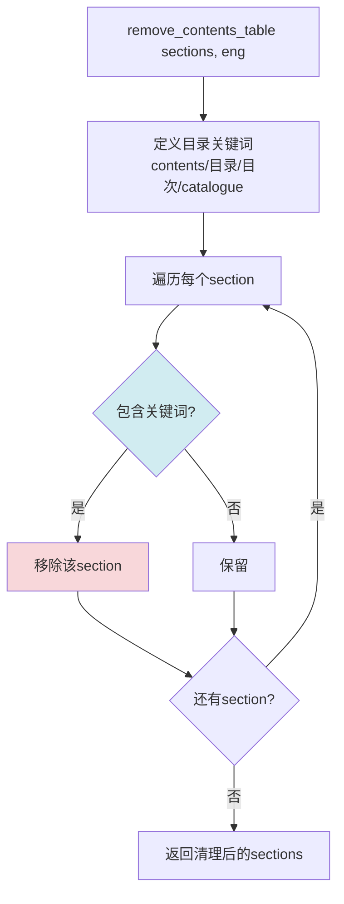
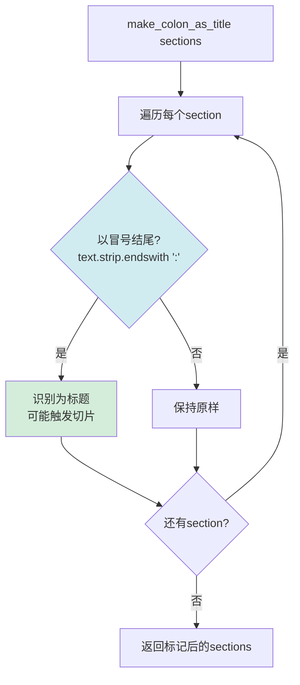

# Laws规则流程图

## 规则概述

Laws（法律）规则是专门为**法律法规、政策文件、条款文档**等层级化文本设计的切片模板。它采用**树形合并（tree_merge）**策略，按照法律文档的典型结构（章、节、条、款、项）进行智能切片。

**适用场景**：
- 法律法规（法律、行政法规、地方性法规）
- 政策文件（政府公文、规章制度）
- 合同条款（协议、合同、条款集）
- 标准规范（国家标准、行业标准）

**核心特点**：
1. **树形结构保留**：识别并保留法律文档的层级结构（章→节→条→款→项）
2. **目录表自动移除**：智能识别并删除"目录"、"Contents"部分
3. **冒号标题转换**：将"第一条："这类冒号结尾的文本识别为标题
4. **多格式支持**：PDF/DOCX/TXT/HTML/DOC（通过tika）全格式支持
5. **DOCX表格内联**：表格自动转HTML并内联到文本中

---

## 主流程图



---

## DOCX解析子流程（Laws专用）



### 表格转HTML算法

```mermaid
graph TD
    A[__table_to_html tb] --> B[html = '<table>']
    B --> C[遍历行 tb.rows]
    C --> D[html += '<tr>']
    D --> E[col_idx = 0]
    E --> F{col_idx < len cells}
    
    F -->|是| G[取单元格 c = r.cells[col_idx]]
    F -->|否| H[html += '</tr>']
    
    G --> I[span = 1]
    I --> J[向右扫描相同文本]
    J --> K{c.text == next.text}
    K -->|是| L[span += 1<br/>col_idx = j]
    K -->|否| M[col_idx += 1]
    
    L --> N{还有下一列?}
    N -->|是| J
    N -->|否| M
    
    M --> O[html_escape c.text]
    O --> P{span == 1}
    P -->|是| Q[html += '<td>cell</td>']
    P -->|否| R[html += '<td colspan=span>cell</td>']
    
    Q --> F
    R --> F
    H --> S{还有行?}
    S -->|是| C
    S -->|否| T[html += '</table>']
    T --> U[返回html]
    
    style J fill:#d1ecf1
    style O fill:#fff3cd
```

---

## PDF解析子流程（Laws专用）



**说明**：Laws的PDF解析器不使用表格分析（`_table_transformer_job`），直接进行垂直合并，保持文本的线性流动。

---

## 核心函数：tree_merge



### Node.build_tree 算法



### Node.get_tree 递归输出



---

## 辅助函数流程图

### remove_contents_table（移除目录表）



### make_colon_as_title（冒号转标题）



**示例转换**：
```
"第一条："  → 识别为标题
"第二条：本规定适用于..." → 识别为标题
"说明：详见附件" → 识别为标题
```

---

## 配置参数

| 参数 | 类型 | 默认值 | 说明 |
|------|------|--------|------|
| `chunk_token_num` | int | 512 | 目标token数量（tree_merge不直接使用） |
| `delimiter` | str | `\n` | 分隔符 |
| `layout_recognize` | str/bool | "DeepDOC" | PDF解析器选择 |
| `from_page` | int | 0 | 起始页码（0-based） |
| `to_page` | int | MAXIMUM_PAGE_NUMBER | 结束页码 |
| `lang` | str | "Chinese" | 语言（Chinese/English） |
| `depth` | int | 2 | tree_merge的深度参数（固定为2） |

---

## h2_level计算逻辑

```python
sorted_levels = sorted(level_set)  # 文档中所有出现的标题级别

if not sorted_levels:
    h2_level = 1
else:
    # 取第二个级别作为h2_level
    h2_level = sorted_levels[1] if len(sorted_levels) > 1 else 1
    
    # 如果h2_level是最大级别，且有至少3个级别，则取倒数第二个
    if h2_level == sorted_levels[-1] and len(sorted_levels) > 2:
        h2_level = sorted_levels[-2]

# 示例：
# sorted_levels = [0, 1, 2, 3, 4, 10^6]  → h2_level = 1
# sorted_levels = [0, 2, 10^6]           → h2_level = 2
# sorted_levels = [0, 10^6]              → h2_level = 1
```

**说明**：`10^6` 是表格的虚拟级别，确保表格作为叶子节点被合并到最近的章节中。

---

## 使用示例

### 示例1：法律法规PDF
```python
from rag.app import laws

def progress_callback(prog, msg):
    print(f"[{prog:.1%}] {msg}")

chunks = laws.chunk(
    filename="中华人民共和国民法典.pdf",
    binary=None,
    from_page=0,
    to_page=1000,
    lang="Chinese",
    callback=progress_callback,
    parser_config={
        "chunk_token_num": 512,
        "layout_recognize": "DeepDOC",
        "delimiter": "\n"
    }
)

# 返回格式（树形结构）：
# [
#   "第一编 总则\n第一章 基本规定\n第一条 为了保护...",
#   "第一编 总则\n第一章 基本规定\n第二条 民法调整...",
#   "第一编 总则\n第二章 自然人\n第一节 民事权利能力和民事行为能力\n第十三条 自然人从出生时起到死亡时止...",
#   ...
# ]
```

### 示例2：政策文件DOCX
```python
chunks = laws.chunk(
    filename="政府工作报告.docx",
    binary=open("政府工作报告.docx", "rb").read(),
    lang="Chinese",
    callback=progress_callback
)

# 自动识别标题层级（Heading 1-6），表格内联为HTML
```

### 示例3：合同条款TXT
```python
chunks = laws.chunk(
    filename="劳动合同模板.txt",
    binary=None,
    lang="Chinese",
    callback=progress_callback
)

# 纯文本按换行分割后进行树形合并
```

---

## 与其他规则的对比

| 特性 | Laws | Manual | Paper | Book |
|------|------|--------|-------|------|
| **合并策略** | tree_merge（深度2） | 小块智能合并 | hierarchical_merge | hierarchical/naive自动 |
| **结构保留** | ✅ 树形标题路径 | ✅ 章节ID | ✅ 层级化 | ✅ 自动检测 |
| **目录移除** | ✅ 自动 | ❌ | ❌ | ❌ |
| **冒号转标题** | ✅ | ❌ | ❌ | ❌ |
| **表格处理** | DOCX内联HTML | 插入sections | 附加末尾 | 附加末尾 |
| **PDF表格分析** | ❌ | ✅ | ✅ | ✅ |
| **深度参数** | 固定2 | 动态 | 动态 | 动态 |

---

## 树形合并示例

### 输入sections（带标题级别）
```
Level 0: "中华人民共和国民法典"
Level 1: "第一编 总则"
Level 2: "第一章 基本规定"
Level 3: "第一条 为了保护民事主体的合法权益..."
Level 3: "第二条 民法调整平等主体的自然人..."
Level 2: "第二章 自然人"
Level 3: "第一节 民事权利能力和民事行为能力"
Level 4: "第十三条 自然人从出生时起到死亡时止，具有民事权利能力..."
```

### 树形结构（depth=2）
```
Node(level=0, question="中华人民共和国民法典")
├─ Node(level=1, question="第一编 总则")
│  ├─ Node(level=2, question="第一章 基本规定", texts=["第一条...", "第二条..."])
│  └─ Node(level=2, question="第二章 自然人")
│     └─ Node(level=3, question="第一节 民事权利能力和民事行为能力", texts=["第十三条..."])
```

### 输出chunks（扁平化）
```
[
  "中华人民共和国民法典\n第一编 总则\n第一章 基本规定\n第一条 为了保护民事主体的合法权益...\n第二条 民法调整平等主体的自然人...",
  "中华人民共和国民法典\n第一编 总则\n第二章 自然人\n第一节 民事权利能力和民事行为能力\n第十三条 自然人从出生时起到死亡时止，具有民事权利能力..."
]
```

**说明**：每个chunk包含完整的标题路径（ancestors），便于理解上下文。

---

## 最佳实践

1. **标准法律文档**：直接使用Laws规则，无需调整参数
2. **非标准层级**：如果文档层级超过2层，考虑修改 `tree_merge` 的 `depth` 参数
3. **目录干扰**：Laws自动移除目录，无需手动预处理
4. **DOCX表格**：确保表格格式正确，避免合并单元格过多导致HTML解析错误
5. **DOC格式**：需要安装tika依赖（`pip install tika`），否则无法解析
6. **纯文本**：确保使用标准缩进或编号（一、二、三 或 1. 2. 3.）来标记层级

---

## 核心代码片段

### 冒号转标题
```python
def make_colon_as_title(sections):
    for i, sec in enumerate(sections):
        if isinstance(sec, str) and sec.strip().endswith(':'):
            # 标记为潜在标题，后续tree_merge会识别
            pass
```

### 目录移除
```python
def remove_contents_table(sections, eng):
    keywords = ["contents", "目录", "目次", "catalogue"] if not eng else ["contents", "catalogue"]
    return [s for s in sections if not any(kw in s.lower() for kw in keywords)]
```

### DOCX表格转HTML
```python
def __table_to_html(self, tb):
    html = "<table>"
    for r in tb.rows:
        html += "<tr>"
        col_idx = 0
        while col_idx < len(r.cells):
            span = 1
            c = r.cells[col_idx]
            # 检测合并单元格（文本相同）
            for j in range(col_idx + 1, len(r.cells)):
                if c.text == r.cells[j].text:
                    span += 1
                    col_idx = j
                else:
                    break
            col_idx += 1
            cell = html_escape(c.text)
            html += f"<td>{cell}</td>" if span == 1 else f"<td colspan='{span}'>{cell}</td>"
        html += "</tr>"
    html += "</table>"
    return html
```

---

## 注意事项

1. **depth参数固定为2**：Laws规则硬编码 `tree_merge(bull, sections, 2)`，不从配置读取
2. **DOCX表格级别**：`table_level = 10^6` 确保表格作为叶子节点，不会独立成chunk
3. **PDF无表格分析**：Laws的PDF解析器跳过 `_table_transformer_job`，保持线性流动
4. **DOC格式依赖**：需要tika服务运行（或安装tika-python），否则会抛出异常
5. **树形路径长度**：深度越大，标题路径越长，可能导致chunk过大

---

## 总结

Laws规则适合**层级清晰、结构严谨**的法律法规和政策文件。通过树形合并算法，能够保留完整的标题路径，便于用户理解检索结果的上下文。对于非层级化文档，建议使用Naive或One规则。
