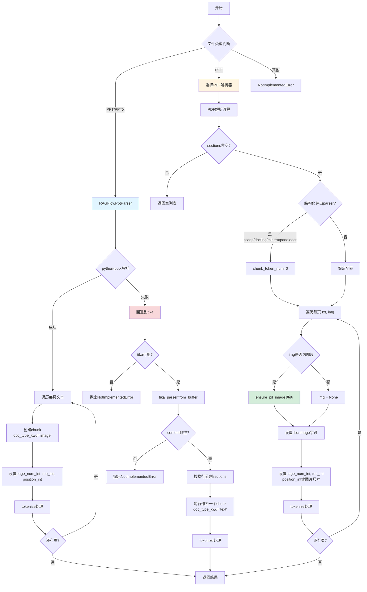
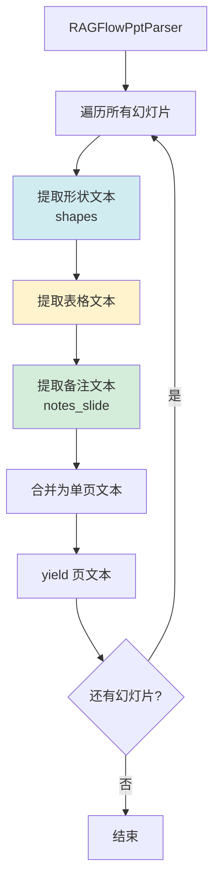
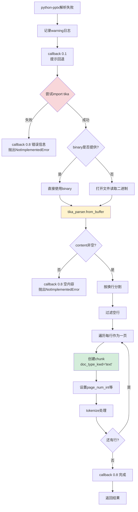

# Presentation规则流程图

## 规则概述

Presentation（演示文稿）规则是专门为**PPT/PPTX/PDF幻灯片**设计的切片模板。它采用**每页一个chunk**策略，并为每页保存**缩略图**，便于用户在检索结果中直观预览幻灯片内容。

**适用场景**：
- PPT演示文稿（培训材料、产品介绍）
- PDF幻灯片（会议报告、学术演讲）
- 图文混排的分页文档

**核心特点**：
1. **页级切片**：每页作为一个独立chunk，保持视觉完整性
2. **缩略图存储**：PDF模式下每页生成缩略图（`doc["image"]`）
3. **多引擎回退**：python-pptx失败时自动回退到tika
4. **位置信息完整**：每个chunk携带页码和图片尺寸
5. **表格图表内联**：PDF模式下表格和图表按位置插入到页面文本中

---

## 主流程图



---

## PDF解析子流程（Presentation专用）

```mermaid
graph TD
    A[Pdf.__call__] --> B[1. OCR<br/>__images__ 提取页面图像]
    B --> C[2. Layout Analysis<br/>_layouts_rec 布局识别]
    C --> D[3. Table Analysis<br/>_table_transformer_job]
    D --> E[4. Text Merge<br/>_text_merge 文本合并]
    E --> F[5. Extract Tables<br/>_extract_table_figure 强制HTML]
    F --> G[6. 重组页面内容]
    
    G --> H[创建 page_items defaultdict]
    H --> I[A: 添加文本boxes]
    I --> J[计算全局页码<br/>global_page_num = b.page_number + from_page]
    J --> K{页码在范围内?}
    K -->|否| L[跳过]
    K -->|是| M[追加 top, x0, text, type='text']
    
    L --> N{还有box?}
    M --> N
    N -->|是| I
    N -->|否| O[B: 添加表格和图表]
    
    O --> P[遍历 tbls]
    P --> Q{positions非空?}
    Q -->|否| R[跳过]
    Q -->|是| S[提取content文本<br/>list→join / str→直接用]
    
    S --> T[解析页码 pn_index]
    T --> U{pn_index是list?}
    U -->|是| V[取第一个元素]
    U -->|否| W[直接使用]
    
    V --> X[current_page_num = pn_index + 1]
    W --> X
    X --> Y{页码在范围内?}
    Y -->|否| Z[跳过]
    Y -->|是| AA[追加 top, x0, text, type='table_or_figure']
    
    R --> AB{还有tbl?}
    Z --> AB
    AA --> AB
    AB -->|是| P
    AB -->|否| AC[7. 生成结果]
    
    AC --> AD[遍历 page_images]
    AD --> AE[current_pn = from_page + i + 1]
    AE --> AF[取该页所有items]
    AF --> AG[按 top, x0 排序<br/>垂直位置优先]
    AG --> AH[join所有text<br/>用双换行分隔]
    AH --> AI{文本为空?}
    AI -->|是| AJ[填充占位符<br/>'No text or data found in Page N']
    AI -->|否| AK[使用实际文本]
    
    AJ --> AL[取该页缩略图 page_img]
    AK --> AL
    AL --> AM[追加 full_page_text, page_img]
    AM --> AN{还有页?}
    AN -->|是| AD
    AN -->|否| AO[返回 res, 空表格列表]
    
    style B fill:#fff3cd
    style C fill:#d1ecf1
    style F fill:#f8d7da
    style AG fill:#d4edda
```



---

## PlainPdf解析子流程（纯文本模式）

```mermaid
graph TD
    A[PlainPdf.__call__] --> B[pdf2_read 读取PDF]
    B --> C[遍历 pages[from_page:to_page]]
    C --> D[page.extract_text<br/>提取纯文本]
    D --> E[追加到 page_txt]
    E --> F{还有页?}
    F -->|是| C
    F -->|否| G[callback 0.9 完成]
    G --> H[返回 txt, None 列表]
    
    style D fill:#d1ecf1
```

**说明**：PlainPdf不生成缩略图（返回 `None`），仅提取文本，速度快但无视觉信息。

---

## PPT解析流程



---

## Tika回退流程



---

## 配置参数

| 参数 | 类型 | 默认值 | 说明 |
|------|------|--------|------|
| `layout_recognize` | str/bool | "DeepDOC" | PDF解析器选择 |
| `chunk_token_num` | int | 无默认 | 页级切片不使用，tcadp等会设为0 |
| `from_page` | int | 0 | 起始页码（0-based） |
| `to_page` | int | MAXIMUM_PAGE_NUMBER | 结束页码 |
| `lang` | str | "Chinese" | 语言（Chinese/English） |

**注意**：Presentation规则的 `parser_config` 可以为 `None`，会自动初始化为空字典。

---

## chunk数据结构

### PPT/PPTX模式
```python
{
    "docnm_kwd": "presentation.pptx",
    "title_tks": [...],
    "title_sm_tks": [...],
    "doc_type_kwd": "image",      # 标记为图像类型
    "page_num_int": [1],           # 页码（1-based）
    "top_int": [0],                # 顶部位置（固定0）
    "position_int": [(1, 0, 0, 0, 0)],  # (页码, 左, 右, 上, 下)
    "content_ltks": [...],
    "content_with_weight": "第一页内容...",
    ...
}
```

### PDF模式（带缩略图）
```python
{
    "docnm_kwd": "slides.pdf",
    "title_tks": [...],
    "title_sm_tks": [...],
    "image": <PIL.Image>,          # 页面缩略图
    "page_num_int": [1],
    "top_int": [0],
    "position_int": [(1, 0, 1920, 0, 1080)],  # 含图片实际尺寸
    "content_ltks": [...],
    "content_with_weight": "第一页文本\n\n表格内容\n\n图表说明",
    ...
}
```

### Tika回退模式
```python
{
    "docnm_kwd": "presentation.pptx",
    "doc_type_kwd": "text",        # 标记为文本类型
    "page_num_int": [1],
    "top_int": [0],
    "position_int": [(1, 0, 0, 0, 0)],
    ...
}
```

---

## 使用示例

### 示例1：PPTX演示文稿
```python
from rag.app import presentation

def progress_callback(prog, msg):
    print(f"[{prog:.1%}] {msg}")

chunks = presentation.chunk(
    filename="product_intro.pptx",
    binary=open("product_intro.pptx", "rb").read(),
    from_page=0,
    to_page=50,
    lang="Chinese",
    callback=progress_callback
)

# 每页一个chunk，doc_type_kwd="image"
print(f"共 {len(chunks)} 页")
for i, ck in enumerate(chunks[:3]):
    print(f"第{i+1}页: {ck['content_with_weight'][:50]}...")
```

### 示例2：PDF幻灯片（带缩略图）
```python
chunks = presentation.chunk(
    filename="conference_slides.pdf",
    binary=None,
    from_page=0,
    to_page=100,
    lang="English",
    callback=progress_callback,
    parser_config={
        "layout_recognize": "DeepDOC"
    }
)

# 每个chunk包含缩略图
for ck in chunks:
    if ck.get("image"):
        print(f"页 {ck['page_num_int'][0]}: 图片尺寸 {ck['image'].size}")
```

### 示例3：纯文本模式（快速）
```python
chunks = presentation.chunk(
    filename="slides.pdf",
    binary=None,
    lang="Chinese",
    callback=progress_callback,
    parser_config={
        "layout_recognize": "Plain Text"  # 使用PlainPdf，无缩略图
    }
)

# 速度快，但无图片和布局信息
```

---

## 与其他规则的对比

| 特性 | Presentation | One | Naive | Picture |
|------|--------------|-----|-------|---------|
| **切片粒度** | 每页一个chunk | 整个文件一个chunk | Token驱动 | 每张图一个chunk |
| **缩略图** | ✅ PDF模式 | ❌ | ❌ | ✅ 原图 |
| **doc_type_kwd** | image/text | 无 | 无 | image/video |
| **位置信息** | ✅ 页码+尺寸 | ❌ | ✅ 详细坐标 | ❌ |
| **支持格式** | PPT/PPTX/PDF | DOCX/PDF/XLSX/TXT/HTML/DOC | 10+种 | 图片/视频 |
| **回退机制** | ✅ tika | ✅ tika | ✅ 多级 | ✅ OCR→Vision |
| **表格处理** | 内联到页面文本 | 内联到整体文本 | 独立chunk | ❌ |

---

## 页面内容排序逻辑

```python
# 收集页面所有元素（文本 + 表格 + 图表）
page_items = defaultdict(list)

# 添加文本
for b in self.boxes:
    page_items[global_page_num].append({
        "top": b["top"],      # 垂直位置
        "x0": b["x0"],        # 水平位置
        "text": b["text"],
        "type": "text"
    })

# 添加表格和图表
for (img, content), positions in tbls:
    page_items[current_page_num].append({
        "top": positions[0][3],   # 表格顶部
        "x0": positions[0][1],    # 表格左侧
        "text": final_text,
        "type": "table_or_figure"
    })

# 按视觉顺序排序：先上后下，先左后右
items.sort(key=lambda x: (x["top"], x["x0"]))
full_page_text = "\n\n".join([item["text"] for item in items])
```

**说明**：使用双换行 `\n\n` 分隔不同元素，保持视觉分隔感。

---

## 页码处理机制

```mermaid
graph TD
    A[页码来源] --> B[boxes: b.page_number<br/>相对页码 0-based]
    A --> C[tbls: positions[0][0]<br/>绝对页码 0-based]
    
    B --> D[global_page_num = b.page_number + from_page]
    C --> E[current_page_num = pn_index + 1]
    
    D --> F{范围检查<br/>from_page < num ≤ to_page + from_page}
    E --> F
    
    F -->|通过| G[加入page_items]
    F -->|不通过| H[跳过]
    
    G --> I[输出时: current_pn = from_page + i + 1]
    
    style B fill:#d1ecf1
    style C fill:#fff3cd
    style I fill:#d4edda
```

**注意**：boxes和tbls的页码基准不同，需要分别处理。

---

## 最佳实践

1. **PPT演示文稿**：直接使用Presentation规则，自动识别每页
2. **需要视觉预览**：使用PDF模式（DeepDOC），会生成缩略图
3. **追求速度**：使用 `layout_recognize="Plain Text"`，跳过OCR和布局分析
4. **旧版PPT（.ppt）**：需要tika服务，或先转换为.pptx
5. **图表密集**：PDF模式会自动提取表格和图表并内联到页面文本
6. **空白页处理**：会自动填充占位符 `[No text or data found in Page N]`，避免空chunk

---

## 核心代码片段

### 页面重组逻辑
```python
res = []
for i in range(len(self.page_images)):
    current_pn = from_page + i + 1
    items = page_items.get(current_pn, [])
    
    # 按视觉顺序排序
    items.sort(key=lambda x: (x["top"], x["x0"]))
    full_page_text = "\n\n".join([item["text"] for item in items])
    
    # 空页占位
    if not full_page_text.strip():
        full_page_text = f"[No text or data found in Page {current_pn}]"
    
    page_img = self.page_images[i]
    res.append((full_page_text, page_img))
```

### 图片处理
```python
for pn, (txt, img) in enumerate(sections):
    d = copy.deepcopy(doc)
    pn += from_page
    
    # 检查是否为有效图片
    if not is_image_like(img):
        img = None
    else:
        img = ensure_pil_image(img)  # 转换为PIL Image
    
    d["image"] = img
    d["page_num_int"] = [pn + 1]
    d["top_int"] = [0]
    # position_int包含图片实际尺寸
    d["position_int"] = [(pn + 1, 0, img.size[0] if img else 0, 0, img.size[1] if img else 0)]
    tokenize(d, txt, eng, language=lang)
    res.append(d)
```

### Tika回退
```python
try:
    ppt_parser = RAGFlowPptParser()
    for pn, txt in enumerate(ppt_parser(...)):
        # 正常处理
        ...
    return res
except Exception as e:
    logging.warning(f"python-pptx parsing failed: {e}, trying tika as fallback")
    if callback:
        callback(0.1, "python-pptx failed, trying tika as fallback")
    
    try:
        from tika import parser as tika_parser
    except Exception as tika_error:
        raise NotImplementedError(f"tika not available: {tika_error}")
    
    # tika解析
    doc_parsed = tika_parser.from_buffer(BytesIO(binary_data))
    ...
```

---

## 注意事项

1. **缩略图内存占用**：PDF模式会为每页生成PIL Image，大文档可能占用较多内存
2. **页码基准差异**：boxes是相对页码，tbls是绝对页码，需要分别转换
3. **PPT表格**：RAGFlowPptParser会提取表格文本，但不保留HTML结构
4. **doc_type_kwd差异**：PPT模式固定为"image"，tika回退为"text"，PDF模式不设置
5. **parser_config可为None**：函数内部会初始化为空字典
6. **MAXIMUM_PAGE_NUMBER**：PPT模式忽略to_page，始终使用最大值

---

## 总结

Presentation规则适合**分页明确、图文并重**的演示文稿。通过页级切片和缩略图存储，用户可以在检索结果中直观看到幻灯片内容。对于纯文本演示文稿，可以使用Plain Text模式提升速度。
