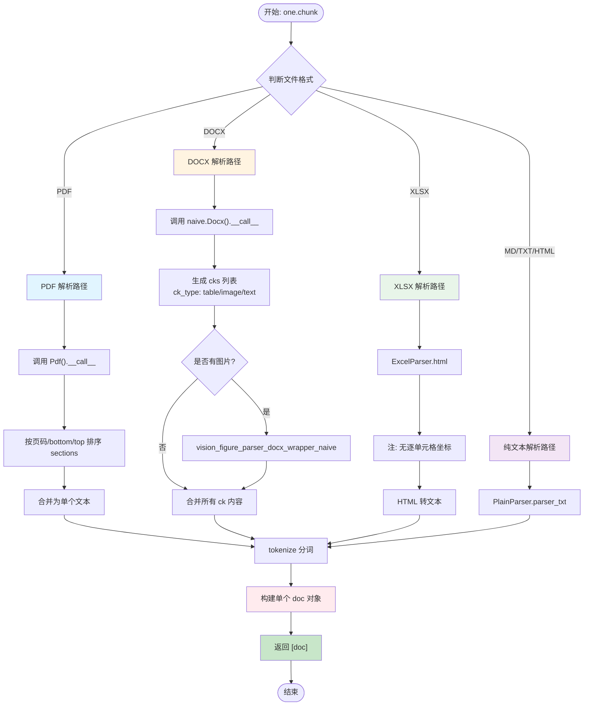
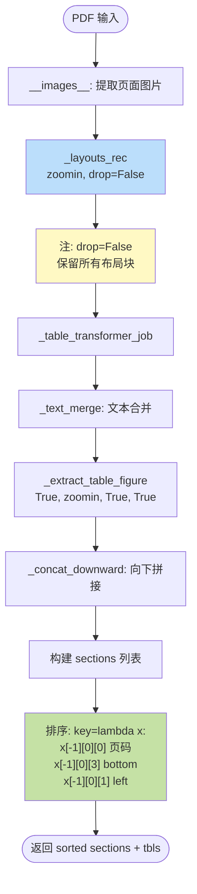
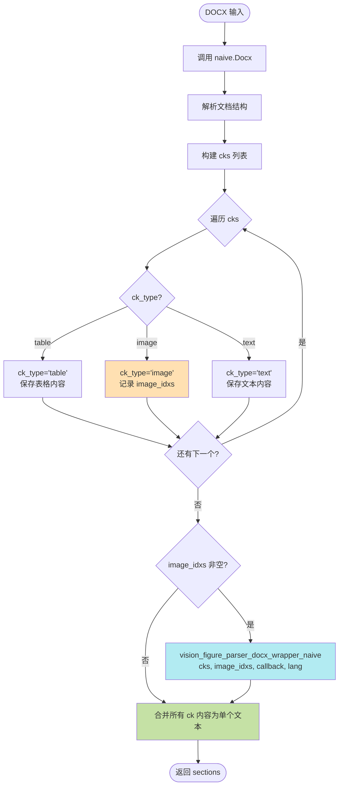
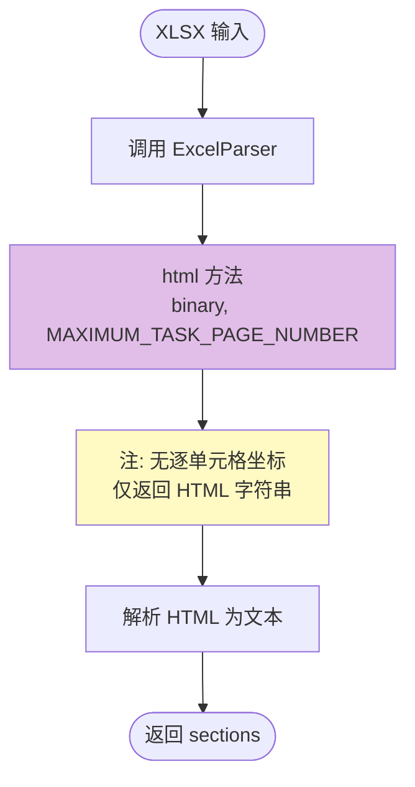

# One 规则流程图

## 概述

**One 规则**是 RAGFlow 中最简单的切片策略：**将整个文件作为单个 chunk**。

### 核心特征

- **单 chunk 输出**: 无论文件多大，最终只生成一个 chunk
- **格式支持**: PDF、DOCX、XLSX、MD、TXT、HTML
- **视觉解析**: DOCX 中的图片/表格通过 `vision_figure_parser_docx_wrapper_naive` 处理
- **XLSX 特殊处理**: 转 HTML，无逐单元格坐标
- **适用场景**: 短文档、单页内容、需要保持完整语义的材料

---

## 主流程图



---

## PDF 解析子流程



### PDF 排序逻辑

**三级排序键**:
1. **页码** (`x[-1][0][0]`): 首要按页排序
2. **bottom** (`x[-1][0][3]`): 同页内按底部位置排序
3. **left** (`x[-1][0][1]`): 相同底部位置按左边界排序

---

## DOCX 解析子流程



### DOCX ck_type 分类

| ck_type | 含义 | 处理方式 |
|---------|------|----------|
| `table` | 表格块 | 直接保存表格 HTML/文本 |
| `image` | 图片块 | 记录索引,传给 vision parser |
| `text` | 文本块 | 保存纯文本内容 |

---

## XLSX 解析子流程



### XLSX 限制

- **无坐标信息**: 不提供单元格级别的位置坐标
- **HTML 格式**: 转换为 HTML 表格,再提取文本
- **页数限制**: 受 `MAXIMUM_TASK_PAGE_NUMBER` 约束

---

## 配置参数

| 参数名 | 默认值 | 说明 |
|--------|--------|------|
| `layout_recognize` | `true` | PDF 是否启用版面识别 |
| `lang` | `"English"` | 语言设置 |

---

## 核心代码片段

### PDF 解析与排序

```python
# one.py: Pdf.__call__
def __call__(self, filename, binary=None, from_page=0, to_page=MAXIMUM_PAGE_NUMBER, 
             zoomin=3, callback=None):
    self.__images__(filename, zoomin, from_page, to_page, callback)
    self._layouts_rec(zoomin, drop=False)  # 注意 drop=False
    self._table_transformer_job(zoomin)
    self._text_merge()
    tbls = self._extract_table_figure(True, zoomin, True, True)
    self._concat_downward()
    
    sections = [
        (b["text"], self.get_position(b, zoomin)) 
        for i, b in enumerate(self.boxes)
    ]
    
    # 三级排序: 页码 -> bottom -> left
    return [
        (txt, "") 
        for txt, _ in sorted(
            sections, 
            key=lambda x: (x[-1][0][0], x[-1][0][3], x[-1][0][1])
        )
    ], tbls
```

### DOCX 视觉解析

```python
# one.py: chunk - DOCX 分支
from rag.app import naive

sections, tbls = naive.Docx()(filename, binary)

# 构建 cks 列表
cks = []
image_idxs = []
for i, (txt, _) in enumerate(sections):
    ck = {"text": txt, "type": "text"}
    if is_table(txt):
        ck["type"] = "table"
    elif is_image(txt):
        ck["type"] = "image"
        image_idxs.append(i)
    cks.append(ck)

# 视觉解析图片
if image_idxs:
    sections = vision_figure_parser_docx_wrapper_naive(
        cks, image_idxs, callback, lang=lang, **kwargs
    )
```

### XLSX 转 HTML

```python
# one.py: chunk - XLSX 分支
from rag.app.naive import ExcelParser

html = ExcelParser().html(binary, MAXIMUM_TASK_PAGE_NUMBER)
sections = parse_html_to_text(html)
```

### 最终合并

```python
# one.py: chunk - 最后统一处理
doc = {
    "docnm_kwd": filename,
    "title_tks": rag_tokenizer.tokenize(title),
    "content_ltks": "",
    "content_with_weight": ""
}

# 合并所有 sections
full_text = "\n".join([txt for txt, _ in sections])

# 分词并构建单个 chunk
tokenize(doc, full_text, eng, language=lang)

return [doc]  # 只返回一个 chunk
```

---

## 使用示例

### 短文档场景

**输入**: 1页 PDF 产品说明书

```
产品名称: XXX 智能设备
规格: 10cm x 5cm x 2cm
功能: 温度监测、湿度监测、数据上传
电池寿命: 2年
```

**输出**: 1个 chunk

```json
{
  "docnm_kwd": "产品说明书.pdf",
  "content_with_weight": "产品名称: XXX 智能设备\n规格: 10cm x 5cm x 2cm...",
  "content_ltks": ["产品", "名称", "xxx", "智能", "设备", ...],
  "page_num_int": [1]
}
```

### DOCX 图文混排场景

**输入**: DOCX 文档

```
# 项目概览
本项目旨在...

[图片: 架构图]

## 技术栈
- Python 3.9+
- FastAPI
```

**处理流程**:
1. `naive.Docx()` 解析 → 3个 cks (text, image, text)
2. `image_idxs = [1]` 触发 vision parser
3. Vision LLM 描述图片: "系统架构图,包含前端、后端、数据库三层..."
4. 合并为单个 chunk: "# 项目概览\n本项目旨在...\n\n系统架构图,包含...\n\n## 技术栈..."

---

## 与其他规则的对比

| 特性 | One | Naive | Manual | Book |
|------|-----|-------|--------|------|
| Chunk 数量 | **1** | 多个 | 多个 | 多个 |
| 长度控制 | 无 | `chunk_token_num` | `chunk_token_num` | `chunk_token_num` |
| 语义完整性 | **最高** | 中 | 高 | 高 |
| 适用文档类型 | 短文档 | 通用 | 手册 | 书籍 |
| 大纲识别 | 否 | 否 | 是 | 是 |
| 检索粒度 | **文档级** | 段落级 | 章节级 | 章节级 |

---

## 最佳实践

### 适用场景

✅ **推荐使用**:
- 单页或2-3页的短文档
- 需要保持完整语义的材料 (如合同条款、政策声明)
- 文档本身就是一个完整的知识单元
- 表单、证书、单页报告

❌ **不推荐使用**:
- 长篇文档 (>5页)
- 多主题混合的文档
- 需要精细检索的技术手册
- 大型报告或书籍

### 性能考量

| 指标 | One 规则 | 说明 |
|------|----------|------|
| 解析速度 | 快 | 无需切分逻辑 |
| 向量存储 | 少 | 只存储1个向量 |
| 检索召回 | 粗 | 文档级召回 |
| Token 消耗 | 高 | 整个文档进入上下文 |

### 配置建议

```python
# 推荐配置
parser_config = {
    "chunk_token_num": 0,  # One 规则忽略此参数
    "layout_recognize": True,  # PDF 启用版面识别
    "html4excel": False  # XLSX 不生成 HTML
}
```

---

## 常见问题

### Q1: One 规则会截断超长文档吗?

**A**: 不会。One 规则始终返回1个 chunk,无论文档多长。但需注意:
- LLM 上下文窗口限制
- 向量模型最大长度限制
- 实际应用中建议文档 <5页

### Q2: XLSX 为什么没有单元格坐标?

**A**: One 规则中 XLSX 通过 `ExcelParser().html()` 转换,该方法只返回 HTML 字符串,不保留单元格坐标信息。如需坐标,使用 `table` 规则。

### Q3: DOCX 图片如何处理?

**A**: 通过 `vision_figure_parser_docx_wrapper_naive` 调用 Vision LLM 描述图片内容,然后将描述文本合并到最终 chunk 中。

### Q4: drop=False 有什么作用?

**A**: `_layouts_rec(zoomin, drop=False)` 中的 `drop=False` 表示保留所有布局块,不丢弃低置信度的块。这确保 One 规则能捕获完整内容。

