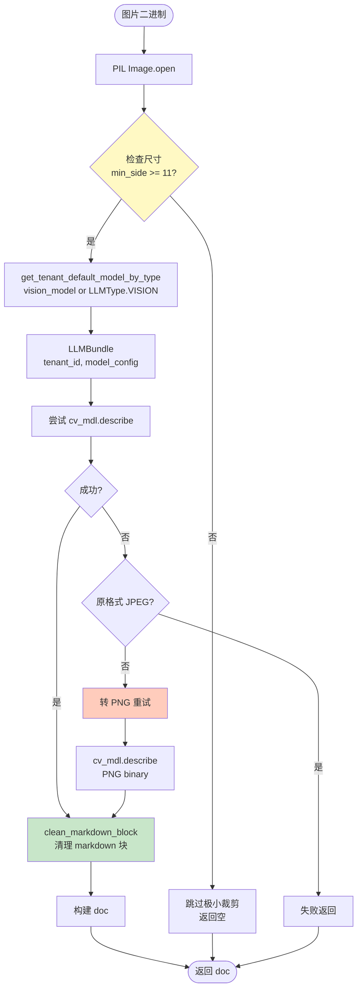
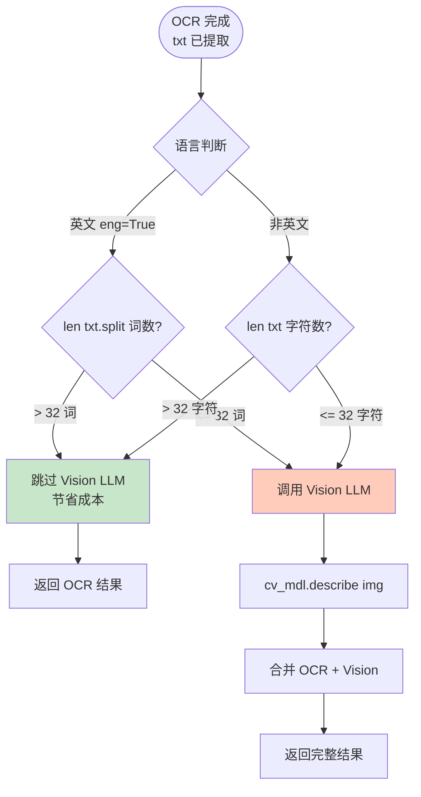
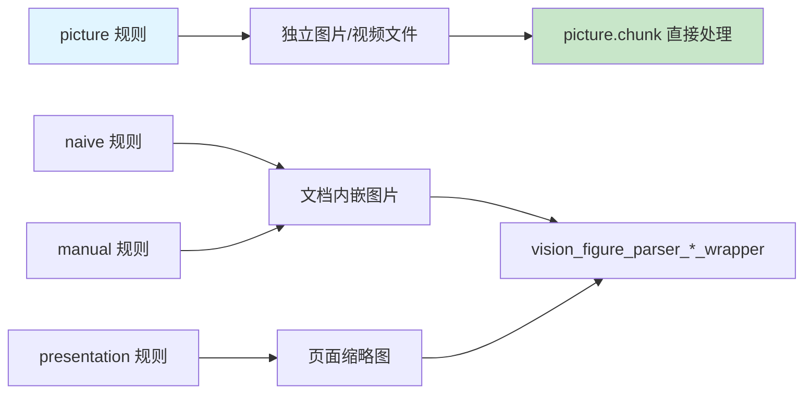

# Picture 规则流程图

## 概述

**Picture 规则**用于处理图片和视频文件，通过 OCR 和视觉 LLM 提取内容。

### 核心特征

- **视频支持**: 通过 Vision LLM 的 `async_chat` 处理视频
- **图片 OCR**: 优先使用 PaddleOCR，回退到通用 OCR
- **智能跳过**: OCR 文本足够长时跳过 Vision LLM (节省成本)
- **Vision 描述**: OCR 结果不足时调用 Vision LLM 生成图片描述
- **格式支持**: 图片 (JPG/PNG/WEBP/GIF) + 视频 (MP4/MOV/AVI/FLV/MPEG/WEBM/WMV/3GP/MKV)

---

## 主流程图

```mermaid
flowchart TD
    Start([开始: picture.chunk]) --> CheckExt{判断文件扩展名}
    
    CheckExt -->|视频格式| Video_Path[视频处理路径]
    CheckExt -->|图片格式| Image_Path[图片处理路径]
    
    Video_Path --> VideoExts[支持: mp4/mov/avi/flv<br/>mpeg/mpg/webm/wmv<br/>3gp/3gpp/mkv]
    VideoExts --> AsyncChat[cv_mdl.async_chat<br/>video_bytes, video_prompt]
    AsyncChat --> VideoDoc[doc_type_kwd='video'<br/>构建 doc]
    
    Image_Path --> OpenImage[Image.open.convert RGB]
    OpenImage --> TryPaddle[_try_paddleocr_image]
    
    TryPaddle --> PaddleSuccess{PaddleOCR 成功?}
    PaddleSuccess -->|是| CheckLength
    PaddleSuccess -->|否| FallbackOCR[_get_ocr<br/>通用 OCR]
    
    FallbackOCR --> CheckLength{OCR 文本长度检查}
    
    CheckLength --> LengthCond{eng: len>32词<br/>或 len>32字?}
    LengthCond -->|是| SkipVision[跳过 Vision LLM<br/>ImageDoc doc_type_kwd='image']
    LengthCond -->|否| CallVision[cv_mdl.describe<br/>Vision LLM 描述]
    
    CallVision --> MergeDesc[合并 OCR + Vision 描述]
    MergeDesc --> ImageDoc[doc_type_kwd='image'<br/>构建 doc]
    
    SkipVision --> AttachCtx[attach_media_context<br/>image_ctx]
    ImageDoc --> AttachCtx
    VideoDoc --> Return
    AttachCtx --> Return[返回 [doc]]
    Return --> End([结束])
    
    style Video_Path fill:#e1f5ff
    style Image_Path fill:#fff4e1
    style CallVision fill:#ffebee
    style SkipVision fill:#c8e6c9
```

---

## OCR 处理子流程

```mermaid
flowchart TD
    Start([图片输入]) --> TryPaddle[_try_paddleocr_image<br/>tenant_id, parser_config]
    
    TryPaddle --> PaddleCheck{PaddleOCR 可用?}
    PaddleCheck -->|是| PaddleParse[PaddleOCR 解析]
    PaddleCheck -->|否| LazyOCR
    
    PaddleParse --> PaddleResult{结果非空?}
    PaddleResult -->|是| ReturnText
    PaddleResult -->|否| LazyOCR[_get_ocr 懒加载]
    
    LazyOCR --> NumpyConvert[np.array img]
    NumpyConvert --> GenericOCR[通用 OCR 模型]
    
    GenericOCR --> ExtractText[提取文本<br/>bxs = [_, t in bxs]]
    ExtractText --> JoinText[txt = '\n'.join t[0]]
    
    JoinText --> ReturnText([返回 txt])
    
    style LazyOCR fill:#fff9c4
    style PaddleParse fill:#b2ebf2
```

### _get_ocr 懒加载机制

```python
def _get_ocr():
    """懒加载 OCR 模型,避免 import 时触发下载"""
    global OCR_MODEL
    if OCR_MODEL is None:
        from rapidocr_paddle import RapidOCR
        OCR_MODEL = RapidOCR()
    return OCR_MODEL
```

**设计原因**: 模型下载耗时,延迟到首次使用时加载。

---

## 视频处理子流程

```mermaid
flowchart TD
    Start([视频文件]) --> GetModel[get_tenant_default_model_by_type<br/>LLMType.VISION]
    GetModel --> BuildLLM[LLMBundle tenant_id, model_config]
    
    BuildLLM --> PreparePrompt[准备 video_prompt<br/>parser_config.get]
    PreparePrompt --> AsyncCall[asyncio.run<br/>cv_mdl.async_chat]
    
    AsyncCall --> Params[参数:<br/>system='', history=[]<br/>gen_conf={}<br/>video_bytes=binary<br/>filename=filename<br/>video_prompt=prompt]
    
    Params --> VisionLLM[Vision LLM 处理视频]
    VisionLLM --> Result[返回视频内容描述]
    
    Result --> BuildDoc[构建 doc<br/>doc_type_kwd='video']
    BuildDoc --> Return([返回 doc])
    
    style AsyncCall fill:#e1bee7
    style VisionLLM fill:#ffccbc
```

### 支持的视频格式

| 扩展名 | 格式 | 备注 |
|--------|------|------|
| `.mp4` | MPEG-4 | 最常用 |
| `.mov` | QuickTime | Apple 格式 |
| `.avi` | AVI | 老格式 |
| `.flv` | Flash Video | 网络视频 |
| `.mpeg`, `.mpg` | MPEG | 标准格式 |
| `.webm` | WebM | Web 优化 |
| `.wmv` | Windows Media | 微软格式 |
| `.3gp`, `.3gpp` | 3GPP | 移动设备 |
| `.mkv` | Matroska | 开源容器 |

---

## Vision LLM 调用子流程 (vision_llm_chunk)



### JPEG → PNG 回退机制

**原因**: 某些 Vision 模型对 JPEG 格式支持不佳

```python
# vision_llm_chunk 中的回退逻辑
try:
    ans = cv_mdl.describe(img_binary.read())
except Exception as e:
    if img.format == "JPEG":
        raise  # JPEG 失败直接抛出
    # 非 JPEG 格式尝试转 PNG
    png_buffer = io.BytesIO()
    img.save(png_buffer, format="PNG")
    png_buffer.seek(0)
    ans = cv_mdl.describe(png_buffer.read())
```

---

## 智能跳过 Vision LLM 逻辑



### 阈值设计

| 语言类型 | 阈值 | 判断逻辑 |
|----------|------|----------|
| 英文 | 32 词 | `len(txt.split()) > 32` |
| 中文/其他 | 32 字符 | `len(txt) > 32` |

**设计理念**: OCR 文本足够长说明图片主要是文字内容，Vision LLM 描述价值低。

---

## 核心代码片段

### 主函数逻辑

```python
# picture.py: chunk
def chunk(filename, binary=None, lang="Chinese", callback=None, **kwargs):
    eng = lang.lower() == "english"
    doc = {
        "docnm_kwd": filename,
        "title_tks": rag_tokenizer.tokenize(os.path.basename(filename))
    }
    
    # 判断文件类型
    if re.search(r"\.(mp4|mov|avi|flv|mpeg|mpg|webm|wmv|3gp|3gpp|mkv)$", 
                 filename.lower()):
        # 视频处理
        doc["doc_type_kwd"] = "video"
        model_config = get_tenant_default_model_by_type(tenant_id, LLMType.VISION)
        cv_mdl = LLMBundle(tenant_id, model_config, lang=lang)
        
        video_prompt = parser_config.get("video_prompt", "")
        ans = asyncio.run(cv_mdl.async_chat(
            system="", history=[], gen_conf={},
            video_bytes=binary, filename=filename, video_prompt=video_prompt
        ))
        
        tokenize(doc, ans, eng, language=lang)
        return [doc]
    
    # 图片处理
    doc["doc_type_kwd"] = "image"
    img = Image.open(io.BytesIO(binary)).convert("RGB")
    
    # OCR 提取
    txt = _try_paddleocr_image(filename, binary, tenant_id, parser_config, callback)
    if not txt:
        bxs = _get_ocr()(np.array(img))
        txt = "\n".join([t[0] for _, t in bxs if t[0]])
    
    # 智能跳过 Vision LLM
    if (eng and len(txt.split()) > 32) or len(txt) > 32:
        tokenize(doc, txt, eng, language=lang)
        return attach_media_context([doc], 0, image_ctx)
    
    # 调用 Vision LLM
    model_config = get_tenant_default_model_by_type(tenant_id, LLMType.VISION)
    cv_mdl = LLMBundle(tenant_id, model_config, lang=lang)
    
    img_binary = io.BytesIO(binary)
    ans = cv_mdl.describe(img_binary.read())
    
    # 合并 OCR + Vision
    final_text = f"{txt}\n\n{ans}" if txt else ans
    tokenize(doc, final_text, eng, language=lang)
    
    return attach_media_context([doc], 0, image_ctx)
```

### OCR 回退机制

```python
def _try_paddleocr_image(filename, binary, tenant_id, parser_config, callback):
    """尝试 PaddleOCR,失败返回 None"""
    try:
        from rag.app.naive import RAGFlowPaddleOCRParser
        ocr = RAGFlowPaddleOCRParser(tenant_id, parser_config)
        return ocr.parse(binary, callback)
    except Exception:
        return None

def _get_ocr():
    """懒加载通用 OCR"""
    global OCR_MODEL
    if OCR_MODEL is None:
        from rapidocr_paddle import RapidOCR
        OCR_MODEL = RapidOCR()
    return OCR_MODEL
```

### vision_llm_chunk 尺寸守卫

```python
def vision_llm_chunk(binary, vision_model, prompt=None, callback=None):
    img = Image.open(io.BytesIO(binary))
    
    # 极小图片跳过 (通常是分割线、图标等噪声)
    min_side = min(img.size)
    if min_side < 11:
        return None
    
    # ... Vision LLM 调用
    ans = clean_markdown_block(ans)  # 清理 ```markdown 包裹
    return ans
```

---

## 输出数据结构

### 图片 chunk

```json
{
  "docnm_kwd": "架构图.png",
  "title_tks": ["架构", "图"],
  "doc_type_kwd": "image",
  "content_with_weight": "OCR文本\n\nVision描述: 这是一张系统架构图...",
  "content_ltks": ["ocr", "文本", "vision", "描述", ...],
  "img_id": "bucket_name/image_key"
}
```

### 视频 chunk

```json
{
  "docnm_kwd": "演示视频.mp4",
  "title_tks": ["演示", "视频"],
  "doc_type_kwd": "video",
  "content_with_weight": "视频展示了产品的完整操作流程,首先...",
  "content_ltks": ["视频", "展示", "产品", "操作", "流程", ...]
}
```

### doc_type_kwd 取值

| 值 | 含义 | 来源 |
|----|------|------|
| `image` | 图片文件 | 图片路径 |
| `video` | 视频文件 | 视频路径 |
| `text` | 纯文本 | 其他规则 |

---

## 配置参数

| 参数名 | 默认值 | 说明 |
|--------|--------|------|
| `video_prompt` | `""` | 视频分析的自定义提示词 |
| `image_context_size` | `0` | 图片上下文窗口大小 |
| `vision_model` | `None` | 指定 Vision 模型 (默认用租户配置) |

---

## 使用示例

### 场景1: 纯文字截图

**输入**: 一张代码截图 (含 50+ 行代码)

**处理**:
1. PaddleOCR 提取代码文本 → 200+ 字符
2. 触发智能跳过: `len(txt) > 32` → True
3. **不调用 Vision LLM** (节省 API 成本)
4. 输出 OCR 结果作为 chunk

### 场景2: 图表/示意图

**输入**: 一张流程图 (仅少量标签文字)

**处理**:
1. OCR 提取标签 → "开始" "处理" "结束" (约 10 字符)
2. 未触发跳过: `len(txt) > 32` → False
3. **调用 Vision LLM** 描述图表结构
4. 输出: OCR 标签 + Vision 描述

### 场景3: 无文字图片

**输入**: 风景照片

**处理**:
1. OCR 返回空字符串
2. 调用 Vision LLM
3. 输出: "这是一张山川风景照,前景是..."

---

## 最佳实践

### 成本优化

| 策略 | 效果 | 实现 |
|------|------|------|
| 智能跳过 | 减少 60-80% Vision 调用 | 内置阈值判断 |
| 尺寸守卫 | 过滤噪声图片 | `min_side < 11` |
| OCR 优先 | 文字图片零 LLM 成本 | PaddleOCR 前置 |

### 常见问题

**Q1: 为什么视频处理需要 asyncio.run?**

**A**: Vision LLM 的视频接口是异步的 (`async_chat`),而 chunk 函数是同步的,需要 `asyncio.run` 桥接。

**Q2: OCR 失败会怎样?**

**A**: 两级回退:
1. PaddleOCR 失败 → 通用 OCR (RapidOCR)
2. 通用 OCR 也失败 → `txt = ""`,直接调 Vision LLM

**Q3: 视频文件大小有限制吗?**

**A**: 取决于 Vision 模型提供商的 API 限制。RAGFlow 本身不做限制,但大视频可能超时。

**Q4: clean_markdown_block 的作用?**

**A**: Vision LLM 有时会用 ```markdown 包裹输出,该函数移除这些包裹标记,保留纯内容。

---

## 与其他规则的关系



**区别**:
- `picture` 规则: 处理**独立的**图片/视频文件
- 其他规则: 通过 `vision_figure_parser_*` 处理**文档内嵌**的图片
