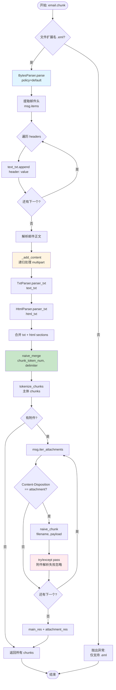
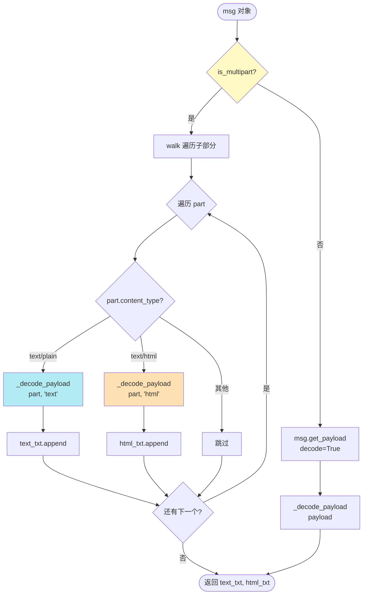
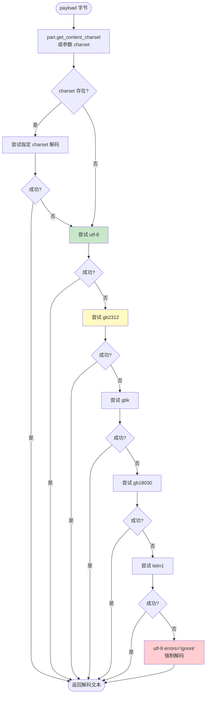
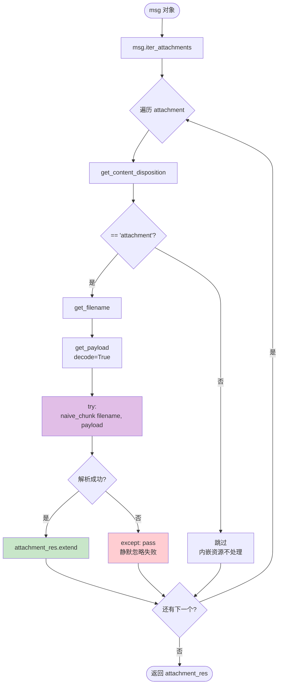
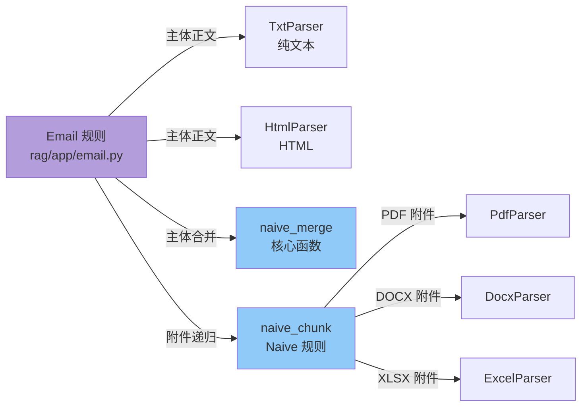

# Email 规则流程图

## 概述

**Email 规则**专门处理 `.eml` 邮件文件，提取邮件头、正文和附件。

### 核心特征

- **格式支持**: 仅支持 `.eml` 格式
- **邮件头提取**: 保留所有 header (From/To/Subject/Date 等)
- **多部分解析**: 递归处理 multipart 邮件
- **编码回退**: 7 级字符集回退链 (UTF-8 → GB 系列 → Latin1 → ignore)
- **HTML 支持**: 同时解析 text/plain 和 text/html
- **附件处理**: 递归调用 `naive_chunk` 解析附件文件
- **合并策略**: 使用 `naive_merge` 合并主体和附件

---

## 主流程图



---

## 邮件正文解析子流程 (_add_content)



---

## 编码解码子流程 (_decode_payload)



### 编码回退链

| 优先级 | 编码 | 适用场景 |
|--------|------|----------|
| 1 | `part.get_content_charset()` | 邮件声明的编码 |
| 2 | `utf-8` | 现代邮件标准 |
| 3 | `gb2312` | 简体中文老邮件 |
| 4 | `gbk` | GB2312 扩展 |
| 5 | `gb18030` | GBK 扩展 (含生僻字) |
| 6 | `latin1` | 西欧字符集 |
| 7 | `utf-8` + `errors="ignore"` | 兜底,丢弃无法解码的字节 |

**设计理念**: 中文邮件编码混乱,GB 系列由窄到宽逐级尝试。

---

## 附件处理子流程



### 附件筛选逻辑

```python
for part in msg.iter_attachments():
    # 仅处理明确标记为 attachment 的部分
    if part.get_content_disposition() != "attachment":
        continue  # 跳过 inline 内嵌图片等
    
    filename = part.get_filename()
    payload = part.get_payload(decode=True)
    
    try:
        # 递归调用 naive 规则解析附件
        attachment_res.extend(
            naive_chunk(filename, payload, callback=callback, **kwargs)
        )
    except Exception:
        pass  # 附件解析失败不影响主体
```

**关键点**:
- `Content-Disposition: inline` 的内嵌资源被跳过
- 附件解析失败使用 `try/except pass` 静默处理，保证主体内容不受影响

---

## 六、配置参数

| 参数名 | 类型 | 默认值 | 说明 |
|--------|------|--------|------|
| `chunk_token_num` | `int` | `512` | 单个 chunk 的最大 token 数 |
| `delimiter` | `str` | `DEFAULT_DELIMITER` | chunk 间分隔符，用于 `naive_merge` |
| `layout_recognize` | `str` | `"DeepDOC"` | 布局识别引擎（对邮件本体无实际影响，主要影响附件解析） |
| `from_page` / `to_page` | `int` | `0` / `MAXIMUM_PAGE_NUMBER` | 页码范围过滤（对 `.eml` 无意义，保留接口一致性） |

**说明**:
- `chunk_token_num` 同时影响 HTML 正文解析（`HtmlParser.parser_txt` 参数）和最终 `naive_merge` 的合并粒度
- 附件会递归调用 `naive_chunk`，继承同一套 `parser_config` 和 `**kwargs`

---

## 七、核心代码片段

### 主函数完整逻辑

```python
def chunk(filename, binary=None, from_page=0, to_page=MAXIMUM_PAGE_NUMBER,
          lang="Chinese", callback=None, **kwargs):
    """Only eml is supported"""
    eng = lang.lower() == "english"
    parser_config = kwargs.get("parser_config", {
        "chunk_token_num": 512,
        "delimiter": DEFAULT_DELIMITER,
        "layout_recognize": "DeepDOC",
    })
    
    doc = {
        "docnm_kwd": filename,
        "title_tks": rag_tokenizer.tokenize(re.sub(r"\.[a-zA-Z]+$", "", filename)),
    }
    doc["title_sm_tks"] = rag_tokenizer.fine_grained_tokenize(doc["title_tks"])
    
    main_res = []
    attachment_res = []
    
    # 1. 解析邮件对象
    if binary is not None:
        with io.BytesIO(binary) as buffer:
            msg = BytesParser(policy=policy.default).parse(buffer)
    else:
        with open(filename, "rb") as buffer:
            msg = BytesParser(policy=policy.default).parse(buffer)
    
    text_txt, html_txt = [], []
    
    # 2. 提取邮件头
    for header, value in msg.items():
        text_txt.append(f"{header}: {value}")
    
    # 3. 递归提取正文
    def _add_content(msg, content_type):
        def _decode_payload(payload, charset, target_list):
            try:
                target_list.append(payload.decode(charset))
            except (UnicodeDecodeError, LookupError):
                for enc in ["utf-8", "gb2312", "gbk", "gb18030", "latin1"]:
                    try:
                        target_list.append(payload.decode(enc))
                        break
                    except UnicodeDecodeError:
                        continue
                else:
                    target_list.append(payload.decode("utf-8", errors="ignore"))
        
        if content_type == "text/plain":
            payload = msg.get_payload(decode=True)
            charset = msg.get_content_charset() or "utf-8"
            _decode_payload(payload, charset, text_txt)
        elif content_type == "text/html":
            payload = msg.get_payload(decode=True)
            charset = msg.get_content_charset() or "utf-8"
            _decode_payload(payload, charset, html_txt)
        elif "multipart" in content_type:
            if msg.is_multipart():
                for part in msg.iter_parts():
                    _add_content(part, part.get_content_type())
    
    _add_content(msg, msg.get_content_type())
    
    # 4. 纯文本 + HTML 合并为 sections
    sections = TxtParser.parser_txt("\n".join(text_txt)) + [
        (line, "")
        for line in HtmlParser.parser_txt(
            "\n".join(html_txt),
            chunk_token_num=parser_config["chunk_token_num"],
        )
        if line
    ]
    
    # 5. naive_merge 合并 + tokenize
    st = timer()
    chunks = naive_merge(
        sections,
        int(parser_config.get("chunk_token_num", 128)),
        parser_config.get("delimiter", DEFAULT_DELIMITER),
    )
    main_res.extend(tokenize_chunks(chunks, doc, eng, None, language=lang))
    logging.debug("naive_merge({}): {}".format(filename, timer() - st))
    
    # 6. 附件递归解析
    for part in msg.iter_attachments():
        content_disposition = part.get("Content-Disposition")
        if content_disposition:
            dispositions = content_disposition.strip().split(";")
            if dispositions[0].lower() == "attachment":
                filename = part.get_filename()
                payload = part.get_payload(decode=True)
                try:
                    attachment_res.extend(
                        naive_chunk(filename, payload, callback=callback, **kwargs)
                    )
                except Exception:
                    pass
    
    # 7. 主体 chunk 在前，附件 chunk 在后
    return main_res + attachment_res
```

### sections 结构说明

`sections` 是 `(text, position)` 二元组列表：

| 来源 | 构造方式 | position 字段 |
|------|----------|---------------|
| 邮件头 + text/plain | `TxtParser.parser_txt("\n".join(text_txt))` | 由 `TxtParser` 内部生成 |
| text/html | `[(line, "") for line in HtmlParser.parser_txt(...) if line]` | 固定为空字符串 `""` |

**注意**: 邮件头和纯文本正文被拼接进同一个 `text_txt` 列表，因此邮件头（`From`/`To`/`Subject`/`Date` 等）与正文一起参与 `naive_merge`，第一个 chunk 通常包含完整邮件头信息，这对"这封邮件是谁发的"类问题的召回很关键。

---

## 八、输出数据结构

### 主体 chunk

```json
{
  "docnm_kwd": "季度汇报.eml",
  "title_tks": "季度 汇报",
  "title_sm_tks": "季度 汇报",
  "content_with_weight": "From: alice@example.com\nTo: bob@example.com\nSubject: Q3 季度汇报\nDate: Mon, 15 Sep 2025 10:30:00 +0800\n\n各位好，附件是本季度业绩汇总……",
  "content_ltks": "from alice example com to bob ...",
  "content_sm_ltks": "..."
}
```

### 附件 chunk

附件 chunk 由 `naive_chunk` 生成，结构与 naive 规则完全一致，`docnm_kwd` 为附件文件名而非邮件文件名：

```json
{
  "docnm_kwd": "Q3业绩表.xlsx",
  "content_with_weight": "<table><tr><td>...</td></tr></table>",
  "content_ltks": "...",
  "page_num_int": [1],
  "position_int": [[1, 0, 0, 0, 0]]
}
```

**关键差异**: 主体 chunk 没有 `page_num_int` / `position_int` 字段（`tokenize_chunks` 的 `pdf_parser` 参数传 `None`），附件 chunk 则可能带有位置信息。

---

## 九、使用示例

### 场景 1: 纯文本邮件（无附件）

**输入**: `meeting-notes.eml`
```
From: project-manager@company.com
To: team@company.com
Subject: Weekly Meeting Notes - 2025-09-15
Date: Mon, 15 Sep 2025 14:00:00 +0800

Hi Team,

1. Sprint 进展回顾
2. Q4 目标对齐
3. 阻塞项讨论

Next meeting: 2025-09-22
```

**输出**: 1 个 chunk
```json
{
  "docnm_kwd": "meeting-notes.eml",
  "content_with_weight": "From: project-manager@company.com\nTo: team@company.com\nSubject: Weekly Meeting Notes - 2025-09-15\n...\nNext meeting: 2025-09-22"
}
```

### 场景 2: HTML 邮件 + Word 附件

**输入**: `proposal.eml`
- HTML 正文 (multipart/alternative)
- 附件 `Proposal-Draft.docx`

**输出**: 2+ chunks
1. 主体 chunk（邮件头 + HTML 转纯文本）
2. 附件 chunk（通过 `naive_chunk` 解析 DOCX，可能产生多个 chunk）

**关键行为**: 如果 `Proposal-Draft.docx` 解析失败（例如损坏文件），`try/except pass` 会静默跳过，但主体 chunk 仍然正常返回。

### 场景 3: 嵌套 multipart + 内嵌图片

**输入**: `newsletter.eml`
```
multipart/mixed
  ├─ multipart/related
  │   ├─ text/html (正文)
  │   └─ image/png (Content-Disposition: inline, 内嵌图片)
  └─ application/pdf (Content-Disposition: attachment, 附件)
```

**输出**: 2 部分
- 主体 chunk（仅包含 HTML 正文，内嵌图片被跳过）
- 附件 PDF 的 chunk（通过 `naive_chunk` 解析）

**注意**: `Content-Disposition: inline` 的 `image/png` 不会出现在 `attachment_res` 中，因为 `iter_attachments()` 只遍历 `disposition == "attachment"` 的部分。

---

## 十、常见问题

### Q1: 为什么邮件头要拼进正文？

**A**: 邮件头（`From`/`To`/`Subject`/`Date`）是邮件元数据的核心组成，对于"谁发的"、"什么时候"、"主题是什么"类检索问题至关重要。将头信息与正文合并后，用户提问"Alice 上周发的邮件说了什么"时，单个 chunk 可以同时匹配 `From: alice@...` 和正文内容，提高召回率。

### Q2: 为什么附件解析失败不抛异常？

**A**: 实际场景中附件可能损坏、格式不支持、或超大导致解析超时。邮件规则的设计哲学是**主体优先**：即使附件全部失败，邮件正文仍需正常返回，避免因单个附件问题导致整封邮件无法入库。

### Q3: 如何处理 multipart/alternative（纯文本 + HTML 双版本）？

**A**: `_add_content` 递归遍历时，`text/plain` 部分追加到 `text_txt`，`text/html` 部分追加到 `html_txt`。最终 `sections = TxtParser.parser_txt(text_txt) + HtmlParser.parser_txt(html_txt)`，两者**不会冲突**——纯文本和 HTML 解析后的内容都会出现在 chunk 中（可能有内容重复，但通常 HTML 版本包含更多格式信息）。

### Q4: 7 级编码回退链为什么设计这么复杂？

**A**: 历史邮件系统编码混乱，尤其是中文邮件：
- `gb2312` 是最早的简体中文国标，但字符集较窄
- `gbk` 扩展了 `gb2312`，支持繁体和生僻字
- `gb18030` 是最全面的中文编码，向下兼容 `gbk` 和 `gb2312`
- `latin1` 是单字节编码，适配西欧语言
- `utf-8` 是现代通用编码，但老旧邮件客户端可能标记错误

回退链**由窄到宽逐级尝试**（gb2312 → gbk → gb18030），最后兜底 `utf-8(errors="ignore")`，保证任何编码的邮件都能"尽力"解析，而不是直接抛出 `UnicodeDecodeError`。

---

## 十一、与其他规则的关系



**核心依赖**:
- **主体解析**: 直接使用 `TxtParser` / `HtmlParser` + `naive_merge`（与 naive 规则共享底层合并逻辑）
- **附件解析**: 完全委托给 `naive_chunk`，支持所有 naive 规则支持的格式（PDF/DOCX/XLSX/PPT/图片/视频等）

**特殊说明**: Email 规则**没有自己的结构化解析逻辑**（不处理标题、章节、表格等），仅做字符串拼接 + 通用合并，是所有规则中**最轻量**的一个。

---

## 十二、最佳实践

### 适用场景

| 场景 | 推荐理由 |
|------|----------|
| 📧 客服邮件归档 | 邮件头（发件人/时间）与正文合并，支持"谁在什么时候问了什么"检索 |
| 📎 带附件的业务邮件 | 附件自动递归解析（合同/报表/PPT），一站式入库 |
| 🔍 企业邮件知识库 | 支持 HTML 格式邮件（营销邮件/通知邮件），内容完整保留 |

### 性能考量

- **主体解析**: `O(n)` 线性复杂度，`naive_merge` 性能稳定
- **附件解析**: 取决于附件类型和大小，大型 PDF 附件可能耗时较长（继承 `naive_chunk` 的性能特征）
- **编码回退**: 最多尝试 7 次解码，对性能影响极小（单个 payload 解码通常 < 1ms）

### 配置建议

```python
parser_config = {
    "chunk_token_num": 512,  # 邮件通常较短，512 token 已足够
    "delimiter": "\n\n",     # 段落级分隔，保持邮件自然段落结构
}
```

**避免**: 不要将 `chunk_token_num` 设置过小（< 128），否则邮件头可能被切分为多个 chunk，导致元数据字段（From/To/Subject）散落，检索召回率下降。