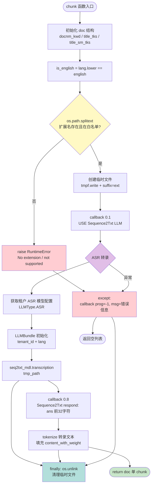
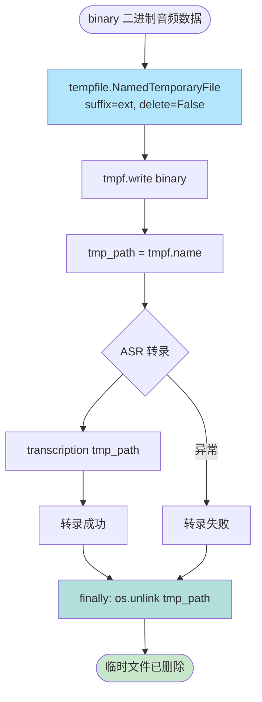
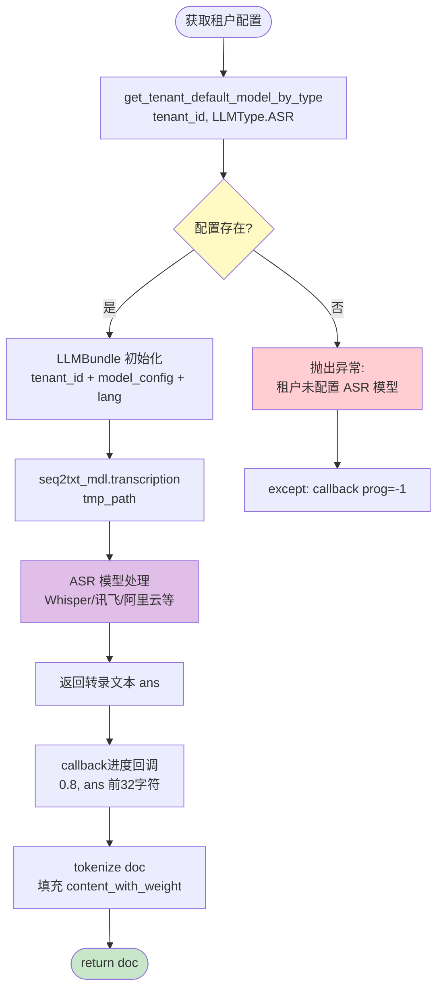
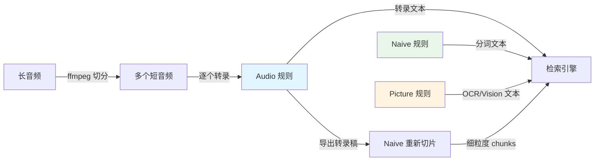

# Audio 规则流程图

## 一、概述

**Audio 规则** (`rag/app/audio.py`) 是 RAGFlow 中专门处理音频文件的切片模板，通过 **ASR (Automatic Speech Recognition) 模型** 将语音转换为文本，然后作为单个 chunk 返回。

### 核心特性

1. **15 种音频格式支持**: 从常见的 `.mp3`/`.wav` 到专业格式 `.flac`/`.aac`，以及古老格式 `.midi`/`.realaudio`
2. **临时文件机制**: 将二进制音频写入临时文件供 ASR 模型读取，处理完成后自动清理
3. **LLM ASR 集成**: 通过 `LLMBundle` 调用租户配置的 ASR 模型（如 Whisper / 讯飞听见 / 阿里巴巴 ASR）
4. **单 chunk 输出**: 无论音频多长，转录文本始终合并为一个 chunk（不做语义切分）
5. **异常上报**: ASR 转录失败时通过 `callback(prog=-1, msg=str(e))` 上报错误并返回空列表，不抛出异常中断任务
6. **无时间戳**: 转录结果不保留音频时间轴信息，纯文本输出
7. **语言自动检测**: 通过 `lang` 参数传递给 ASR 模型，支持多语言转录

---

## 二、主流程图



---

## 三、支持的音频格式

| 扩展名 | 格式全称 | 典型用途 | 备注 |
|--------|----------|----------|------|
| `.mp3` | MPEG Audio Layer 3 | 通用音频（音乐/播客/录音） | 最常见格式 |
| `.wav` | Waveform Audio File Format | 无损录音 | 文件体积大 |
| `.wave` | 同 `.wav` | 无损录音 | `.wav` 的别名 |
| `.flac` | Free Lossless Audio Codec | 无损压缩 | 发烧友首选 |
| `.aac` | Advanced Audio Coding | 高质量有损压缩 | Apple 生态常用 |
| `.ogg` | Ogg Vorbis | 开源有损压缩 | 游戏/流媒体 |
| `.da` | Digital Audio | 专业录音 | 较少见 |
| `.aiff` | Audio Interchange File Format | Apple 无损格式 | macOS 原生 |
| `.au` | Audio File | Unix 音频格式 | 古老格式 |
| `.midi` | Musical Instrument Digital Interface | 音乐符号（非波形） | **不包含语音，ASR 无效** |
| `.wma` | Windows Media Audio | Windows 专有格式 | 需相应解码器 |
| `.realaudio` | RealAudio | 流媒体音频 | 90 年代流行 |
| `.vqf` | TwinVQ | 高压缩率格式 | 已过时 |
| `.oggvorbis` | Ogg Vorbis | 同 `.ogg` | 扩展名变体 |
| `.ape` | Monkey's Audio | 无损压缩 | 中文音乐圈流行 |

**警告**: `.midi` 文件不包含实际语音波形，ASR 转录会失败或返回空结果。

---

## 四、临时文件处理流程



**关键点**:
- `delete=False`: 临时文件需要手动管理生命周期（ASR 模型需要读取文件路径）
- `suffix=ext`: 保留原始扩展名，ASR 模型可能根据扩展名选择解码器
- `os.path.abspath`: 转换为绝对路径，避免相对路径引发的 ASR 读取失败
- `finally` 块保证临时文件一定被清理，即使 ASR 转录异常

---

## 五、ASR 模型调用流程



**重要说明**:
- `LLMType.ASR` 是枚举值，对应租户配置表中的 ASR 模型类型字段
- `transcription()` 方法是 `LLMBundle` 对外统一接口，底层可能调用 OpenAI Whisper API、讯飞 WebSocket、阿里云 HTTP 接口等
- `lang` 参数影响 ASR 模型的语言模型选择（如 Whisper 的 `language` 参数）

---

## 六、核心代码片段

### 完整 chunk 函数

```python
def chunk(filename, binary, tenant_id, lang, callback=None, **kwargs):
    doc = {
        "docnm_kwd": filename,
        "title_tks": rag_tokenizer.tokenize(re.sub(r"\.[a-zA-Z]+$", "", filename))
    }
    doc["title_sm_tks"] = rag_tokenizer.fine_grained_tokenize(doc["title_tks"])
    
    is_english = lang.lower() == "english"
    tmp_path = ""
    
    try:
        # 1. 验证扩展名
        _, ext = os.path.splitext(filename)
        if not ext:
            raise RuntimeError("No extension detected.")
        
        if ext not in [".da", ".wave", ".wav", ".mp3", ".aac", ".flac",
                       ".ogg", ".aiff", ".au", ".midi", ".wma", ".realaudio",
                       ".vqf", ".oggvorbis", ".ape"]:
            raise RuntimeError(f"Extension {ext} is not supported yet.")
        
        # 2. 创建临时文件
        with tempfile.NamedTemporaryFile(suffix=ext, delete=False) as tmpf:
            tmpf.write(binary)
            tmpf.flush()
            tmp_path = os.path.abspath(tmpf.name)
        
        # 3. ASR 转录
        callback(0.1, "USE Sequence2Txt LLM to transcription the audio")
        seq2txt_model_config = get_tenant_default_model_by_type(
            tenant_id, LLMType.ASR
        )
        seq2txt_mdl = LLMBundle(tenant_id, seq2txt_model_config, lang=lang)
        ans = seq2txt_mdl.transcription(tmp_path)
        callback(0.8, "Sequence2Txt LLM respond: %s ..." % ans[:32])
        
        # 4. 文本 tokenize
        tokenize(doc, ans, is_english, language=lang)
        return [doc]
    
    except Exception as e:
        callback(prog=-1, msg=str(e))
    
    finally:
        # 5. 清理临时文件
        if tmp_path and os.path.exists(tmp_path):
            try:
                os.unlink(tmp_path)
            except Exception as e:
                logging.exception(
                    f"Failed to remove temporary file: {tmp_path}, exception: {e}"
                )
                pass
    
    return []
```

### tokenize 函数核心逻辑

```python
# 来自 rag/nlp/__init__.py
def tokenize(doc, text, is_english, language="English"):
    """将转录文本填充到 doc 结构"""
    doc["content_with_weight"] = text
    doc["content_ltks"] = rag_tokenizer.tokenize(text)
    doc["content_sm_ltks"] = rag_tokenizer.fine_grained_tokenize(
        doc["content_ltks"]
    )
```

**关键点**:
- 转录文本 `ans` 直接赋值给 `content_with_weight`，不做任何切分
- `content_ltks` 是粗粒度 token（用于向量化）
- `content_sm_ltks` 是细粒度 token（用于全文检索）

---

## 七、输出数据结构

### 单 chunk 输出

```json
{
  "docnm_kwd": "meeting-recording.mp3",
  "title_tks": "meeting recording",
  "title_sm_tks": "meet ##ing record ##ing",
  "content_with_weight": "大家好，今天的会议主要讨论三个议题：第一，Q3 季度总结；第二，Q4 目标对齐；第三，资源调配方案。首先我们回顾一下 Q3 的完成情况……",
  "content_ltks": "大家 好 今天 的 会议 主要 讨论 三个 议题 第一 q3 季度 总结 第二 q4 目标 对齐 第三 资源 调配 方案 首先 我们 回顾 一下 q3 的 完成 情况",
  "content_sm_ltks": "大家 好 今天 的 会 议 主 要 讨 论 三 个 议 题 第 一 q 3 季 度 总 结 第 二 q 4 目 标 对 齐 第 三 资 源 调 配 方 案 首 先 我 们 回 顾 一 下 q 3 的 完 成 情 况"
}
```

### 字段说明

| 字段名 | 类型 | 来源 | 说明 |
|--------|------|------|------|
| `docnm_kwd` | `str` | 函数参数 `filename` | 原始音频文件名（含扩展名） |
| `title_tks` | `str` | `rag_tokenizer.tokenize(去扩展名filename)` | 文件名分词（粗粒度） |
| `title_sm_tks` | `str` | `fine_grained_tokenize(title_tks)` | 文件名分词（细粒度） |
| `content_with_weight` | `str` | ASR 转录结果 `ans` | 完整转录文本（无时间戳） |
| `content_ltks` | `str` | `rag_tokenizer.tokenize(ans)` | 转录文本分词（粗粒度） |
| `content_sm_ltks` | `str` | `fine_grained_tokenize(content_ltks)` | 转录文本分词（细粒度） |

**缺失字段**:
- 无 `page_num_int` / `position_int`（音频没有页面概念）
- 无 `image_id` / `table_id`（音频没有多模态内容）
- 无 `timestamp` / `speaker`（ASR 转录不保留时间轴和说话人信息）

---

## 八、配置参数

Audio 规则**不读取** `parser_config`，切片行为完全由 ASR 模型决定。

| 参数 | 是否生效 | 说明 |
|------|----------|------|
| `chunk_token_num` | ❌ | 不做二次切分，转录文本整体成 1 个 chunk |
| `delimiter` | ❌ | 不做分隔符切分 |
| `layout_recognize` | ❌ | 音频无版面概念 |
| `raptor` | ✅ | 上层 RAPTOR 聚类仍可对 chunk 生效（但只有 1 个 chunk 时无意义） |
| `tenant_id` | ✅ **必需** | 用于查询该租户配置的默认 ASR 模型 |
| `lang` | ✅ | 传给 `LLMBundle`，影响 ASR 识别语言与分词策略 |

### ASR 模型选取

```python
seq2txt_model_config = get_tenant_default_model_by_type(tenant_id, LLMType.ASR)
```

- 模型来自租户在「模型提供商」中设置的 **Sequence2Txt / ASR** 默认模型
- 若租户未配置 ASR 模型，`get_tenant_default_model_by_type` 抛异常 → 被 `except` 捕获 → `callback(-1, ...)` → 返回 `[]`
- 常见可选模型：Tongyi-Qianwen `paraformer`、OpenAI `whisper-1`、Azure Speech、本地 FunASR

---

## 九、使用示例

### 示例 1：会议录音

**输入**：`Q3季度会议.mp3`（时长 45 分钟）

**处理**：
1. 扩展名 `.mp3` 在白名单内 → 通过
2. 写入临时文件 `/tmp/tmpab12cd.mp3`
3. 调用 ASR 模型转录整段音频（可能耗时数分钟）
4. 得到约 8000 字转录文本
5. tokenize 后返回 1 个 chunk

**输出**：1 个 chunk，`content_with_weight` 包含全部 8000 字

**检索效果**：命中该 chunk 时，返回的是**整场会议**的文本，上下文完整但精度较粗。

### 示例 2：播客片段

**输入**：`播客-EP12.flac`（时长 3 分钟）

**输出**：1 个 chunk，约 600 字，检索精度较好。

### 示例 3：不支持的格式

**输入**：`录音.m4a`

**处理**：
```
ext = ".m4a"  →  不在白名单
raise RuntimeError("Extension .m4a is not supported yet.")
→ callback(-1, "Extension .m4a is not supported yet.")
→ return []
```

**输出**：空列表，任务在前端显示为失败，错误信息为扩展名不支持。

> 注意：`.m4a` 是常见的 iOS 录音格式，但**不在**当前白名单中。需先转码为 `.mp3` 或 `.wav`。

---

## 十、常见问题

### Q1：为什么长音频只切成 1 个 chunk？

Audio 规则的定位是「把音频变成可检索文本」，切分职责交给上层。若需要细粒度切分，有两条路：

1. **前置切分**：用 ffmpeg 把长音频切成多个短音频文件,分别上传
2. **后置处理**：先用 Audio 规则入库，再导出转录文本，改用 Naive 规则重新切片

### Q2：为什么要用临时文件，不直接传 binary？

多数 ASR SDK（如 OpenAI Whisper API、FunASR）要求**文件路径**作为输入，不支持内存 buffer。临时文件方案兼容性最好。

### Q3：ASR 转录失败会怎样？

```python
except Exception as e:
    callback(prog=-1, msg=str(e))
```

- 任何异常都被捕获 → `callback(-1)` 通知前端失败
- 返回 `[]` 表示该文档产生 0 个 chunk
- 前端任务列表显示「失败」状态，鼠标悬停可见错误信息

常见失败原因：
- 租户未配置 ASR 模型
- 模型服务不可达（网络、配额、API key 失效）
- 音频文件损坏（如 MP3 头部缺失）
- 音频时长超过模型限制（如 Whisper API 限 25 MB）

### Q4：超长音频会不会超时？

会。ASR 转录是**同步阻塞调用**，60 分钟音频可能耗时 5-10 分钟。若超过 Quart 的请求超时（默认 30 秒），任务会中断。

**解决方案**：
- 调大 Quart 超时配置
- 或将 ASR 转录改为**异步任务**（需修改 `audio.py` 架构）

---

## 十一、最佳实践

### 模型选择

| 场景 | 推荐模型 | 理由 |
|------|----------|------|
| 中文会议录音 | 阿里云 Paraformer | 中文识别率高，支持方言 |
| 英文播客 | OpenAI Whisper | 准确率高，支持多语言 |
| 本地部署 | FunASR | 无需调用外部 API，成本低 |
| 实时性要求高 | Azure Speech | 流式转录，延迟低（但需修改代码支持流式） |

### 成本与速度权衡

| 模型 | 成本 | 速度 | 准确率 |
|------|------|------|--------|
| OpenAI Whisper API | $0.006/分钟 | ★★☆ | ★★★ |
| 阿里云 Paraformer | ¥0.018/分钟 | ★★★ | ★★★ |
| FunASR 本地 | 算力成本 | ★☆☆ | ★★☆ |

### 预处理建议

1. **降噪**：用 ffmpeg 或 Audacity 去除背景噪音
2. **格式转换**：iOS 录音的 `.m4a` 需转为 `.mp3` 或 `.wav`
3. **时长控制**：建议单个音频不超过 30 分钟，否则考虑切分

---

## 十二、与其他规则的关系



**规则互补**：
- Audio 侧重「音频 → 文本」转换
- Naive 侧重「长文本 → 多 chunk」切分
- Picture 侧重「图像/视频 → 文本」理解

**工作流建议**：
- 短音频（< 5 分钟）：直接用 Audio 规则
- 长音频（> 30 分钟）：ffmpeg 切分 → Audio 规则 → Naive 二次切分