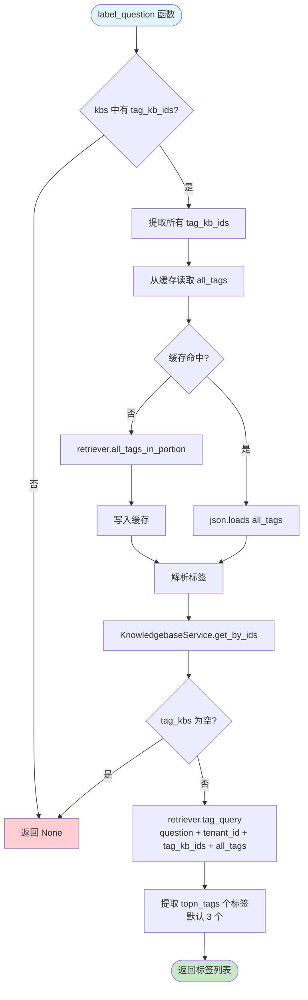
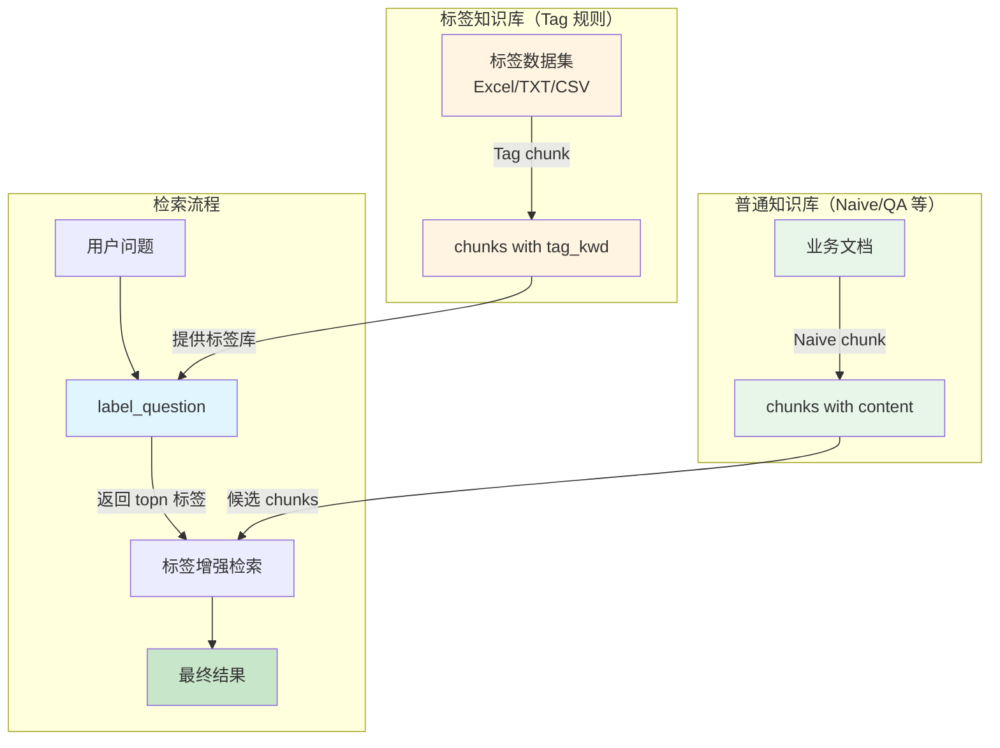

# Tag 规则流程图

## 一、规则概述

**Tag 规则**专为**标签数据集**（Tag Dataset）设计，用于将「内容-标签对」解析为可检索的 chunk。

### 核心特点

| 特性 | 说明 |
|------|------|
| **输入格式** | Excel (.xlsx/.xls)、TXT (.txt)、CSV (.csv) |
| **数据结构** | 2 列：内容列 + 标签列（无需表头） |
| **切片粒度** | **每对（content, tags）→ 1 个 chunk** |
| **标签字段** | `tag_kwd`（列表类型），支持逗号分隔多个标签 |
| **检索时增强** | `label_question()` 可在检索时根据标签知识库匹配相关标签 |
| **累积内容** | TXT/CSV 格式支持多行累积到一个内容块 |
| **进度回调** | 每 999 条记录触发一次回调 |

### 典型应用场景

1. **FAQ 知识库**：「问题」列 + 「分类标签」列（如 `财务,发票` / `技术支持,网络`）
2. **商品分类**：「商品描述」列 + 「类目标签」列（如 `电子产品,手机,华为`）
3. **文档标注**：「文档摘要」列 + 「主题标签」列（如 `机器学习,深度学习,NLP`）

---

## 二、主流程图

```mermaid
flowchart TD
    Start([chunk 函数入口]) --> CheckExt{检查文件扩展名}
    
    CheckExt -->|.xlsx / .xls| ExcelPath[Excel 路径]
    CheckExt -->|.txt| TxtPath[TXT 路径]
    CheckExt -->|.csv| CsvPath[CSV 路径]
    CheckExt -->|其他| RaiseError[抛出 NotImplementedError]
    
    ExcelPath --> ExcelParse[Excel() 解析器]
    ExcelParse --> ExcelIter{遍历所有 sheet<br/>每行返回 q, a}
    ExcelIter --> BeAdoc1[beAdoc 构建 chunk]
    BeAdoc1 --> ExcelNext{还有下一行?}
    ExcelNext -->|是| ExcelIter
    ExcelNext -->|否| Return
    
    TxtPath --> TxtRead[get_text 读取文本]
    TxtRead --> DetectDelim[检测分隔符<br/>统计 tab vs comma]
    DetectDelim --> TxtIter{逐行解析}
    TxtIter --> TxtSplit{split 分隔符}
    TxtSplit -->|len != 2| Accumulate[累积到 content]
    TxtSplit -->|len == 2| TxtBeAdoc[beAdoc 构建 chunk<br/>content += arr[0]<br/>tags = arr[1]]
    TxtBeAdoc --> TxtClearContent[清空 content]
    TxtClearContent --> TxtCallback{len(res) % 999 == 0?}
    TxtCallback -->|是| Callback1[callback 进度]
    TxtCallback -->|否| TxtNextLine
    Callback1 --> TxtNextLine{还有下一行?}
    Accumulate --> TxtNextLine
    TxtNextLine -->|是| TxtIter
    TxtNextLine -->|否| FinalCallback1[callback 0.6 最终统计]
    FinalCallback1 --> Return
    
    CsvPath --> CsvRead[get_text 读取文本]
    CsvRead --> CsvDetect[检测分隔符<br/>有 tab 用 tab 否则 comma]
    CsvDetect --> CsvReader[csv.reader 解析]
    CsvReader --> CsvIter{遍历 reader}
    CsvIter --> CsvRowClean[strip 所有字段]
    CsvRowClean --> CsvCheck{len(row) == 2?}
    CsvCheck -->|否| CsvAccum[累积到 content]
    CsvCheck -->|是| CsvBeAdoc[beAdoc 构建 chunk<br/>content += row[0]<br/>tags = row[1]]
    CsvBeAdoc --> CsvClear[清空 content]
    CsvClear --> CsvCallback{len(res) % 999 == 0?}
    CsvCallback -->|是| Callback2[callback 进度]
    CsvCallback -->|否| CsvNext
    Callback2 --> CsvNext{还有下一行?}
    CsvAccum --> CsvNext
    CsvNext -->|是| CsvIter
    CsvNext -->|否| FinalCallback2[callback 0.6 最终统计]
    FinalCallback2 --> Return
    
    Return([返回 chunk 列表])
    
    style Start fill:#e1f5ff
    style Return fill:#c8e6c9
    style RaiseError fill:#ffcdd2
    style BeAdoc1 fill:#fff9c4
    style TxtBeAdoc fill:#fff9c4
    style CsvBeAdoc fill:#fff9c4
```

---

## 三、beAdoc 函数详解

### 功能

将「内容 + 标签字符串」转换为标准 chunk 结构。

### 流程图

```mermaid
flowchart TD
    Start([beAdoc 函数]) --> SetContent[d['content_with_weight'] = q]
    SetContent --> Tokenize1[d['content_ltks'] = tokenize q]
    Tokenize1 --> Tokenize2[d['content_sm_ltks'] = fine_grained_tokenize]
    Tokenize2 --> ParseTags[解析标签字符串 a]
    ParseTags --> SplitTags[按逗号分割]
    SplitTags --> StripTags[每个标签 strip]
    StripTags --> ReplaceDot[替换 . 为 _]
    ReplaceDot --> FilterEmpty[过滤空标签]
    FilterEmpty --> SetTagKwd[d['tag_kwd'] = 标签列表]
    SetTagKwd --> CheckRowNum{row_num >= 0?}
    CheckRowNum -->|是| SetTopInt[d['top_int'] = [row_num]]
    CheckRowNum -->|否| Skip
    SetTopInt --> Return
    Skip --> Return([返回 d])
    
    style Start fill:#e1f5ff
    style Return fill:#c8e6c9
    style SetTagKwd fill:#fff9c4
```

### 代码实现

```python
def beAdoc(d, q, a, eng, row_num=-1):
    d["content_with_weight"] = q
    d["content_ltks"] = rag_tokenizer.tokenize(q)
    d["content_sm_ltks"] = rag_tokenizer.fine_grained_tokenize(d["content_ltks"])
    
    # 标签解析：逗号分割 → strip → 替换 . 为 _ → 过滤空值
    d["tag_kwd"] = [t.strip().replace(".", "_") for t in a.split(",") if t.strip()]
    
    # 可选：记录行号（用于 TXT/CSV 格式）
    if row_num >= 0:
        d["top_int"] = [row_num]
    
    return d
```

**关键点**：
- `tag_kwd` 是**列表**类型，示例：`["财务", "发票", "报销"]`
- 标签中的 `.` 被替换为 `_`（避免某些检索引擎字段名冲突）
- `row_num` 用于 TXT/CSV 格式记录原始行号，Excel 格式也传入行号（从 0 开始）

---

## 四、格式解析规则

### 4.1 Excel 格式

```python
if re.search(r"\.xlsx?$", filename, re.IGNORECASE):
    excel_parser = Excel()
    for ii, (q, a) in enumerate(excel_parser(filename, binary, callback)):
        res.append(beAdoc(deepcopy(doc), q, a, eng, ii))
    return res
```

**要求**：
1. **2 列结构**：内容列在前，标签列在后
2. **无需表头**：直接从第一行读取数据
3. **多 sheet 支持**：所有 sheet 都会被解析（只要列结构正确）

**示例**：

| 列 A（内容） | 列 B（标签） |
|--------------|--------------|
| 如何申请发票？ | 财务,发票 |
| 网络连接失败怎么办？ | 技术支持,网络 |
| 产品保修期多久？ | 售后,保修 |

→ 3 个 chunk，每个 chunk 的 `tag_kwd` 为 2 个标签的列表

### 4.2 TXT 格式

```python
elif re.search(r"\.(txt)$", filename, re.IGNORECASE):
    txt = get_text(filename, binary)
    lines = txt.split("\n")
    
    # 自动检测分隔符：统计每行 tab 和 comma 的数量
    comma, tab = 0, 0
    for line in lines:
        if len(line.split(",")) == 2: comma += 1
        if len(line.split("\t")) == 2: tab += 1
    delimiter = "\t" if tab >= comma else ","
    
    # 逐行解析
    content = ""
    i = 0
    while i < len(lines):
        arr = lines[i].split(delimiter)
        if len(arr) != 2:
            content += "\n" + lines[i]  # 累积非标准行
        elif len(arr) == 2:
            content += "\n" + arr[0]
            res.append(beAdoc(deepcopy(doc), content, arr[1], eng, i))
            content = ""  # 清空累积
        i += 1
        if len(res) % 999 == 0:
            callback(...)
```

**特点**：
1. **自动分隔符检测**：优先 TAB，其次逗号
2. **累积模式**：遇到 `len(arr) != 2` 的行会累积到 `content`，直到下一个标准行才生成 chunk
3. **UTF-8 编码要求**：`get_text()` 默认按 UTF-8 读取

**示例**（TAB 分隔）：

```
如何申请发票？	财务,发票
这是一段长文本描述，
可能跨越多行，
直到遇到下一个标签行才结束。	技术支持,网络
产品保修期多久？	售后,保修
```

→ 3 个 chunk：
- chunk 1: `content = "如何申请发票？"`, `tag_kwd = ["财务", "发票"]`
- chunk 2: `content = "这是一段长文本描述，\n可能跨越多行，\n直到遇到下一个标签行才结束。"`, `tag_kwd = ["技术支持", "网络"]`
- chunk 3: `content = "产品保修期多久？"`, `tag_kwd = ["售后", "保修"]`

### 4.3 CSV 格式

```python
elif re.search(r"\.(csv)$", filename, re.IGNORECASE):
    txt = get_text(filename, binary)
    lines = txt.split("\n")
    delimiter = "\t" if any("\t" in line for line in lines) else ","
    
    content = ""
    reader = csv.reader((line + "\n" for line in lines), delimiter=delimiter)
    prev_line_num = 0
    
    for i, row in enumerate(reader):
        raw = "\n".join(lines[prev_line_num : reader.line_num])
        prev_line_num = reader.line_num
        row = [r.strip() for r in row if r.strip()]
        if len(row) != 2:
            content += "\n" + raw
        elif len(row) == 2:
            content += "\n" + row[0]
            res.append(beAdoc(deepcopy(doc), content, row[1], eng, i))
            content = ""
        if len(res) % 999 == 0:
            callback(...)
```

**与 TXT 的区别**：
1. **使用 `csv.reader`**：正确处理引号包裹的字段（如 `"content, with comma","tag1,tag2"`）
2. **`reader.line_num` 跟踪**：处理跨行引号字段时，`reader.line_num` 会大于当前 `i`
3. **`row.strip()`**：CSV 解析后再 strip 每个字段

**示例**（CSV 带引号）：

```csv
"如何申请发票？","财务,发票"
"这是一段包含逗号的描述，
跨越多行，
带引号保护。","技术支持,网络"
产品保修期多久？,售后,保修
```

→ 3 个 chunk，处理逻辑与 TXT 类似，但引号和逗号被正确解析

---

## 五、核心函数完整代码

```python
def chunk(filename, binary=None, lang="Chinese", callback=None, **kwargs):
    """
    Excel and csv(txt) format files are supported.
    If the file is in Excel format, there should be 2 column content and tags without header.
    And content column is ahead of tags column.
    And it's O.K if it has multiple sheets as long as the columns are rightly composed.

    If it's in csv format, it should be UTF-8 encoded. Use TAB as delimiter to separate content and tags.

    All the deformed lines will be ignored.
    Every pair will be treated as a chunk.
    """
    eng = lang.lower() == "english"
    rag_tokenizer.tokenizer.set_language(lang)
    res = []
    doc = {"docnm_kwd": filename, "title_tks": rag_tokenizer.tokenize(re.sub(r"\.[a-zA-Z]+$", "", filename))}
    
    if re.search(r"\.xlsx?$", filename, re.IGNORECASE):
        callback(0.1, "Start to parse.")
        excel_parser = Excel()
        for ii, (q, a) in enumerate(excel_parser(filename, binary, callback)):
            res.append(beAdoc(deepcopy(doc), q, a, eng, ii))
        return res

    elif re.search(r"\.(txt)$", filename, re.IGNORECASE):
        callback(0.1, "Start to parse.")
        txt = get_text(filename, binary)
        lines = txt.split("\n")
        comma, tab = 0, 0
        for line in lines:
            if len(line.split(",")) == 2: comma += 1
            if len(line.split("\t")) == 2: tab += 1
        delimiter = "\t" if tab >= comma else ","

        content = ""
        i = 0
        while i < len(lines):
            arr = lines[i].split(delimiter)
            if len(arr) != 2:
                content += "\n" + lines[i]
            elif len(arr) == 2:
                content += "\n" + arr[0]
                res.append(beAdoc(deepcopy(doc), content, arr[1], eng, i))
                content = ""
            i += 1
            if len(res) % 999 == 0:
                callback(len(res) * 0.6 / len(lines), 
                         f"Extract TAG: {len(res)}")

        callback(0.6, f"Extract TAG: {len(res)}")
        return res

    elif re.search(r"\.(csv)$", filename, re.IGNORECASE):
        callback(0.1, "Start to parse.")
        txt = get_text(filename, binary)
        lines = txt.split("\n")
        delimiter = "\t" if any("\t" in line for line in lines) else ","

        content = ""
        res = []
        reader = csv.reader((line + "\n" for line in lines), delimiter=delimiter)
        prev_line_num = 0

        for i, row in enumerate(reader):
            raw = "\n".join(lines[prev_line_num : reader.line_num])
            prev_line_num = reader.line_num
            row = [r.strip() for r in row if r.strip()]
            if len(row) != 2:
                content += "\n" + raw
            elif len(row) == 2:
                content += "\n" + row[0]
                res.append(beAdoc(deepcopy(doc), content, row[1], eng, i))
                content = ""
            if len(res) % 999 == 0:
                callback(len(res) * 0.6 / len(lines), 
                         f"Extract Tags: {len(res)}")

        callback(0.6, f"Extract TAG : {len(res)}")
        return res

    raise NotImplementedError("Excel, csv(txt) format files are supported.")
```

---

## 六、输出数据结构

### 单 chunk 示例

```json
{
  "docnm_kwd": "faq-dataset.xlsx",
  "title_tks": "faq dataset",
  "content_with_weight": "如何申请发票？",
  "content_ltks": "如何 申请 发票",
  "content_sm_ltks": "如 何 申 请 发 票",
  "tag_kwd": ["财务", "发票"],
  "top_int": [0]
}
```

### 字段说明

| 字段名 | 类型 | 来源 | 说明 |
|--------|------|------|------|
| `docnm_kwd` | `str` | 函数参数 `filename` | 原始文件名（含扩展名） |
| `title_tks` | `str` | `rag_tokenizer.tokenize(去扩展名filename)` | 文件名分词（粗粒度） |
| `content_with_weight` | `str` | 参数 `q`（内容列） | 用户提供的内容文本（可能跨行累积） |
| `content_ltks` | `str` | `rag_tokenizer.tokenize(q)` | 内容分词（粗粒度） |
| `content_sm_ltks` | `str` | `fine_grained_tokenize(content_ltks)` | 内容分词（细粒度） |
| `tag_kwd` | `List[str]` | 参数 `a`（标签列） | **标签列表**，逗号分割，`.` 替换为 `_` |
| `top_int` | `List[int]` | 可选，TXT/CSV 行号 | 记录原始行号（Excel 也记录，从 0 开始） |

**关键差异**：
- `tag_kwd` 是**列表**类型，不同于其他规则的字符串字段
- 检索时可通过标签精确匹配或模糊匹配

---

## 七、label_question 检索时增强

### 功能

在**检索阶段**，根据用户问题从标签知识库中匹配相关标签，用于过滤或加权。

### 流程图



### 代码实现

```python
def label_question(question, kbs):
    from api.db.services.knowledgebase_service import KnowledgebaseService
    from rag.graphrag.utils import get_tags_from_cache, set_tags_to_cache

    tags = None
    tag_kb_ids = []
    for kb in kbs:
        if kb.parser_config.get("tag_kb_ids"):
            tag_kb_ids.extend(kb.parser_config["tag_kb_ids"])
    
    if tag_kb_ids:
        all_tags = get_tags_from_cache(tag_kb_ids)
        if not all_tags:
            all_tags = settings.retriever.all_tags_in_portion(kb.tenant_id, tag_kb_ids)
            set_tags_to_cache(tags=all_tags, kb_ids=tag_kb_ids)
        else:
            all_tags = json.loads(all_tags)
        
        tag_kbs = KnowledgebaseService.get_by_ids(tag_kb_ids)
        if not tag_kbs:
            return tags
        
        tags = settings.retriever.tag_query(
            question, 
            list(set([kb.tenant_id for kb in tag_kbs])), 
            tag_kb_ids, 
            all_tags, 
            kb.parser_config.get("topn_tags", 3)
        )
    return tags
```

### 使用场景

假设知识库 A 配置了 `tag_kb_ids = [kb_tag_1, kb_tag_2]`：

1. 用户问题：「如何申请发票？」
2. 调用 `label_question(question, [kb_A])` → 返回 `["财务", "发票", "报销"]`（top 3）
3. 检索时优先匹配 `tag_kwd` 包含这些标签的 chunk
4. 或在 rerank 阶段给含这些标签的 chunk 加权

**配置路径**：
- 知识库设置 → 解析配置 → `tag_kb_ids`（关联的标签知识库 ID 列表）
- `topn_tags`（默认 3）：每次查询返回的标签数量

---

## 八、配置参数

Tag 规则**不读取** `chunk_token_num` / `delimiter` 等通用切片参数，行为完全由文件格式决定。

| 参数 | 是否生效 | 说明 |
|------|----------|------|
| `chunk_token_num` | ❌ | 每对（content, tags）固定为 1 个 chunk |
| `delimiter` | ❌ | 分隔符由文件格式决定（Excel 无需分隔符，TXT/CSV 自动检测） |
| `layout_recognize` | ❌ | 无版面概念 |
| `raptor` | ✅ | 上层 RAPTOR 聚类可对生成的 chunk 生效 |
| `tag_kb_ids` | ✅ | 关联的标签知识库 ID 列表（用于检索时增强） |
| `topn_tags` | ✅ | `label_question` 返回的标签数量，默认 3 |
| `lang` | ✅ | 影响分词策略（English / Chinese） |

---

## 九、使用示例

### 示例 1：FAQ 知识库（Excel）

**输入文件**：`customer-faq.xlsx`

| 内容 | 标签 |
|------|------|
| 如何修改密码？ | 账户,安全 |
| 忘记密码怎么办？ | 账户,密码重置 |
| 如何绑定手机号？ | 账户,绑定 |
| 产品支持哪些支付方式？ | 支付,方式 |

**处理**：
1. Excel() 解析器读取 4 行
2. 每行调用 beAdoc 生成 1 个 chunk
3. 共 4 个 chunk

**输出**：
- chunk 1: `tag_kwd = ["账户", "安全"]`
- chunk 2: `tag_kwd = ["账户", "密码重置"]`
- chunk 3: `tag_kwd = ["账户", "绑定"]`
- chunk 4: `tag_kwd = ["支付", "方式"]`

**检索场景**：
- 用户问「如何找回密码？」 → 匹配到 chunk 2（标签：`密码重置`）
- 配置 `tag_kb_ids` 后，`label_question` 可自动返回 `["账户", "密码重置"]`，进一步提升召回

### 示例 2：商品分类（TXT 累积模式）

**输入文件**：`products.txt`（TAB 分隔）

```
iPhone 15 Pro Max
128GB 存储
钛合金边框	电子产品,手机,苹果
小米 14 Ultra
骁龙 8 Gen 3	电子产品,手机,小米
```

**处理**：
1. 第 1 行 split("\t") → len=1 → 累积到 content
2. 第 2 行 split("\t") → len=1 → 继续累积
3. 第 3 行 split("\t") → len=2 → 生成 chunk 1，清空 content
4. 第 4-5 行同理 → 生成 chunk 2

**输出**：
- chunk 1: `content = "iPhone 15 Pro Max\n128GB 存储\n钛合金边框"`, `tag_kwd = ["电子产品", "手机", "苹果"]`
- chunk 2: `content = "小米 14 Ultra\n骁龙 8 Gen 3"`, `tag_kwd = ["电子产品", "手机", "小米"]`

### 示例 3：不支持的格式

**输入**：`tags.json`

**处理**：
```
所有 if/elif 分支都不匹配
→ raise NotImplementedError("Excel, csv(txt) format files are supported.")
```

**输出**：抛出异常，任务失败。Tag 规则仅支持 Excel / TXT / CSV 三种格式。

---

## 十、常见问题

### Q1：标签中能包含逗号吗？

不能。`beAdoc` 用逗号分割标签字符串：

```python
d["tag_kwd"] = [t.strip().replace(".", "_") for t in a.split(",") if t.strip()]
```

若标签本身含逗号（如 `"A, B"`），会被拆分为两个标签。建议用其他字符（如 `-` 或 `_`）替代。

### Q2：为什么标签中的 `.` 会被替换为 `_`？

某些检索引擎（如 Elasticsearch）的字段名或聚合路径不允许 `.`，替换为 `_` 避免冲突。

示例：标签 `v1.2.3` → `v1_2_3`

### Q3：TXT 和 CSV 有什么区别？

| 维度 | TXT | CSV |
|------|-----|-----|
| 解析方式 | 简单 `split(delimiter)` | `csv.reader`（标准 CSV 解析） |
| 引号支持 | ❌ 不支持 | ✅ 支持 `"..."` 包裹 |
| 跨行字段 | ❌ 不支持 | ✅ 支持（引号内换行） |
| 分隔符检测 | 统计 TAB vs 逗号数量 | 只要有 TAB 就用 TAB |
| 性能 | 略快 | 略慢（正则解析开销） |

**推荐**：
- 内容简单、无逗号/引号 → TXT
- 内容含逗号、引号、换行 → CSV

### Q4：累积模式（多行合并）会不会导致数据错乱？

会。累积模式的逻辑是「遇到 len==2 的行才生成 chunk」，若数据格式不规范：

```
问题一	标签A
这是一段说明
问题二	标签B
```

第 2 行「这是一段说明」会被累积，与「问题二」合并成一个 chunk：
- chunk 1: `content = "问题一"`, `tag = ["标签A"]`
- chunk 2: `content = "这是一段说明\n问题二"`, `tag = ["标签B"]` ← 数据错乱

**规避方案**：确保每行都严格是「内容 + 分隔符 + 标签」格式，或改用 Excel 格式（按单元格解析，不存在累积歧义）。

### Q5：Excel 多 sheet 会怎么处理？

`Excel()` 解析器（复用 `rag/app/qa.py` 中的实现）会**遍历所有 sheet**，只要每个 sheet 都是 2 列结构就能正确解析。所有 sheet 的数据合并为一个 chunk 列表，`row_num` 全局连续递增。

### Q6：标签知识库和普通知识库有什么区别？

| 维度 | 标签知识库 | 普通知识库 |
|------|------------|------------|
| 切片规则 | **Tag** | Naive / Paper / QA 等 |
| 主要字段 | `tag_kwd`（标签列表） | `content_with_weight`（正文） |
| 用途 | 提供「问题 → 标签」映射 | 提供检索答案 |
| 检索时角色 | 被 `label_question` 查询 | 被用户问题直接检索 |
| 配置关联 | 被普通知识库的 `tag_kb_ids` 引用 | 引用标签知识库 |

**工作流**：
1. 建立标签知识库 A（用 Tag 规则上传标签数据集）
2. 在普通知识库 B 的设置中配置 `tag_kb_ids = [A.id]`
3. 用户检索 B 时，系统先调 `label_question` 从 A 查标签，再用标签增强 B 的检索

---

## 十一、最佳实践

### 数据准备

1. **格式统一**：优先用 Excel（无累积歧义），2 列结构，无表头
2. **标签规范**：
   - 使用统一的标签体系（如三级分类：`一级,二级,三级`）
   - 标签数量控制在 2-5 个（过多会稀释权重）
   - 避免标签中含逗号、句点
3. **内容质量**：内容列应包含用户可能的提问方式，便于向量匹配

### 标签体系设计

```
好的标签设计：
财务,发票,报销      ← 层级清晰
技术支持,网络,VPN   ← 领域明确

不好的标签设计：
其他,杂项           ← 过于笼统
问题,咨询,请求      ← 无区分度
财务问题,发票问题   ← 冗余后缀
```

### 检索优化

1. **`topn_tags` 调优**：
   - 默认 3，适合大多数场景
   - 标签体系细粒度（100+ 标签）→ 调大到 5-8
   - 标签体系粗粒度（< 20 标签）→ 保持 3 或调小到 2

2. **多标签知识库**：可配置多个 `tag_kb_ids`，标签会合并去重

3. **缓存机制**：`get_tags_from_cache` / `set_tags_to_cache` 会缓存全量标签，减少数据库查询。标签数据集更新后需清理缓存。

---

## 十二、与其他规则的关系



**与 QA 规则的对比**：

| 维度 | Tag 规则 | QA 规则 |
|------|----------|---------|
| 输入 | 内容 + 标签（2 列） | 问题 + 答案（2 列） |
| 核心字段 | `tag_kwd`（列表） | `content_with_weight`（问答对合并） |
| 用途 | 检索时标签增强 | 直接返回答案 |
| 复用代码 | `from rag.app.qa import Excel` | 自带 Excel 解析器 |

Tag 规则**复用**了 QA 规则的 `Excel` 解析器（`from rag.app.qa import Excel`），两者的 Excel 解析逻辑完全一致，差异只在 `beAdoc` 的字段填充方式。
