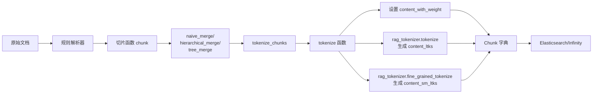

# RAGFlow Chunk 输出数据结构说明

## 概述

RAGFlow 的 14 个 chunk 规则（naive、paper、book、qa、table、resume、manual、laws、presentation、one、picture、audio、email、tag）**最终输出的数据结构基本一致**，都遵循统一的 chunk 字典格式，便于后续的向量化、索引和检索。

### 核心特征

- **统一接口**: 所有规则返回 `List[Dict]`，每个 Dict 是一个 chunk
- **必需字段**: `docnm_kwd`、`content_with_weight`、`content_ltks`、`content_sm_ltks` 是所有规则共有的
- **可选字段**: 不同规则根据场景添加特定字段（如 `image`、`tag_kwd`、`position_int` 等）
- **存储映射**: 字段设计与 Elasticsearch/Infinity 的索引 schema 对应（参考 `conf/infinity_mapping.json`）

---

## 通用数据结构

### 基础 Chunk 格式

```python
chunk = {
    # === 必需字段 ===
    "docnm_kwd": str,              # 文档文件名
    "title_tks": List[str],        # 标题分词结果
    "content_with_weight": str,    # chunk 文本内容（原始文本）
    "content_ltks": str,           # 粗粒度分词结果（空格分隔的 token 串）
    "content_sm_ltks": str,        # 细粒度分词结果（更细的分词）
    
    # === 位置信息（PDF/DOCX） ===
    "page_num_int": List[int],     # 页码列表（从0开始）
    "top_int": List[int],          # 顶部位置坐标列表
    "position_int": List[List[int]], # 完整位置信息: [[page, left, right, top, bottom], ...]
    
    # === 多媒体字段 ===
    "image": Any,                  # 图片数据（PIL.Image 或 base64）
    "doc_type_kwd": str,           # 文档类型: "text"/"table"/"image"
    
    # === 特殊规则字段 ===
    "tag_kwd": List[str],          # 标签列表（tag 规则）
    "toc_kwd": List[str],          # 目录层级（book/paper/manual/laws 规则）
    "raptor_kwd": str,             # RAPTOR 聚类标识（raptor=True 时）
    "raptor_layer_int": int,       # RAPTOR 层级（0=叶子节点）
    
    # === 层级关系字段 ===
    "mom_with_weight": str,        # 父 chunk 内容（hierarchical_merge 时）
    
    # === 元数据 ===
    "chunk_order_int": int,        # chunk 在文档中的顺序号
}
```

---

## 字段详细说明

### 1. 核心内容字段

#### content_with_weight
- **类型**: `str`
- **说明**: chunk 的原始文本内容，是检索和展示的主要字段
- **生成**: 由 `tokenize()` 函数设置
- **示例**:
  ```python
  "content_with_weight": "RAGFlow 是一个基于深度文档理解的 RAG 引擎..."
  ```

#### content_ltks
- **类型**: `str`
- **说明**: 粗粒度分词结果，空格分隔的 token 串，用于全文检索
- **生成**: `rag_tokenizer.tokenize()` 后的结果
- **示例**:
  ```python
  "content_ltks": "ragflow 基于 深度 文档 理解 rag 引擎"
  ```

#### content_sm_ltks
- **类型**: `str`
- **说明**: 细粒度分词结果，更细的分词粒度，提升召回率
- **生成**: `rag_tokenizer.fine_grained_tokenize()` 
- **示例**:
  ```python
  "content_sm_ltks": "rag flow 基 于 深 度 文 档 理 解"
  ```

### 2. 位置信息字段

#### page_num_int
- **类型**: `List[int]`
- **说明**: chunk 所在的页码列表（从 0 开始）
- **生成**: `add_positions()` 函数从 position_int 提取
- **示例**:
  ```python
  "page_num_int": [3, 4]  # chunk 跨越第 4、5 页
  ```

#### top_int
- **类型**: `List[int]`
- **说明**: chunk 在页面中的顶部 Y 坐标列表
- **生成**: `add_positions()` 函数提取
- **用途**: 用于前端定位和高亮显示

#### position_int
- **类型**: `List[List[int]]`
- **说明**: 完整的位置信息，每个元素是 `[page, left, right, top, bottom]`
- **生成**: `add_positions()` 函数设置
- **示例**:
  ```python
  "position_int": [
      [3, 100, 500, 200, 250],  # 第4页，左100右500，顶200底250
      [4, 100, 500, 50, 100]    # 第5页，左100右500，顶50底100
  ]
  ```

### 3. 文档元数据字段

#### docnm_kwd
- **类型**: `str`
- **说明**: 文档文件名（不含路径）
- **生成**: 从 `filename` 参数获取
- **示例**: `"docnm_kwd": "用户手册.pdf"`

#### title_tks
- **类型**: `List[str]`
- **说明**: 文档标题的分词结果
- **生成**: `rag_tokenizer.tokenize(filename)` （去除扩展名）
- **用途**: 文档级别的检索匹配

### 4. 多媒体字段

#### image
- **类型**: `Any`（PIL.Image / base64 str / bytes）
- **说明**: chunk 关联的图片数据
- **生成规则**:
  - **picture 规则**: OCR 识别的原始图片
  - **table 规则**: 表格渲染的图片（从 `tokenize_table` 的 `img` 参数）
  - **one 规则**: PDF 页面截图（从 `pdf_parser.crop()` 提取）
- **示例**:
  ```python
  "image": <PIL.Image.Image object>
  ```

#### doc_type_kwd
- **类型**: `str`
- **说明**: chunk 的文档类型标识
- **可选值**:
  - `"text"`: 纯文本 chunk（默认不设置此字段）
  - `"table"`: 表格 chunk
  - `"image"`: 图片 chunk
- **生成**: 特定规则显式设置（table、picture、one）
- **用途**: 检索时按类型过滤

### 5. 特殊规则字段

#### tag_kwd
- **类型**: `List[str]`
- **说明**: 标签关键词列表
- **使用规则**: **tag 规则**专用
- **生成**: `beAdoc()` 函数从答案列拆分，`.` 替换为 `_`
- **示例**:
  ```python
  "tag_kwd": ["产品分类", "电子产品", "手机_配件"]
  ```

#### toc_kwd
- **类型**: `List[str]`
- **说明**: 目录层级路径（Table of Contents）
- **使用规则**: **book、paper、manual、laws** 规则
- **生成**: `hierarchical_merge()` 或 `tree_merge()` 中构建章节树时设置
- **示例**:
  ```python
  "toc_kwd": ["第一章 引言", "1.1 背景介绍"]
  ```

#### raptor_kwd 和 raptor_layer_int
- **类型**: `str` 和 `int`
- **说明**: RAPTOR 递归聚类的标识和层级
- **使用规则**: 所有规则都支持（`parser_config.raptor=True` 时）
- **生成**: `hierarchical_merge()` 的 raptor 路径
- **示例**:
  ```python
  "raptor_kwd": "doc123_cluster5",
  "raptor_layer_int": 1  # 0=叶子节点, 1/2/...=聚类层
  ```

#### mom_with_weight
- **类型**: `str`
- **说明**: 父 chunk 的内容（用于层级切片）
- **使用规则**: `hierarchical_merge()` 和 `child_delimiters_pattern` 时生成
- **用途**: 提供上下文信息，保持父子关系
- **示例**:
  ```python
  "mom_with_weight": "第一章 引言\n本章介绍项目背景和目标..."
  ```

#### authors_tks 和 authors_sm_tks
- **类型**: `str`
- **说明**: 作者的粗/细粒度分词结果
- **使用规则**: **paper 规则**专用
- **生成**: 从论文元数据提取作者信息后分词
- **示例**:
  ```python
  "authors_tks": "zhang san li si",
  "authors_sm_tks": "zhang san li si"
  ```

---

## 不同规则的字段差异对比

| 字段名 | naive | paper | book | qa | table | resume | manual | laws | presentation | one | picture | audio | email | tag |
|--------|-------|-------|------|----|----|--------|--------|------|--------------|-----|---------|-------|-------|-----|
| `docnm_kwd` | ✅ | ✅ | ✅ | ✅ | ✅ | ✅ | ✅ | ✅ | ✅ | ✅ | ✅ | ✅ | ✅ | ✅ |
| `content_with_weight` | ✅ | ✅ | ✅ | ✅ | ✅ | ✅ | ✅ | ✅ | ✅ | ✅ | ✅ | ✅ | ✅ | ✅ |
| `content_ltks` | ✅ | ✅ | ✅ | ✅ | ✅ | ✅ | ✅ | ✅ | ✅ | ✅ | ✅ | ✅ | ✅ | ✅ |
| `content_sm_ltks` | ✅ | ✅ | ✅ | ✅ | ✅ | ✅ | ✅ | ✅ | ✅ | ✅ | ✅ | ✅ | ✅ | ✅ |
| `position_int` | ✅ | ✅ | ✅ | ✅ | ✅ | ✅ | ✅ | ✅ | ✅ | ✅ | ✅ | ❌ | ✅ | ❌ |
| `page_num_int` | ✅ | ✅ | ✅ | ✅ | ✅ | ✅ | ✅ | ✅ | ✅ | ✅ | ✅ | ❌ | ✅ | ❌ |
| `top_int` | ✅ | ✅ | ✅ | ✅ | ✅ | ✅ | ✅ | ✅ | ✅ | ✅ | ✅ | ❌ | ✅ | ⚠️ |
| `image` | ⚠️ | ⚠️ | ⚠️ | ❌ | ✅ | ⚠️ | ⚠️ | ⚠️ | ⚠️ | ✅ | ✅ | ❌ | ⚠️ | ❌ |
| `doc_type_kwd` | ⚠️ | ⚠️ | ⚠️ | ❌ | ✅ | ⚠️ | ⚠️ | ⚠️ | ⚠️ | ⚠️ | ✅ | ❌ | ⚠️ | ❌ |
| `toc_kwd` | ❌ | ✅ | ✅ | ❌ | ❌ | ❌ | ✅ | ✅ | ❌ | ❌ | ❌ | ❌ | ❌ | ❌ |
| `tag_kwd` | ❌ | ❌ | ❌ | ❌ | ❌ | ❌ | ❌ | ❌ | ❌ | ❌ | ❌ | ❌ | ❌ | ✅ |
| `authors_tks` | ❌ | ✅ | ❌ | ❌ | ❌ | ❌ | ❌ | ❌ | ❌ | ❌ | ❌ | ❌ | ❌ | ❌ |
| `mom_with_weight` | ⚠️ | ⚠️ | ⚠️ | ❌ | ❌ | ⚠️ | ⚠️ | ⚠️ | ⚠️ | ⚠️ | ⚠️ | ❌ | ⚠️ | ❌ |
| `raptor_kwd` | ⚠️ | ⚠️ | ⚠️ | ⚠️ | ⚠️ | ⚠️ | ⚠️ | ⚠️ | ⚠️ | ⚠️ | ⚠️ | ❌ | ⚠️ | ❌ |

**图例**:
- ✅ 必定存在
- ⚠️ 条件存在（依赖 parser_config 或解析器能力）
- ❌ 不存在

---

## 完整数据示例

### 重要说明：返回格式

所有 chunk 规则都返回 **`List[Dict]`** 格式，即 chunk 字典的列表：

```python
# 单个文档切片后的完整返回结果
chunks = [
    {chunk1_dict},  # 第一个 chunk
    {chunk2_dict},  # 第二个 chunk
    {chunk3_dict},  # 第三个 chunk
    # ... 更多 chunks
]
```

### 示例 0: 多条数据的完整结构（Naive 规则）

```python
# 一个 3 页 PDF 被切分为 3 个 chunks 的完整输出
chunks = [
    {
        "docnm_kwd": "产品说明书.pdf",
        "title_tks": ["产品", "说明书"],
        "content_with_weight": "第一章 产品概述\n\n本产品是一款智能手机，配备6.5英寸OLED屏幕...",
        "content_ltks": "第 一 章 产品 概述 本 产品 智能 手机 配备 oled 屏幕",
        "content_sm_ltks": "第 一 章 产 品 概 述 本 产 品 智 能 手 机 配 备 o l e d 屏 幕",
        "page_num_int": [0],
        "top_int": [100],
        "position_int": [[0, 80, 520, 100, 350]],
        "chunk_order_int": 0
    },
    {
        "docnm_kwd": "产品说明书.pdf",
        "title_tks": ["产品", "说明书"],
        "content_with_weight": "第二章 技术参数\n\n处理器：骁龙8 Gen2\n内存：12GB LPDDR5\n存储：256GB UFS 3.1...",
        "content_ltks": "第 二 章 技术 参数 处理器 骁龙 内存 存储",
        "content_sm_ltks": "第 二 章 技 术 参 数 处 理 器 骁 龙 内 存 存 储",
        "page_num_int": [1],
        "top_int": [100],
        "position_int": [[1, 80, 520, 100, 400]],
        "chunk_order_int": 1
    },
    {
        "docnm_kwd": "产品说明书.pdf",
        "title_tks": ["产品", "说明书"],
        "content_with_weight": "第三章 使用说明\n\n开机：长按电源键3秒\n充电：使用原装65W充电器...",
        "content_ltks": "第 三 章 使用 说明 开机 长按 电源 键 充电 使用 原装 充电器",
        "content_sm_ltks": "第 三 章 使 用 说 明 开 机 长 按 电 源 键 充 电 使 用 原 装 充 电 器",
        "page_num_int": [2],
        "top_int": [100],
        "position_int": [[2, 80, 520, 100, 380]],
        "chunk_order_int": 2
    }
]

# 调用方式示例
from rag.app.naive import chunk

result = chunk(
    filename="产品说明书.pdf",
    binary=pdf_content,
    lang="Chinese",
    callback=None,
    **parser_config
)
# result 就是上面的 chunks 列表
print(f{

### 示例 2: Paper 规则输出（学术论文）

```python
{
    "docnm_kwd": "深度学习综述.pdf",
    "title_tks": ["深度", "学习", "综述"],
    "content_with_weight": "3.2 卷积神经网络\n\n卷积神经网络（CNN）通过卷积层提取局部特征...",
    "content_ltks": "卷积 神经 网络 cnn 通过 卷积 层 提取 局部 特征",
    "content_sm_ltks": "卷 积 神 经 网 络 c n n 通 过 卷 积 层 提 取 局 部 特 征",
    "toc_kwd": ["3. 神经网络模型", "3.2 卷积神经网络"],
    "authors_tks": "zhang wei li ming",
    "authors_sm_tks": "zhang wei li ming",
    "page_num_int": [5],
    "top_int": [200],
    "position_int": [[5, 100, 500, 200, 280]]
}
```

### 示例 3: Table 规则输出（表格数据）

```python
{
    "docnm_kwd": "财务报表.xlsx",
    "title_tks": ["财务", "报表"],
    "content_with_weight": "序号: 1; 产品名称: 智能手机; 销量: 1500; 收入: 4500000",
    "content_ltks": "序号 产品 名称 智能 手机 销量 收入",
    "content_sm_ltks": "序 号 产 品 名 称 智 能 手 机 销 量 收 入",
    "doc_type_kwd": "table",
    "image": "<base64 encoded table image>",
    "page_num_int": [0],
    "top_int": [1],
    "position_int": [[0, 0, 0, 1, 1]]
}
```

### 示例 4: Picture 规则输出（图片识别）

```python
{
    "docnm_kwd": "架构图.png",
    "title_tks": ["架构", "图"],
    "content_with_weight": "系统架构图\n前端层 -> API网关 -> 业务层 -> 数据层",
    "content_ltks": "系统 架构 图 前端 层 api 网关 业务 层 数据 层",
    "content_sm_ltks": "系 统 架 构 图 前 端 层 a p i 网 关 业 务 层 数 据 层",
    "doc_type_kwd": "image",
    "image": <PIL.Image.Image object>,
    "page_num_int": [0],
    "top_int": [0],
    "position_int": [[0, 0, 0, 0, 0]]
}
```

### 示例 5: Audio 规则输出（音频转录）

```python
{
    "docnm_kwd": "会议录音.mp3",
    "title_tks": ["会议", "录音"],
    "content_with_weight": "大家好，今天我们讨论第三季度的销售情况。根据最新数据显示...",
    "content_ltks": "大家 好 今天 讨论 第三 季度 销售 情况 根据 最新 数据 显示",
    "content_sm_ltks": "大 家 好 今 天 讨 论 第 三 季 度 销 售 情 况 根 据 最 新 数 据 显 示"
    # 注意: audio 规则不生成 position_int/page_num_int/top_int
}
```

### 示例 6: Tag 规则输出（标签知识库）

```python
{
    "docnm_kwd": "产品FAQ.xlsx",
    "title_tks": ["产品", "faq"],
    "content_with_weight": "如何重置手机密码?",
    "content_ltks": "如何 重置 手机 密码",
    "content_sm_ltks": "如 何 重 置 手 机 密 码",
    "tag_kwd": ["手机操作", "密码管理", "常见问题"],
    "top_int": [3]
    # 注意: tag 规则使用 top_int 记录 Excel 行号，不生成 position_int
}
```

---

## 数据流转过程

### 1. 文本切片 → 分词 → 索引



### 2. 关键函数调用链

#### tokenize() 函数
```python
def tokenize(d, txt, eng, language="English"):
    """核心分词函数，设置三个关键字段"""
    from . import rag_tokenizer
    
    rag_tokenizer.tokenizer.set_language(language)
    d["content_with_weight"] = txt  # 原始文本
    
    # 去除 HTML 表格标签后分词
    t = re.sub(r"</?(table|td|caption|tr|th)( [^<>]{0,12})?>", " ", txt)
    d["content_ltks"] = rag_tokenizer.tokenize(t)
    d["content_sm_ltks"] = rag_tokenizer.fine_grained_tokenize(d["content_ltks"])
```

#### add_positions() 函数
```python
def add_positions(d, poss):
    """添加位置信息，生成 position_int/page_num_int/top_int"""
    if not poss:
        return
    
    d["position_int"] = [[int(p) if p is not None else 0 for p in pos] for pos in poss]
    d["page_num_int"] = [pos[0] for pos in poss if pos and pos[0] is not None]
    d["top_int"] = [pos[3] for pos in poss if pos and len(pos) > 3 and pos[3] is not None]
```

## 核心函数实现

### tokenize_chunks() - 批量分词
```python
def tokenize_chunks(chunks, doc, eng, pdf_parser=None, child_delimiters_pattern=None, language="English"):
    """批量处理 chunks，为每个 chunk 添加分词和位置信息"""
    res = []
    for ii, ck in enumerate(chunks):
        if len(ck.strip()) == 0:
            continue
        
        d = copy.deepcopy(doc)
        
        # 处理 PDF 位置和图片
        if pdf_parser:
            try:
                d["image"], poss = pdf_parser.crop(ck, need_position=True)
                add_positions(d, poss)
                ck = pdf_parser.remove_tag(ck)
            except NotImplementedError:
                pass
        else:
            add_positions(d, [[ii] * 5])
        
        # 处理层级切片（hierarchical merge）
        if child_delimiters_pattern:
            d["mom_with_weight"] = ck.removeprefix("\n")
            res.extend(split_with_pattern(d, child_delimiters_pattern, ck, eng, language=language))
            continue
        
        tokenize(d, ck, eng, language=language)
        res.append(d)
    
    return res
```

### tokenize_table() - 表格专用分词
```python
def tokenize_table(tbls, doc, eng, pdf_parser=None, language="English"):
    """处理表格数据，生成带图片的 chunk"""
    res = []
    for ii, (rows, img) in enumerate(tbls):
        d = copy.deepcopy(doc)
        d["doc_type_kwd"] = "table"
        d["image"] = img
        
        # 将表格转为文本（键值对格式）
        txt = "\n".join("; ".join([f"{k}: {v}" for k, v in r.items()]) for r in rows)
        
        # 添加位置信息
        if pdf_parser:
            add_positions(d, [[ii, 0, 0, ii, ii]])
        else:
            add_positions(d, [[ii, 0, 0, ii, ii]])
        
        tokenize(d, txt, eng, language=language)
        res.append(d)
    
    return res
```

---

## Elasticsearch/Infinity Schema 映射

所有 chunk 字段最终会映射到 `conf/infinity_mapping.json` 定义的索引 schema。

### 核心字段映射

```json
{
  "content": {
    "type": "varchar",
    "analyzer": "rag-coarse",        // 映射到 content_ltks
    "extra_analyzer": ["rag-fine"]   // 映射到 content_sm_ltks
  },
  "content_with_weight": {
    "type": "varchar"  // 原始文本，存储但不分词
  },
  "docnm_kwd": {
    "type": "varchar"
  },
  "page_num_int": {
    "type": "int"
  },
  "top_int": {
    "type": "int"
  },
  "position_int": {
    "type": "varchar"  // JSON 序列化存储
  },
  "image": {
    "type": "varchar"  // base64 编码存储
  },
  "doc_type_kwd": {
    "type": "varchar"
  },
  "tag_kwd": {
    "type": "varchar"
  },
  "toc_kwd": {
    "type": "varchar"
  },
  "raptor_kwd": {
    "type": "varchar"
  },
  "raptor_layer_int": {
    "type": "int"
  }
}
```

---

## 使用建议

### 1. 检索场景选择合适的字段

- **全文检索**: 使用 `content_ltks`（粗粒度）或 `content_sm_ltks`（细粒度）
- **精确匹配**: 使用 `content_with_weight`
- **标签过滤**: 使用 `tag_kwd`（tag 规则）
- **章节过滤**: 使用 `toc_kwd`（book/paper/manual/laws 规则）
- **类型过滤**: 使用 `doc_type_kwd`（区分 text/table/image）

### 2. 位置信息用于前端展示

- `page_num_int`: 快速定位到具体页码
- `top_int`: 页面内垂直定位
- `position_int`: 完整的矩形框坐标，用于高亮显示

### 3. RAPTOR 聚类增强检索

当 `parser_config.raptor=True` 时，系统会自动生成多层级聚类 chunk：
- `raptor_layer_int=0`: 原始叶子节点
- `raptor_layer_int=1/2/...`: 聚类摘要节点

检索时可以优先召回高层级节点，获得更全局的上下文。

### 4. 层级切片保持上下文

使用 `hierarchical_merge` 或 `child_delimiters_pattern` 时，`mom_with_weight` 字段保存父 chunk 内容，便于：
- 保持语义连贯性
- 支持多粒度检索
- 提供更完整的上下文

---

## 总结

✅ **数据结构统一**: 所有 14 个 chunk 规则输出 `List[Dict]` 格式，具有一致的核心字段

✅ **灵活扩展**: 不同规则根据场景添加特定字段（`image`、`tag_kwd`、`toc_kwd` 等）

✅ **三级分词**: `content_with_weight`（原始）、`content_ltks`（粗粒度）、`content_sm_ltks`（细粒度）满足不同检索需求

✅ **位置追踪**: `position_int`/`page_num_int`/`top_int` 支持精确定位和可视化

✅ **Schema 对应**: 字段设计与 Elasticsearch/Infinity 索引 schema 一一对应，便于存储和检索

---

**文档版本**: v1.0  
**生成时间**: 2026-09-18  
**相关文件**:
- 源码: `rag/nlp/__init__.py`
- Schema: `conf/infinity_mapping.json`
- 规则文档: `ace/chunk-rules/01-naive规则流程图.md` ~ `ace/chunk-rules/15-tag规则流程图.md`
