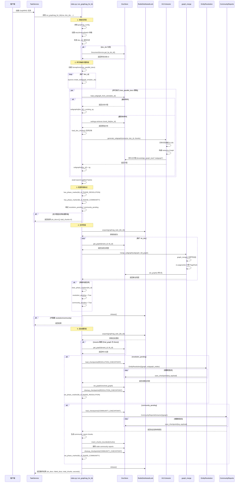
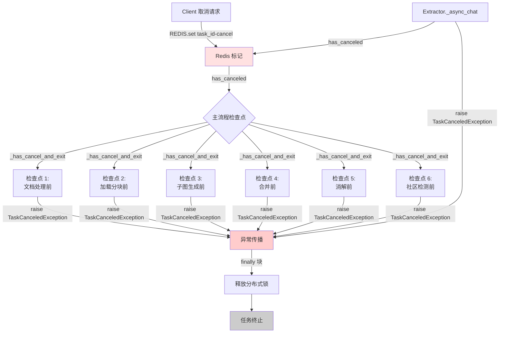
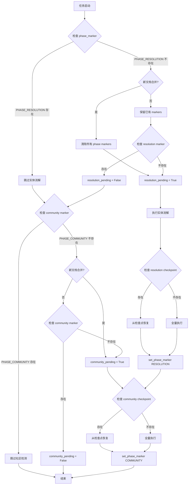
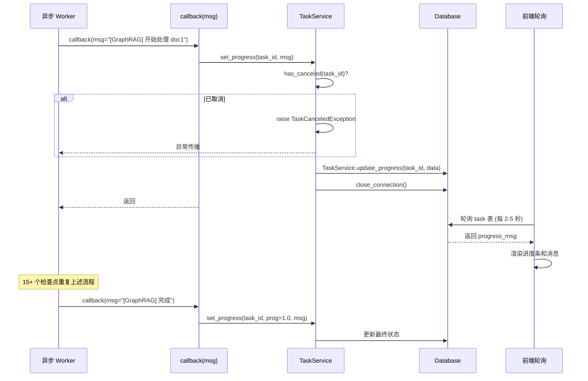

# 10. 完整流程时序图

## 概述

本文档描述 RAGFlow GraphRAG 端到端的完整执行流程，包括状态机转换、关键数据结构的流转，以及各阶段之间的时序关系。

## 1. 整体状态机

GraphRAG 任务的生命周期可以用以下状态机表示：

```mermaid
stateDiagram-v2
    [*] --> 初始化: 任务创建
    初始化 --> 加载配置: 读取 kb_parser_config
    加载配置 --> 获取文档列表: doc_ids 或全量查询
    获取文档列表 --> 并行构建子图: 启动 max_parallel_docs 并发
    
    并行构建子图 --> 加载分块: load_doc_chunks
    加载分块 --> 检查子图缓存: load_subgraph_from_store
    检查子图缓存 --> 跳过提取: 缓存命中
    检查子图缓存 --> 实体关系抽取: 缓存未命中
    
    实体关系抽取 --> 构建本地子图: networkx.Graph
    构建本地子图 --> 保存子图快照: docStore 持久化
    保存子图快照 --> 子图构建完成
    跳过提取 --> 子图构建完成
    
    子图构建完成 --> 等待其他文档: 未完成
    子图构建完成 --> 获取合并锁: 所有文档完成
    等待其他文档 --> 获取合并锁
    
    获取合并锁 --> 加载全局图: get_graph
    加载全局图 --> 合并子图: graph_merge
    合并子图 --> 计算PageRank: nx.pagerank
    计算PageRank --> 持久化全局图: set_graph
    持久化全局图 --> 清除阶段标记: clear_phase_markers
    清除阶段标记 --> 释放合并锁
    
    释放合并锁 --> 检查阶段标记: 判断 resolution/community pending
    检查阶段标记 --> 结束: 无待处理阶段
    检查阶段标记 --> 获取后处理锁: 有待处理阶段
    
    获取后处理锁 --> 加载持久化图: resume 路径
    获取后处理锁 --> 使用内存图: 刚完成 merge
    加载持久化图 --> 实体消解
    使用内存图 --> 实体消解
    
    实体消解 --> 加载消解检查点: load_checkpoints(RESOLUTION_CHECKPOINT)
    加载消解检查点 --> 执行实体消解: EntityResolution
    执行实体消解 --> 保存消解检查点: save_checkpoint
    保存消解检查点 --> 持久化消解结果: set_graph
    持久化消解结果 --> 清理消解检查点: cleanup_checkpoints
    清理消解检查点 --> 设置消解标记: set_phase_marker(PHASE_RESOLUTION)
    
    设置消解标记 --> 社区检测
    
    社区检测 --> 加载社区检查点: load_checkpoints(COMMUNITY_CHECKPOINT)
    加载社区检查点 --> 执行社区检测: CommunityReportsExtractor
    执行社区检测 --> 保存社区检查点: save_checkpoint
    保存社区检查点 --> 生成社区报告: JSON chunks
    生成社区报告 --> 插入报告索引: insert_chunks_bounded
    插入报告索引 --> 清理过期报告: 删除 stale_ids
    清理过期报告 --> 清理社区检查点: cleanup_checkpoints
    清理社区检查点 --> 设置社区标记: set_phase_marker(PHASE_COMMUNITY)
    
    设置社区标记 --> 释放后处理锁
    释放后处理锁 --> 结束
    结束--> [*]
```



## 2. 主流程时序图

### 2.1 run_graphrag_for_kb 整体时序



## 3. 关键数据结构流转

### 3.1 文档 → 分块 → 子图

```mermaid
graph LR
    A[Document] -->|chunk_list| B[Raw Chunks<br/>List[dict]]
    B -->|batch_chunk_token_size| C[Merged Chunks<br/>List[str]]
    C -->|Extractor.__call__| D[Entities/Relations<br/>List[dict]]
    D -->|networkx.Graph| E[Subgraph<br/>nx.Graph]
    E -->|json.dumps node_link_data| F[Chunk JSON<br/>knowledge_graph_kwd=subgraph]
    F -->|docStore.insert| G[Persistent Subgraph]
    
    style D fill:#e1f5ff
    style E fill:#ffe1e1
    style G fill:#e1ffe1
```

**数据结构说明**：

1. **Raw Chunks**: `List[dict]`
   - 字段: `content_with_weight`, `doc_id`
   - 来源: `settings.retriever.chunk_list(doc_id, ...)`

2. **Merged Chunks**: `List[str]`
   - 合并后的文本块，每个块的 token 数 < `batch_chunk_token_size`
   - NER 模式下不合并，直接使用原始内容列表

3. **Entities**: `List[dict]`
   ```python
   {
       "entity_name": str,      # 实体名称
       "entity_type": str,      # 类型 (organization/person/geo/event/category)
       "description": str,      # 描述文本
       "source_id": [doc_id]    # 来源文档
   }
   ```

4. **Relations**: `List[dict]`
   ```python
   {
       "src_id": str,           # 源实体名
       "tgt_id": str,           # 目标实体名
       "description": str,      # 关系描述
       "keywords": str,         # 关系类型关键词
       "weight": int,           # 权重
       "source_id": [doc_id]    # 来源文档
   }
   ```

5. **Subgraph**: `nx.Graph`
   - 节点: 实体，属性包含 `entity_name`, `entity_type`, `description`, `source_id`
   - 边: 关系，属性包含 `description`, `keywords`, `weight`, `source_id`
   - 图属性: `graph["source_id"] = [doc_id]`

6. **Persistent Subgraph Chunk**:
   ```python
   {
       "id": chunk_id(chunk),
       "content_with_weight": json.dumps(nx.node_link_data(subgraph, edges="edges")),
       "knowledge_graph_kwd": "subgraph",
       "kb_id": kb_id,
       "source_id": [doc_id],
       "available_int": 0,
       "removed_kwd": "N"
   }
   ```

### 3.2 子图 → 全局图 → 消解图

```mermaid
graph TB
    A[Subgraph 1<br/>nx.Graph] -->|graph_merge| D[Global Graph<br/>nx.Graph]
    B[Subgraph 2<br/>nx.Graph] -->|graph_merge| D
    C[Subgraph N<br/>nx.Graph] -->|graph_merge| D
    
    D -->|nx.pagerank| E[PageRank Values<br/>dict[str, float]]
    E -->|set_graph| F[Persistent Global Graph<br/>knowledge_graph_kwd=graph]
    
    F -->|EntityResolution| G[Resolved Graph<br/>nx.Graph]
    G -->|set_graph| H[Persistent Resolved Graph]
    
    G -->|CommunityReportsExtractor| I[Communities<br/>List[dict]]
    I -->|chunk generation| J[Community Report Chunks<br/>knowledge_graph_kwd=community_report]
    J -->|docStore.insert| K[Persistent Community Reports]
    
    style D fill:#ffe1e1
    style F fill:#e1ffe1
    style G fill:#ffe1ff
    style I fill:#e1f5ff
    style K fill:#e1ffe1
```

**数据结构说明**：

1. **GraphChange**:
   ```python
   class GraphChange:
       added_updated_nodes: set[str]    # 新增或更新的节点
       added_updated_edges: set[tuple]  # 新增或更新的边
       removed_nodes: set[str]          # 删除的节点 (消解阶段)
       removed_edges: set[tuple]        # 删除的边 (消解阶段)
   ```

2. **Global Graph Chunk**:
   ```python
   {
       "id": chunk_id({"content_with_weight": "graph", "kb_id": kb_id}),
       "content_with_weight": json.dumps(nx.node_link_data(graph, edges="edges")),
       "knowledge_graph_kwd": "graph",
       "kb_id": kb_id,
       "source_id": graph.graph["source_id"],  # 所有已合并的 doc_id
       "available_int": 0
   }
   ```

3. **Community Structure**:
   ```python
   {
       "title": str,                     # 社区标题
       "entities": List[str],            # 社区成员实体
       "weight": float,                  # 社区权重
       "findings": List[dict]            # 发现列表
           # 每个 finding: {"explanation": str, ...}
   }
   ```

4. **Community Report Chunk**:
   ```python
   {
       "id": chunk_id({"content_with_weight": f"community_report::{title}", "kb_id": kb_id}),
       "docnm_kwd": title,
       "title_tks": tokenize(title),
       "content_with_weight": json.dumps({"report": str, "evidences": str}),
       "content_ltks": tokenize(report + evidences),
       "content_sm_ltks": fine_grained_tokenize(content_ltks),
       "knowledge_graph_kwd": "community_report",
       "weight_flt": weight,
       "entities_kwd": entities,
       "important_kwd": entities,
       "kb_id": kb_id,
       "source_id": doc_ids,
       "available_int": 0
   }
   ```

### 3.3 取消信号流转



**取消检查点位置** (15+ 调用点):

1. **主流程** (`run_graphrag_for_kb`):
   - L362: 文档处理开始前
   - L368: 加载检查点前
   - L375: 加载分块前
   - L390: 子图生成前
   - L439: 所有文档处理前
   - L455: 文档处理完成后
   - L472: 获取合并锁前
   - L477: 合并子图前
   - L482: 每个子图合并前
   - L545: 消解/社区前
   - L547: 获取后处理锁前
   - L552: 消解/社区开始前
   - L574: 实体消解前
   - L606: 社区检测前

2. **子图生成** (`generate_subgraph`):
   - L744: 函数开始
   - L750: 实体抽取前
   - L761: 每个实体处理
   - L770: 每个关系处理
   - L789: tidy_graph 前
   - L802: 保存子图前

3. **消解/社区阶段**:
   - L863: 消解开始
   - L887: 消解完成后
   - L889: 保存消解结果前
   - L907: 社区检测开始
   - L926: 社区检测中
   - L935: 社区索引前
   - L1014: 社区完成后

4. **提取器内部** (`Extractor._async_chat`):
   - L88-91: 每次 LLM 重试前

## 4. 配置参数影响

### 4.1 超时控制

| 配置项 | 默认值 | 影响阶段 | 公式 |
|--------|--------|----------|------|
| `build_subgraph_timeout_per_chunk_seconds` | 300 | 子图构建 | `max(min_timeout, len(chunks) * per_chunk)` |
| `build_subgraph_min_timeout_seconds` | 600 | 子图构建 | 最小超时兜底 |
| `merge_timeout_seconds` | 180 | 子图合并 | 固定值 |
| `resolution_timeout_seconds` | 1800 | 实体消解 | 固定值 |
| `community_timeout_seconds` | 1800 | 社区检测 | 固定值 |
| `lock_acquire_timeout_seconds` | 600 | 锁获取 | 固定值 |

### 4.2 重试控制

| 配置项 | 默认值 | 影响阶段 | 策略 |
|--------|--------|----------|------|
| `retry_attempts` | 2 | 全局默认 | 指数退避 `2^attempt` |
| `retry_backoff_seconds` | 2.0 | 重试间隔 | 初始等待时间 |
| `retry_backoff_max_seconds` | 60.0 | 重试间隔 | 最大等待时间 |
| `build_subgraph_retry_attempts` | 继承 `retry_attempts` | 子图构建 | 独立配置 |
| `merge_retry_attempts` | 继承 `retry_attempts` | 子图合并 | 独立配置 |
| `resolution_retry_attempts` | 继承 `retry_attempts` | 实体消解 | 独立配置 |
| `community_retry_attempts` | 继承 `retry_attempts` | 社区检测 | 独立配置 |

### 4.3 并发控制

| 配置项 | 默认值 | 作用域 | 说明 |
|--------|--------|--------|------|
| `max_parallel_docs` | 4 | 文档级并发 | 同时构建子图的文档数 |
| `MAX_CONCURRENT_PROCESS_AND_EXTRACT_CHUNK` | 10 | 分块级并发 | Extractor 内部并发数 |
| `MAX_CONCURRENT_CHATS` | 10 | LLM 调用并发 | `chat_limiter` 信号量 |
| `_INSERT_BULK_SIZE` | 64 | 批量插入 | 每批插入的 chunk 数 |
| `_INSERT_CONCURRENCY` | 4 | 批量插入并发 | 并行插入的批次数 |

### 4.4 分块控制

| 配置项 | 默认值 | 影响 | 说明 |
|--------|--------|------|------|
| `batch_chunk_token_size` | 4096 | 合并分块 | 合并后单个分块的目标 token 数 |
| `method` | "light" | 提取器选择 | `general`/`light`/`ner` |

## 5. 恢复与续传机制

### 5.1 三层恢复粒度

| 层级 | 机制 | 存储 | TTL | 作用域 | 典型场景 |
|------|------|------|-----|--------|----------|
| **粗粒度** | Phase Markers | Redis | 7天 | KB级 | 整个 KB 的 resolution/community 已完成 |
| **中粒度** | Subgraph Cache | DocStore | 永久 | 文档级 | 单个文档的子图已构建 |
| **细粒度** | Checkpoints | Redis | 7天 | 实体/社区级 | EntityResolution/CommunityDetection 增量进度 |

### 5.2 恢复决策树



### 5.3 Resume 路径示例

**场景 1**: 消解阶段崩溃后重启

```python
# 第一次运行
run_graphrag_for_kb(doc_ids=["doc1", "doc2"])
# 完成: 子图构建 + 合并
# 崩溃: 实体消解进行到 50%

# 重启后
run_graphrag_for_kb(doc_ids=[])  # 空列表触发 resume
# 1. has_phase_marker(kb_id, PHASE_RESOLUTION) → False
# 2. final_graph = None → await get_graph() 加载持久化图
# 3. load_checkpoints(RESOLUTION_CHECKPOINT) → 恢复到 50%
# 4. EntityResolution 从检查点继续
# 5. 完成后 set_phase_marker(PHASE_RESOLUTION)
```

**场景 2**: 新文档增量构建

```python
# 第一次运行
run_graphrag_for_kb(doc_ids=["doc1", "doc2"])
# 完成: 全部阶段 (resolution + community)
# set_phase_marker(PHASE_RESOLUTION)
# set_phase_marker(PHASE_COMMUNITY)

# 增量更新
run_graphrag_for_kb(doc_ids=["doc3"])  # 新文档
# 1. 构建 doc3 子图
# 2. 合并到全局图 → clear_phase_markers()  # 清除所有标记
# 3. resolution_pending = True
# 4. community_pending = True
# 5. 重新执行消解和社区检测
```

**场景 3**: 纯 resume 无新文档

```python
# 第一次运行崩溃于社区检测
run_graphrag_for_kb(doc_ids=["doc1", "doc2"])
# 完成: 子图构建 + 合并 + 消解
# set_phase_marker(PHASE_RESOLUTION)
# 崩溃: 社区检测进行到 30%

# 重启后
run_graphrag_for_kb(doc_ids=[])  # 空列表
# 1. 无新子图: ok_docs = []
# 2. has_phase_marker(PHASE_RESOLUTION) → True
# 3. has_phase_marker(PHASE_COMMUNITY) → False
# 4. resolution_pending = False (已完成)
# 5. community_pending = True
# 6. final_graph = None → await get_graph()
# 7. subgraph_nodes = set() → 回退到 set(final_graph.nodes())
# 8. load_checkpoints(COMMUNITY_CHECKPOINT) → 恢复到 30%
# 9. CommunityReportsExtractor 从检查点继续
```

## 6. 进度反馈链路



**关键点**:

1. **进度更新频率**: 每个关键操作都会调用 `callback(msg=...)`
2. **取消检查集成**: `set_progress` 内部每次都调用 `has_canceled`
3. **轻量级设计**: 更新操作不阻塞主流程，失败静默降级
4. **时间戳**: 每条消息自动添加 `[HH:MM:SS]` 前缀

## 7. 典型执行时间线

以一个包含 10 个文档、每文档 50 个分块的 KB 为例：

| 时间点 | 阶段 | 操作 | 典型耗时 | 累计进度 |
|--------|------|------|----------|----------|
| T+0s | 初始化 | 读取配置、获取文档列表 | 0.5s | 0% |
| T+0.5s | 子图构建 | 启动 4 个并发文档处理 | - | 5% |
| T+5s | 子图构建 | 第一个文档完成 (LLM 抽取) | 4.5s | 15% |
| T+10s | 子图构建 | 第二批文档完成 | 5s | 25% |
| T+30s | 子图构建 | 所有文档完成 | 25s | 50% |
| T+31s | 合并 | 获取合并锁 | 1s | 52% |
| T+35s | 合并 | 合并 10 个子图 + PageRank | 4s | 60% |
| T+36s | 合并 | 持久化全局图 | 1s | 62% |
| T+37s | 消解 | 获取后处理锁 | 1s | 64% |
| T+40s | 消解 | 加载检查点 | 3s | 66% |
| T+180s | 消解 | 实体消解 (LLM 密集) | 140s | 80% |
| T+185s | 消解 | 持久化消解结果 | 5s | 82% |
| T+190s | 社区 | 加载检查点 | 5s | 84% |
| T+350s | 社区 | 社区检测 (LLM 密集) | 160s | 95% |
| T+360s | 社区 | 生成并插入社区报告 | 10s | 98% |
| T+365s | 完成 | 清理检查点、释放锁 | 5s | 100% |

**总耗时**: ~6 分钟

**瓶颈分析**:
- **LLM 调用**: 占 80% 时间 (实体抽取 + 消解 + 社区检测)
- **并发限制**: `max_parallel_docs=4` 和 `MAX_CONCURRENT_CHATS=10` 限制吞吐
- **网络 I/O**: DocStore 读写占 10% 时间

## 8. 设计亮点

1. **状态机清晰**: 每个阶段有明确的入口/出口条件
2. **幂等性保证**: Phase Markers + Checkpoints 支持安全重试
3. **增量更新**: 新文档合并后清除标记，触发全量后处理
4. **并发控制**: 文档级并发 + 分块级并发 + LLM 并发 三层限流
5. **取消响应快**: 15+ 检查点确保任何阶段都能快速响应取消
6. **锁粒度适中**: KB 级分布式锁，避免跨任务冲突
7. **数据结构转换**: 清晰的数据流 (文档 → 分块 → 实体 → 图 → 报告)

## 总结

RAGFlow GraphRAG 的端到端流程体现了**分阶段、可恢复、可观测**的设计原则。通过状态机驱动、三层恢复机制、15+ 取消检查点、以及清晰的数据结构流转，确保了大规模知识图谱构建任务的健壮性和可维护性。
