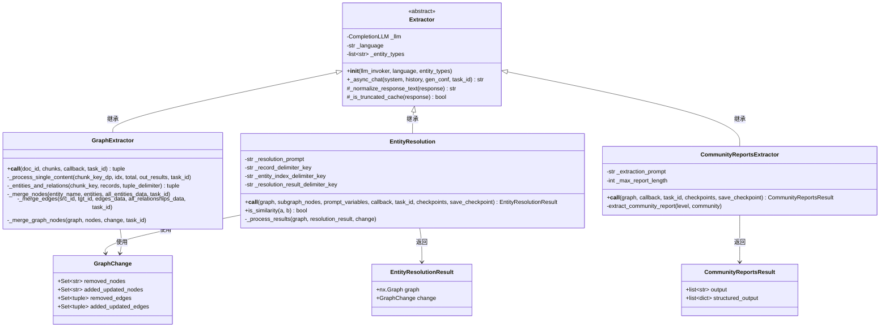
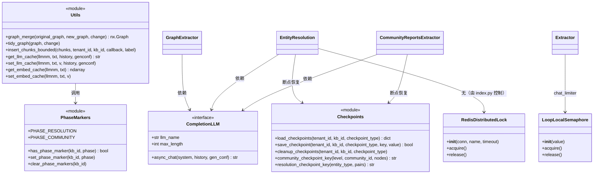
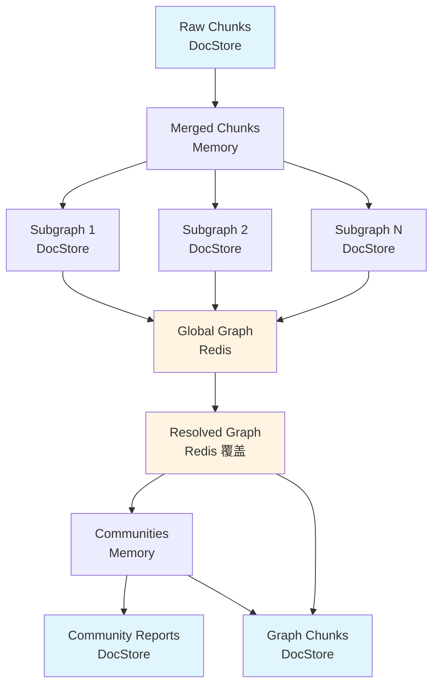
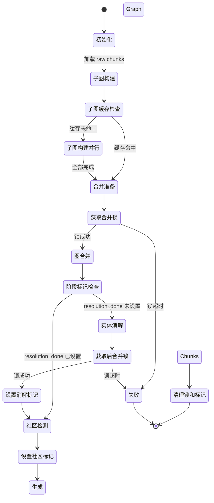

# 11. GraphRAG 架构设计

## 概述

本文档基于已有的 10 篇流程和实现分析文档，从架构设计的角度对 RAGFlow 的 GraphRAG 模块进行系统性梳理，包括：

1. **核心类图与继承关系**
2. **关键接口定义与契约**
3. **数据流转与状态机**
4. **依赖注入与组件协作**
5. **扩展点与可插拔设计**

本文档的目标是为代码维护、架构演进和系统集成提供清晰的设计蓝图。

---

## 1. 核心类图

### 1.1 类层次结构



**设计要点：**

- **Extractor 基类**：封装 LLM 调用（`_async_chat`）、响应规范化、缓存判断等通用逻辑
- **三大子类**：
  - `GraphExtractor`（通用/轻量/NER 三种实现）：负责实体关系抽取
  - `EntityResolution`：负责实体消解（合并同名实体）
  - `CommunityReportsExtractor`：负责社区检测和报告生成
- **Result 对象**：封装返回值（图对象 + 变更记录），便于调用方追踪增量变化

### 1.2 工具类与数据容器



**设计要点：**

- **LLM 接口抽象**：`CompletionLLM` 是所有 LLM 的基类，支持同步/异步调用
- **并发控制**：
  - `LoopLocalSemaphore`：事件循环本地信号量，避免 "Future attached to different loop" 错误
  - `RedisDistributedLock`：分布式锁，确保多实例下的互斥访问（merge/post-merge 阶段）
- **恢复机制**：
  - `Checkpoints`：细粒度断点（消解/社区级别），Redis 存储，7 天 TTL
  - `PhaseMarkers`：粗粒度阶段标记（KB 级别），Redis 存储，7 天 TTL
- **缓存层**：
  - LLM 缓存：xxHash 键，24 小时 TTL
  - Embedding 缓存：xxHash 键，24 小时 TTL

---

## 2. 关键接口定义

### 2.1 主流程编排接口

```python
async def run_graphrag_for_kb(
    tenant_id: str,
    kb_id: str,
    callback: Callable = None,
    task_id: str = "",
    resume_from_checkpoint: bool = False,
    config: dict = None
) -> None:
    """
    GraphRAG 端到端流程入口。
    
    参数：
        tenant_id: 租户 ID
        kb_id: 知识库 ID
        callback: 进度回调函数 callback(msg: str)
        task_id: 任务 ID（用于取消检查）
        resume_from_checkpoint: 是否从断点恢复
        config: 配置字典，包含：
            - batch_chunk_token_size: 批次大小（token）
            - retry_attempts: 重试次数
            - build_subgraph_timeout_per_chunk_seconds: 每 chunk 超时
            - merge_timeout_seconds: 合并超时
            - resolution_timeout_seconds: 消解超时
            - community_timeout_seconds: 社区检测超时
            
    流程：
        1. 加载原始 chunks（从 doc_store）
        2. 按 batch_chunk_token_size 合并 chunks
        3. 并行构建子图（generate_subgraph）
        4. 【加锁】合并子图到全局图（merge_subgraph）
        5. 【加锁】实体消解（resolve_entities）
        6. 社区检测与报告生成（extract_community）
        7. 生成 graph chunks 并存储
        
    异常：
        TaskCanceledException: 任务被取消
        TimeoutError: 阶段超时
        Exception: 其他错误
    """
```

### 2.2 子图构建接口

```python
@timeout(build_subgraph_timeout)
async def generate_subgraph(
    doc_id: str,
    doc_name: str,
    chunks: list[str],
    kb_id: str,
    tenant_id: str,
    callback: Callable = None,
    task_id: str = ""
) -> tuple[nx.Graph, list[dict]]:
    """
    为单个文档构建子图。
    
    参数：
        doc_id: 文档 ID
        doc_name: 文档名称
        chunks: 文档的文本块列表
        kb_id: 知识库 ID
        tenant_id: 租户 ID
        callback: 进度回调
        task_id: 任务 ID
        
    返回：
        (子图对象, 实体关系列表)
        
    流程：
        1. 检查子图缓存（DocStore，knowledge_graph_kwd="subgraph"）
        2. 如命中缓存，直接返回反序列化的图
        3. 否则调用 GraphExtractor 抽取实体关系
        4. 构建 NetworkX 图对象
        5. 持久化到 DocStore
        
    取消检查：
        - 开始前检查 1 次
        - 抽取完成后检查 1 次
    """
```

### 2.3 图合并接口

```python
def graph_merge(
    original_graph: nx.Graph,
    new_graph: nx.Graph,
    change: GraphChange
) -> nx.Graph:
    """
    将新图合并到原图，记录变更。
    
    参数：
        original_graph: 全局图（可能为空）
        new_graph: 子图
        change: 变更记录对象（输出参数）
        
    返回：
        合并后的图对象
        
    逻辑：
        1. 合并节点：
           - 同名节点：合并 description（<SEP> 分隔）、source_id 列表
           - 新节点：直接添加
        2. 合并边：
           - 同边（src, tgt）：累加 weight、合并 description 和 keywords
           - 新边：直接添加
        3. 计算 PageRank：
           - 更新所有节点的 rank 属性
        4. 填充 change 对象：
           - added_updated_nodes: 新增或更新的节点集合
           - added_updated_edges: 新增或更新的边集合
    """
```

### 2.4 实体消解接口

```python
@timeout(resolution_timeout)
async def resolve_entities(
    graph: nx.Graph,
    subgraph_nodes: set[str],
    llm: CompletionLLM,
    tenant_id: str,
    kb_id: str,
    callback: Callable = None,
    task_id: str = "",
    resume_from_checkpoint: bool = False
) -> EntityResolutionResult:
    """
    实体消解：合并语义相似的实体。
    
    参数：
        graph: 全局图
        subgraph_nodes: 本次新增的节点集合（用于生成候选对）
        llm: LLM 调用器
        tenant_id: 租户 ID
        kb_id: 知识库 ID
        callback: 进度回调
        task_id: 任务 ID
        resume_from_checkpoint: 是否恢复断点
        
    返回：
        EntityResolutionResult(graph, change)
        
    流程：
        1. 加载断点（resolution_checkpoint）
        2. 按实体类型分组，生成候选对：
           - 仅考虑至少一方在 subgraph_nodes 中的对
           - 快速过滤：编辑距离 / 长度 < 0.4
        3. 批量（100 对/批）调用 LLM 判断是否同一实体
        4. 合并判定为相同的实体（保留字典序小的名称）
        5. 重新计算 PageRank
        6. 保存断点并返回
        
    取消检查：
        - 每个候选批次处理前检查 1 次
        - 每个候选批次处理后检查 1 次
        - 节点合并前后各检查 1 次
        - 边合并前后各检查 1 次
    """
```

### 2.5 社区检测接口

```python
@timeout(community_timeout)
async def extract_community(
    graph: nx.Graph,
    llm: CompletionLLM,
    tenant_id: str,
    kb_id: str,
    callback: Callable = None,
    task_id: str = "",
    resume_from_checkpoint: bool = False
) -> CommunityReportsResult:
    """
    社区检测与报告生成。
    
    参数：
        graph: 全局图
        llm: LLM 调用器
        tenant_id: 租户 ID
        kb_id: 知识库 ID
        callback: 进度回调
        task_id: 任务 ID
        resume_from_checkpoint: 是否恢复断点
        
    返回：
        CommunityReportsResult(output, structured_output)
        
    流程：
        1. 加载断点（community_checkpoint）
        2. 运行 Leiden 算法，生成多层级社区
        3. 为每个社区（≥2 个实体）生成报告：
           - 提取社区子图（节点、边、关系）
           - 调用 LLM 生成结构化报告（标题、总结、实体列表、边关系）
           - 保存断点
        4. 返回所有社区报告
        
    取消检查：
        - 每个社区报告生成前检查 1 次
    """
```

---

## 3. 数据流转与状态机

### 3.1 核心数据结构

| 阶段 | 输入 | 输出 | 存储位置 |
|---|---|---|---|
| **Raw Chunks** | 文档内容 | `list[dict]` (content, doc_id) | DocStore (无 knowledge_graph_kwd) |
| **Merged Chunks** | Raw Chunks | `list[str]` (合并后文本) | 内存（不持久化） |
| **Subgraph** | Merged Chunks | `nx.Graph` + entities/relations | DocStore (knowledge_graph_kwd="subgraph") |
| **Global Graph** | Subgraph 列表 | `nx.Graph` (合并后) | Redis (JSON 序列化，7 天 TTL) |
| **Resolved Graph** | Global Graph | `nx.Graph` (消解后) | Redis (覆盖 Global Graph) |
| **Communities** | Resolved Graph | `dict[level, dict[comm_id, nodes]]` | 内存（不持久化） |
| **Community Reports** | Communities | `list[dict]` (title, summary, entities, edges) | DocStore (knowledge_graph_kwd="community_report") |
| **Graph Chunks** | Resolved Graph + Communities | `list[dict]` (content_with_weight, important_kwd) | DocStore (knowledge_graph_kwd="graph_chunk") |

**数据流转图：**



### 3.2 状态机转换



**关键状态说明：**

1. **子图构建并行**：最多 4 个文档并发（`MAX_CONCURRENT_PROCESS_AND_BUILD_SUB_GRAPH`）
2. **合并锁**：`graphrag_task_{kb_id}`，10 分钟超时
3. **阶段标记**：
   - `resolution_done`：消解完成标记
   - `community_done`：社区检测完成标记
4. **后合并锁**：与合并锁同名，确保消解阶段的互斥
5. **清理时机**：整个流程成功完成后，清理锁和阶段标记

---

## 4. 依赖注入与组件协作

### 4.1 依赖注入模式

GraphRAG 模块采用**构造器注入**模式，将 LLM、配置等依赖通过构造函数传入：

```python
# index.py 中的实例化
llm = LLMBundle(
    tenant_id,
    LLMType.CHAT,
    llm_name=kb.llm_id,
    lang=doc.language
)

extractor_factory = {
    "general": GeneralKGExt,
    "light": LightKGExt,
    "ner": NerKGExt
}

kgext_cls = extractor_factory[kb.parser_config.get("raptor", {}).get("implementation", "general")]
kgext = kgext_cls(
    llm_invoker=llm,
    language=doc.language if is_english(doc.language) else "English",
    entity_types=kb.parser_config.get("entity_types")
)

entity_resolution = EntityResolution(llm_invoker=llm)
community_extractor = CommunityReportsExtractor(
    llm_invoker=llm,
    max_report_length=1500
)
```

**优点：**

- 易于测试（可注入 Mock LLM）
- 支持多种 LLM 实现（OpenAI、Ollama、通义千问等）
- 配置集中管理（KB 级别的 parser_config）

### 4.2 回调机制

所有长时运行的操作都接受 `callback` 参数，用于进度反馈：

```python
# 回调接口
def callback(msg: str, prog: int = None):
    """
    msg: 进度消息
    prog: 进度百分比（0-100），None 表示不更新进度条
    """
    pass

# 典型调用
await generate_subgraph(
    doc_id, doc_name, chunks, kb_id, tenant_id,
    callback=lambda msg: set_progress(task_id, msg=msg),
    task_id=task_id
)
```

**回调时机：**

- 子图构建：每个文档完成后
- 图合并：合并完成后
- 实体消解：每 100 个候选对处理完成后
- 社区检测：每个社区报告生成后
- Graph Chunks 插入：每 100 条插入后

### 4.3 取消传播机制

```python
# 取消检查函数
def has_canceled(task_id: str) -> bool:
    """检查任务是否被取消（Redis 标记）"""
    try:
        if REDIS_CONN.get(f"{task_id}-cancel"):
            logging.info(f"Task: {task_id} has been canceled")
            return True
    except Exception as e:
        logging.exception(e)
    return False  # Redis 故障时默认不取消

# 取消传播
def _has_cancel_and_exit(task_id: str, message: str, callback=None) -> None:
    if not task_id or not has_canceled(task_id):
        return
    if callback:
        callback(msg=message)
    raise TaskCanceledException(f"Task {task_id} was cancelled")
```

**检查点分布：**

| 文件 | 函数 | 检查次数 | 位置 |
|---|---|---|---|
| index.py | run_graphrag_for_kb | 14 | 各阶段开始/结束 |
| index.py | generate_subgraph | 6 | 子图构建前后 |
| entity_resolution.py | EntityResolution.__call__ | 7 | 候选处理、节点/边合并前后 |
| community_reports_extractor.py | extract_community_report | 每个社区 1 次 | 报告生成前 |
| extractor.py | Extractor._async_chat | 每次重试前 1 次 | LLM 调用前 |

---

## 5. 扩展点与可插拔设计

### 5.1 GraphExtractor 实现切换

**三种实现：**

1. **GeneralKGExt**（默认）：基于 Microsoft GraphRAG 论文实现
   - Prompt: `GRAPH_EXTRACTION_PROMPT`（详细实体类型枚举）
   - 适用场景：通用文档、学术文本、新闻报道
   
2. **LightKGExt**：基于 LightRAG 实现
   - Prompt: 简化版（无实体类型约束）
   - 适用场景：结构化文档、代码库、API 文档
   
3. **NerKGExt**：基于命名实体识别（NER）实现
   - Prompt: 强制实体类型（person, organization, geo, event）
   - 适用场景：人物关系、组织架构、地理位置

**配置方式：**

```json
{
  "kb": {
    "parser_config": {
      "raptor": {
        "implementation": "general"  // 或 "light" / "ner"
      },
      "entity_types": ["organization", "person", "geo", "event", "category"]
    }
  }
}
```

### 5.2 LLM 适配层

```python
class CompletionLLM:
    """LLM 基类（抽象接口）"""
    
    @property
    def llm_name(self) -> str:
        raise NotImplementedError
    
    @property
    def max_length(self) -> int:
        raise NotImplementedError
    
    async def async_chat(self, system: str, history: list[dict], gen_conf: dict) -> str:
        raise NotImplementedError
```

**已支持的 LLM：**

- OpenAI (gpt-3.5-turbo, gpt-4, gpt-4-turbo)
- Ollama (llama2, mistral, codellama)
- 通义千问 (qwen-turbo, qwen-plus, qwen-max)
- 文心一言 (ernie-bot-turbo, ernie-bot)
- 智谱 AI (glm-3-turbo, glm-4)

**扩展新 LLM：**

```python
class NewLLMProvider(CompletionLLM):
    def __init__(self, api_key: str, model_name: str):
        self._api_key = api_key
        self._model_name = model_name
    
    @property
    def llm_name(self) -> str:
        return self._model_name
    
    @property
    def max_length(self) -> int:
        return 8192  # 根据模型上下文长度设置
    
    async def async_chat(self, system: str, history: list[dict], gen_conf: dict) -> str:
        # 调用新 LLM 的 API
        response = await self._call_api(system, history, gen_conf)
        return response
```

### 5.3 DocStore 存储适配

```python
class DocStoreConnection:
    """DocStore 接口（抽象）"""
    
    def insert(self, docs: list[dict], index_name: str, kb_id: str) -> str:
        """批量插入文档，返回错误信息（空字符串表示成功）"""
        raise NotImplementedError
    
    def search(
        self,
        index_name: str,
        query: dict,
        kb_ids: list[str],
        page: int,
        size: int,
        order_by: OrderByExpr = None
    ) -> list[dict]:
        """搜索文档"""
        raise NotImplementedError
    
    def delete(self, index_name: str, ids: list[str]) -> bool:
        """删除文档"""
        raise NotImplementedError
```

**已支持的存储：**

- Elasticsearch (7.x, 8.x)
- Infinity (自研向量数据库)

**扩展新存储：**

1. 继承 `DocStoreConnection`
2. 实现 `insert`, `search`, `delete` 方法
3. 在 `settings.py` 中注册：

```python
from rag.utils.doc_store_conn import ElasticsearchConnection, InfinityConnection, NewStoreConnection

DOCSTORE_MAPPING = {
    "es": ElasticsearchConnection,
    "infinity": InfinityConnection,
    "new_store": NewStoreConnection  # 新存储
}

docStoreConn = DOCSTORE_MAPPING[settings.DOC_ENGINE](settings.ES_HOST, settings.ES_USER, settings.ES_PASSWORD)
```

### 5.4 社区检测算法扩展

当前使用 Leiden 算法（`rag/graphrag/general/leiden.py`），可通过以下方式扩展：

```python
# 当前接口
def run(graph: nx.Graph, args: dict) -> dict[str, dict[str, list]]:
    """
    运行社区检测算法。
    
    参数：
        graph: NetworkX 图对象
        args: 算法参数（当前未使用）
        
    返回：
        {
            "level_0": {
                "community_id_1": {"nodes": [...], "weight": 10},
                "community_id_2": {"nodes": [...], "weight": 8},
                ...
            },
            "level_1": {...},
            ...
        }
    """
    # Leiden 算法实现
    pass

# 扩展新算法
def run_louvain(graph: nx.Graph, args: dict) -> dict:
    """Louvain 算法实现"""
    pass

def run_label_propagation(graph: nx.Graph, args: dict) -> dict:
    """标签传播算法实现"""
    pass

# 在 index.py 中切换算法
community_algorithm = kb.parser_config.get("community_algorithm", "leiden")
if community_algorithm == "louvain":
    communities = run_louvain(graph, {})
elif community_algorithm == "label_propagation":
    communities = run_label_propagation(graph, {})
else:
    communities = leiden.run(graph, {})
```

---

## 6. 配置参数汇总

### 6.1 环境变量

| 变量名 | 默认值 | 说明 |
|---|---|---|
| `MAX_CONCURRENT_CHATS` | 10 | LLM 并发调用数 |
| `MAX_CONCURRENT_PROCESS_AND_EXTRACT_CHUNK` | 10 | 单文档分块并发数 |
| `GRAPHRAG_INSERT_BULK_SIZE` | 64 | DocStore 批量插入大小 |
| `GRAPHRAG_INSERT_CONCURRENCY` | 4 | DocStore 并发插入数 |
| `GRAPHRAG_MAX_ERRORS` | 3 | 实体抽取最大容错次数 |
| `ENABLE_TIMEOUT_ASSERTION` | 空 | 测试模式开关（设置后超时改为 3 秒） |

### 6.2 KB 级配置（parser_config）

```json
{
  "raptor": {
    "implementation": "general",
    "batch_chunk_token_size": 4096,
    "retry_attempts": 2,
    "retry_backoff_seconds": 2.0,
    "retry_backoff_max_seconds": 60.0,
    "build_subgraph_timeout_per_chunk_seconds": 300,
    "build_subgraph_min_timeout_seconds": 600,
    "merge_timeout_seconds": 180,
    "resolution_timeout_seconds": 1800,
    "community_timeout_seconds": 1800,
    "lock_acquire_timeout_seconds": 600
  },
  "entity_types": ["organization", "person", "geo", "event", "category"],
  "community_algorithm": "leiden"
}
```

### 6.3 超时矩阵

| 阶段 | 默认超时 | 测试模式超时 | 动态计算公式 |
|---|---|---|---|
| 子图构建 | `max(600, len(chunks) * 300)` 秒 | 3 秒 | `max(min_timeout, len(chunks) * per_chunk)` |
| 图合并 | 180 秒 | 3 秒 | - |
| 实体消解 | 1800 秒 | 3 秒 | - |
| 社区检测 | 1800 秒 | 3 秒 | - |
| 分布式锁获取 | 600 秒 | - | - |
| LLM 单次调用 | 1200 秒 | - | - |

---

## 7. 总结与设计原则

### 7.1 设计原则

1. **单一职责**：每个类只负责一个核心功能（抽取 / 消解 / 社区检测）
2. **开闭原则**：通过继承扩展功能（GraphExtractor 的三种实现），而不修改基类
3. **依赖倒置**：依赖抽象接口（CompletionLLM、DocStoreConnection），而非具体实现
4. **接口隔离**：回调函数单一职责（仅传递进度消息），不强制实现复杂接口
5. **组合优于继承**：使用 `GraphChange` 对象传递变更，而非在类层次中传递状态
6. **容错优先**：所有外部依赖（Redis、LLM、DocStore）都有兜底逻辑，故障时降级而非中断

### 7.2 架构优势

- **可测试性**：LLM、DocStore 都可注入 Mock 对象进行单元测试
- **可扩展性**：新增 LLM 提供商、存储引擎、社区检测算法只需实现接口即可
- **可观测性**：回调机制 + 日志记录 + 进度追踪，便于监控和调试
- **容错性**：三层恢复机制（Phase Markers / Checkpoints / Subgraph Cache）+ 重试 + 取消传播
- **性能优化**：并发控制 + 缓存 + 批量操作 + 超时保护

### 7.3 已知限制与改进方向

| 限制 | 改进方向 |
|---|---|
| 单租户 Redis 键冲突 | 增加租户隔离命名空间 |
| 大图（>10 万节点）内存压力 | 引入图数据库（Neo4j、JanusGraph） |
| LLM 调用成本高 | 缓存命中率优化、Prompt 压缩 |
| 社区报告串行生成慢 | 支持批量并发生成 |
| 实体消解准确率依赖 LLM | 引入人工审核机制 |
| Checkpoint 清理策略简单 | 支持增量清理和版本管理 |

---

## 附录：关键代码位置索引

| 模块 | 文件路径 | 核心类/函数 |
|---|---|---|
| 主流程编排 | `rag/graphrag/general/index.py` | `run_graphrag_for_kb`, `generate_subgraph`, `merge_subgraph`, `resolve_entities`, `extract_community` |
| 实体关系抽取 | `rag/graphrag/general/extractor.py` | `Extractor`, `GraphExtractor.__call__` |
| 实体消解 | `rag/graphrag/entity_resolution.py` | `EntityResolution`, `EntityResolutionResult` |
| 社区检测 | `rag/graphrag/general/community_reports_extractor.py` | `CommunityReportsExtractor`, `CommunityReportsResult` |
| Leiden 算法 | `rag/graphrag/general/leiden.py` | `run`, `add_community_info2graph` |
| 图操作工具 | `rag/graphrag/utils.py` | `graph_merge`, `tidy_graph`, `insert_chunks_bounded`, `GraphChange` |
| 断点管理 | `rag/graphrag/checkpoints.py` | `load_checkpoints`, `save_checkpoint`, `cleanup_checkpoints` |
| 阶段标记 | `rag/graphrag/phase_markers.py` | `has_phase_marker`, `set_phase_marker`, `clear_phase_markers` |
| LLM 基类 | `rag/llm/chat_model.py` | `Base` (CompletionLLM) |
| DocStore 接口 | `common/doc_store/doc_store_base.py` | `DocStoreConnection` |
| 任务取消 | `api/db/services/task_service.py` | `has_canceled`, `TaskCanceledException` |

---

**本文档版本**: v1.0  
**最后更新**: 2026-09-18  
**维护者**: RAGFlow Core Team
